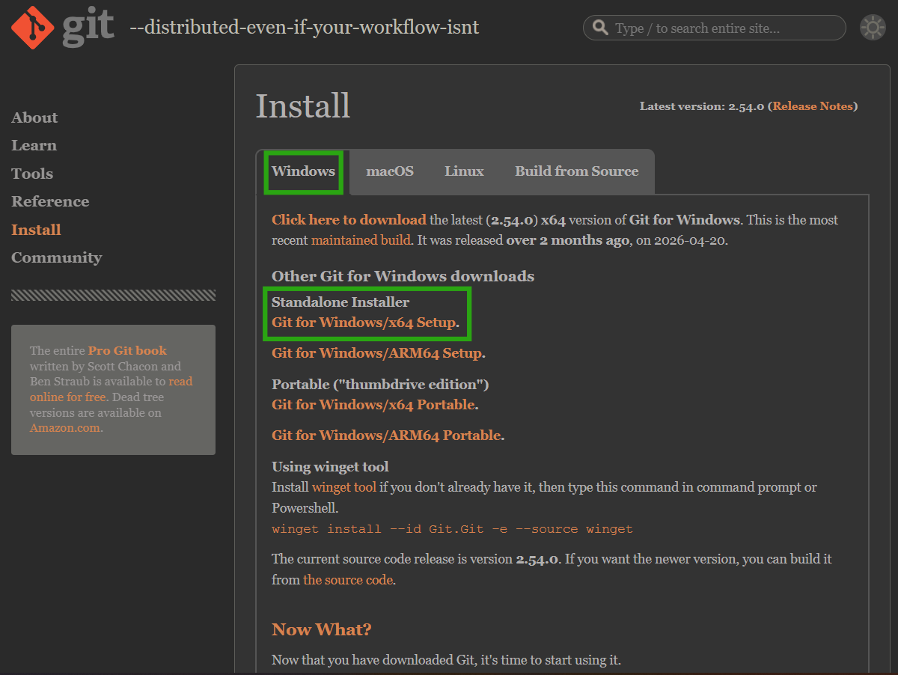
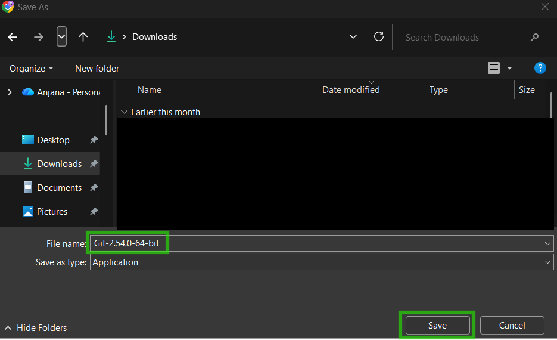

# 🚀 Git Installation Guide

This is a complete step-by-step guide to install Git on your machine.

If you do not have Git installed yet, follow this guide carefully and complete all the steps.

If you already have Git installed, you can skip this file and move on to the next onboarding guide in the repository.

---

## 1. Open Git Download Page

Copy and paste the following link into your browser:

https://git-scm.com/downloads

---

## 2. Select Your Operating System

You will see a page like this.

Choose the operating system based on your computer.

---

## 3. Download Git for Windows

Select your operating system on the page.

This guide is for Windows users.

Click on:

**Git for Windows / x64 Setup (Standalone Installer)**

Choose the option that is compatible with your system.

---

## 4. Choose Download Location

After clicking on **Git for Windows / x64 Setup (Standalone Installer)**, your browser will ask where to save the file.

Choose the **Downloads** folder on your computer and save the file there.

---

## 5. Open the Setup File

Go to your **Downloads** folder.

Find the Git setup file you just downloaded.

Double-click on the file to start the installation process.

---

