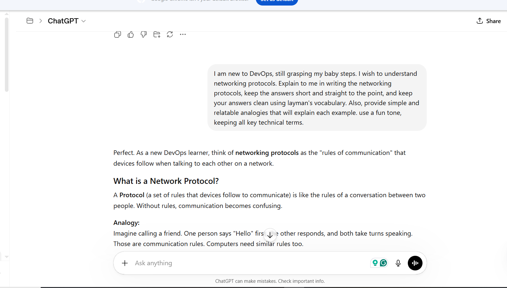
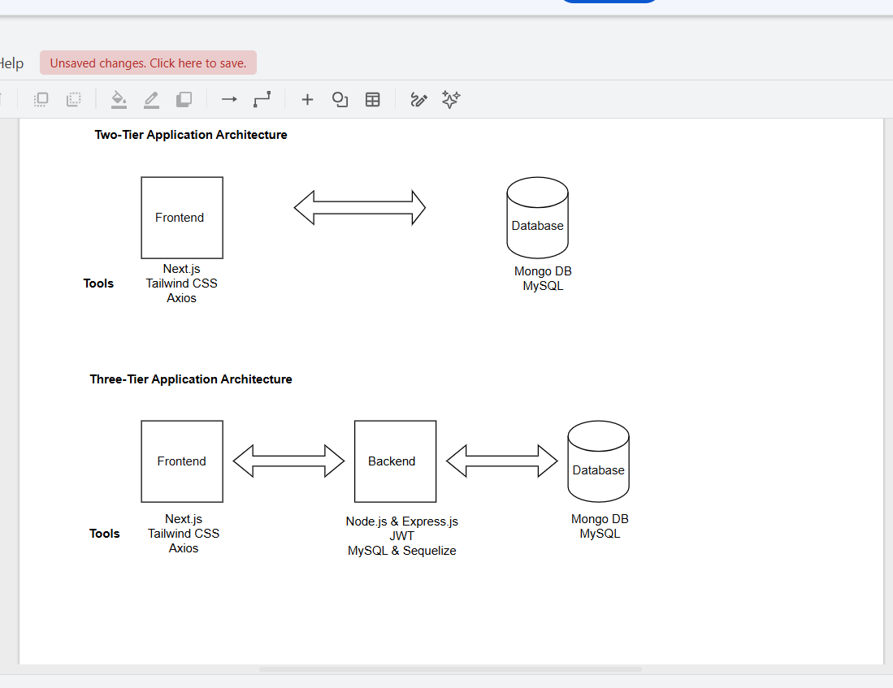
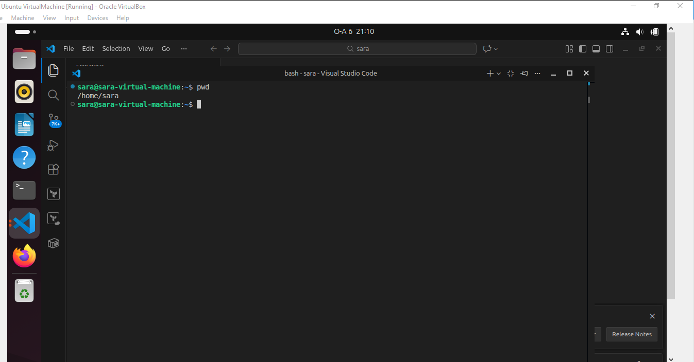

# Week 00 - Internet and Networking

Part of the DevOps Micro Internship (DMI) Cohort 3 with Agentic AI

---

# 🧑‍💻 Task 1: Using ChatGPT as Your Learning Assistant

## Scenario

You're new to DevOps and will frequently encounter technical questions. ChatGPT can be your learning companion.

## Your Task

Write a clear ChatGPT prompt to help you understand:

> "What is a protocol in networking? Explain with a simple real-life example."

Take a screenshot of your interaction showing:

* Your detailed prompt (with clear expectations)
* ChatGPT's simplified response with an example

## Screenshot

Save your screenshot in the `screenshots` folder and update the file name below.




Replace `task-1-chatgpt.png` with your actual screenshot file name.

---

## What I Learned (2–3 lines)

The output quality of an AI chatbot will always be directly influenced to the quality of the prompt you feed it with. 

---

# 🌐 Task 2: Internet and Networking

## Scenario

Your friend is launching an online bookstore named **EpicReads**.

He asked you to explain how users globally can access his website hosted in Finland.

## Your Task

Write a short explanation (**100–150 words**) that includes:

* Packet Switching
* IP Address
* TCP/IP
* HTTP/HTTPS

💡 **Tip:** You may use ChatGPT (as demonstrated in Task 1) to refine your explanation.

## Answer

    Imagine your online book is stored in a digital library somewhere in the world. When a reader clicks your website, their computer sends a request using HTTP/HTTPS (the language web browsers use to communicate with websites). The request is addressed to your website's IP Address (the unique numerical address of a device on the internet), just like sending a letter to a house address.

    The information then travels across the internet using TCP/IP (the communication rules that ensure data is sent, received, and reassembled correctly). To make the journey faster, the book's data is broken into small pieces called Packets through Packet Switching (a method where data is split into smaller chunks and sent along the best available routes).

    These packets travel across different networks, reunite at the reader's device, and are reassembled into the complete book. Within seconds, the reader can open and enjoy your book from anywhere in the world.


---

# 🏗️ Task 3: Application Architecture & Stack

## Scenario

EpicReads bookstore has two application versions:

### Two-Tier Application

* Frontend
* Database

### Three-Tier Application

* Frontend
* Backend
* Database

## Your Task

* Draw simple diagrams (hand-drawn or tool-based such as draw.io)
* Label each layer clearly
* List at least two common technologies or tools used for each layer
* Submit a screenshot or photo clearly showing your own drawing

## Diagram Screenshot / Photo

Save your diagram image in the `screenshots` folder and update the file name below.




Replace `task-3-diagram.png` with your actual diagram file name.

---

## Technologies Used

### Frontend

Next.js
Tailwind CSS
Axios

### Backend

Node.js & Express.js
JWT


### Database

Mongo DB
My SQL


---

# 🌍 Task 4: Domain Name & DNS (Basic Concepts)

## Scenario

Your friend's bookstore **EpicReads** is currently accessible through:

```text
52.172.142.222:3000
```

He purchased the domain:

```text
epicreads.com
```

## Your Task

In **50–100 words**, explain in your own words:

1. What is DNS (Domain Name System)?
2. Which DNS record type should be used to connect the domain to the given IP, and why?

## Answer

    DNS (Domain Name System – which is also referred to as the internet's phonebook) helps people access websites using easy-to-remember names instead of complicated IP addresses. For example, it is much easier to remember epicreads.com than 52.172.142.222.

    To connect epicreads.com to the server, an A Record (Address Record - a DNS record that maps a domain name to an IP address) should be used. The A Record tells browsers that when someone types epicreads.com, they should be directed to the server located at 52.172.142.222. This allows visitors to access the bookstore using the domain name instead of the IP address.


---

# 💻 Task 5: Visual Studio Code Setup (Hands-on)

## Your Task

Install Visual Studio Code (if not already installed).

Take a screenshot of your VS Code environment showing:

* Terminal open inside VS Code
* Running a basic command:

### Windows

```powershell
dir
```

### Linux / macOS

```bash
pwd
ls
```

* Your selected VS Code theme clearly visible

⚠️ **Important:** The screenshot must show your username or another identifiable detail to confirm it is your environment.

## Screenshot

Save your screenshot in the `screenshots` folder and update the file name below.




Replace `task-5-vscode.png` with your actual screenshot file name.

---

# 🔗 Task 6: Publish Your Assignment as a LinkedIn Post

## Objective

Publishing on LinkedIn helps you:

* Build your professional online presence
* Reinforce your learning
* Document your DevOps journey publicly

## Your Task

Summarize your answers from Tasks 1–5 into a LinkedIn post.

Clearly structure your post into the following sections:

* ChatGPT
* Internet & Networking
* App Architecture
* DNS
* VS Code Setup

Add the following credit note at the end of your post:

> **P.S. This post is part of the DevOps Micro Internship (DMI) with Agentic AI — Cohort 3 — by Pravin Mishra. My graded progress is public: https://dmi.pravinmishra.com/s/YOUR-GITHUB-USERNAME.html · Start your DevOps journey: https://dmi.pravinmishra.com/?utm_source=student&utm_medium=ps-linkedin&utm_campaign=cohort3**

---

## LinkedIn Post URL

https://www.linkedin.com/posts/sarah-w-amadi_join-the-dmi-devops-micro-internship-activity-7469137384576565248-9kBn?utm_source=share&utm_medium=member_desktop&rcm=ACoAACAx4n8Bvuf305sZ28vfr5yvaoLLEr0SkSA


## Blog Post URL

https://medium.com/@sarahamadi97/starting-over-at-40-was-never-the-plan-building-the-future-was-aad7a8df843f

---

## LinkedIn Post Backup Copy

🚀 Looking back at my first DevOps Micro Internship assessment, I am reminded that every expert once started with the basics.
As someone transitioning into DevOps, it was refreshing to see that the journey doesn't begin with complex cloud deployments or Kubernetes clusters. It starts with understanding how the internet works, how applications are structured, and how users access what we build.
🔹 How AI like ChatGPT assists in learning
One thing that stood out during these tasks was how AI can accelerate learning. Having a tool that can break down technical concepts into simple language, provide examples, and answer questions in real time makes learning less intimidating and more engaging.
🔹 Understanding this basic concept is not trivial: Internet & Networking
At first glance, concepts like IP addresses, packet switching, TCP/IP, and HTTP/HTTPS may seem basic. However, they form the foundation of everything we do in DevOps. Understanding how information travels across the internet helps connect the dots between users, applications, and infrastructure.
🔹 Understanding App Architecture is the most important step in designing the deployment journey
One of my biggest takeaways was that before deploying anything, you must understand how the application works. Knowing the different components, how they communicate, and where they run helps shape the entire deployment strategy. A strong deployment starts with a clear understanding of the application's architecture.
🔹 Another concept worth knowing: DNS
DNS often works quietly in the background, but it plays a critical role. It allows users to access applications using friendly domain names instead of memorizing IP addresses. Something as simple as typing a website name depends on DNS doing its job correctly.
🔹 Example of the environments used: VS Code Setup
Even setting up the right tools is part of the learning journey. Installing and configuring VS Code, extensions, terminals, and development environments may seem like small tasks, but they create the foundation for everything that follows.
These early lessons reminded me that DevOps is built one concept at a time. From understanding networking fundamentals to configuring development environments, every small step contributes to the bigger picture. Today's basic concepts become tomorrow's deployment pipelines.

hashtag#DevOps hashtag#LearningInPublic hashtag#CloudComputing hashtag#Networking hashtag#DNS hashtag#AI hashtag#VSCode hashtag#CareerTransition 
hashtag#TechLearning hashtag#DevOpsJourney hashtag#WomenInTech

**P.S. This post is part of the DevOps Micro Internship (DMI) with Agentic AI — Cohort 3 — by Pravin Mishra. My graded progress is public: https://dmi.pravinmishra.com/s/YOUR-GITHUB-USERNAME.html · Start your DevOps journey: https://dmi.pravinmishra.com/?utm_source=student&utm_medium=ps-linkedin&utm_campaign=cohort3**

---

# Reflection – Week 0

### What did you find easy?

Writing about the whole experince in LInkedIn. And also using Chatgpt for studying.

---

### What was difficult?

Gathering all my work into a one page portfolio, and using github as a repository.

---

### What will you improve next week?

Learn to document my work in github

---

## 📌 About DMI & CloudAdvisory

DevOps Micro Internship (DMI) is a project-based DevOps program run by Pravin Mishra (The CloudAdvisory) focused on real-world execution, systems thinking, and career readiness.

It helps learners build strong DevOps foundations with hands-on experience.


## 📌 Resources

- 🌐 **DMI Official Website:** https://pravinmishra.com/dmi  
- 🎓 **DevOps for Beginners (Udemy):** https://www.udemy.com/course/devops-for-beginners-docker-k8s-cloud-cicd-4-projects/  
- 🎓 **Ultimate Agentic AI DevOps with Clude Code** https://www.udemy.com/course/ultimate-agentic-ai-devops-with-claude-code/?referralCode=448389767BC96284087B
- 🎓 **DevOps with Claude Code: Terraform, EKS, ArgoCD & Helm** https://www.udemy.com/course/devops-with-claude-code-terraform-eks-argocd-helm/?referralCode=1C5B734505D65A010FA3
- ▶️ **YouTube Playlist (DMI Cohort 3):** https://www.youtube.com/playlist?list=PLFeSNDtI4Cho  
- 🔗 **Pravin Mishra (LinkedIn):** https://www.linkedin.com/in/pravin-mishra-aws-trainer/  
- 🏢 **CloudAdvisory (LinkedIn):** https://www.linkedin.com/company/thecloudadvisory/

---

*This submission is part of DevOps Micro Internship (DMI) Cohort 3 — Agentic AI Track*