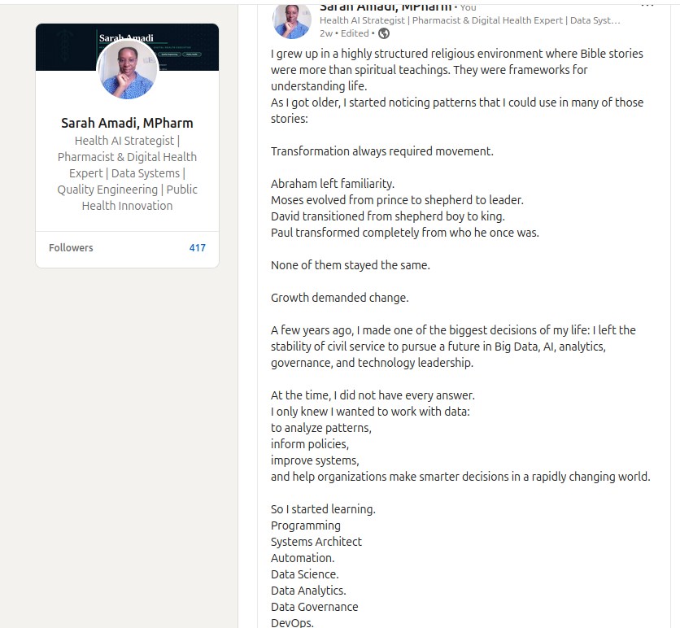
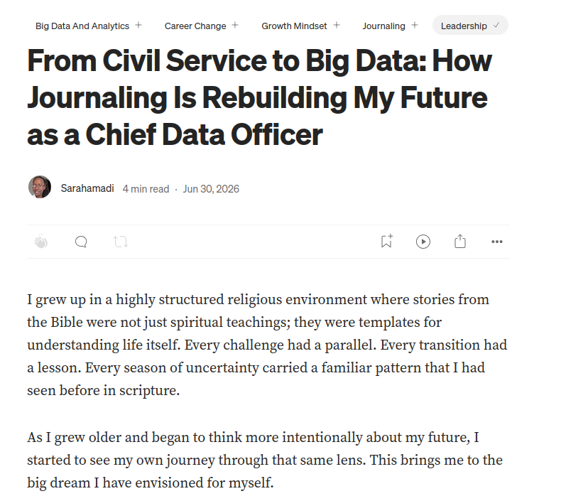

# Week 01 — Success Mindset (Mindset OS)

Part of the DevOps Micro Internship (DMI) Cohort 3 with Agentic AI

---

## Purpose

This is me building my **Mindset OS** — the system I will use for the next 5 months (and honestly, for years).

### Expectations

* Be honest.
* Be specific.
* Be practical.

---

# 1. Something that I believe to be true that most people around me would disagree with:

One belief I hold strongly, even if many may disagree, is this:

**No one is born a genius.**

Behind every remarkable achievement is usually a long season of discipline, repetition, learning, failure, correction, and persistence. Excellence is rarely accidental. It is built deliberately over time.

In every project, career, or life pursuit, growth demands continuous effort. We must seek knowledge relentlessly, practice consistently, make mistakes, learn from them, and keep going until what once seemed impossible becomes achievable.

I believe we are all born with a clean slate. What separates people over time is not simply talent, but commitment, consistency, mindset, and the willingness to keep improving when others stop trying.

Potential may be given, but mastery is earned.

---

# 2. The top 3 objective truths I discovered through experimentation and results.

### Definition

Objective truths do not depend on opinions. They hold true regardless of how people feel.

---

## Truth #1

### Truth

Consistent effort and disciplined repetition can transform weakness into excellence.

### Evidence from my life

I was once an F student in mathematics until Higher Secondary Level 2. After changing my mindset, surrounding myself with more focused friends, and committing to disciplined study day and night, I eventually became an A student.

This proved to me that intelligence is not fixed. Performance improves when effort, consistency, and the right environment are applied repeatedly over time.

---

## Truth #2

### Truth

Persistence creates opportunities that circumstances alone cannot predict.

### Evidence from my life

I had to drop out of university because I could not afford the fees. Despite the setback, I refused to abandon my dream. I continued working relentlessly, applying for scholarship after scholarship, even after repeated disappointments.

Eventually, one opportunity changed my life. The result taught me that persistence often succeeds where talent, luck, or background initially fail.

---

## Truth #3

### Truth

Growth requires the courage to leave comfort and pursue long-term purpose over short-term security.

### Evidence from my life

I stayed in a job that paid my bills, but deep inside I knew I was meant for something greater. Choosing to leave that stability was painful and financially difficult, but it forced me to rebuild myself with intention.

Today, I am actively building the portfolio and skills needed for my dream career path: becoming a Chief Data Officer. That journey confirmed for me that meaningful success often begins with uncomfortable decisions.

---

# 3. What does my 2.0 version look like.

**Sarah Amadi: The Data Executive Who Helped Redefine Healthcare Intelligence in Africa**

By 2032, Sarah Amadi had become one of the most respected voices in Africa’s healthcare data and AI ecosystem. As Chief Data Officer at a FAANG-backed health technology division operating across Africa, she led one of the continent’s largest healthcare intelligence transformation programs, connecting fragmented medical data systems into a unified, AI-powered infrastructure that improved patient outcomes across multiple countries.

Her journey into executive leadership was anything but conventional.

Years earlier, Sarah had openly shared how she once struggled academically in mathematics and later transformed herself through relentless discipline and focused learning. That same mindset eventually became the foundation of her career. After overcoming financial hardship that forced her to temporarily leave university, she rebuilt her path through scholarships, continuous education, technical certifications, and an obsession with mastering data systems.

Industry peers often pointed to her portfolio as one of the strongest examples of intentional career reinvention in Africa’s tech industry.

She had built and published multiple healthcare analytics projects focused on predictive modeling, governance frameworks, patient data interoperability, and AI-driven reporting systems. Her GitHub portfolio became widely referenced among aspiring African data professionals because it documented not only polished projects, but also her learning journey from beginner to executive-level strategist.

Sarah earned certifications in data analytics, cloud technologies, project management, AI governance, and healthcare information systems. She later contributed to policy discussions surrounding ethical AI implementation and healthcare data governance across emerging African digital health ecosystems.

Before becoming a CDO, she had led cross-functional analytics teams, shipped enterprise reporting systems, and designed scalable data governance structures for health organizations handling millions of patient records. Her leadership style became known for combining technical precision with human-centered innovation.

Outside corporate leadership, Sarah published blogs and thought leadership articles focused on big data, AI ethics, healthcare transformation, and the future of African digital infrastructure. She also mentored young professionals transitioning into data careers, especially women entering AI and analytics.

Colleagues described her as a leader who transformed adversity into architecture, someone who built systems with the same resilience she once used to rebuild her own life.

Today, her work continues to influence how healthcare organizations across Africa use data not just to store information, but to save lives, predict risk, improve access, and shape the future of intelligent healthcare delivery on the continent.

**P.S. This post is part of the DevOps Micro Internship (DMI) with Agentic AI — Cohort 3 — by [Pravin Mishra](https://www.linkedin.com/in/pravin-mishra-aws-trainer/). My graded progress is public: https://dmi.pravinmishra.com/s/YOUR-GITHUB-USERNAME.html · Start your DevOps journey: https://dmi.pravinmishra.com/?utm_source=student&utm_medium=ps-blog&utm_campaign=cohort3**

## Article

Sarah Amadi: The Data Executive Who Helped Redefine Healthcare Intelligence in Africa

### Public Link

 https://medium.com/@sarahamadi97/sarah-amadi-the-data-executive-who-helped-redefine-healthcare-intelligence-in-africa-eb2f083b1f17 

---

# 4. Have I ever cut corners (unethical / dishonest / shortcut behavior — not necessarily illegal)? How did it make me feel?

This is about self-awareness, not judgment.

### Answer 

**Yes**

**What emotion did I feel?** 

I had a deep feeling of guilt and fear because what I did was tied to my career reputation and integrity. This taught me to stand for the truth and nothing but the truth. Guilt and fear has a way of paralyzing your career growth. That constant feeling that you will be caught makes you live in hiding. This makes your visibility blur. 

---

# 5. 10 non-fiction books I plan to read in 2026?

**These books fall under the following categories:**

* mindset
* communication
* productivity
* health
* money
* career
* leadership

## Book List

1. The Mountain is You - Brianna Weist-      🔄 My current Read
<!--[book1](screenshots/Week-01-The%20Mountain%20is%20You.jpeg)-->
2. The 4 Disciples of Execution - Chriss McChesney, Sean Covey, Jim Huling with  Beverly Walker & Scott Thele 
<!--[book1](screenshots/Week-02-The%204%20Disciplines%20of%20Execution.jpeg)-->
3. Deep Work - Cal Newport
<!--[book1](screenshots/Week-03-Deep%20Work.jpeg)-->
4. The Book of Five Rings - Miyamoto Musashi translated by Thomas Cleary
<!--[book1](screenshots/Week-05-The%20Book%20of%20Five%20Rings.jpeg)-->
5. Atomic habits - James Clear
<!--[book1](screenshots/Week-04-Atomic%20Habits.jpeg)-->
6. MindSet — The New Psychology of Success - Carol S. Dweck, PH.D.
<!--[book1](screenshots/Week-09-Mindset.jpeg)-->
7. The Psychology of Money — Morgan Housel
<!--[book1](screenshots/Week-10-The%20Psychology%20of%20Money.jpeg)-->
8. Extreme Ownership — Jocko Willink & Leif Babin
<!--[book1](screenshots/Week-07-Extreme%20Ownership.jpeg)-->
9. So Good They Can't Ignore You — Cal Newport
<!--[book1](screenshots/Week-06-So%20Good%20They%20Can't%20Ignore%20You.jpeg)-->
10. Can't Hurt Me — David Goggins
<!--[book1](screenshots/Week-08-Can't%20Hurt%20Me.jpeg)-->

---

# 6. The things I will measure regularly in my life and career.

## My Metrics

* Learning hours per week
* DevOps tools practiced weekly
* Projects completed and documented
* GitHub commits per week
* Deep work sessions per day
* Screen time and focus tracking
* Sleep hours per night
* Daily water intake
* Exercise or walking sessions per week
* Monthly spending and savings tracker
* Networking and LinkedIn engagement
* Technical articles or notes written
* Interview preparation sessions
* Cloud and Linux labs completed
* Number of books or learning resources completed

---

# 7. Brain Dump + 5-Month System Plan

## Step 1: Brain Dump (Private)

### Did I Do It?

**Yes**

Answer:

I did a full brain dump of my pending tasks, goals, responsibilities, worries, learning targets, assignments, bills, personal commitments, and ideas. This helped me clear my mind and identify what truly needs my attention during this DevOps internship journey.

---

## Step 2: My 5-Month Routine + Focus Blocks

#### My Weekly Routine

* Monday – Thursday:
    * 9:00am – 11:45am → Deep work for studying new DevOps concepts
    * 1:00pm – 4:00pm → Assignments, labs, and practical sessions
* Friday:
    * Revision, documentation, LinkedIn updates, and light practice
* Saturday:
    * DMI Sessions and community engagement
* Sunday:
    * Family time, rest, and weekly reset

---

### Focus Blocks

#### When I Will Do DMI Work. (Days + Time)

* Monday to Thursday
    * 9:00am – 11:45am
    * 1:00pm – 4:00pm

#### Number of Sessions Per Week.

* 4 focused study sessions weekly

---

#### My Distraction Rules

* Keep my phone on silent mode during focus blocks
* Reschedule non-urgent calls for after 4:00pm
* Limit social media usage to after 4:00pm for not more than 1 hour
* Study in a quiet environment away from distractions
* Avoid multitasking during deep work sessions

---

# Reflection – Week 1

### Biggest insight I got about myself this week

Blocking my time and maintaining a strict schedule is very important for my productivity and consistency.

### My biggest weakness/loop I noticed

I tend to make or receive phone calls close to my focus block periods, which drains my energy and consumes valuable study time.

### One system I will implement from this week (exact habit + time)

I will stop answering unnecessary family phone calls during my focus block hours and return calls only after 4:00pm.

### LinkedIn Post

https://www.linkedin.com/posts/sarah-w-amadi_check-out-this-image-share-7477748520637222913-SoGK/?utm_source=share&utm_medium=member_desktop&rcm=ACoAACAx4n8Bvuf305sZ28vfr5yvaoLLEr0SkSA 

---

## 10. Proof of Work

<>

**Blog post**

<>

---

## 📌 About DMI & CloudAdvisory

DevOps Micro Internship (DMI) is a project-based DevOps program run by Pravin Mishra (The CloudAdvisory) focused on real-world execution, systems thinking, and career readiness.

It helps learners build strong DevOps foundations with hands-on experience.

## 📌 Resources

- 🌐 **DMI Official Website:** https://pravinmishra.com/dmi  
- 🎓 **DevOps for Beginners (Udemy):** https://www.udemy.com/course/devops-for-beginners-docker-k8s-cloud-cicd-4-projects/  
- 🎓 **Ultimate Agentic AI DevOps with Clude Code** https://www.udemy.com/course/ultimate-agentic-ai-devops-with-claude-code/?referralCode=448389767BC96284087B
- 🎓 **DevOps with Claude Code: Terraform, EKS, ArgoCD & Helm** https://www.udemy.com/course/devops-with-claude-code-terraform-eks-argocd-helm/?referralCode=1C5B734505D65A010FA3
- ▶️ **YouTube Playlist (DMI Cohort 3):** https://www.youtube.com/playlist?list=PLFeSNDtI4Cho  
- 🔗 **Pravin Mishra (LinkedIn):** https://www.linkedin.com/in/pravin-mishra-aws-trainer/  
- 🏢 **CloudAdvisory (LinkedIn):** https://www.linkedin.com/company/thecloudadvisory/

---

*This submission is part of DevOps Micro Internship (DMI) Cohort 3 — Agentic AI Track*