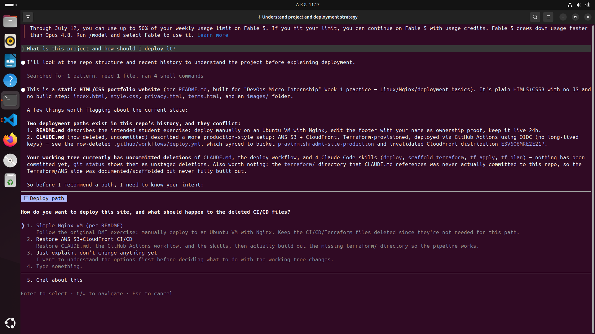
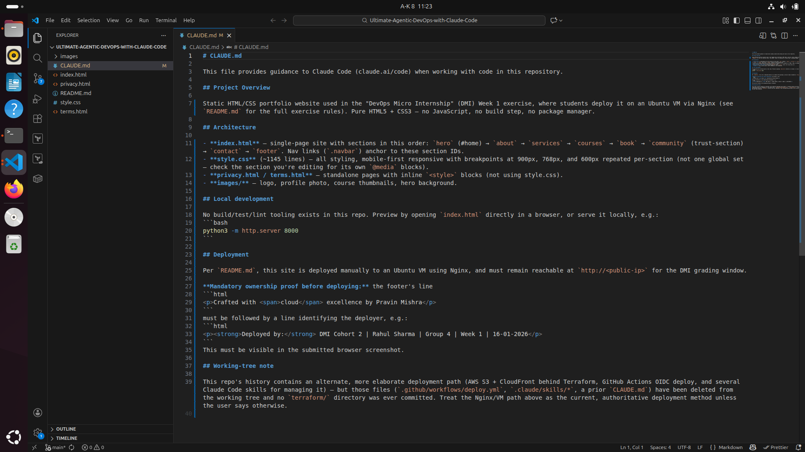
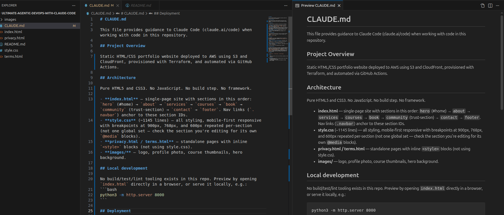
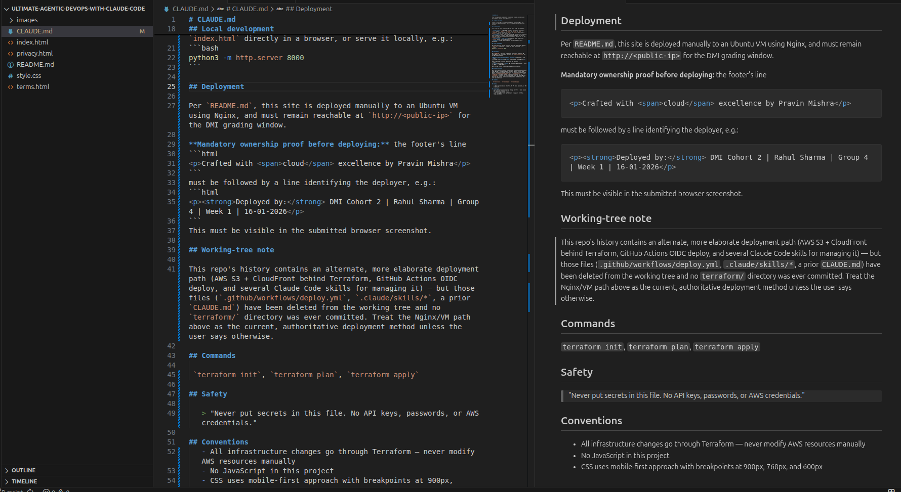
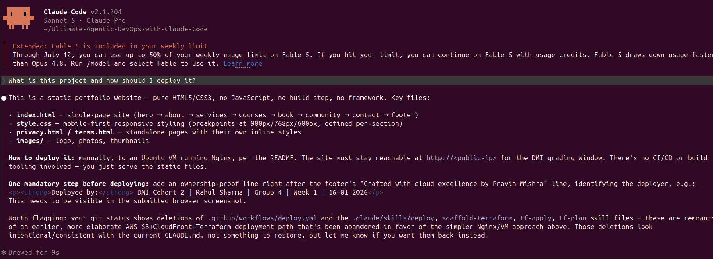
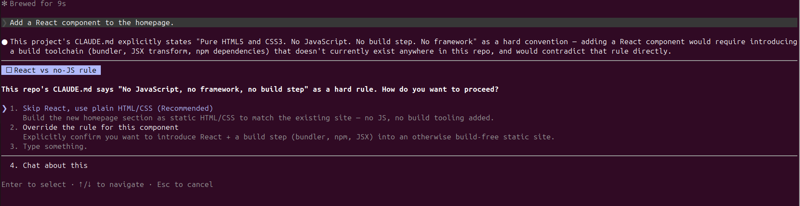
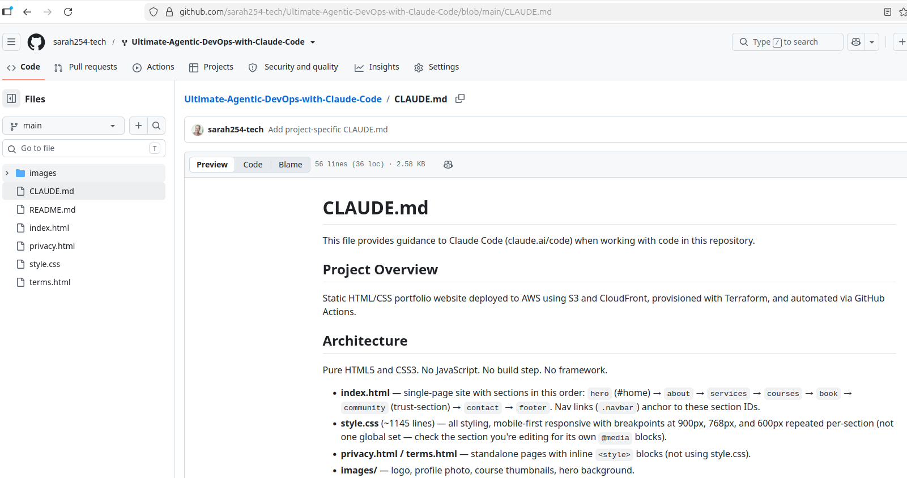

# Assignment 2 — Teaching Claude Your Project

Part of the DevOps Micro Internship (DMI) Cohort 3 with Agentic AI

---

## Purpose

In this assignment, I created and customize a `CLAUDE.md` file for my project using `/init`. I then modify it with project-specific rules and verify how it changes Claude’s behavior through before-and-after testing.

---

# Task 1 — Captured the Before State

## Goal

Capture Claude’s response before `CLAUDE.md` exists in the project to establish a baseline behavior.

### Evidence

#### Screenshot 1 — Claude’s generic response before CLAUDE.md exists (project contains only `index.html`, `style.css`, `images/`, `README.MD`, `privacy.html`, `terms.html`)

<>

---

# Task 2 — Generated the First Draft with /init

## Goal

Generate an initial `CLAUDE.md` file using the `/init` command and reviewe the auto-generated content.

### Evidence

#### Screenshot 2 — The auto-generated CLAUDE.md open in VS Code showing its content

<>

---

# Task 3 — Customized the CLAUDE.md

## Goal

Update the generate `CLAUDE.md` file by adding project-specific instructions across all required sections.

### Evidence

#### Screenshot 3 — The customized CLAUDE.md in VS Code showing all 5 sections (scroll to show the full file)

<>
<>

---

# Task 4 — Tested the After State

## Goal

Verify that Claude’s behavior changes after adding `CLAUDE.md` by running a new session and comparing responses before and after context is applied.

### Evidence

#### Screenshot 4 — Claude's specific, detailed answer after reading CLAUDE.md (Claude mentioning S3, CloudFront and Terraform)

<>

---

#### Screenshot 5 — Claude refusing or warning against adding React because of the "No JavaScript" convention defined in CLAUDE.md

<>

---

# Task 5 — Committed and pushed my changes to my fork in GitHub

## Goal

Commit the `CLAUDE.md` file and push it to my GitHub fork so the project instructions are version-controlled.

### Evidence

#### Screenshot 6 — `CLAUDE.md` visible in my GitHub repository after pushing the commit

<>

---

# Submission Instructions

- Ensure `CLAUDE.md` is committed to your GitHub repository
- Add all required screenshots to your submission
- Push your final changes to your forked repository

---

## GitHub Repository URL

Paste your forked repository URL here:

`https://github.com/sarah254-tech/Ultimate-Agentic-DevOps-with-Claude-Code/`

---

# Completion Checklist

[✅ ] Screenshot 1 shows a generic Claude response (no CLAUDE.md) 
[✅ ] Screenshot 2 shows the auto-generated `/init` output  
[✅ ] Screenshot 3 shows all 5 sections in your customized CLAUDE.md  
[✅ ] Screenshot 4 shows Claude mentioning S3, CloudFront, and Terraform  
[✅ ] Screenshot 5 shows Claude refusing the React request  
[✅ ] Screenshot 6 shows `CLAUDE.md` committed and visible in your GitHub repository  
[✅ ] GitHub repository URL is included in the submission  

---

## 📌 About DMI & CloudAdvisory

DevOps Micro Internship (DMI) is a project-based DevOps program run by Pravin Mishra (The CloudAdvisory) focused on real-world execution, systems thinking, and career readiness.

It helps learners build strong DevOps foundations with hands-on experience.

---

## 📌 Resources

- 🌐 DMI Official Website: https://pravinmishra.com/dmi  
- 🎓 DevOps for Beginners (Udemy): https://www.udemy.com/course/devops-for-beginners-docker-k8s-cloud-cicd-4-projects/  
- 🎓 Agentic AI DevOps with Claude Code: https://www.udemy.com/course/ultimate-agentic-ai-devops-with-claude-code/  
- 🎓 DevOps with Claude Code: Terraform, EKS, ArgoCD & Helm: https://www.udemy.com/course/devops-with-claude-code-terraform-eks-argocd-helm/  
- ▶️ YouTube Playlist: https://www.youtube.com/playlist?list=PLFeSNDtI4Cho  
- 🔗 Pravin Mishra (LinkedIn): https://www.linkedin.com/in/pravin-mishra-aws-trainer/  
- 🏢 CloudAdvisory (LinkedIn): https://www.linkedin.com/company/thecloudadvisory/

---

*This submission is part of DevOps Micro Internship (DMI) Cohort 3 — Agentic AI Track.*