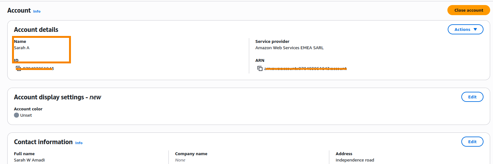

# Assignment 1 — AWS Free Tier Account Setup (EpicReads Cloud Onboarding)

Part of the DevOps Micro Internship (DMI) Cohort 3 with Agentic AI

---

## Purpose

In this assignment, I created and verified an AWS Free Tier account as part of onboarding EpicReads — an online bookstore moving to the cloud. I demonstrated an understanding of AWS fundamentals, Free Tier services, and account setup by answering conceptual questions and capturing proof of a working AWS Console login.

---

# Task 1 — Understanding AWS & Free Tier

## Goal

Demonstrate understanding of AWS basics and Free Tier usage by answering the following questions in your own words (3–4 lines each).

### Answers

#### Question 1 — What is an AWS account, and why do you need it at this stage?

    An AWS account is a personal account that gives people access to Amazon's cloud computing platform. It acts as my identity for creating, managing, and using cloud resources e.g virtual servers, storage, databases, and networking services.

    At this stage of the internship, an AWS account is needed because it provides a real cloud environment where I can practice deploying applications, creating virtual machines, automating infrastructure, and learning cloud-based DevOps tools.

---

#### Question 2 — What is AWS Free Tier, and how long does it last?

    The AWS Free Tier is a program that allows new AWS customers to use selected AWS services at no cost within specified monthly usage limits. It is designed to help beginners learn and experiment with AWS without paying for common cloud resources.

    They have a standard 6-month Free Tier that begins when you create your AWS account. Some AWS services also include Always Free offers that remain free as long as you stay within the monthly usage limits, while a few services provide short-term free trials(like 3-months).

---

#### Question 3 — Name three AWS Free Tier services and their free usage limits.

1. Amazon EC2 (Elastic Compute Cloud) – Up to 750 hours per month of a t2.micro or t3.micro instance (depending on the region) during the 6-month Free Tier. This is commonly used to host virtual machines.

2. Amazon S3 (Simple Storage Service) for personal portfolio– Up to 5 GB of Standard Storage, 20,000 GET requests, and 2,000 PUT/COPY/POST/LIST requests per month during the 12-month Free Tier. It is used to store files and application data.

3. Amazon RDS (Relational Database Service) – Up to 750 hours per month of a db.t3.micro or db.t4g.micro Single-AZ database instance (depending on the database engine and region), plus up to 20 GB of database storage during the 12-month Free Tier. It is used to host managed relational databases such as MySQL and PostgreSQL.

---

# Task 2 — Create AWS Free Tier Account

## Goal

Create a valid AWS Free Tier account and sign in to the AWS Management Console.

> No screenshots required for this task. Completion is verified through Task 3.

---

# Task 3 — Verify AWS Account

## Goal

Confirm that your AWS account setup is complete by navigating to the Account section and capturing proof.

### Evidence

#### Screenshot 1 — AWS Account page showing account name (email may be blurred)

<>

---

# Submission Instructions

- Add all required screenshots in your GitHub repository submission
- Full name must be visible in required screenshots
- Do not expose sensitive information (keys, passwords, account IDs)

---

# Completion Checklist

- [✅] Task 1 answers written in own words
- [✅] AWS Free Tier account created successfully
- [✅] Signed in to AWS Management Console
- [✅] Screenshot of AWS Account page captured (full name visible, no sensitive data)
- [✅] All required screenshots added to repository

---

## 📌 About DMI & CloudAdvisory

DevOps Micro Internship (DMI) is a project-based DevOps program run by Pravin Mishra (The CloudAdvisory) focused on real-world execution, systems thinking, and career readiness.

It helps learners build strong DevOps foundations with hands-on experience.

---

## 📌 Resources

- 🌐 DMI Official Website: https://pravinmishra.com/dmi  
- 🎓 DevOps for Beginners (Udemy): https://www.udemy.com/course/devops-for-beginners-docker-k8s-cloud-cicd-4-projects/  
- 🎓 Agentic AI DevOps with Claude Code: https://www.udemy.com/course/ultimate-agentic-ai-devops-with-claude-code/  
- 🎓 DevOps with Claude Code: Terraform, EKS, ArgoCD & Helm: https://www.udemy.com/course/devops-with-claude-code-terraform-eks-argocd-helm/  
- ▶️ YouTube Playlist: https://www.youtube.com/playlist?list=PLFeSNDtI4Cho  
- 🔗 Pravin Mishra (LinkedIn): https://www.linkedin.com/in/pravin-mishra-aws-trainer/  
- 🏢 CloudAdvisory (LinkedIn): https://www.linkedin.com/company/thecloudadvisory/

---

*This submission is part of DevOps Micro Internship (DMI) Cohort 3 — Agentic AI Track.*