# Assignment 3 — Production Maintenance Drill (OPS Checklist)

Part of the DevOps Micro Internship (DMI) Cohort 3 with Agentic AI

---

## Purpose

In this assignment, I treated my already deployed React application (on Ubuntu VM with Nginx) as a live production system. I performed structured operational checks covering network validation, service health, log analysis, resource monitoring, configuration verification, and incident simulation with recovery — mirroring real on-call DevOps responsibilities.

---

# Task 1 — Server Access & Networking Validation

## Goal

Verify that the deployed React application is reachable from the browser and confirm basic network connectivity of the Ubuntu VM.

### Evidence

#### Screenshot 1 — Browser showing the React app with your Full Name visible on the UI

<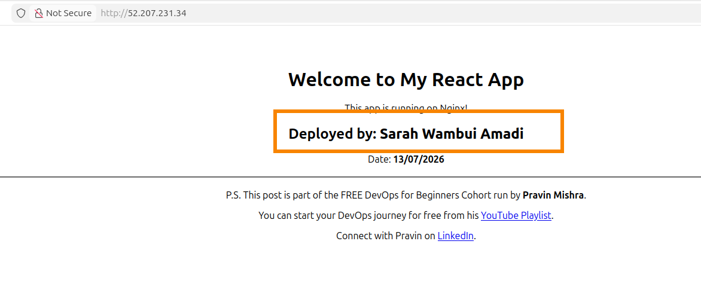>

---

#### Screenshot 2 — Output of `ip a`

<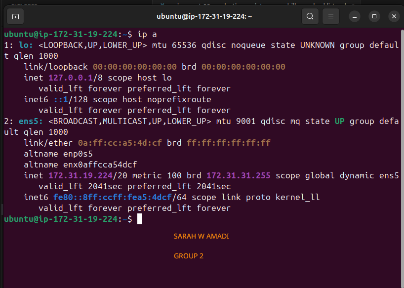>

---

#### Screenshot 3 — Output of `sudo ss -tulpen`

<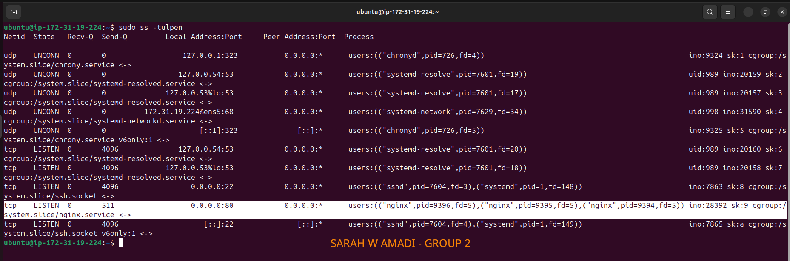>

---

#### Screenshot 4 — Output of `sudo ufw status`

<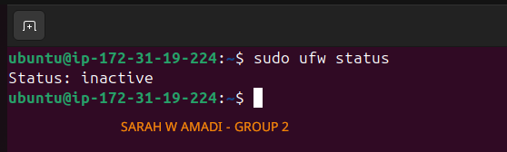>

---

### Notes

Answer the following in your own words:

**1. What proves Nginx is listening on 0.0.0.0:80?**

    The output from `sudo ss -tulnep`-----> `tcp LISTEN 0  511  0.0.0.0:80  0.0.0.0:* .......` proves that Nginx is listening on `0.0.0.0:80.`.The `0.0.0.0` means Nginx is listening on all network interfaces (every available network connection on the server), not just the local machine. The `:80` means it is listening on port 80, which is the default port for HTTP web traffic.

---

**2. What proves SSH is active on port 22?**

    The output from sudo ss -tulnep also illustrates`tcp LISTEN 0 4096 0.0.0.0:22.....users:(("sshd"...))`,proving that SSH is active on port 22. The `0.0.0.0:22` indicates that SSH is listening on port 22 across all network interfaces (all available network connections on the server). The presence of the `sshd` process confirms that the SSH service is running and ready to accept remote login requests.

---

**3. Did you find any unexpected open ports? Explain briefly.**

    No, I did not find any unexpected open ports. The open ports shown are expected for this server. **Port 22** is being used by **SSH (Secure Shell)** to allow secure remote access, while **port 80** is being used by **Nginx** to serve web traffic. The other ports, such as **53** for **DNS (Domain Name System)** and **68** for **DHCP (Dynamic Host Configuration Protocol)**, are used by system services to handle name resolution and network configuration.

---

# Task 2 — Service Health & Systemd Validation (Nginx)

## Goal

Verify that Nginx is properly installed, running, enabled at boot, and safely configured.

### Evidence

#### Screenshot 1 — Output of `systemctl status nginx --no-pager`

<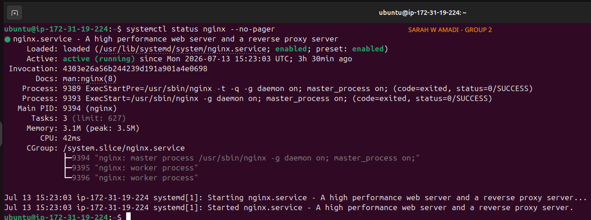>

---

#### Screenshot 2 — Output of `sudo nginx -t`

<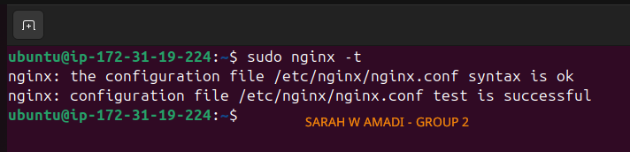>

#### Screenshot 3 — Output of `sudo ss -lptn '( sport = :80 )'`

<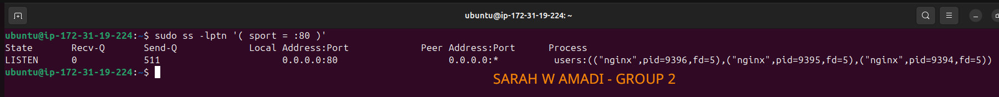>

---

### Notes

Answer the following in your own words:

**1. What happens if Nginx fails to restart in production?**

    If Nginx fails to restart in production, the issue might be a configuration error, a port conflict, a missing dependency, or a service permission problem. Because of that, users may not be able to access the website or application through the web server leading to a downtime.

---

**2. What's your basic rollback plan?**

    My basic rollback plan would be to first restore the last working Nginx configuration if the new changes caused the restart to fail. I would then test the configuration using `nginx -t` to check for errors before restarting the service again. If the issue still persists, I would review the Nginx error logs to identify the problem and fix it before attempting another restart. This approach helps restore the website quickly while reducing downtime.

---

# Task 3 — Logs & Request Trace

## Goal

Verify real traffic flow and analyze logs to understand system behavior and errors.

### Evidence

#### Screenshot 1 — Output of `sudo tail -n 30 /var/log/nginx/access.log`

<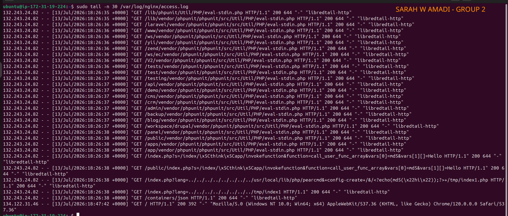>

---

#### Screenshot 2 — Output of `sudo tail -n 30 /var/log/nginx/error.log`

<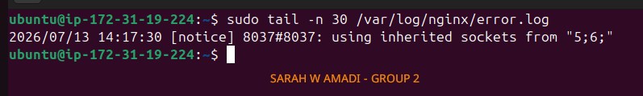>

---

#### Screenshot 3 — Output of `sudo journalctl -u nginx --no-pager -n 50`

<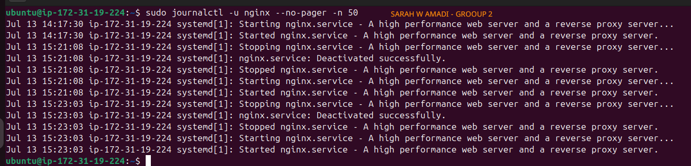>

---

### Notes

Answer the following in your own words:

**1. Were there any errors in the logs?**

- If yes, mention 1–2 example error lines from the logs and explain what each one means in simple terms.
- If no, explain what it means if the error log is empty or shows no recent errors during your check.

    I did not find any Nginx server errors in the logs. Instead, the output from, `sudo tail -n 30 /var/log/nginx/access.log` shows access requests made to the server. Most of the requests appear to be from an automated scanner trying different URLs to look for known vulnerabilities. Since the server continued responding with successful HTTP responses and the website remained accessible, it suggests that Nginx was running normally and there were no service failures at the time the logs were captured.

---

**2. If there were no errors, what does that indicate about the system?**

    It indicates that the system was running normally at the time the logs were checked. **Nginx** was able to receive and process requests without crashing or reporting configuration issues. This suggests that the web server was stable, functioning as expected, and successfully serving users. Although the logs show some suspicious requests from automated scanners, there is no evidence that they caused any problems or affected the normal operation of the server.

---

**3. Based on the access logs, were your curl requests visible in the log entries? What does that prove about traffic flow?**

    Yes, my curl request was visible in the **Nginx** access logs (`127.0.0.1 - - [13/Jul/2026:19:56:11 +0000] "GET / HTTP/1.1" 200 644 "-" "curl/8.18.0"`
    ). This proves that the request successfully reached the web server and was processed by **Nginx**. Every request sent to the server, whether from a browser or the curl command-line tool, is recorded in the access log. This confirms that traffic flows from the client to the web server, and Nginx logs each request it receives.

---

# Task 4 — System Resource Health Check (Capacity Red Flags)

## Goal

Assess server capacity and detect potential performance or failure risks.

### Evidence

#### Screenshot 1 — Output of `uptime`

<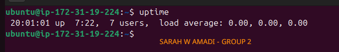>

---

#### Screenshot 2 — Output of `free -h`

<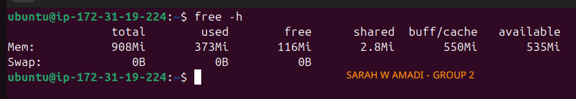>

---

#### Screenshot 3 — Output of `df -h`

<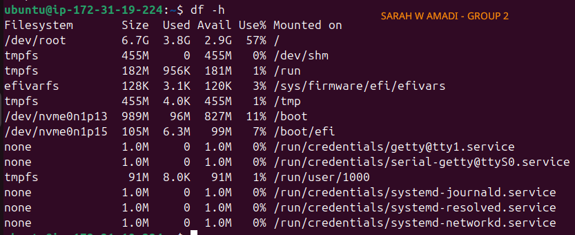>
---

#### Screenshot 4 — Output of `sudo du -sh /var/* | sort -h`

<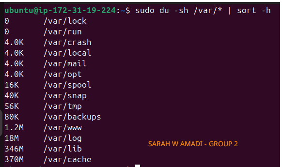>

---

### Notes

Answer the following in your own words:

**1. Which resource looks most critical right now? (CPU/load, memory, or disk) Explain why.**

    On one hand, even though not critical, I will need to closely monitor the disk space. The disk space can fill up over time due to logs, application files, and updates. Currently, the root filesystem (/) is using 57% of its available storage, leaving about 2.9 GB free.  

    On the other and, the server's memory (RAM) is in a healthy state. Although only 108 MB is free, Linux uses available memory for buffer/cache. There is still 535 MB of available memory, so there is no sign of memory pressure. There is also no indication that CPU/load is under stress.

---

**2. What happens if disk becomes 100% full in a production server?**

    If the disk becomes 100% full, the server may no longer be able to write new files, logs, or application data. This can cause applications to crash, prevent users from uploading data, and even stop some services from running properly. In a worst care scenarion, the server may become unstable or unavailable. That is why monitoring disk usage and cleaning up unnecessary files before the disk is full is an important practice.

---

# Task 5 — Configuration & Deployment Verification

## Goal

Ensure the correct React build is deployed and Nginx is serving it properly.

### Evidence

#### Screenshot 1 — Output of `ls -lah /var/www/html | head -n 20`

<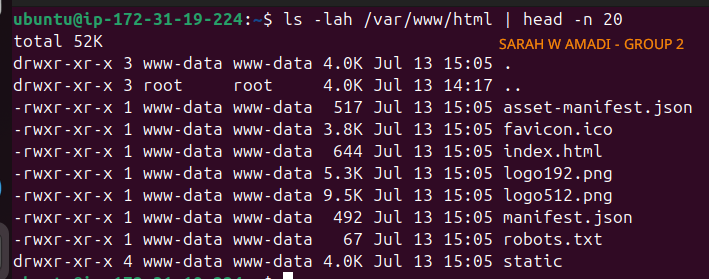>

---

#### Screenshot 2 — Output of `grep -R "Deployed by" -n /var/www/html 2>/dev/null | head`

<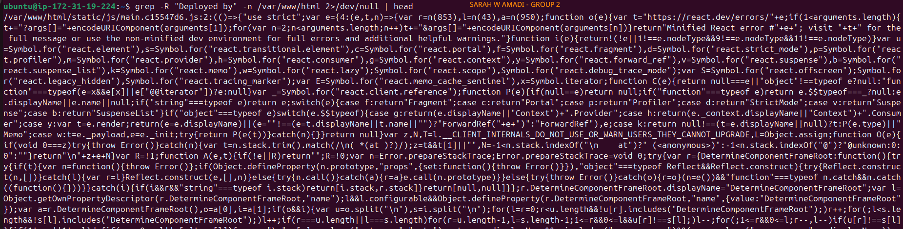>

---

#### Screenshot 3 — Output of `grep -n "try_files" /etc/nginx/sites-available/default`

<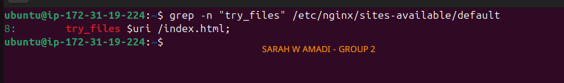>

---

### Notes

Answer the following in your own words:

**1. How do you confirm that the correct version of the application is deployed?**

    I would confirm the correct version by opening the deployed application and checking that it contains the latest changes or features I expected to see. I would also compare the deployed version with the latest code in the GitHub repository or verify the deployed commit if version information is available. This helps ensure that the application running in production matches the version that was intended for deployment.

---

# Task 6 — Nginx Configuration Failure Simulation

## Goal

Simulate a real-world Nginx misconfiguration and recover the service safely.

### Evidence

#### Screenshot 1 — Output of `sudo nginx -t` showing the syntax error (broken config)

<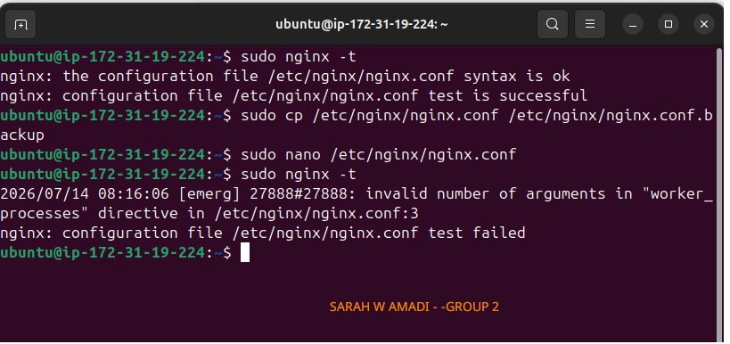>

---

#### Screenshot 2 — Output of `sudo nginx -t` showing syntax ok (fixed config)

<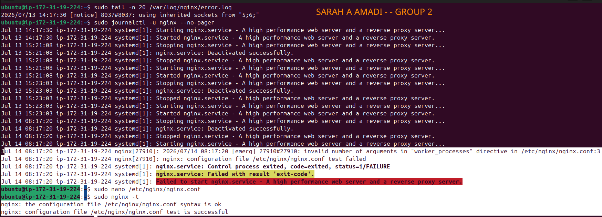>

---

#### Screenshot 3 — Output of `curl -I http://<public-ip>` confirming recovery (200 OK)

<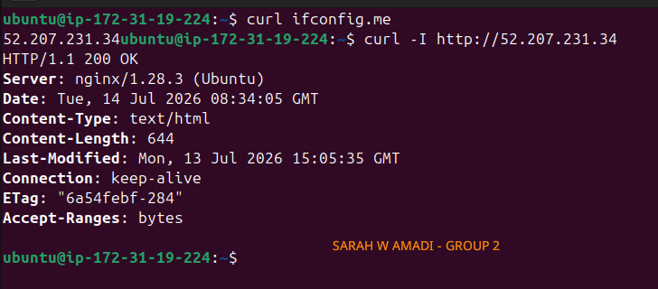>

---

### Notes

Answer the following in your own words:

**1. What caused the configuration failure?**

    The configuration failure was caused by a `syntax error` in the **Nginx** configuration file. I accidentally removed the semicolon `(;)` after the worker_processes auto directive, making the configuration invalid.

---

**2. How did you fix the issue?**

    I checked the error logs using `sudo journalctl -u nginx --no-pager`, which identified the syntax error. I edited the configuration file, added the missing semicolon, tested the configuration again (`nginx -t`) to confirm it was successful, and then restarted the Nginx service.

---

**3. How can you avoid this kind of issue in real production systems?**

    I can avoid this by always backing up the configuration before making changes, testing the configuration with `nginx -t` before restarting Nginx, and reviewing changes carefully. This helps catch errors early.

---

# Task 7 — Web Application Failure Simulation

## Goal

Simulate missing deployment content and recover the application safely.

### Evidence

#### Screenshot 1 — Output of `curl -I http://<public-ip>` showing failure (non-200 response)

<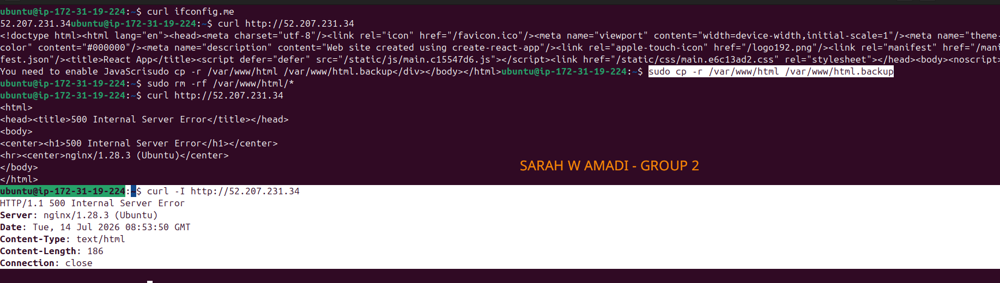>

---

#### Screenshot 2 — Output of `curl -I http://<public-ip>` confirming recovery (200 OK)

<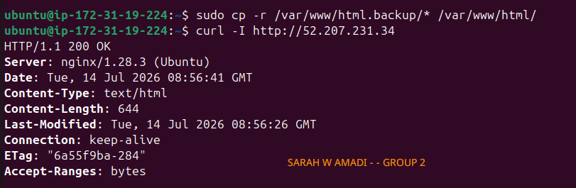>

---

### Notes

Answer the following in your own words:

**1. What caused the application to break in this scenario?**

    The application broke because the website files in the deployment directory (`/var/www/html`) were accidentally deleted. Although Nginx was still running, it could not display the application because the required files were missing.

---

**2. How did you fix the issue and restore the application?**

    I restored the website files from the backup, confirmed that they were back in the deployment directory, and then verified that the application was accessible again by opening it in the browser and testing it with `curl`.

---

**3. What steps would you take to prevent this kind of issue in real production systems?**

    To prevent this, I would always back up the application before deployment, verify the deployment files before deleting or replacing anything, and test the application immediately after deployment. I would also use version control and an automated deployment process to reduce the risk of accidental file deletion.

---

# Task 8 — Security & Reliability Review

## Goal

Review and reflect on the security and reliability practices applied during this assignment.

### Security & Reliability Notes

Answer the following in your own words:

**1. Why is SSH key-based authentication more secure than sharing passwords?**

    SSH key-based authentication (instead of a password) is more secure because the private key stays on my computer and is never sent over the network. It is much harder for attackers to guess or steal than a password, reducing the risk of unauthorized access.

---

**2. Why should only required ports be open on a production server?**

    Only the ports needed by the application should be open because every open port is a possible entry point for attackers. Closing unused ports reduces the server's attack surface and improves its overall security.

---

**3. Why is it important for Nginx to be enabled on boot?**

    Enabling Nginx on boot ensures that the web server starts automatically whenever the server is restarted. This helps keep the application available without requiring someone to start the service manually.

---

**4. What are the risks of sharing secrets, keys, or credentials publicly?**

    Sharing secrets, SSH keys, passwords, or cloud credentials publicly can give unauthorized people access to servers, applications, or cloud resources. This can lead to data theft, service disruption, or unexpected cloud charges.

---

**5. Why should cloud resources be stopped or terminated when they are no longer needed?**

    Cloud resources should be stopped or terminated when they are no longer needed to avoid unnecessary costs and reduce security risks. Unused resources can still be targeted by attackers and may continue generating charges even when they are not being used.

---

# LinkedIn Post (Required)

## Evidence

#### LinkedIn Post URL

Paste your LinkedIn post URL here:

https://www.linkedin.com/posts/sarah-w-amadi_dmibypravinmishra-agenticai-claudecode-activity-7482728968807260160-nPGJ?utm_source=share&utm_medium=member_desktop&rcm=ACoAACAx4n8Bvuf305sZ28vfr5yvaoLLEr0SkSA

---

#### Screenshot — Published LinkedIn post

<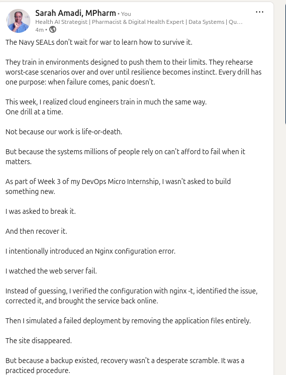>

---

# Submission Instructions

- Add all required screenshots in your submission
- Full name must be visible in required screenshots
- Do not expose sensitive information (keys, passwords, account IDs)

---

# Completion Checklist

- [✅] Task 1: Screenshots (browser, ip a, ss -tulpen, ufw status) + Notes answered
- [✅] Task 2: Screenshots (nginx status, nginx -t, ss port 80) + Notes answered
- [✅] Task 3: Screenshots (access log, error log, journalctl) + Notes answered
- [✅] Task 4: Screenshots (uptime, free -h, df -h, du -sh) + Notes answered
- [✅] Task 5: Screenshots (ls html, grep deployed by, grep try_files) + Notes answered
- [✅] Task 6: Screenshots (nginx -t fail, nginx -t pass, curl recovery) + Notes answered
- [✅] Task 7: Screenshots (curl failure, curl recovery) + Notes answered
- [✅] Task 8: Security & Reliability Notes answered
- [✅] LinkedIn post published and URL submitted
- [✅] Full Name visible in all required screenshots
- [✅] No sensitive data exposed

---

## 📌 About DMI & CloudAdvisory

DevOps Micro Internship (DMI) is a project-based DevOps program run by Pravin Mishra (The CloudAdvisory) focused on real-world execution, systems thinking, and career readiness.

It helps learners build strong DevOps foundations with hands-on experience.

---

## 📌 Resources

- 🌐 DMI Official Website: https://pravinmishra.com/dmi  
- 🎓 DevOps for Beginners (Udemy): https://www.udemy.com/course/devops-for-beginners-docker-k8s-cloud-cicd-4-projects/  
- 🎓 Agentic AI DevOps with Claude Code: https://www.udemy.com/course/ultimate-agentic-ai-devops-with-claude-code/  
- 🎓 DevOps with Claude Code: Terraform, EKS, ArgoCD & Helm: https://www.udemy.com/course/devops-with-claude-code-terraform-eks-argocd-helm/  
- ▶️ YouTube Playlist: https://www.youtube.com/playlist?list=PLFeSNDtI4Cho  
- 🔗 Pravin Mishra (LinkedIn): https://www.linkedin.com/in/pravin-mishra-aws-trainer/  
- 🏢 CloudAdvisory (LinkedIn): https://www.linkedin.com/company/thecloudadvisory/

---

*This submission is part of DevOps Micro Internship (DMI) Cohort 3 — Agentic AI Track.*