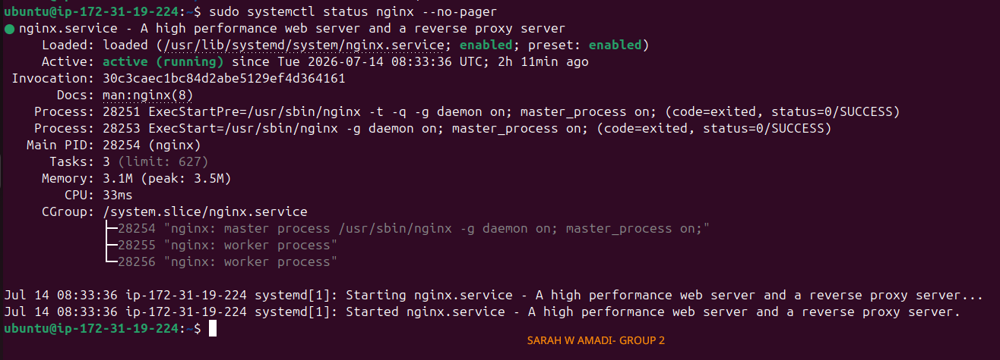
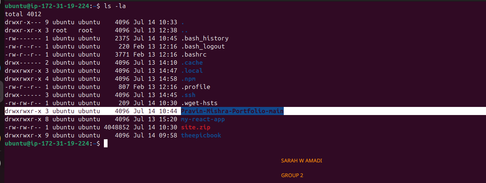
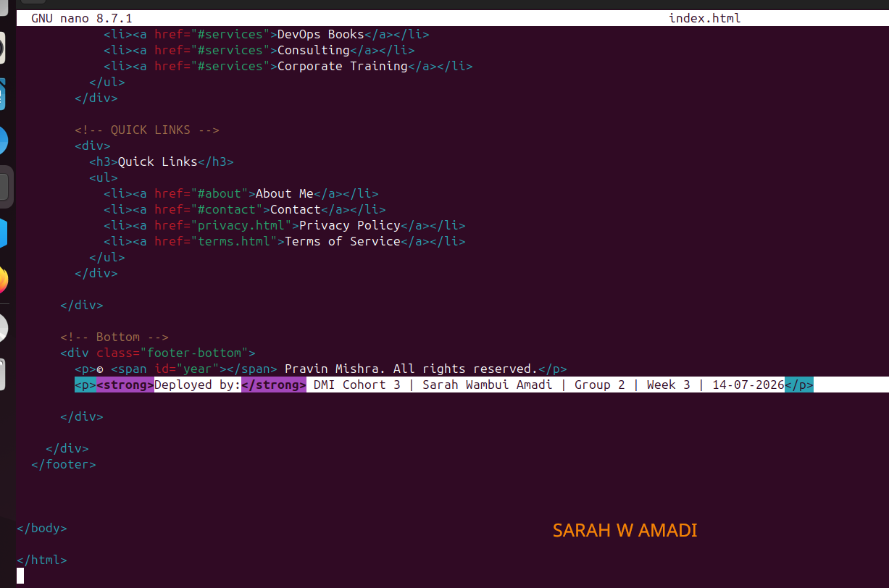
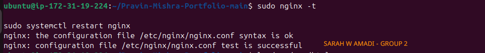
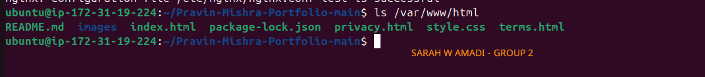
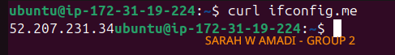
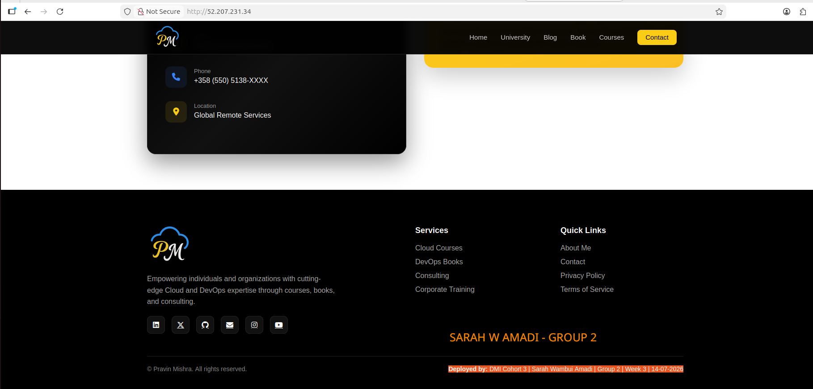
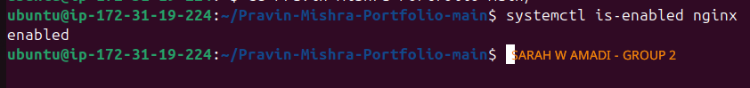
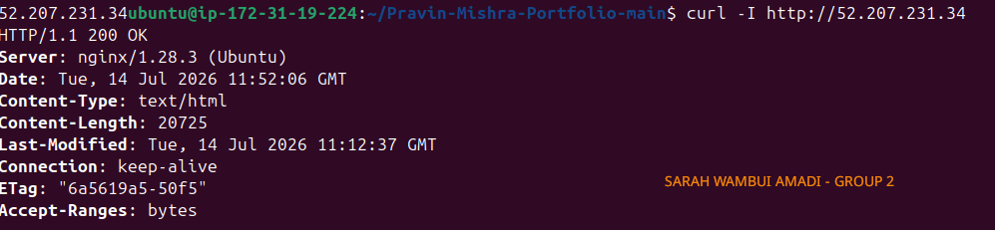
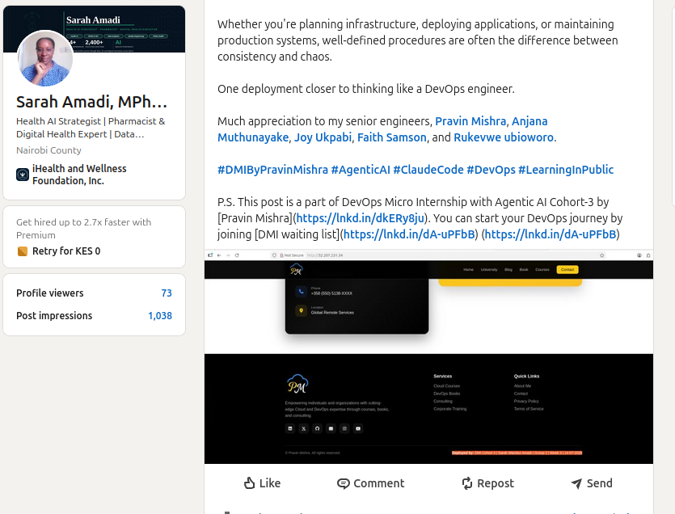

# Assignment 4 — Deploy EpicReads Portfolio Website via Nginx

Part of the DevOps Micro Internship (DMI) Cohort 3 with Agentic AI

---

## Purpose

In this assignment, I deployed a static portfolio website on an Ubuntu VM using Nginx. I downloaded the website template, added my ownership proof in the footer, deployed the files to the Nginx web root, and verified the website is publicly accessible via a browser.

---

# Task 0 — Pre-flight Check

## Goal

Verify the Ubuntu VM and Nginx are ready for deployment.

### Evidence

#### Screenshot 0 — Output of `sudo systemctl status nginx --no-pager` showing Active (running)

<>

---

# Task 1 — Get the Website Source Code

## Goal

Download and extract the portfolio website template.

### Evidence

#### Screenshot 1 — Output of `ls -la` showing the extracted project folder

<>

---

# Task 2 — Add Ownership Proof (Anti-Copy Change)

## Goal

Update the website footer with your deployment details.

### Evidence

#### Screenshot 2 — Nano editor open with the updated footer showing your Full Name, Group, Week, and Date

<>

---

# Task 3 — Deploy Website via Nginx

## Goal

Deploy the portfolio website to the Nginx web root.

### Evidence

#### Screenshot 3 — Output of `sudo nginx -t` showing configuration test successful

<>

---

#### Screenshot 4 — Output of `ls /var/www/html` showing deployed website files

<>

---

# Task 4 — Verify Website is Live

## Goal

Verify the deployed website is publicly accessible and the footer contains your details.

### Evidence

#### Screenshot 5 — Output of `curl ifconfig.me` showing the server's public IP address

<>

---

#### Screenshot 6 — Browser showing the live website with your Full Name and deployment details in the footer

<>

---

# Task 5 — Mini Real DevOps Operational Check

## Goal

Verify the deployed website and Nginx service are healthy.

### Evidence

#### Screenshot 7 — Output of `systemctl is-enabled nginx`

<>

---

#### Screenshot 8 — Output of `curl -I http://localhost` showing 200 OK

<>

---

# LinkedIn Post (Mandatory)

## Evidence

#### LinkedIn Post URL

Paste your LinkedIn post URL here:

https://www.linkedin.com/posts/sarah-w-amadi_sops-dmibypravinmishra-agenticai-activity-7482873013059772416-a3My?utm_source=share&utm_medium=member_desktop&rcm=ACoAACAx4n8Bvuf305sZ28vfr5yvaoLLEr0SkSA

---

#### Screenshot — Published LinkedIn post showing the live website with your Full Name in the footer

<>

---

# Submission Instructions

- Add all required screenshots in your submission
- Full name must be visible in required screenshots
- Ownership proof in the footer is mandatory
- Do not expose sensitive information (keys, passwords, account IDs)

---

# Completion Checklist

- [✅] Screenshot 0: Nginx service status (active/running)
- [✅] Screenshot 1: Website files downloaded and extracted
- [✅] Screenshot 2: Footer updated with Full Name, Group, Week, and Date
- [✅] Screenshot 3: Nginx configuration test successful
- [✅] Screenshot 4: Website files deployed to /var/www/html
- [✅] Screenshot 5: Public IP retrieved
- [✅] Screenshot 6: Live website accessible in browser with footer details
- [✅] Screenshot 7: Nginx enabled on boot
- [✅] Screenshot 8: Local HTTP response returns 200 OK
- [✅] LinkedIn post published and URL submitted
- [✅] Full Name visible in all required screenshots
- [✅] No sensitive data exposed

---

## 📌 About DMI & CloudAdvisory

DevOps Micro Internship (DMI) is a project-based DevOps program run by Pravin Mishra (The CloudAdvisory) focused on real-world execution, systems thinking, and career readiness.

It helps learners build strong DevOps foundations with hands-on experience.

---

## 📌 Resources

- 🌐 DMI Official Website: https://pravinmishra.com/dmi  
- 🎓 DevOps for Beginners (Udemy): https://www.udemy.com/course/devops-for-beginners-docker-k8s-cloud-cicd-4-projects/  
- 🎓 Agentic AI DevOps with Claude Code: https://www.udemy.com/course/ultimate-agentic-ai-devops-with-claude-code/  
- 🎓 DevOps with Claude Code: Terraform, EKS, ArgoCD & Helm: https://www.udemy.com/course/devops-with-claude-code-terraform-eks-argocd-helm/  
- ▶️ YouTube Playlist: https://www.youtube.com/playlist?list=PLFeSNDtI4Cho  
- 🔗 Pravin Mishra (LinkedIn): https://www.linkedin.com/in/pravin-mishra-aws-trainer/  
- 🏢 CloudAdvisory (LinkedIn): https://www.linkedin.com/company/thecloudadvisory/

---

*This submission is part of DevOps Micro Internship (DMI) Cohort 3 — Agentic AI Track.*