# Assignment 5 — Bash Script Automation Drill (OPS Checklist)

Part of the DevOps Micro Internship (DMI) Cohort 3 with Agentic AI

---

## Purpose

In this assignment, I practised Bash scripting by building a series of small automation scripts covering environment setup, variables, arrays, loops, file conditionals, if-else logic, and functions. These scripts form the foundation of real-world Linux automation used in DevOps, cloud, and production support environments.

---

# Task 1 — Bash Environment & Workspace Setup

## Goal

Verify that Bash is available on your system and create a clean workspace for this assignment.

### Evidence

#### Screenshot 1 — Output of `echo $SHELL` and `bash --version`

<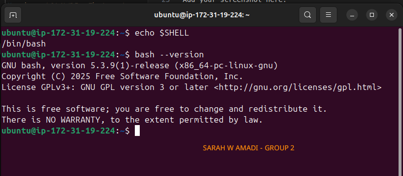>

---

#### Screenshot 2 — Output of `pwd` and `ls -lah` showing the scripts directory

<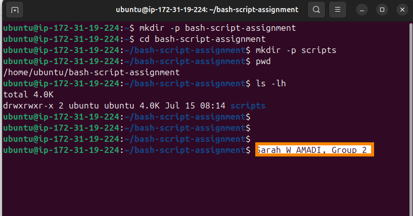>

---

### Notes

Answer the following in your own words:

**1. What is Bash?**

    Bash is a full programming language, the most widely used shell-type in Linux OS.

---

**2. What is the difference between shell and Bash?**

    Shell is a program in the Linux OS that receives commands, interprets them, and tells the OS the actions it should execute. While Bash is the most widely used programing langauge in shell.

---

**3. Why is it important to confirm the Bash version before writing scripts?**

    Knowing the Bash version is important because different versions support different features and commands. A script written for a newer Bash version may not work on an older system and vice versa. Checking the Bash version before writing scripts helps ensure the script will run correctly and remain compatible the Linux environment in use.

---

# Task 2 — Your First Bash Script

## Goal

Create your first Bash script, make it executable, and run it from the terminal.

### Evidence

#### Screenshot 1 — Content of `first-script.sh`

<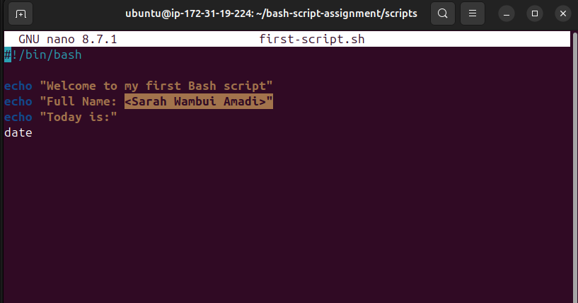>

---

#### Screenshot 2 — Output of `./first-script.sh`

<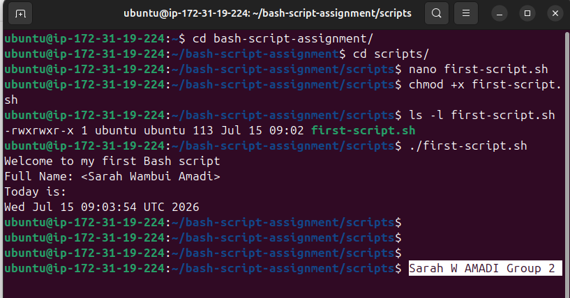>

---

#### Screenshot 3 — Output of `ls -l first-script.sh` showing executable permission

<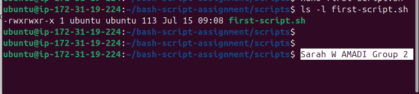>

---

### Notes

Answer the following in your own words:

**1. What is the purpose of `#!/bin/bash`?**

`#!/bin/bash` also known as `shebang`, tells the Linux OS to use bash as the interpreter.

---

**2. Why do we use `chmod +x` before running a script?**

`chmod +x` is applied before running the script, and it's solely to grant execution permission to the script file.

---

**3. What is the difference between running a script using `./script.sh` and `bash script.sh`?**

`./script.sh` is the already executable script file, while `bash script.sh`, starts the Bash interpretr and tells it to read the script. No need of execution because Bash is running directly.

---

# Task 3 — Variables: User Information Script

## Goal

Use variables to store and display user-related information.

### Evidence

#### Screenshot 1 — Content of `user-info.sh`

<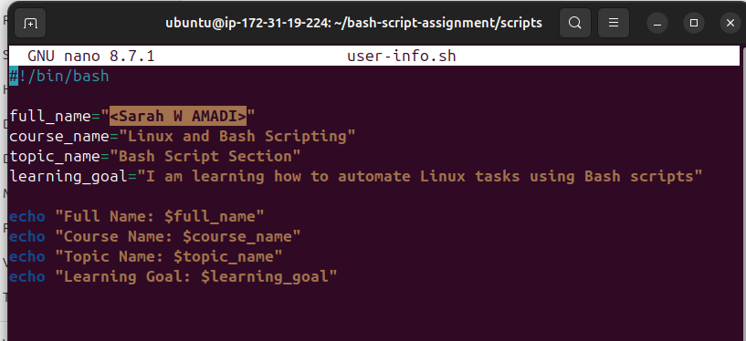>

---

#### Screenshot 2 — Output of `./user-info.sh`

<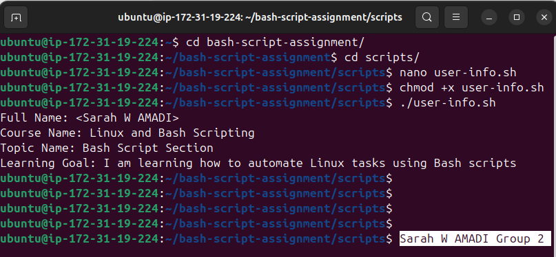>

---

### Notes

Answer the following in your own words:

**1. What is a variable in Bash?**

    Variable is like a container with a name, and it holds a value.

---

**2. Why should we avoid spaces around the `=` sign when creating variables?**

    The Bash will read the arguments plus the spaces and name the space as being part of the command, this will break the script.

---

**3. How do you access the value stored inside a Bash variable?**

We access the values inside the variables using the `$` Bash sign that is attached before the variable e.g `$Var`. The`$` simply tells Bash to get inside the variable and retrieve the stored value.

---

# Task 4 — Arrays & Loops: Tools Checklist Script

## Goal

Use arrays and loops to print a checklist of tools used in Bash scripting.

### Evidence

#### Screenshot 1 — Content of `tools-checklist.sh`

<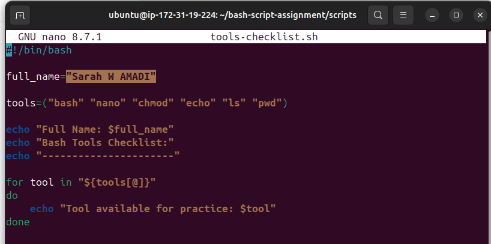>

---

#### Screenshot 2 — Output of `./tools-checklist.sh`

<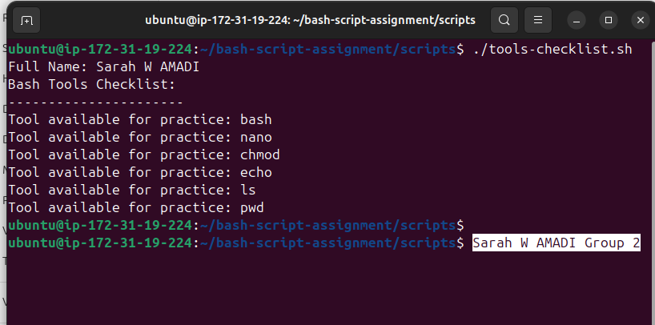>

---

### Notes

Answer the following in your own words:

**1. What is an array in Bash?**

    An array in Bash is a variable that can hold a list of values under one name.

---

**2. Why are arrays useful in scripts?**

    Arrays help you group related data together, making your scripts cleaner and easier to manage.

---

**3. What does `"${tools[@]}"` mean?**

`"${tools[@]}"`, 1.  `$`-tells Bash to retrieve the value stored in the `tools` array, and collectively, `${}` also keeps each element together, even if it contains spaces, 2. `tools` is the the name of the array variable, 3. `[@]`means all the elements in the array.

---

**4. What is the purpose of the `for` loop in this script?**

`for` starts the loop.

---

# Task 5 — Loops: Number Counter Script

## Goal

Use loops to repeat a task multiple times.

### Evidence

#### Screenshot 1 — Content of `counter.sh`

<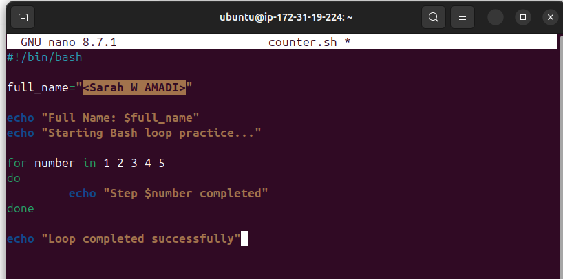>

---

#### Screenshot 2 — Output of `./counter.sh`

<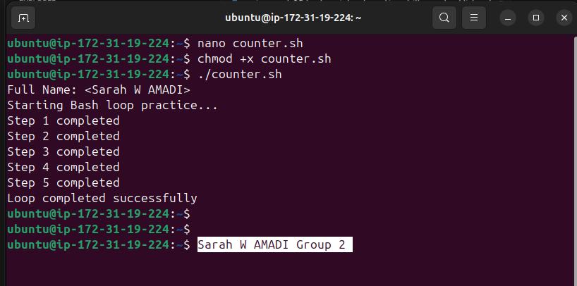>

---

### Notes

Answer the following in your own words:

**1. What is a loop?**

    A loop is a Bash programming structure that repeats a block of commands until all items have been processed or a condition is met.

---

**2. Why do we use loops in Bash scripting?**

    Loops are used to run repetitive runs using a single code line. We can run through arrays of directories, services and file paths.

---

**3. How many times did the loop run in your script?**

    Five times.

---

**4. What would you change if you wanted the loop to run 10 times?**

    Increase the number of count to 10.

---

# Task 6 — Files & Conditionals: File Validation Script

## Goal

Use file checks and conditionals to verify whether files and directories exist.

### Evidence

#### Screenshot 1 — Output of `ls -lah ../test-folder`

<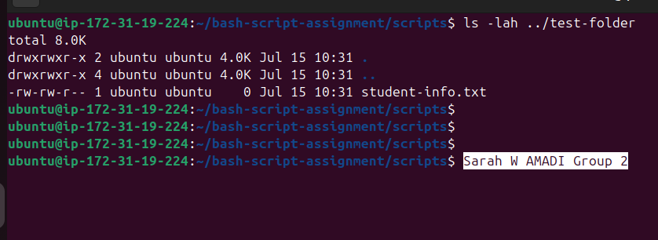>

---

#### Screenshot 2 — Content of `file-check.sh`

<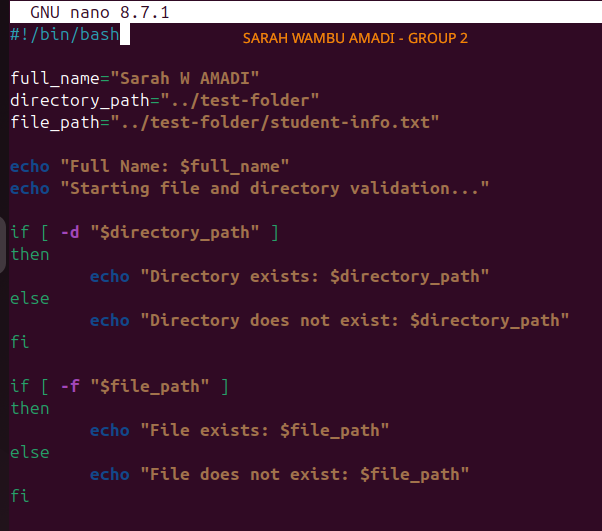>

---

#### Screenshot 3 — Output of `./file-check.sh`

<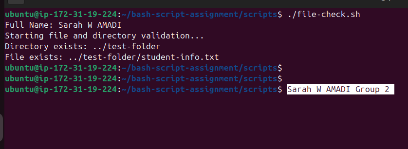>

---

### Notes

Answer the following in your own words:

**1. What does `-d` check in Bash?**

In this task the `-d` appears at `if [ -d "$directory_path" ]` and it means, "Is this path a directory?".

---

**2. What does `-f` check in Bash?**

In this task the `-f` appears at `if [ -f "$file_path" ]` and it means, "check if a file exists".

---

**3. Why should file and directory paths be stored in variables?**

    Storing file paths and directory paths in variables makes your Bash script easier to read, update, and reuse. If the path changes, you only need to update it in one place instead of searching through the entire script.

---

**4. What happens if the file does not exist?**

    If the file does not exist, the bash script may fail when it tries to use that file. The command will usually display an error, and depending on how the script is written, it may stop running or continue with incorrect results.

---

# Task 7 — Conditionals: Pass or Retry Script

## Goal

Use if-else conditionals to make decisions based on a variable value.

### Evidence

#### Screenshot 1 — Content of `score-check.sh` with `score=85`

<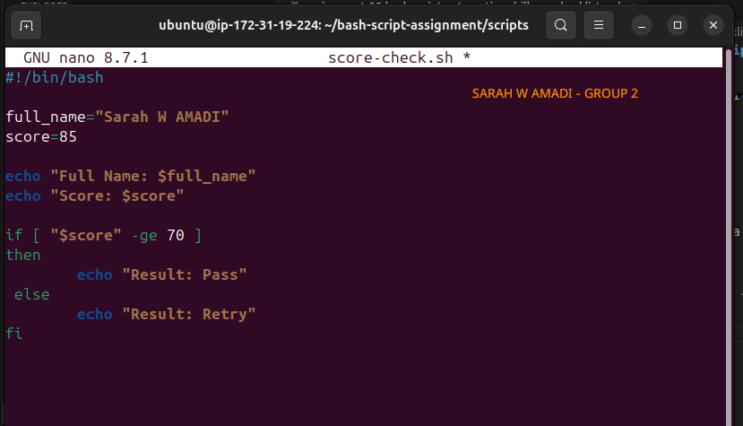>

---

#### Screenshot 2 — Output showing `Result: Pass`

<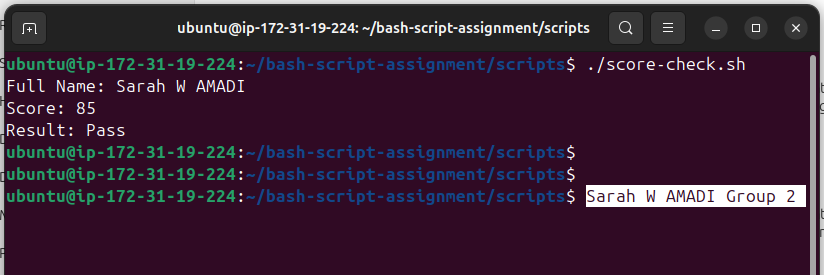>

---

#### Screenshot 3 — Content of `score-check.sh` with `score=55`

<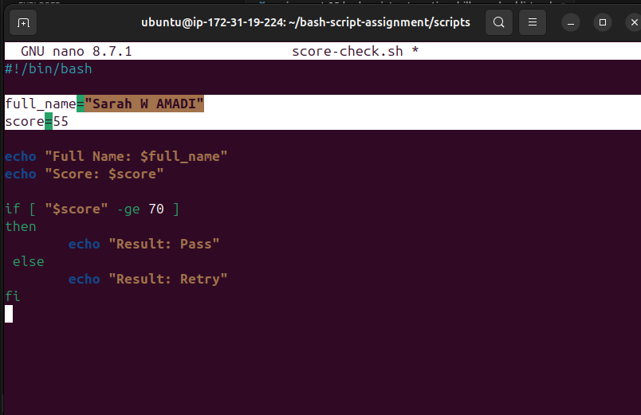>

---

#### Screenshot 4 — Output showing `Result: Retry`

<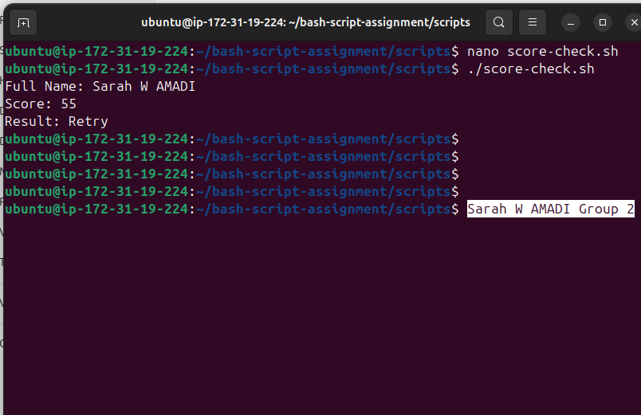>

---

### Notes

Answer the following in your own words:

**1. What is the purpose of if-else in Bash?**

    if-else statement is the conditional statement that is used to check two different expected outputs. if-else checks the condition is met  and runs different code; depending on the result.

---

**2. What does `-ge` mean?**

`-ge`, means "greater than or equal to"

---

**3. Why should conditions be tested with different values?**

    Conditions should be tested with different values to make sure the script behaves correctly in every situation, not just when everything is working as expected. Testing different inputs helps confirm that the script can handle both valid and invalid cases, making it more reliable and reducing unexpected errors in production.

---

**4. How can conditionals help in automation scripts?**

    Conditionals (statements like if, else, and elif that allow a script to make decisions) help automation scripts decide what action to take based on a specific situation. Instead of running every command, the script checks a condition first and only performs the appropriate task. This makes automation smarter, safer, and able to handle different scenarios without human intervention.

---

# Task 8 — Functions: Final Bash Automation Script

## Goal

Create a final Bash script using functions to organize reusable code.

### Evidence

#### Screenshot 1 — Content of `final-automation.sh`

<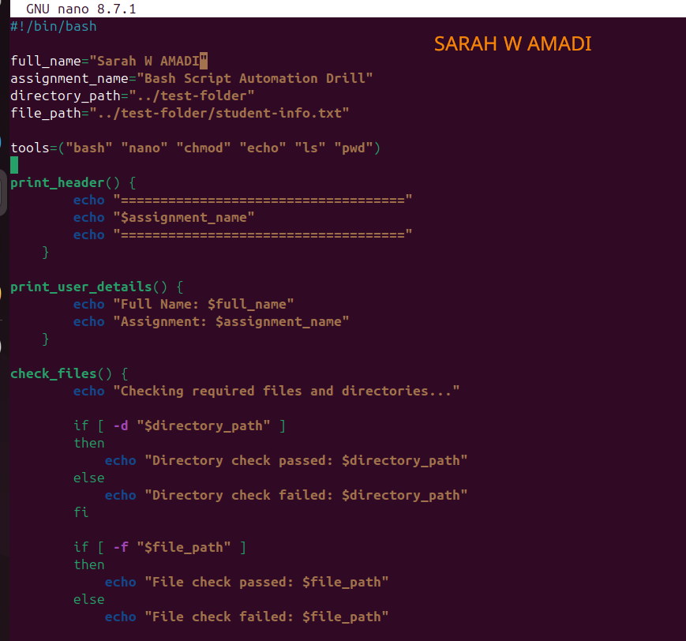>
<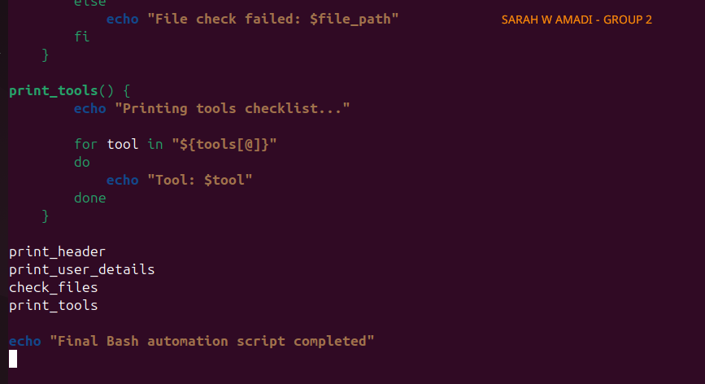>
---

#### Screenshot 2 — Output of `./final-automation.sh`

<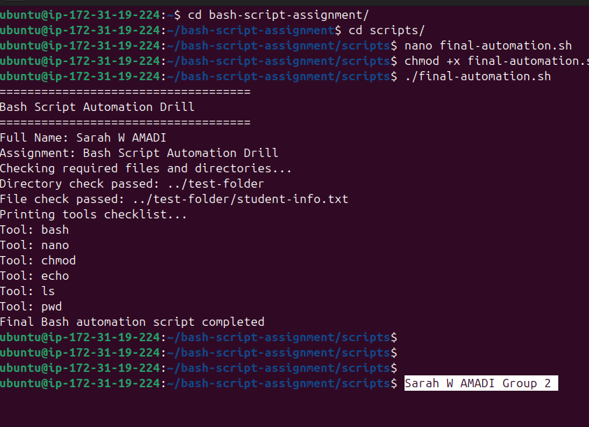>

---

#### Screenshot 3 — Output of `ls -lah` showing all created scripts

<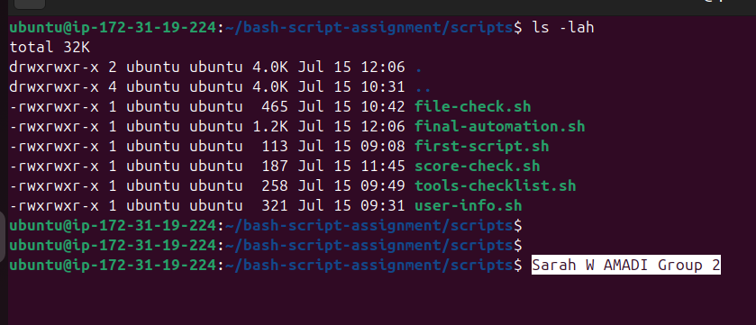>

---

### Notes

Answer the following in your own words:

**1. What is a function in Bash?**

    A function takes a block of codes, gives it a name and run it as a single unit when called upon.

---

**2. Why are functions useful in scripts?**

    Makes the work neat and easy to read, the functions can also be reused throughout the script, and also keeps the scripts easier to maintain.

---

**3. Which functions did you create in this script?**

Four functions wre created:
1. Print_header()
2. Print_user_details()
3. Check_files()
4. Print_tools()

---

**4. How does this final script combine variables, arrays, loops, conditionals, files, and functions?**

This script combines several core Bash concepts into one working program. It uses **variables** to store information such as my name, the assignment name, and file paths, making the script easier to update. It uses an **array** to store a list of tools, then a **for loop** to print each tool one at a time. **Conditional statements** (`if`) check whether the required directory and file exist before displaying the appropriate message. The script interacts with **files and directories** by verifying their existence using `-f` and `-d`. Finally, it organizes related tasks into **functions**, making the script cleaner, reusable, and easier to maintain.

---

# LinkedIn Post (Required)

## Evidence

#### LinkedIn Post URL

Paste your LinkedIn post URL here:

`https://www.linkedin.com/posts/sarah-w-amadi_dmibypravinmishra-agenticai-claudecode-activity-7483229640870907904-oHcY?utm_source=share&utm_medium=member_desktop&rcm=ACoAACAx4n8Bvuf305sZ28vfr5yvaoLLEr0SkSA`

---

#### Screenshot — Published LinkedIn post

<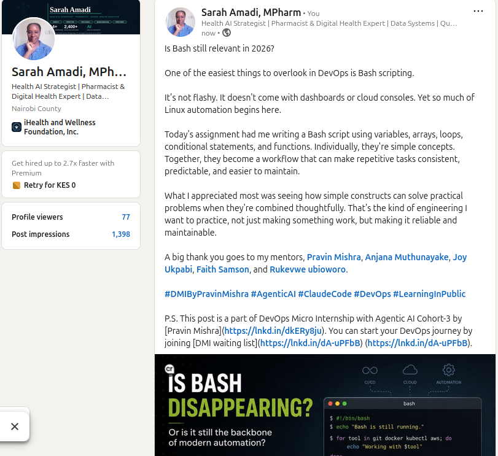>

---

# Submission Instructions

- Add all required screenshots in your submission
- Full name must be visible in required screenshots
- All script files must be created and run successfully
- Required notes must be answered clearly for every task
- Do not expose sensitive information (keys, passwords, credentials)

---

# Completion Checklist

- [✅] Task 1: Environment setup verified, workspace created (Screenshots 1–2, Notes answered)
- [✅] Task 2: First script created, executed, permissions verified (Screenshots 1–3, Notes answered)
- [✅] Task 3: Variables script created and run (Screenshots 1–2, Notes answered)
- [✅] Task 4: Arrays and loops script created and run (Screenshots 1–2, Notes answered)
- [✅] Task 5: Counter loop script created and run (Screenshots 1–2, Notes answered)
- [✅] Task 6: File validation script created and run (Screenshots 1–3, Notes answered)
- [✅] Task 7: Pass/Retry conditional script tested with both values (Screenshots 1–4, Notes answered)
- [✅] Task 8: Final automation script created and run (Screenshots 1–3, Notes answered)
- [✅] All scripts run without errors
- [✅] Full Name visible in all required screenshots
- [✅] LinkedIn post published and URL submitted
- [✅] No sensitive data exposed

---

## 📌 About DMI & CloudAdvisory

DevOps Micro Internship (DMI) is a project-based DevOps program run by Pravin Mishra (The CloudAdvisory) focused on real-world execution, systems thinking, and career readiness.

It helps learners build strong DevOps foundations with hands-on experience.

---

## 📌 Resources

- 🌐 DMI Official Website: https://pravinmishra.com/dmi  
- 🎓 DevOps for Beginners (Udemy): https://www.udemy.com/course/devops-for-beginners-docker-k8s-cloud-cicd-4-projects/  
- 🎓 Agentic AI DevOps with Claude Code: https://www.udemy.com/course/ultimate-agentic-ai-devops-with-claude-code/  
- 🎓 DevOps with Claude Code: Terraform, EKS, ArgoCD & Helm: https://www.udemy.com/course/devops-with-claude-code-terraform-eks-argocd-helm/  
- ▶️ YouTube Playlist: https://www.youtube.com/playlist?list=PLFeSNDtI4Cho  
- 🔗 Pravin Mishra (LinkedIn): https://www.linkedin.com/in/pravin-mishra-aws-trainer/  
- 🏢 CloudAdvisory (LinkedIn): https://www.linkedin.com/company/thecloudadvisory/

---

*This submission is part of DevOps Micro Internship (DMI) Cohort 3 — Agentic AI Track.*