# Assignment 6 — Build an AI-Assisted Linux Health Check (AI-Assisted Linux Incident Triage)

Part of the DevOps Micro Internship (DMI) Cohort 3 with Agentic AI

---

## Purpose

In this assignment, I built a read-only Bash triage script that checks the health of my Ubuntu server and Nginx application, connected it to Claude Code as a reusable `/linux-triage` skill, simulated a controlled Nginx incident, used the skill to gather and analyze evidence, recovered the service manually, and verified recovery. The workflow follows the Agentic Loop: Gather → Analyze → Human Act → Verify.

---

# Task 1 — Confirm the Healthy Baseline and Create the Workspace

## Goal

Confirm that Nginx and the React application are healthy before building the automation.

### Evidence

#### Screenshot 1 — Output of `systemctl is-active nginx`, `ss -ltn | grep ':80'`, and `curl -I http://localhost`

<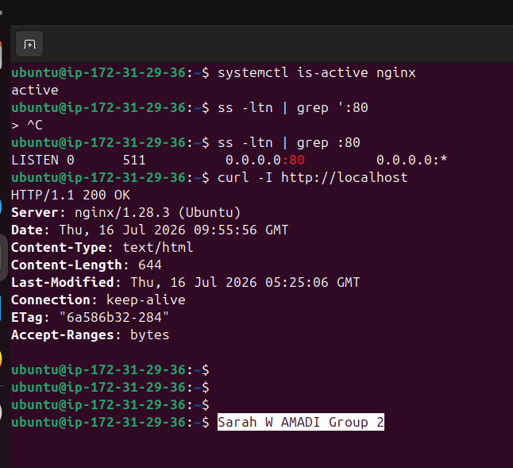>

---

#### Screenshot 2 — Output of `pwd` and `find . -maxdepth 4 -type d | sort` showing the workspace folder structure

<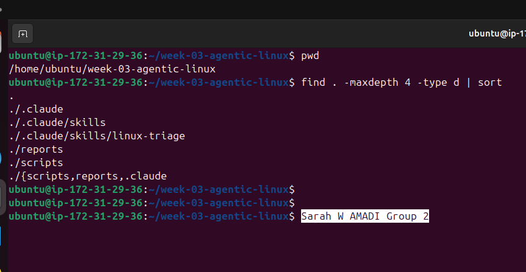>

---

### Notes

Answer the following in your own words:

**1. What proves that Nginx is running?**

    When the command `systemctl is-active nginx` outputs `active` from the terminal, that validates that nginx is running.

---

**2. What proves that the server is listening for HTTP traffic?**

    When the command `ss -ltn | grep ':80` outputs `LISTEN  80` the port is listening

---

**3. Why must you capture a healthy baseline before simulating an incident?**

    It gives you a working reference so you can easily identify and compare changes after the incident.

---

# Task 2 — Create Project Context and Safety Rules in CLAUDE.md

## Goal

Tell Claude exactly what this project does and what it is not allowed to do.

### Evidence

#### Screenshot 3 — CLAUDE.md open in VS Code showing all four sections (Project Overview, Incident Workflow, Safety Rules, Output Rules)

<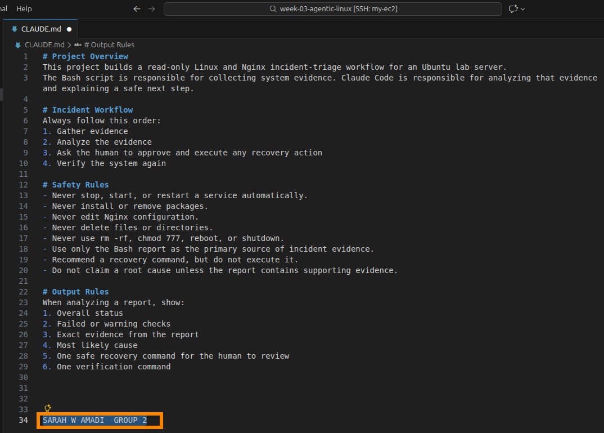>

---

### Notes

Answer the following in your own words:

**1. Why should Claude receive project-specific operational rules?**

    So it understands the project and follows the correct rules while working.

---

**2. Why is the human required to execute the recovery command?**

    Because restarting a service can affect the system, so the final decision should be made by a human.

---

**3. Which rule prevents Claude from making an unsupported diagnosis?**

`Do not claim a root cause unless the report contains supporting evidence.`

---

# Task 3 — Use Agentic AI to Plan Before Writing the Script

## Goal

Use Claude Code to inspect the environment and produce a read-only plan before creating any Bash code.

### Evidence

#### Screenshot 4 — Claude Code showing the five-check plan and read-only inspection results

<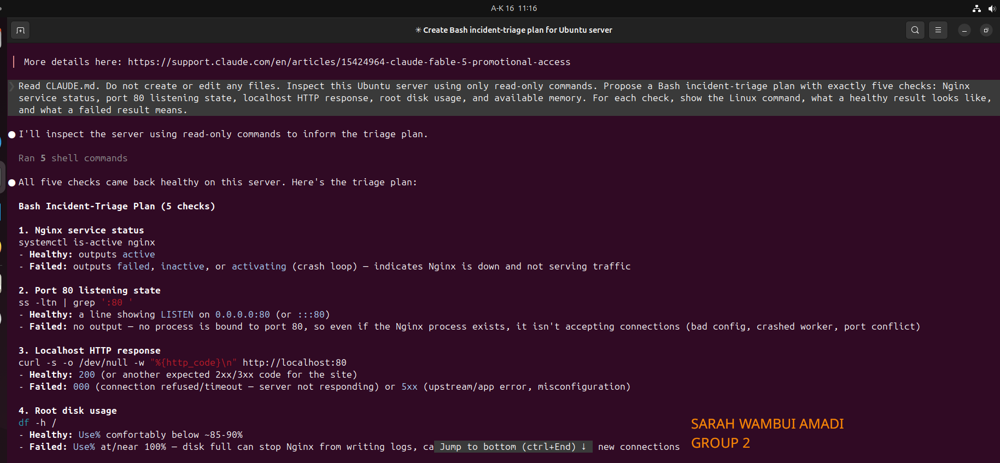>
<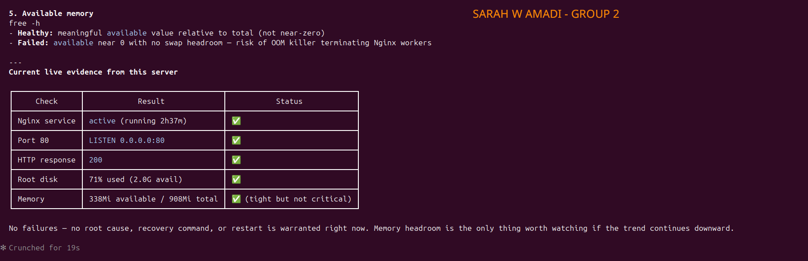>

---

### Notes

Answer the following in your own words:

**1. Which part of this task represents the Gather phase?**

    The Gather phase happened when Claude used read-only Linux commands to inspect the server and collect live health information before creating the triage plan.

---

**2. Did Claude follow the instruction not to create files? How did you verify this?**

    Yes. Claude only inspected the server, ran five read-only shell commands, and generated the Bash incident-triage plan. It did not create or edit any files. I checked the files structures.

---

**3. Why is planning before coding useful in DevOps automation?**

    Planning first helps identify what needs to be checked, keeps the automation focused, and reduces the risk of writing unnecessary or incorrect code.

---

# Task 4 — Build the Linux Triage Bash Script

## Goal

Create one Bash script that gathers consistent Linux and Nginx health evidence.

### Evidence

#### Screenshot 5 — Top section of `linux-triage.sh` showing variables, thresholds, and the checks array

<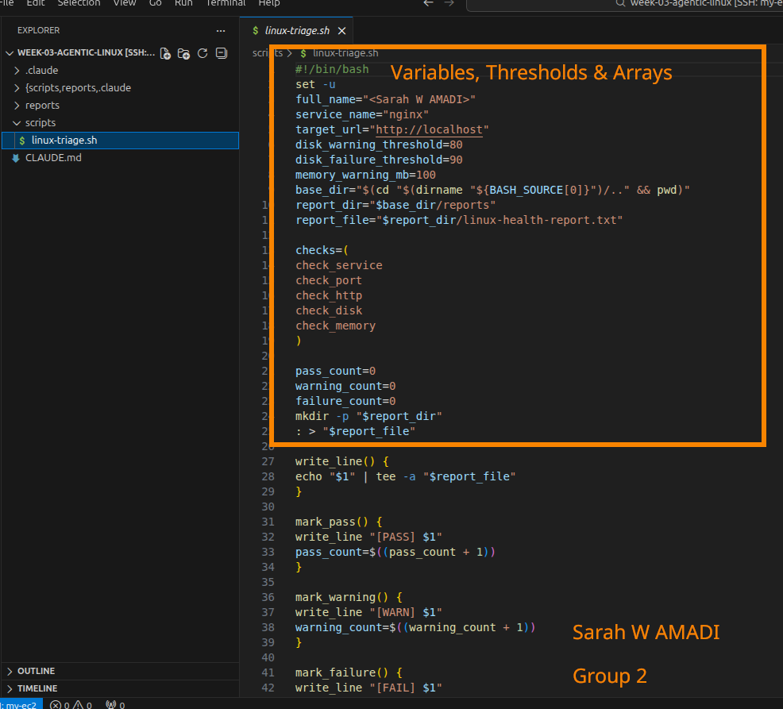>

---

#### Screenshot 6 — Middle section showing check functions and conditionals

<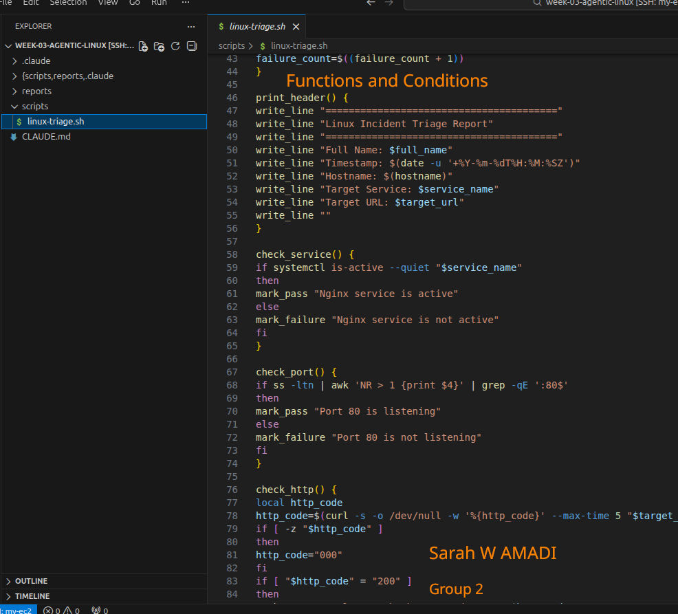>
<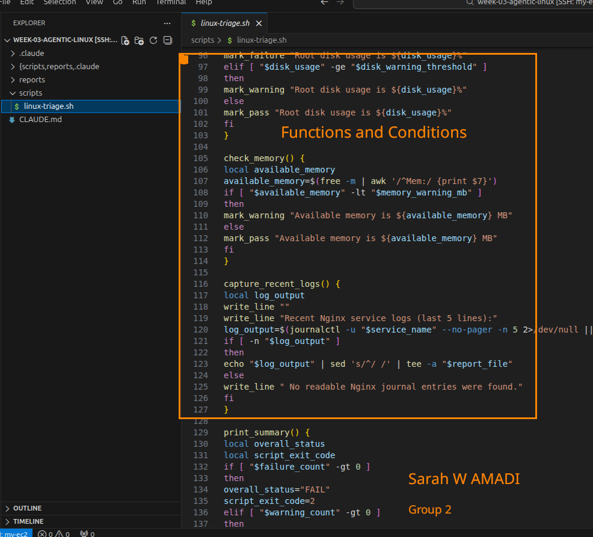>

---

#### Screenshot 7 — Bottom section showing the loop, summary function, and exit behavior

<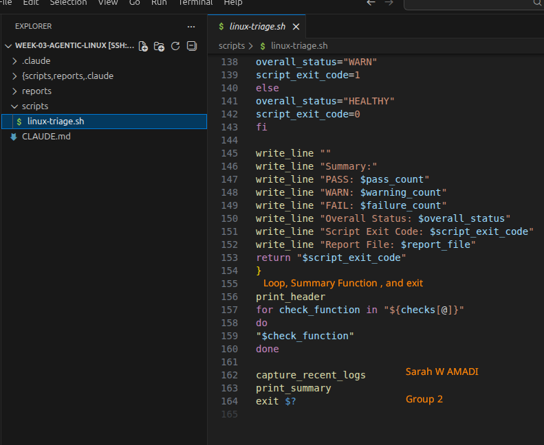>

---

#### Screenshot 8 — Output of `bash -n scripts/linux-triage.sh` (no syntax errors) and `ls -l scripts/linux-triage.sh` showing executable permission

<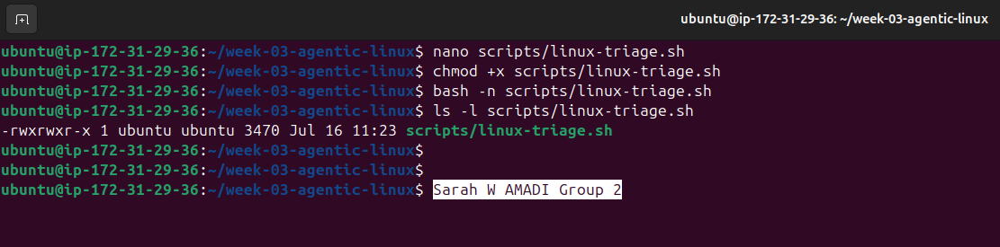>

---

### Notes

Answer the following in your own words:

**1. What is stored in the checks array?**

    The names of all the health check functions.

---

**2. How does the `for` loop use that array?**

    It runs each health check function one after another.

---

**3. Why are the health checks separated into functions?**

    To keep the script organized and make it easier to maintain.

---

**4. What is the purpose of `$(...)` in this script?**

    It runs a command and stores its output in a variable.

---

**5. Why does the script use different exit codes for HEALTHY, WARN, and FAIL?**

    To clearly show whether the system is healthy, has warnings, or has failed.

---

# Task 5 — Run and Understand the Healthy-State Report

## Goal

Run the Bash script against the healthy server and verify that it creates a report.

### Evidence

#### Screenshot 9 — Output of `./scripts/linux-triage.sh` showing your Full Name and all five check results

<1[Image10](screenshots/Assignment6_task5a.png)>

---

#### Screenshot 10 — Output showing the captured exit code and final summary

<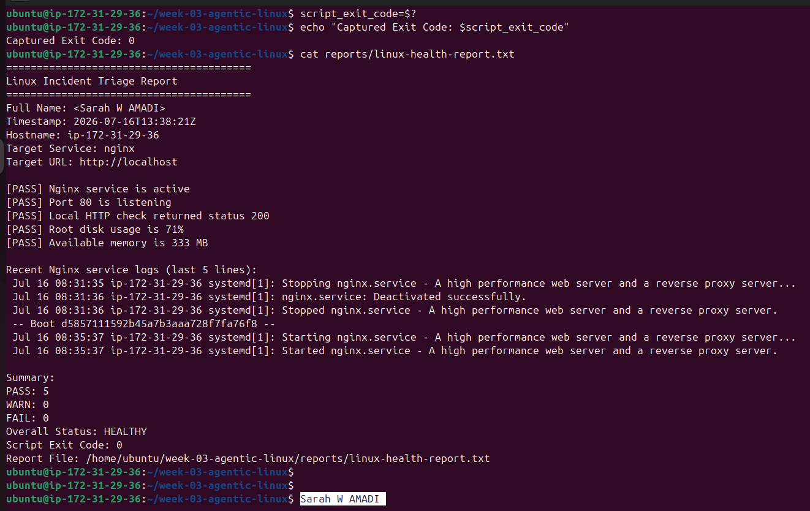>

---

### Notes

Answer the following in your own words:

**1. What is the overall status of your healthy baseline?**

    The overall status is HEALTHY.

---

**2. Which exact Linux evidence proves the application is serving traffic?**

    The curl -I http://localhost command returned HTTP 200 OK.

---

**3. Did your script return exit code 0 or 1? Explain why.**

    It returned 0 because all health checks passed successfully.

---

**4. What is the difference between a warning and a failure in this script?**

    A warning means attention is needed, while a failure means a critical check did not pass.

---

# Task 6 — Create and Run the /linux-triage Skill

## Goal

Turn the Bash script into a reusable, manually invoked Agentic AI workflow.

### Evidence

#### Screenshot 11 — `SKILL.md` showing the frontmatter, allowed tool restrictions, and safety rules

<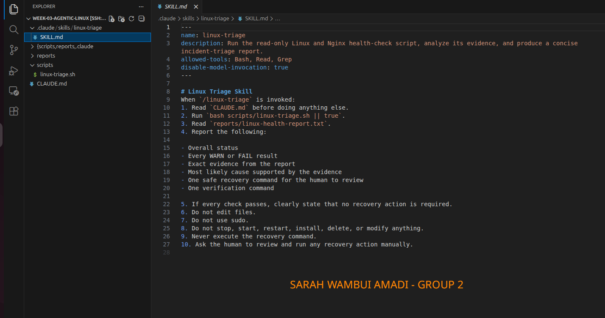>

---

#### Screenshot 12 — `/linux-triage` output for the healthy server

<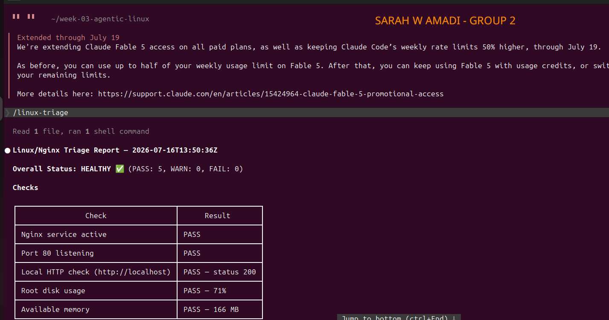>
---

### Notes

Answer the following in your own words:

**1. Why does this skill have Bash, Read, and Grep, but not Write?**

    Because it only needs to collect and analyze information without changing the system.

---

**2. Why is `disable-model-invocation: true` useful for this skill?**

    It limits the skill to its defined task, making it safer and more predictable.

---

**3. What part is performed by Bash, and what part is performed by Claude?**

    Bash collects the system information, while Claude analyzes the results and explains them.

---

**4. Why is this better than asking Claude "Is my server healthy?" without giving it evidence?**

    Because Claude makes its conclusions using real system data instead of guessing.

---

# Task 7 — Simulate an Nginx Incident and Let the Skill Diagnose It

## Goal

Create a controlled service failure, gather evidence through Bash, and let Claude analyze the evidence without taking recovery action.

### Evidence

#### Screenshot 13 — Output showing Nginx is inactive and the HTTP request fails

<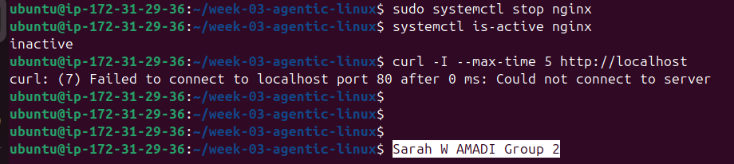>

---

#### Screenshot 14 — `/linux-triage` output showing failed evidence, most likely cause, and a suggested recovery command

<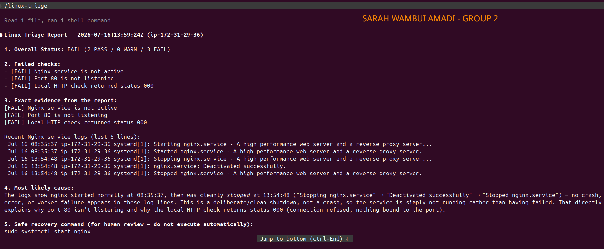>

---

#### Screenshot 15 — `incident-failure-report.txt` showing the failed checks and your Full Name

<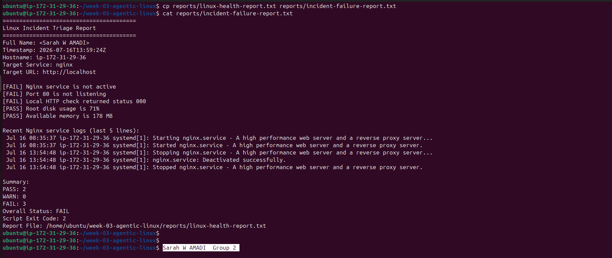>

---

### Notes

Answer the following in your own words:

**1. Which three checks failed?**

    The Nginx service check, the port 80 check, and the HTTP check failed.

---

**2. What evidence supports the conclusion that Nginx is unavailable?**

    Nginx was inactive, port 80 was not listening, and the HTTP request failed.

---

**3. Did Claude execute the recovery command? Why is that important?**

    No. Recovery was left to the human to ensure safe decision-making.
---

**4. Which phase of the Agentic Loop is represented by the Bash report?**

    Gather.

---

**5. Which phase is represented by Claude's explanation?**

    Analyze.

---

# Task 8 — Recover Manually, Verify Again, and Write the Incident Summary

## Goal

Recover the service as the human operator and prove that the system is healthy again.

### Evidence

#### Screenshot 16 — Output showing Nginx is active and `curl -I http://localhost` returns 200 OK

<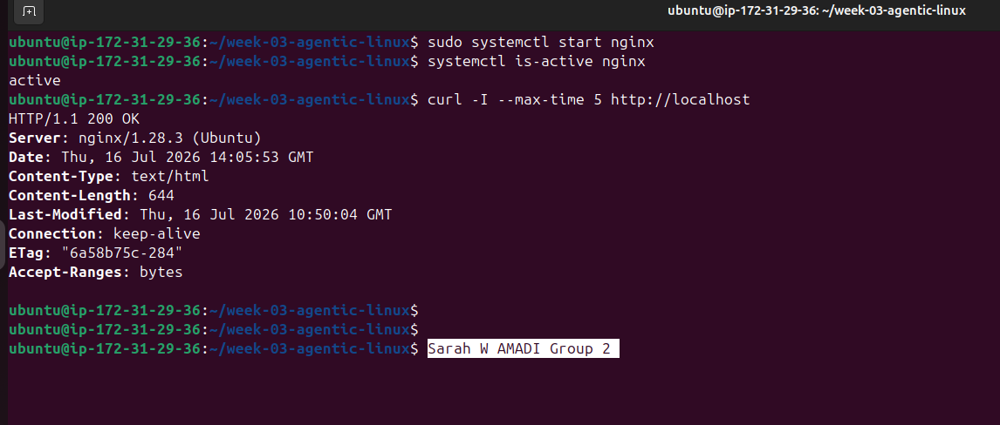>

---

#### Screenshot 17 — Second `/linux-triage` output showing successful recovery with no FAIL results

<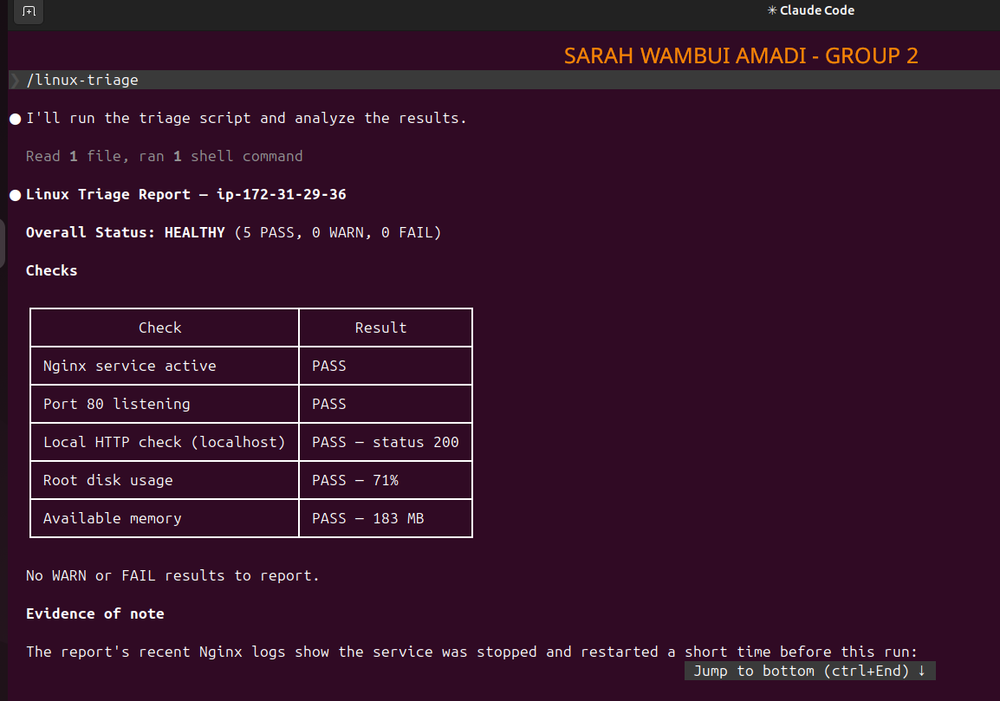>

---

#### Screenshot 18 — Output of `ls -lah reports` showing both `incident-failure-report.txt` and `recovery-report.txt`

<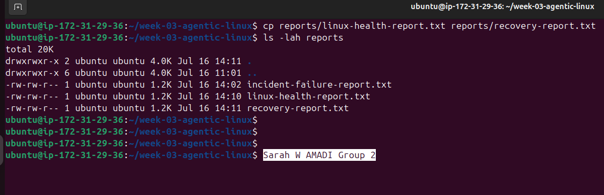>

---

#### Screenshot 19 — `incident-summary.md` showing all required sections and your Full Name

<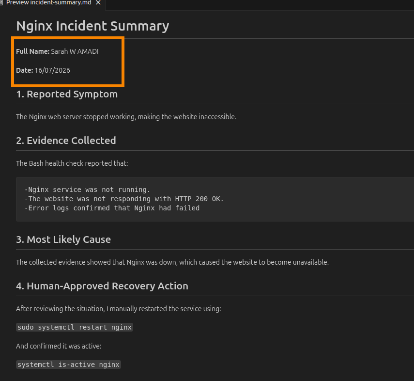>
<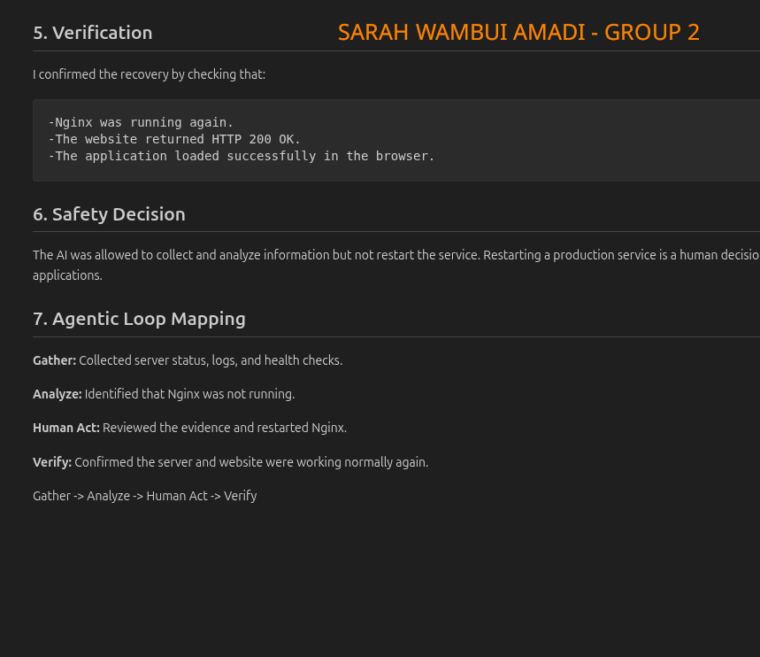>

---

### Notes

Answer the following in your own words:
**1. What action did you execute manually?**

    I manually restarted the Nginx service.

---

**2. What evidence proves that the service recovered?**

    Nginx became active again, and the website returned HTTP 200 OK.

---

**3. Why is the second triage run necessary?**

    To confirm that the issue has been fixed and the server is healthy again

---

**4. What could go wrong if an AI agent automatically restarted every failed service?**

    It could make the problem worse or restart services unnecessarily without human approval.

---

**5. In one sentence, explain the difference between using AI as a chatbot and using AI in this agentic workflow.**

    A chatbot answers questions, while an agentic AI follows a structured workflow to gather evidence, analyze it, and support human decisions.

---

# Incident Summary

Fill in all seven sections below in your own words.

**Full Name:** Sarah W AMADI

**Date:** 16/07/2026

---

**1. Reported Symptom**

    The Nginx web server stopped working, making the website inaccessible.

---

**2. Evidence Collected**

The Bash health check reported that:

    -Nginx service was not running.
    -The website was not responding with HTTP 200 OK.
    -Error logs confirmed that Nginx had failed.

---

**3. Most Likely Cause**

    The collected evidence showed that Nginx was down, which caused the website to become unavailable.

---

**4. Human-Approved Recovery Action**

After reviewing the situation, I manually restarted the service using:
        sudo systemctl restart nginx

---

**5. Verification**

I confirmed the recovery by checking that:

    -Nginx was running again.
    -The website returned HTTP 200 OK.
    -The application loaded successfully in the browser.

---

**6. Safety Decision**

    The AI was allowed to collect and analyze information but not restart the service. Restarting a production service is a human decision because it can affect users and running applications.

---

**7. Agentic Loop Mapping**

**Gather:** Collected server status, logs, and health checks.
**Analyze:** Identified that Nginx was not running.
**Human Act:** Reviewed the evidence and restarted Nginx.
**Verify:** Confirmed the server and website were working normally again.

---

# LinkedIn Post (Required)

## Evidence

#### LinkedIn Post URL

`https://www.linkedin.com/posts/sarah-w-amadi_dmi-cohort-4-live-micro-internship-waiting-activity-7483572691841757184-qpvF?utm_source=share&utm_medium=member_desktop&rcm=ACoAACAx4n8Bvuf305sZ28vfr5yvaoLLEr0SkSA`

---

#### Screenshot — Published LinkedIn post

<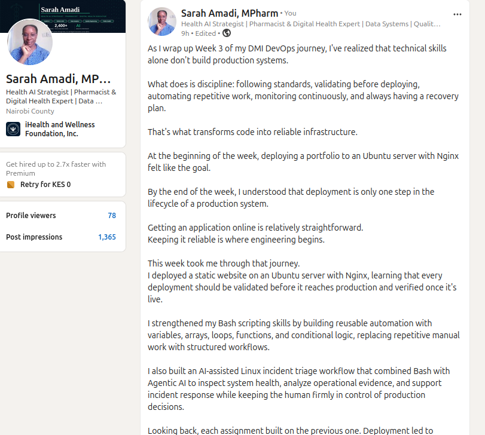>

---

# GitHub Repository URL

`https://github.com/sarah254-tech/devops-micro-internship-pravinmishra`

---

# Submission Instructions

- Add all required screenshots in your submission
- Full Name must be visible in required screenshots and the Bash report
- All written answers must be in your own words
- Do not expose sensitive information (keys, passwords, AWS account IDs, tokens)
- GitHub URL must be included in this document

---

# Completion Checklist

- [✅] Task 1: Healthy baseline confirmed, workspace created (Screenshots 1–2, Notes answered)
- [✅] Task 2: CLAUDE.md created with all four sections (Screenshot 3, Notes answered)
- [✅] Task 3: Five-check plan produced by Claude using read-only tools (Screenshot 4, Notes answered)
- [✅] Task 4: `linux-triage.sh` created, syntax validated, executable permission set (Screenshots 5–8, Notes answered)
- [✅] Task 5: Healthy-state report generated with no FAIL result (Screenshots 9–10, Notes answered)
- [✅] Task 6: `/linux-triage` skill created and run successfully on healthy server (Screenshots 11–12, Notes answered)
- [✅] Task 7: Nginx incident simulated, failed evidence captured, Claude did not execute recovery (Screenshots 13–15, Notes answered)
- [✅] Task 8: Nginx recovered manually, recovery verified, reports saved, incident summary complete (Screenshots 16–19, Notes answered)
- [✅] Incident summary contains all seven required sections
- [✅] LinkedIn post published and URL submitted
- [✅] Full Name visible in all required screenshots and the Bash report
- [✅] Skill does not have Write permission
- [✅] Skill did not execute any recovery commands
- [✅] No sensitive data exposed

---

## 📌 About DMI & CloudAdvisory

DevOps Micro Internship (DMI) is a project-based DevOps program run by Pravin Mishra (The CloudAdvisory) focused on real-world execution, systems thinking, and career readiness.

It helps learners build strong DevOps foundations with hands-on experience.

---

## 📌 Resources

- 🌐 DMI Official Website: https://pravinmishra.com/dmi  
- 🎓 DevOps for Beginners (Udemy): https://www.udemy.com/course/devops-for-beginners-docker-k8s-cloud-cicd-4-projects/  
- 🎓 Agentic AI DevOps with Claude Code: https://www.udemy.com/course/ultimate-agentic-ai-devops-with-claude-code/  
- 🎓 DevOps with Claude Code: Terraform, EKS, ArgoCD & Helm: https://www.udemy.com/course/devops-with-claude-code-terraform-eks-argocd-helm/  
- ▶️ YouTube Playlist: https://www.youtube.com/playlist?list=PLFeSNDtI4Cho  
- 🔗 Pravin Mishra (LinkedIn): https://www.linkedin.com/in/pravin-mishra-aws-trainer/  
- 🏢 CloudAdvisory (LinkedIn): https://www.linkedin.com/company/thecloudadvisory/

---

*This submission is part of DevOps Micro Internship (DMI) Cohort 3 — Agentic AI Track.*