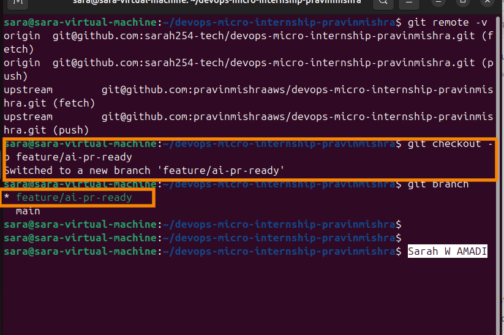
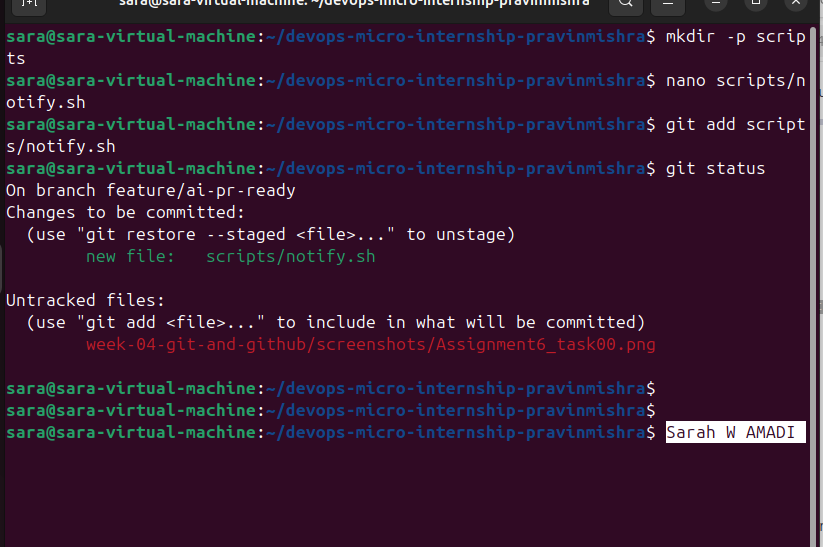
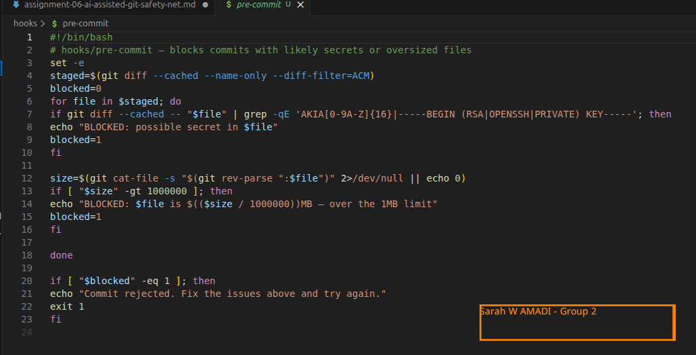
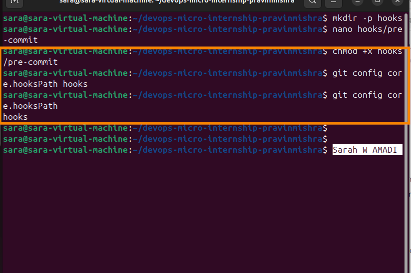
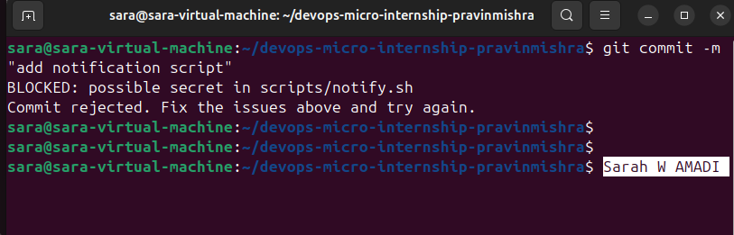
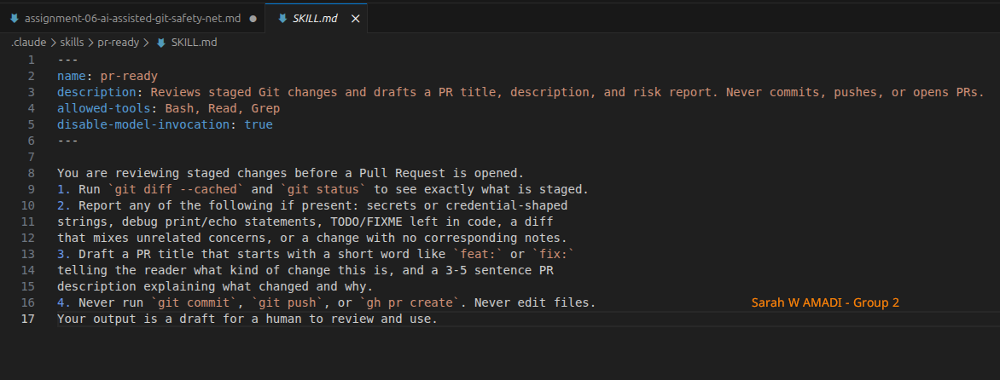
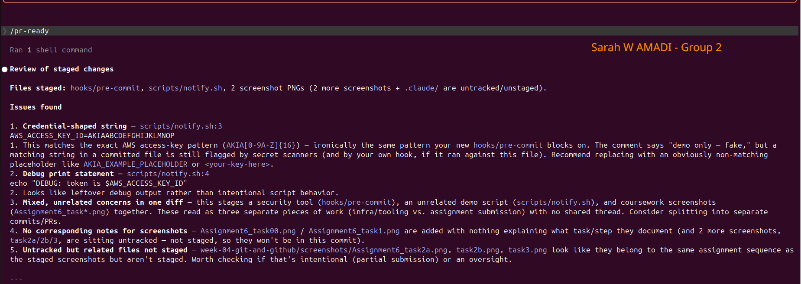
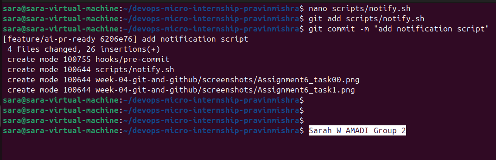
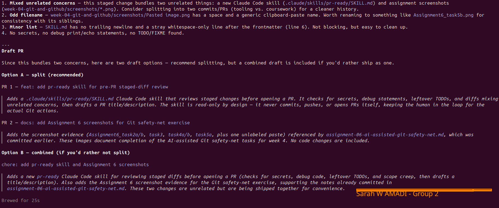
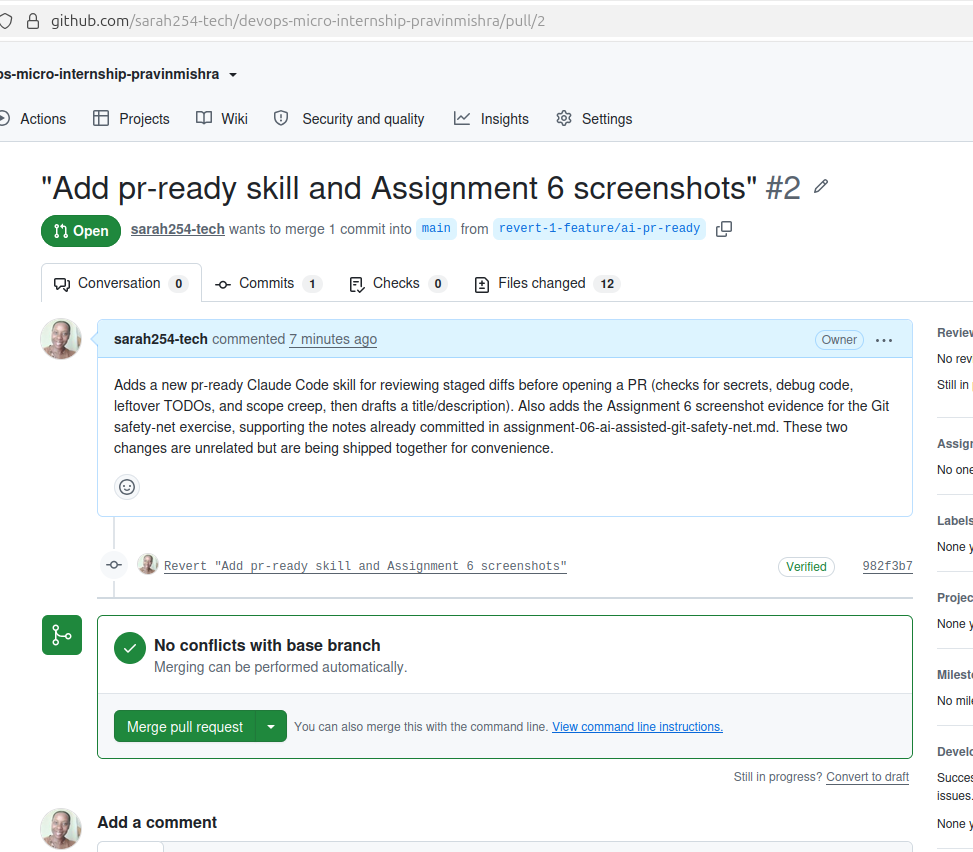

# Assignment 6 — Building an AI-Assisted Git Safety Net (PR Ready Check)

Part of the DevOps Micro Internship (DMI) Cohort 3 with Agentic AI

---

## Purpose

In Week 2 I built Claude Code hooks that block a dangerous action *before* it happens (`PreToolUse`), and a restricted skill that could look but not touch (`allowed-tools` without `Write`). In this assignment I  discovered that Git has the exact same idea, decades older: a **pre-commit hook** that blocks a commit before it's created.

I built both halves of a real "PR Ready" workflow:

1. A **Git hook that follows fixed rules** — scans staged changes for hardcoded secrets and oversized files and refuses the commit. No AI involved, no guessing, just a rule that gives the same answer every time.
2. A **restricted Claude Code skill** (`/pr-ready`) that reads your staged diff and drafts a Pull Request title, description, and a short list of things worth a second look — the kind of judgment a fixed rule can't make (mixed changes, missing context, unclear intent). The skill never commits, pushes, or opens the PR. You do that yourself, using its draft as a starting point.

This mirrors the Agentic Loop from Week 3's Linux triage assignment: **Gather → Analyze → Human Act → Verify**. The hook and the skill both gather and analyze; only you act.

---

# Task 0 — Confirm Your Fork and Create a Feature Branch

## Goal

Confirm you are working in your own fork, then create a dedicated branch for this assignment.

### Evidence

#### Screenshot 1 — Output of `git remote -v` and `git branch` showing the new branch

<>

---

### Notes

**1. Why create a dedicated branch instead of doing this work on main?**

Creating a branch helps keep the main branch clean, the created branch can then be modified and executed to validate the codes health before merging to the main branch.

---

# Task 1 — Stage a Change With Realistic Risk

## Goal

On your own fork of this repository (the one you've been submitting your DMI work in since onboarding), create a new branch and stage a change that a real reviewer should catch: a hardcoded-looking secret and a leftover debug statement.

### Evidence

#### Screenshot 1 — Output of  `git status` showing the staged file on feature/ai-pr-ready

<>

---

### Notes

**1. Why does this assignment use an obviously fake key instead of a real one?**

    AWS keys are secret keys that should not be displayed to the public because your AWS account will be compromised.

---

# Task 2 — Write a Real Git Pre-Commit Hook

## Goal

Create a tracked, shareable pre-commit hook that blocks a commit containing secret-like patterns or files over 1MB.

### Evidence

#### Screenshot 2 — `hooks/pre-commit` open in VS Code showing the full script

<>

---

#### Screenshot 3 — Output of `git config core.hooksPath` confirming it points to `hooks`

<>

---

### Notes

**1. Why is `hooks/pre-commit` tracked in the repo instead of living only in `.git/hooks/`?**

    The hooks/pre-commit file is tracked in the repository so that every team member gets the same pre-commit checks when they clone the project. If the hook only existed in `.git/hooks/`, it would stay on my local machine and would not be shared with anyone else. By tracking it in the repository and configuring Git to use it, the whole team follows the same safety rules and has a consistent workflow.

---

**2. Compare this to `PreToolUse` from Week 2 Assignment 6. What does each one intercept, and what do they have in common?**

    The Git pre-commit hook intercepts a Git commit before it is created. It checks the staged files for problems such as hardcoded secrets or files that are too large, and blocks the commit if it finds an issue.

    The PreToolUse hook intercepts an AI tool request before Claude Code is allowed to execute the tool. It can allow, deny, or ask for approval based on the rules that have been defined.

    What they have in common is that both act as safety gates. They run before an action is completed, automatically check for risks, enforce predefined rules, and stop unsafe actions from happening. Neither replaces human judgment; they simply help prevent mistakes before they cause problems.

---

# Task 3 — Prove the Hook Blocks the Risky Commit

## Goal

Attempt to commit the staged file from Task 1 and show the hook rejecting it.

### Evidence

#### Screenshot 4 — Terminal showing `git commit` rejected with the hook's "BLOCKED" message naming the exact file

<>

---

### Notes

**1. Which line in `hooks/pre-commit` matched your fake key, and why did it match?**

`for file in $staged; do`
`if git diff --cached -- "$file" | grep -qE 'AKIA[0-9A-Z]{16}|-----BEGIN (RSA|OPENSSH|PRIVATE) KEY-----'; then`
`echo "BLOCKED: possible secret in $file"`

    The grep command searched the staged changes for text matching the pattern AKIA[0-9A-Z]{16}. My fake AWS access key started with AKIA and was followed by 16 uppercase letters, so it matched the pattern. As a result, the hook printed "BLOCKED: possible secret in scripts/notify.sh" and prevented the commit.

---

**2. Could this hook have caught a poorly-named variable that stores a secret without the `AKIA` prefix? What does that tell you about the limits of a fixed rule like this?**

    No. This hook would probably not catch a secret if it did not match one of the patterns defined in the grep command. This shows the limitation of fixed-rule checks: they are fast and reliable for known patterns, but they cannot detect every possible secret or understand the context of the code. That is why they are best used together with AI-assisted reviews and human judgment.

---

# Task 4 — Build the `/pr-ready` Skill

## Goal

Create a manually invoked Claude Code skill that reads your staged changes and produces a PR-readiness report and a draft PR description — without writing, committing, or pushing anything itself.

### Evidence

#### Screenshot 5 — `SKILL.md` frontmatter showing `allowed-tools: Bash, Read, Grep` (no `Write`) and `disable-model-invocation: true`

<>

---

#### Screenshot 6 — `/pr-ready` output while the risky file is still staged, showing it flagged the secret and/or debug statement

<>

---

### Notes

**1. Why does `/pr-ready` have `Bash` and `Read` but not `Write`?**

    The /pr-ready skill only needs to inspect my staged changes and generate a draft Pull Request report. It uses Read to view the project files and Bash to run commands like git diff --cached and git status. It does not have Write because it is not supposed to edit files, commit code, push changes, or create Pull Requests. This keeps the AI in an advisory role while I remain responsible for making changes and approving Git actions.

---

**2. The pre-commit hook and `/pr-ready` both looked at the same staged diff. Did they flag the same things? What did one catch that the other didn't?**

    They both flagged the hardcoded AWS access key because it looked like a secret. However, they did not provide the same level of feedback. The pre-commit hook simply detected the secret based on a fixed pattern and blocked the commit immediately. The /pr-ready skill also identified the hardcoded key, but it went further by pointing out the leftover debug statement and explaining why those changes could be risky. It also drafted a Pull Request title and description, something the hook cannot do. This showed me that the hook enforces fixed security rules, while the Agent AI provides broader context and review suggestions

---

# Task 5 — Fix the Issues and Re-Verify

## Goal

Remove the secret and debug statement, then prove both gates now pass clean.

### Evidence

#### Screenshot 7 — `git commit` succeeding after the fix (no BLOCKED message)

<>

---

#### Screenshot 8 — Second `/pr-ready` run showing a clean risk report and a drafted PR title + description

<>

---

### Notes

**1. What exactly did you change to satisfy the pre-commit hook?**

    I removed the hardcoded AWS_KEY_ID, and the echo for the notify.sh from the scripts folder before staging.

---

# Task 6 — Push and Open a Pull Request Using the AI Draft

## Goal

Push your branch and open a real Pull Request, using `/pr-ready`'s drafted title and description as your starting point — read it critically and edit before you use it.

**Important:** Open this Pull Request with base repository set to **your own fork** — not the shared upstream `pravinmishraaws/devops-micro-internship-pravinmishra` repository. This assignment's hook and skill files are your own practice work, not a change meant for the shared class repo.

### Evidence

#### Screenshot 9 — Your Pull Request showing the base repository is your own fork, plus the title and description, with the `/pr-ready` draft visible for comparison (paste it in the PR conversation or your notes below)

<>

---

#### PR Link

https://github.com/sarah254-tech/devops-micro-internship-pravinmishra/pull/2

---

### Notes

**1. What, if anything, did you edit in the AI's drafted PR description before using it? Why?**

    I reviewed the Agent-generated PR description and made a few edits to ensure it accurately reflected the changes I made. I edited the PR by only documenting the folders I had created, and added the use of /pr-ready part on the whole process. I wanted the Pull Request to clearly explain what was changed and why, instead of relying entirely on the AI's draft

---

**2. If you had blindly copy-pasted the AI's draft without reading it, what could go wrong?**

    The Agent could include inaccurate information, leave out important details, or misunderstand the purpose of my changes. This could confuse reviewers or make the Pull Request documentation misleading. Reviewing the draft before using it helps ensure that the information is correct and that I remain accountable for what is submitted.

---

**3. Why does this PR need to target your own fork instead of the shared upstream repository?**

    This assignment is part of my personal learning repository, not a contribution to the original project. Opening the Pull Request against my own fork allows me to practice the complete Git workflow safely without affecting the shared upstream repository or other contributors' work.

---

# Task 7 — Map the Workflow to the Agentic Loop

## Goal

Explain this assignment's workflow using the same Gather → Analyze → Human Act → Verify structure from Week 3.

### Notes

**1. Which step(s) represent Gather?**

    The Gather stage happened when the Git pre-commit hook checked the staged files using git diff --cached, and when the /pr-ready skill ran git status and git diff --cached to collect information about my staged changes.

---

**2. Which step(s) represent Analyze?**

    The Analyze stage was performed by both the pre-commit hook and the /pr-ready skill. The pre-commit hook analyzed the staged files for known secret patterns and oversized files, while the AI skill analyzed the changes for potential risks such as hardcoded secrets, debug statements, mixed changes, and drafted a Pull Request summary.   

---

**3. Which step is Human Act, and why must a human — not Claude — run `git commit`, `git push`, and open the PR?**

    The Human Act stage was when I removed the risky code, staged the updated files, committed the changes, pushed my branch to GitHub, and created the Pull Request. These actions must be performed by a human because they directly modify the repository and affect the shared project. 

---

**4. Which step is Verify?**

    The Verify stage happened after I fixed the issues. I successfully committed the changes without the pre-commit hook blocking the commit, re-ran the /pr-ready skill to confirm there were no remaining risks, and verified that my Pull Request accurately described the final changes before submitting it.

---

**5. In one or two sentences: why do you need *both* the fixed-rule pre-commit hook and the AI skill? Isn't one enough?**

The pre-commit hook is good at enforcing fixed security rules quickly and consistently, but it cannot understand the purpose or context of a change. The Agent skill provides additional review and suggestions, but it cannot guarantee that every risk will be detected. Using both together creates a stronger and more reliable review process while keeping the human responsible for the final decision.

---

# Task 8 — LinkedIn Post

## Goal

Publish a LinkedIn post summarizing what you built and what you learned about combining fixed-rule safety checks with AI-assisted review.

### Evidence

#### LinkedIn Post URL

https://www.linkedin.com/posts/sarah-w-amadi_dmi-devops-micro-internship-with-agentic-share-7485398338666663937-PVuO/?utm_source=share&utm_medium=member_desktop&rcm=ACoAACAx4n8Bvuf305sZ28vfr5yvaoLLEr0SkSA

---

## Key Learnings

-I learned how to build a Git pre-commit hook that automatically blocks commits containing hardcoded secrets or oversized files.
-I learned how to create a Claude Code skill that reviews staged changes and drafts a Pull Request without modifying the repository.
-I learned that fixed-rule automation and AI-assisted reviews complement each other, but neither replaces human judgment.
-I learned why engineers should always review AI-generated content before using it in production workflows.
-I gained a better understanding of how the Agentic Loop (Gather → Analyze → Human Act → Verify) applies to real-world Git and DevOps workflows.

---

# Submission Instructions

- Ensure `hooks/pre-commit` and `.claude/skills/pr-ready/SKILL.md` are committed to your GitHub repository
- Add all required screenshots to your submission
- All written answers must be in your own words
- Do not use a real secret or credential anywhere in your submission — the fake key in Task 1 is intentional and must stay clearly fake
- Open your Pull Request against your own fork, not the shared upstream repository
- Push your final changes to your forked repository
- Include your PR link and LinkedIn post URL

---

## GitHub Repository URL

https://github.com/sarah254-tech/devops-micro-internship-pravinmishra

---

# Completion Checklist

- [✅] Branch `feature/ai-pr-ready` created with a staged file containing a fake secret and a debug statement
- [✅] `hooks/pre-commit` created and tracked in the repo (not only in `.git/hooks/`)
- [✅] `core.hooksPath` configured to point at `hooks/`
- [✅] Pre-commit hook shown blocking the risky commit
- [✅] `.claude/skills/pr-ready/SKILL.md` created with correct `allowed-tools` (no `Write`) and `disable-model-invocation: true`
- [✅] `/pr-ready` run against the risky diff and shown flagging issues
- [✅] Risky file fixed; `git commit` succeeds cleanly
- [✅] `/pr-ready` re-run showing a clean report and drafted PR title/description
- [✅] Pull Request opened using the AI draft as a starting point, with your own fork as the base repository (not upstream), PR link included
- [✅] Agentic Loop mapping (Task 7) completed in your own words
- [✅] LinkedIn post published and URL submitted
- [✅] All required screenshots added
- [✅] GitHub repository URL provided

---

## 📌 About DMI & CloudAdvisory

DevOps Micro Internship (DMI) is a project-based DevOps program run by Pravin Mishra (The CloudAdvisory) focused on real-world execution, systems thinking, and career readiness.

It helps learners build strong DevOps foundations with hands-on experience.

---

## 📌 Resources

- 🌐 DMI Official Website: https://pravinmishra.com/dmi  
- 🎓 DevOps for Beginners (Udemy): https://www.udemy.com/course/devops-for-beginners-docker-k8s-cloud-cicd-4-projects/  
- 🎓 Agentic AI DevOps with Claude Code: https://www.udemy.com/course/ultimate-agentic-ai-devops-with-claude-code/  
- 🎓 DevOps with Claude Code: Terraform, EKS, ArgoCD & Helm: https://www.udemy.com/course/devops-with-claude-code-terraform-eks-argocd-helm/  
- ▶️ YouTube Playlist: https://www.youtube.com/playlist?list=PLFeSNDtI4Cho  
- 🔗 Pravin Mishra (LinkedIn): https://www.linkedin.com/in/pravin-mishra-aws-trainer/  
- 🏢 CloudAdvisory (LinkedIn): https://www.linkedin.com/company/thecloudadvisory/

---

*This submission is part of DevOps Micro Internship (DMI) Cohort 3 — Agentic AI Track.*
