# Assignment 4 — Gotto Job: Backlog Refinement & Sprint 1 in Jira

Part of the DevOps Micro Internship (DMI) Cohort 3 with Agentic AI

---

## Purpose

In this 90-minute, time-boxed exercise, you will act as a Scrum team — or run in Solo Mode, playing every role yourself — to turn the Gotto Job template into a value-ordered backlog, estimate the work in story points, plan Sprint 1, open the burndown chart, and ship one small UI-only increment (text, color, spacing, a label, or a CTA — no backend changes).

---

# Task 1 — Roles & Mode Setup (Team vs Solo)

## Goal

Choose Team Mode or Solo Mode, and document how each Scrum role (Product Owner, Scrum Master, Dev Lead, DevOps Lead) was handled.

### Evidence

#### Screenshot 1 — Jira "Create project" screen, or the project sidebar after creation

<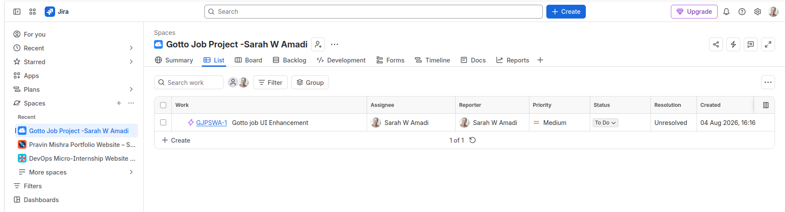>

---

### Notes

- Product Owner: Defined the product vision and Sprint Goal.
- Scrum Master: Facilitated Scrum events, removed blockers, ensured the team followed Agile principles, and tracked Sprint progress using Jira.
- Dev Lead: Owned the user interface improvements.
- DevOps Lead: Owned deployment and release activities.

---

# Task 2 — Create the Jira Project (Team-managed → Scrum)

## Goal

Create a Team-managed Scrum project named `Gotto Job – Team <#>` (Team Mode) or `Gotto Job – <YourName>` (Solo Mode).

### Evidence

#### Screenshot 2 — Project created page showing the project name and key

<>

---

# Task 3 — Create the Epic

## Goal

Create the Epic `Improve Gotto Job UI discoverability & trust` to group the UI improvement initiative.

### Evidence

#### Screenshot 3 — Backlog showing the Epic panel with the Epic visible

<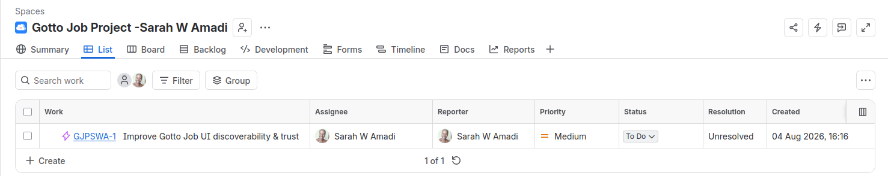>

---

# Task 4 — Seed the Product Backlog (6–8 Stories + Fibonacci Points + Ranking)

## Goal

Create at least six Stories under the Epic, estimate each with 1, 2, or 3 story points, and rank them by value.

### Evidence

#### Screenshot 4 — Backlog showing the Epic and at least six Stories under it

<>

---

#### Screenshot 5 — One Story opened showing its Story Points and acceptance criteria filled in

<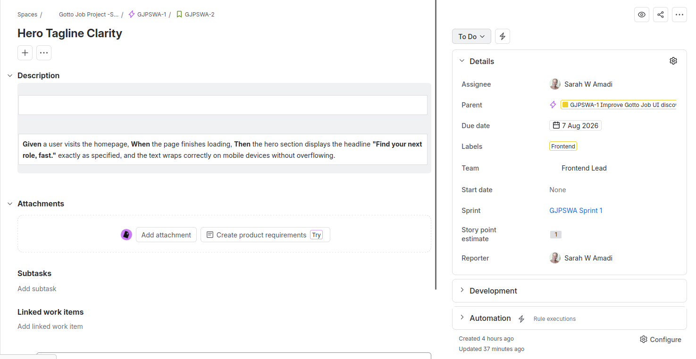>

---

# Task 5 — Planning Poker (Estimate + Debate Notes)

## Goal

Confirm the Story Points (1, 2, or 3) for each Story and record brief reasoning for each estimate.

### Evidence

#### Screenshot 6 — Backlog showing Story Points visible, or two or three Stories opened showing their points

<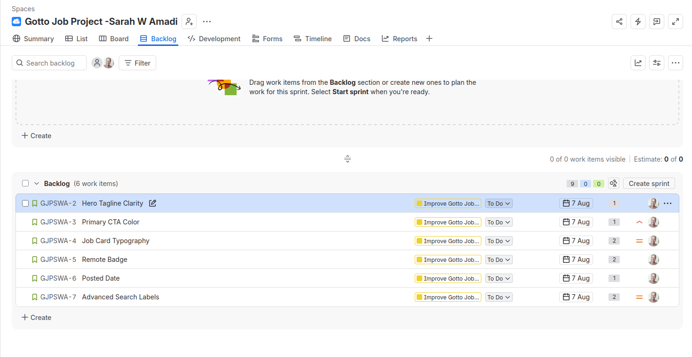>

---

### Notes

| Story                              | Story Points | Acceptance Criteria (Gherkin)                                                                                                                                                                                                         | Why this Story Point?                                                                                                                            |
| ---------------------------------- | :----------: | ------------------------------------------------------------------------------------------------------------------------------------------------------------------------------------------------------------------------------------- | ------------------------------------------------------------------------------------------------------------------------------------------------ |
| **US-01 – Hero Tagline Clarity**   |     **1**    | **Given** a user visits the homepage, **When** the page loads, **Then** the hero section displays the text **"Find your next role, fast."** exactly as specified, and the text wraps correctly on desktop and mobile screens.         | This is a simple text replacement with minimal HTML changes and very little testing required. Low effort and low risk.                           |
| **US-02 – Primary CTA Colour**     |     **1**    | **Given** a user views the homepage, **When** the primary CTA button is displayed, **Then** it uses the colour **#198754**, the text remains readable, and the hover state is visually distinct across supported browsers.            | This involves updating a CSS colour and hover style. It is a straightforward visual change with low complexity.                                  |
| **US-03 – Job Card Typography**    |     **2**    | **Given** a user opens the Job Listing page, **When** job cards are displayed, **Then** job titles are larger, bolder, and visually more prominent than the supporting text on both desktop and mobile layouts.                       | Although it is a CSS change, it affects multiple job cards and requires testing across different screen sizes to ensure consistency.             |
| **US-04 – Remote Badge**           |     **2**    | **Given** a job is marked as **REMOTE**, **When** the job card is displayed, **Then** a badge labelled **"REMOTE"** appears in uppercase, is clearly visible, and does not affect the card layout.                                    | This requires adding a new UI element and styling it consistently across all applicable job cards. Slightly more work than a simple text change. |
| **US-05 – Posted Date**            |     **1**    | **Given** a user views a job card, **When** the card is displayed, **Then** it shows a static human-readable date in the format **"Posted on DD Mon YYYY"** beneath the job information.                                              | Static text is being added without any backend logic. This is a small UI enhancement with very low complexity.                                   |
| **US-06 – Advanced Search Labels** |     **2**    | **Given** a user opens the Advanced Search section, **When** the search form is displayed, **Then** the fields clearly show the labels **Location**, **Type**, and **Salary Range**, with aligned labels and meaningful placeholders. | Several form fields require updates, alignment, and responsive testing. More elements are affected than a simple text change.                    |
| **US-07 – Apply Now CTA**          |     **1**    | **Given** a user opens a Job Detail page, **When** the page loads, **Then** an **"Apply Now"** button is visible above the fold, is keyboard-focusable, and links to the configured destination (`mailto:` or `#`).                   | This is the addition of a single button and link. Minimal HTML and CSS work with straightforward testing.                                        |
| **US-08 – Footer Trust Links**     |     **1**    | **Given** a user scrolls to the footer, **When** the footer is displayed, **Then** the **About** and **Contact** links are visible, keyboard-focusable, and navigate to the correct pages or sections.                                | Adding two footer links is a simple navigation update with minimal implementation and testing effort.                                            |

---

# Task 6 — Sprint Planning: Create Sprint 1 + Sprint Goal + Scope

## Goal

Create Sprint 1, move three or four Stories into it (approximately 3–6 points), set the Sprint Goal, and break each selected Story into Build, Verify, Deploy, and Screenshot Sub-tasks.

### Evidence

#### Screenshot 7 — Sprint 1 with the selected Stories inside it

<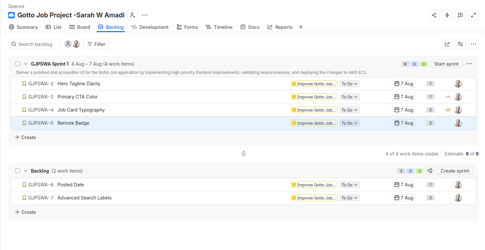>

---

#### Screenshot 8 — One Story showing the Sub-tasks created

<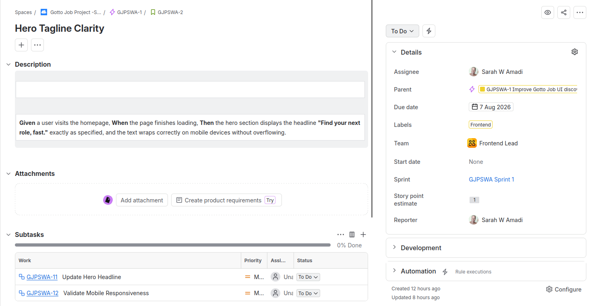>

---

# Task 7 — Reports: Open Burndown Chart

## Goal

Open the Burndown Chart and confirm it exists for Sprint 1. It is acceptable if the chart is not yet populated.

### Evidence

#### Screenshot 9 — Burndown Chart page opened, even if empty

<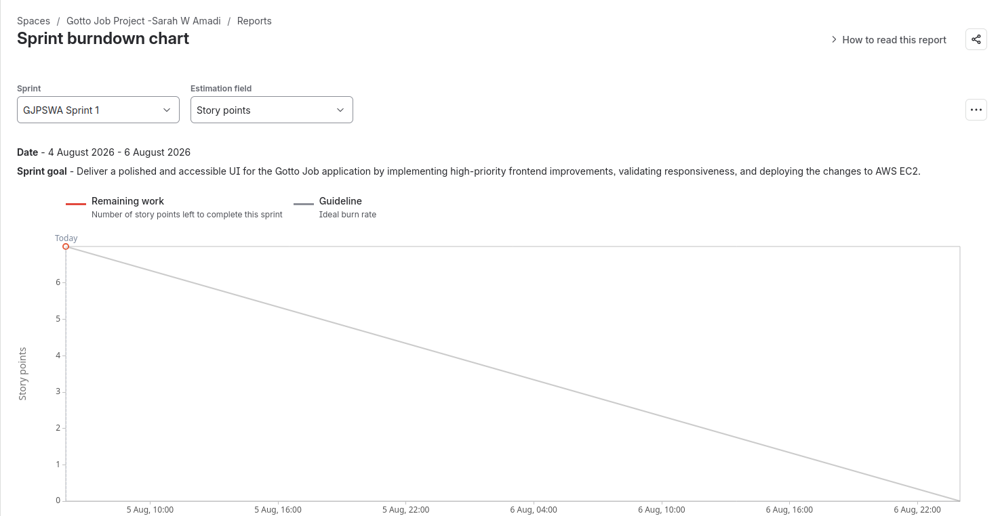>

---

# Task 8 — Ship One Small Increment (Build + Deploy + Proof)

## Goal

Implement one small UI-only Story from Sprint 1, commit it, deploy it live, and move the Story and its Sub-tasks to Done in Jira.

### Evidence

#### Screenshot 10 — Jira board showing the Story moved to Done

<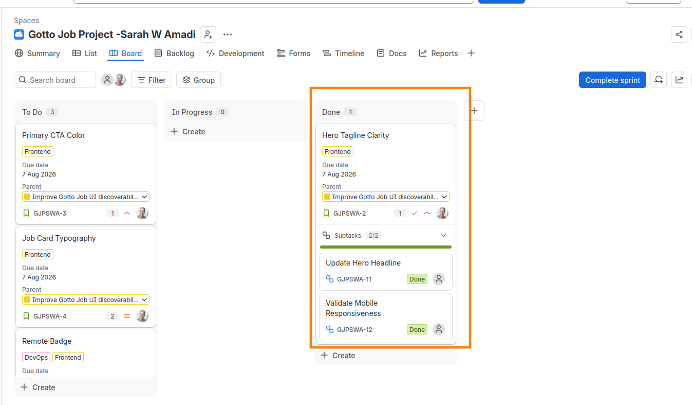>

---

#### Screenshot 11 — Git commit output

<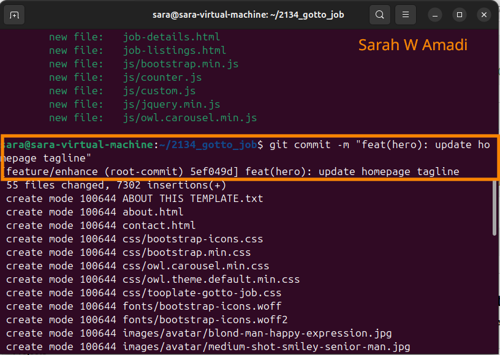>

---

#### Screenshot 12 — Live URL in the browser showing the UI change, with the URL visible

<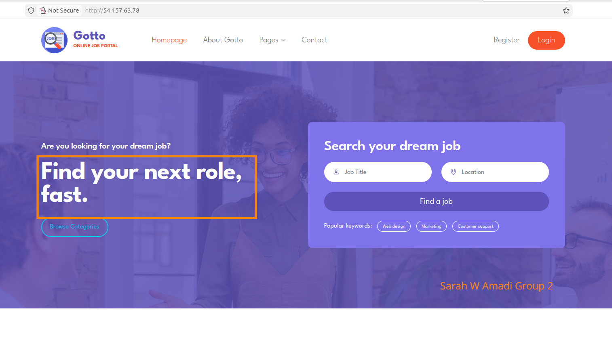>

---

# Task 9 — Retro Notes (Scrum Pillar + Value)

## Goal

Add a retro comment covering what went well, what to improve, one Scrum pillar observed (Transparency, Inspection, or Adaptation), and one Scrum value (Openness, Focus, Commitment, Courage, or Respect).

### Evidence

#### Screenshot 13 — Jira retro comment visible

<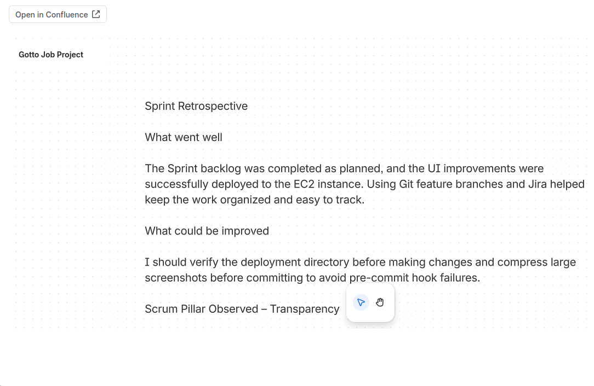>
<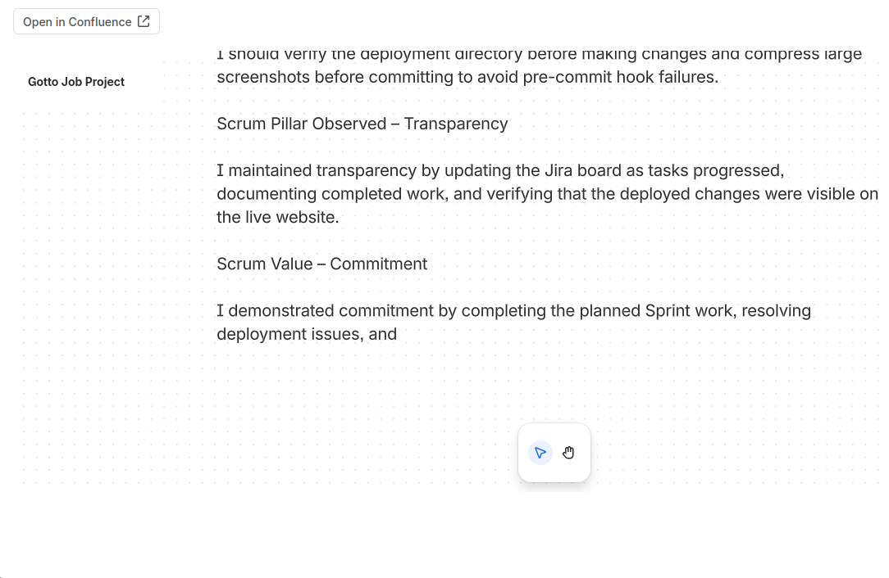>

---

# Task 10 — LinkedIn Post (Mandatory)

## Goal

Publish a LinkedIn post about what you delivered, including your live URL, three to five lines on what you did and learned, and one screenshot (Burndown Chart, Sprint board, or the live UI change).

## Evidence

#### LinkedIn Post URL

https://www.linkedin.com/posts/sarah-w-amadi_dmibypravinmishra-jira-scrum-ugcPost-7490519527231991808-R5Xr/?utm_source=share&utm_medium=member_desktop&rcm=ACoAACAx4n8Bvuf305sZ28vfr5yvaoLLEr0SkSA

---

#### Screenshot 14 — Published LinkedIn post

<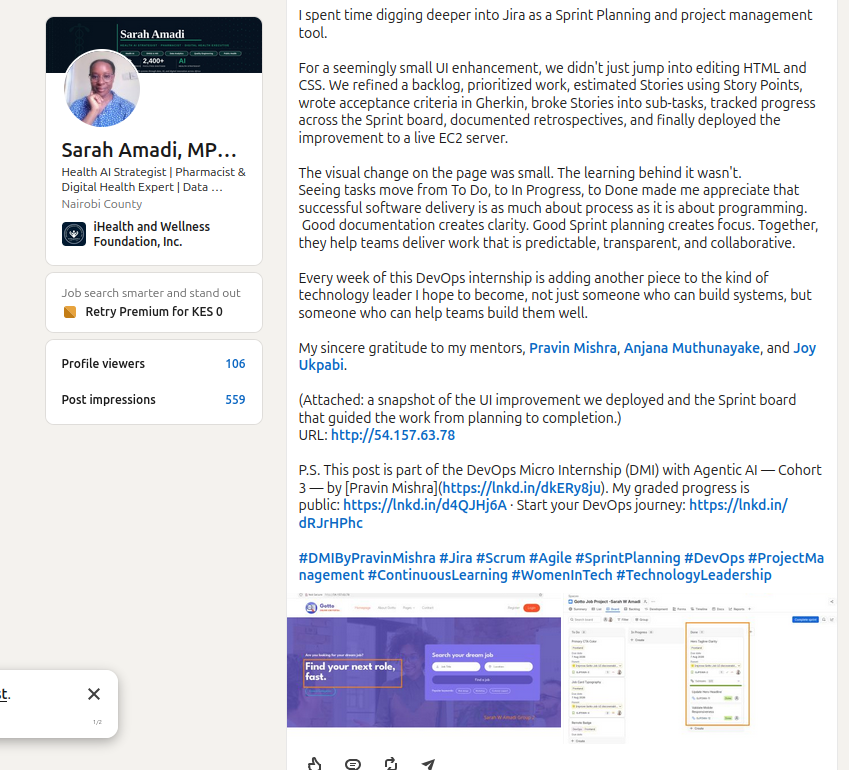>

---

# Submission Instructions

- Add all 14 required screenshots
- Full name must be visible in required screenshots
- Do not expose sensitive information (keys, passwords, account IDs)

---

# Completion Checklist

- [✅] Task 1: Team Mode or Solo Mode selected and all four roles documented (Screenshot 1 & Notes)
- [✅] Task 2: Team-managed Scrum project created with the required name (Screenshot 2)
- [✅] Task 3: UI improvement Epic created (Screenshot 3)
- [✅] Task 4: 6–8 Stories added under the Epic and ranked by value (Screenshots 4 & 5)
- [✅] Task 5: Story Points set (1, 2, or 3) with reasoning recorded (Screenshot 6 & Notes)
- [✅] Task 6: Sprint 1 created with Sprint Goal, 3–4 Stories, and Sub-tasks (Screenshots 7 & 8)
- [✅] Task 7: Burndown Chart opened (Screenshot 9)
- [✅] Task 8: One UI-only increment implemented, committed, deployed, and verified (Screenshots 10–12)
- [✅] Task 9: Retro comment with one Scrum pillar and one Scrum value (Screenshot 13)
- [✅] Task 10: Mandatory LinkedIn post published with the live URL, backlog refinement, Sprint planning, one shipped increment, proof, and Screenshot 14
- [✅] Full Name visible in required screenshots
- [✅] No sensitive data exposed

---

## 📌 About DMI & CloudAdvisory

DevOps Micro Internship (DMI) is a project-based DevOps program run by Pravin Mishra (The CloudAdvisory) focused on real-world execution, systems thinking, and career readiness.

It helps learners build strong DevOps foundations with hands-on experience.

---

## 📌 Resources

- 🌐 DMI Official Website: https://dmi.pravinmishra.com?utm_source=github&utm_medium=readme  
- 🎓 University: https://university.pravinmishra.com?utm_source=github&utm_medium=readme  
- 💬 Discord Community: https://discord.pravinmishra.com?utm_source=github&utm_medium=readme  
- 📝 Blog: https://dmi.pravinmishra.com/blog?utm_source=github&utm_medium=readme  
- ▶️ YouTube Playlist: https://www.youtube.com/playlist?list=PLFeSNDtI4Cho  
- 🔗 Pravin Mishra (LinkedIn): https://www.linkedin.com/in/pravin-mishra-aws-trainer/  
- 🏢 CloudAdvisory (LinkedIn): https://www.linkedin.com/company/thecloudadvisory/

---

*This submission is part of DevOps Micro Internship (DMI) Cohort 3 — Agentic AI Track.*
