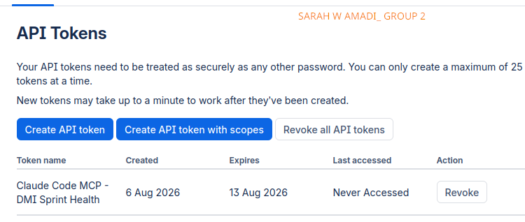
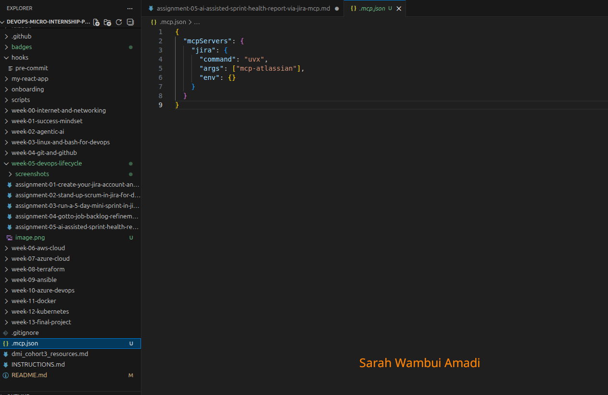
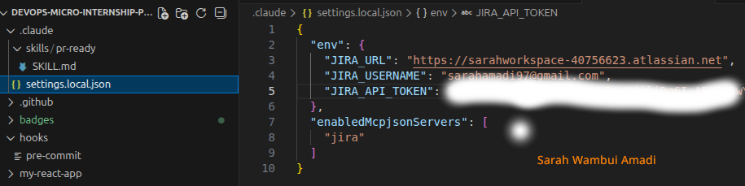
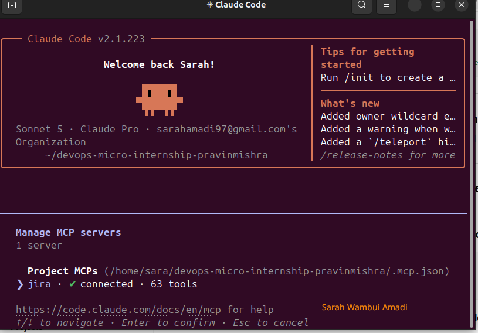
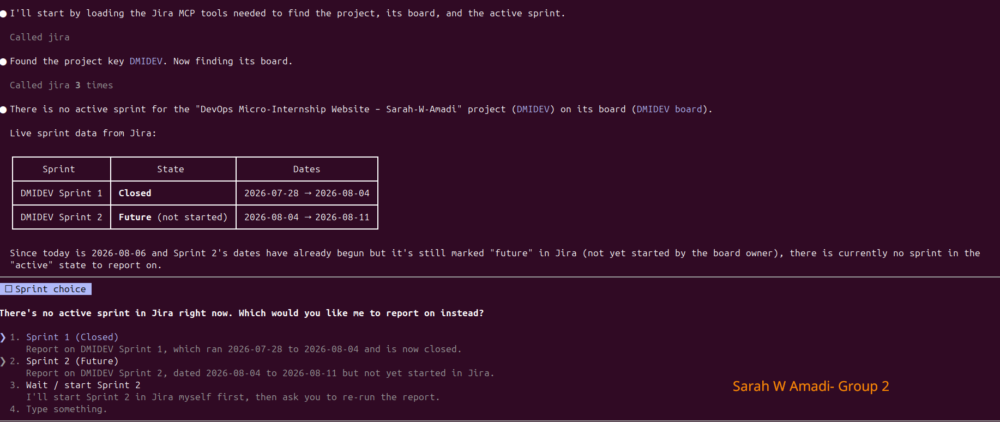
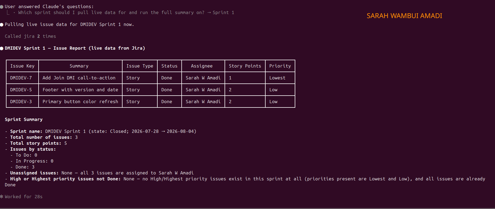
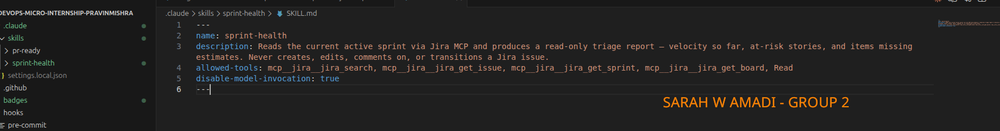
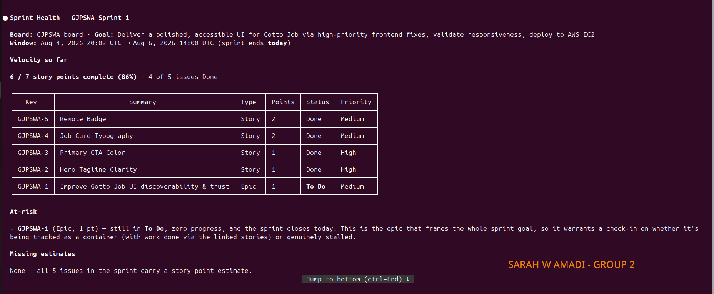
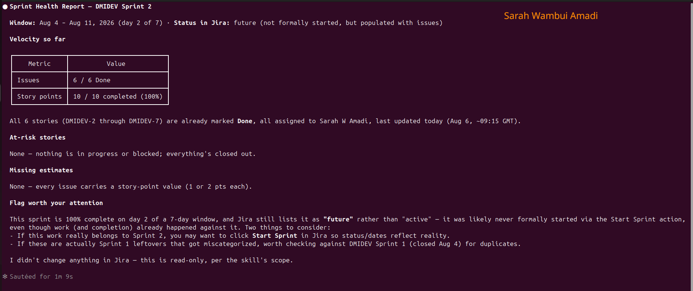

# Assignment 5 — AI-Assisted Sprint Health Report via Jira MCP

Part of the DevOps Micro Internship (DMI) Cohort 3 with Agentic AI

---

## Purpose

In this assignment, I connected Claude Code to my Jira board through an MCP server, the same way I connected it to GitHub in Week 2, and built a read-only `/sprint-health` skill. The skill reads my current sprint through Jira's API and reports sprint velocity, stories at risk of missing the sprint, and items missing an estimate — but it must never create, edit, comment on, or transition a single ticket itself. I proved that boundary holds by making a real change on the board yourself and confirming the skill only ever reports, never acts.

---

# Task 1 — Create a Jira API Token

## Goal

Generate an API token from your Atlassian account that the MCP server will use to authenticate with your Jira site. Do not screenshot the token value itself.

### Evidence

#### Screenshot 1 — Jira API token creation confirmation page showing the token name, with the token value not visible

<>

### Notes You Must Write (Very Important):

Why does the MCP server need your site URL and account email in addition to the token?

    The API token alone does not identify which Jira site or user it belongs to. The Jira site URL tells the MCP server which Jira instance to connect to, while the account email identifies the user associated with the token. Together, the site URL, email, and API token authenticate the connection securely and allow Claude Code to access the correct Jira project.

---

# Task 2 — Create .mcp.json at the Project Root

## Goal

Create or update `.mcp.json` at your project root with a Jira MCP server block, following the same shape as the GitHub MCP server you configured in Week 2.

### Evidence

#### Screenshot 2 — `.mcp.json` open in VS Code showing the Jira server configuration

<>

### Notes You Must Write (Very Important):

Compare this jira block to the github block from Week 2 Assignment 5. The GitHub server ran via npx (a Node.js package); this one runs via uvx (a Python package) — what stays exactly the same shape despite that difference, and why doesn't Claude Code care which language a given MCP server is written in?

    Both configurations use the same MCP structure: a server name, a command to start it, optional arguments, and environment variables. The only difference is the launcher (npx for a Node.js package and uvx for a Python package). Claude Code communicates through the standardized MCP protocol, so it does not depend on whether the server is written in JavaScript, Python, or another language.

---

# Task 3 — Add Your Credentials to settings.local.json

## Goal

Add your Jira site URL, account email, and API token to `.claude/settings.local.json`, and confirm that file is listed in `.gitignore` so it is never committed.

### Evidence

#### Screenshot 3 — `settings.local.json` open in VS Code showing the `env` section, with the actual token value blurred or covered

<>

### Notes You Must Write (Very Important):

Why must JIRA_API_TOKEN live in settings.local.json and never in .mcp.json?

    The API token is a secret used to authenticate access to my Jira account. It must be stored in settings.local.json because that file is intended for local, private configuration and is excluded from version control. The .mcp.json file is part of the project configuration and may be shared or committed to GitHub, so storing secrets there could expose sensitive credentials and create a security risk.

---

# Task 4 — Verify the Connection with /mcp

## Goal

Restart Claude Code and confirm the Jira MCP server shows as connected.

### Evidence

#### Screenshot 4 — `/mcp` output showing `jira: connected`

<>

---

# Task 5 — Run a Live Query to Prove Real Board Data

## Goal

Ask Claude to list the issues in your current active sprint through the Jira MCP connection, and confirm the result matches what you see on your live board in the browser.

**Prompt used:**

`Use the Jira MCP to analyze the current active sprint for the Jira project "DevOps Micro-Internship Website – Sarah-W-Amadi".`

`Retrieve every issue in the active sprint and display:`

- Issue Key
- Summary
- Issue Type
- Status
- Assignee
- Story Points
- Priority

`Then provide a sprint summary that includes:`

- Sprint name
- Total number of issues
- Total story points
- Number of issues in each status (To Do, In Progress, Done)
- Any unassigned issues
- Any High or Highest priority issues that are not Done

`Use only live data returned by the Jira MCP for the "DevOps Micro-Internship Website – Sarah-W-Amadi" project. Do not generate, assume, or fabricate any information.`

### Evidence

#### Screenshot 5 — Claude's response showing the live sprint issue list retrieved via Jira MCP

<>
<>

### Notes You Must Write (Very Important):

How did you confirm this was real board data and not something Claude guessed?

    I compared Claude's report with my live Jira Sprint board in the browser. The issue keys, summaries, statuses, assignees, story points, priorities, and Sprint summary all matched exactly. This confirmed that Claude was retrieving live information through the Jira MCP server rather than generating or guessing the data.

---

# Task 6 — Build the /sprint-health Skill

## Goal

Create a `/sprint-health` skill restricted to read-only Jira tools plus `Read`, with no issue-mutating tools and no `Write`. Run it and confirm it produces a report covering sprint velocity, at-risk stories, and items missing an estimate.

### Evidence

#### Screenshot 6 — `SKILL.md` frontmatter showing `allowed-tools` limited to read-only Jira tools plus `Read`, with `disable-model-invocation: true`

<>

#### Screenshot 7 — `/sprint-health` output showing the full triage report against your real sprint

<>

### Notes You Must Write (Very Important):

1. Which Jira MCP tools does this skill's allowed-tools list include, and which mutating tools (create issue, update issue, transition issue, add comment) does it deliberately exclude?

The skill includes the read-only Jira MCP tools `jira_search`, `jira_get_issue`, `jira_get_sprint`, and `jira_get_board`, together with the local `Read` tool. It deliberately excludes all mutating tools such as `jira_create_issue`, `jira_update_issue`, `jira_transition_issue`, and any tool for adding comments. This ensures the skill can only inspect and report on Sprint data without making changes to the Jira board.

2. Why does a Scrum Master need this restriction more than almost any other role in this course?

    A Scrum Master is responsible for maintaining transparency and facilitating the team's workflow, not making changes on behalf of the team without their knowledge. If the AI could edit or transition Jira issues automatically, it could change the Sprint board without team agreement, reducing transparency and accountability. Keeping the skill read-only ensures that the Scrum Master reviews the information, discusses it with the team, and makes any board updates manually.

---

# Task 7 — Prove the Skill Never Mutates the Board

## Goal

Manually update one ticket on your board in the browser (for example, move a story to "Done" or add a missing estimate), then run `/sprint-health` again and confirm the new report reflects your change — proving the skill only ever reads live state and never wrote to the board itself.

### Evidence

#### Screenshot 8 — Second `/sprint-health` run showing the report now reflects your manual board change

<>

### Notes You Must Write (Very Important):

Map this assignment to Gather → Analyze → Human Act → Verify from Week 3 Assignment 6. Which step did you perform manually in the browser, and why must that step stay human?

    1. Gather

The Verify stage occurred when I reopened the Jira Sprint board and confirmed that the reported information matched the live board and that no issues had been modified automatically. This verified that the skill operated in read-only mode.

    2. Analyze

The Analyze stage occurred when /sprint-health reviewed the retrieved Sprint data and identified missing Story Points, missing Acceptance Criteria, unfinished work, and potential Sprint risks before generating the Sprint Health Report.

    4. Verify

The Verify stage occurred when I reopened the Jira Sprint board and confirmed that the reported information matched the live board and that no issues had been modified automatically. This verified that the skill operated in read-only mode.

**Why?**

    The Jira MCP server provides secure access to live Sprint data, while the /sprint-health skill interprets that data and highlights potential risks. The MCP server retrieves facts, whereas the skill adds analysis. Together they support better decision-making, but neither replaces the Scrum Master's responsibility for updating Jira.
---

# Submission Instructions

Complete all tasks in sequence.

Your submission must include:
- All 8 required screenshots
- All the required notes

---

# Completion Checklist

- [✅] Task 1: Jira API token created, value never screenshotted (Screenshot 1)
- [✅] Task 2: `.mcp.json` has the Jira server block (Screenshot 2)
- [✅] Task 3: Credentials stored in `settings.local.json`, token blurred, file gitignored (Screenshot 3)
- [✅] Task 4: `/mcp` shows the Jira server connected (Screenshot 4)
- [✅] Task 5: Live query returned real sprint data, verified against the browser (Screenshot 5)
- [✅] Task 6: `/sprint-health` skill created with correct read-only `allowed-tools`, and produced a full report (Screenshots 6–7)
- [✅] Task 7: A manual board change was reflected in a second `/sprint-health` run (Screenshot 8)
- [✅] Skill never created, edited, transitioned, or commented on any issue
- [✅] Reflection answered (Notes)
- [✅] No API token value exposed

---

## 📌 About DMI & CloudAdvisory

DevOps Micro Internship (DMI) is a project-based DevOps program run by Pravin Mishra (The CloudAdvisory) focused on real-world execution, systems thinking, and career readiness.

It helps learners build strong DevOps foundations with hands-on experience.

---

## 📌 Resources

- 🌐 DMI Official Website: https://dmi.pravinmishra.com?utm_source=github&utm_medium=readme  
- 🎓 University: https://university.pravinmishra.com?utm_source=github&utm_medium=readme  
- 💬 Discord Community: https://discord.pravinmishra.com?utm_source=github&utm_medium=readme  
- 📝 Blog: https://dmi.pravinmishra.com/blog?utm_source=github&utm_medium=readme  
- ▶️ YouTube Playlist: https://www.youtube.com/playlist?list=PLFeSNDtI4Cho  
- 🔗 Pravin Mishra (LinkedIn): https://www.linkedin.com/in/pravin-mishra-aws-trainer/  
- 🏢 CloudAdvisory (LinkedIn): https://www.linkedin.com/company/thecloudadvisory/

---

*This submission is part of DevOps Micro Internship (DMI) Cohort 3 — Agentic AI Track.*
