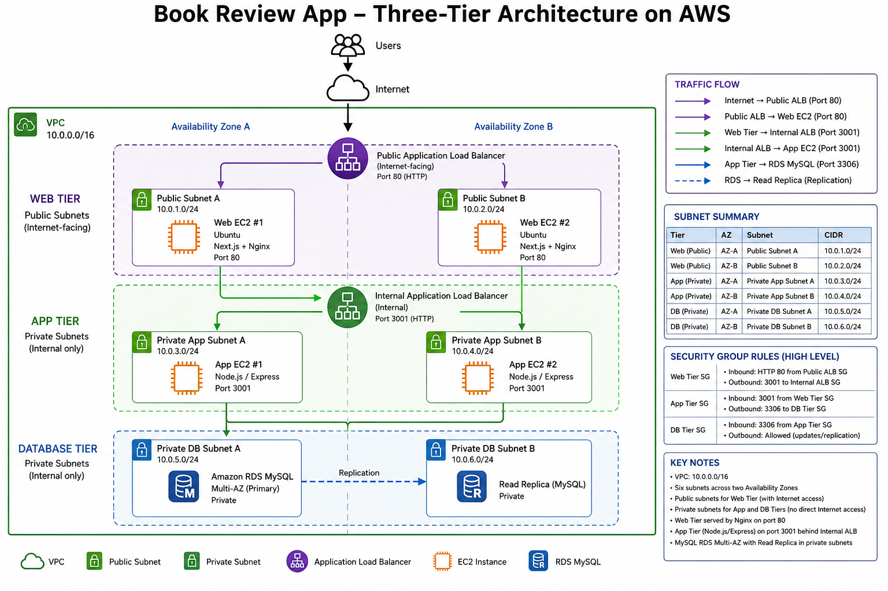
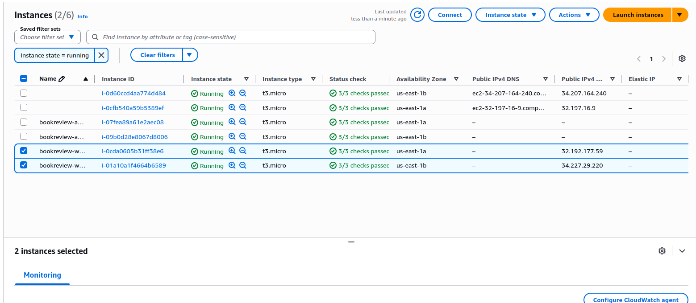
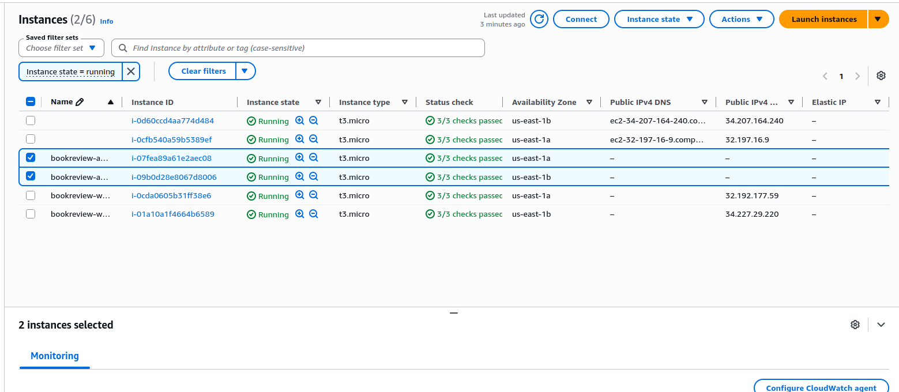
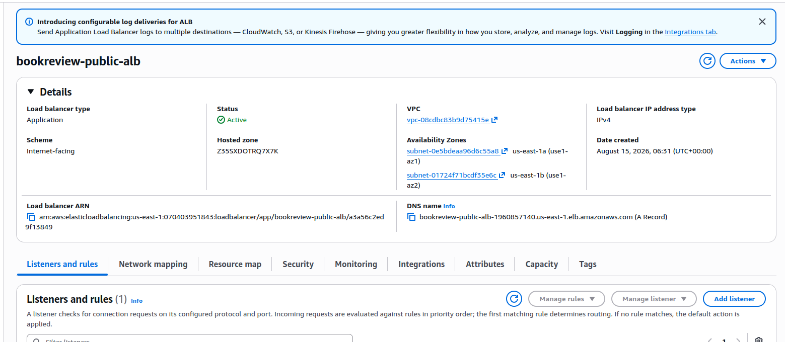
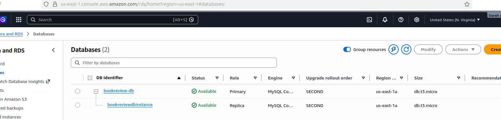
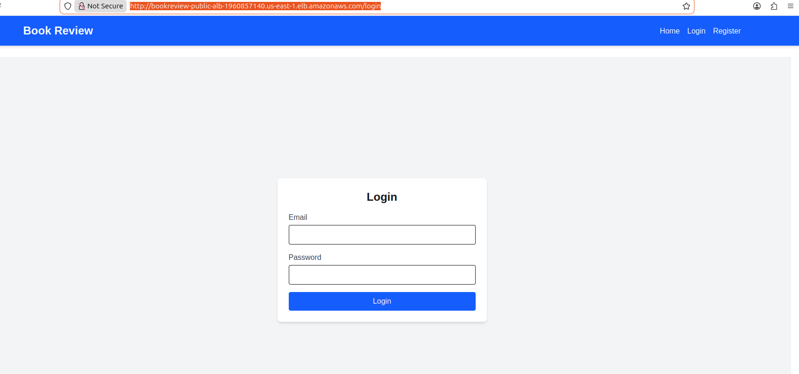
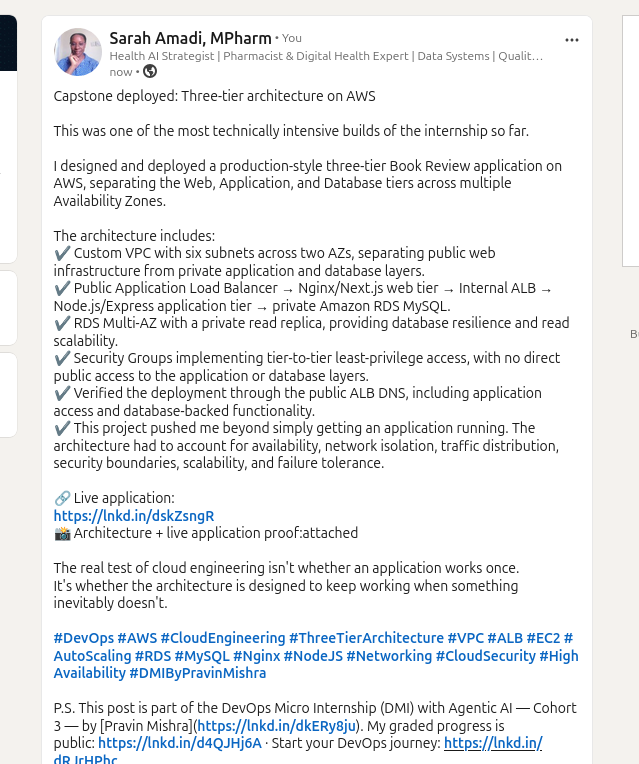

# Assignment 6 — Capstone Assignment — Deploy Book Review App (Three-Tier Architecture) on AWS

Part of the DevOps Micro Internship (DMI) Cohort 3 with Agentic AI

---

## Purpose

This is the most important assignment of the course. I deployed the Book Review App in a fully production-style three-tier architecture on AWS: a Next.js Web Tier behind Nginx and a public ALB, a private Node.js/Express App Tier behind an internal ALB, and a private Multi-AZ MySQL RDS database with a read replica. I designed, deployed, isolated, debugged, and documented the result independently.

---

# Task 1 — Architecture Diagram

## Goal

Create an architecture diagram showing the custom VPC (10.0.0.0/16), the six subnets across two Availability Zones (two public Web Tier, two private App Tier, two private Database Tier), the public ALB, Web Tier EC2/Nginx, internal ALB, private App Tier EC2, private Multi-AZ RDS with its read replica, and the permitted traffic flow.

### Evidence

#### Diagram image or link

<>

---

# Task 2 — AWS Region & Services Used

## Goal

Record the AWS Region used and list every AWS service used across networking, compute, load balancing, security, and the database.

### Notes

**Region:**

    AWS us-east-1

---

**Services:**

    Services used include:

    Amazon VPC
    Subnets
    Internet Gateway
    NAT Gateway
    Route Tables
    Security Groups
    Amazon EC2
    Application Load Balancer
    Target Groups
    AWS Systems Manager Session Manager
    Amazon RDS for MySQL
    RDS Multi-AZ
    RDS Read Replica

---

# Task 3 — Public Entry Point

## Goal

Confirm the Book Review App loads through the public ALB DNS name.

### Evidence

#### Public ALB DNS

Paste your public ALB DNS name here:

http://bookreview-public-alb-1960857140.us-east-1.elb.amazonaws.com

---

# Task 4 — Evidence Screenshots

## Goal

Capture visual proof of every tier and load balancer.

### Evidence

#### Web EC2

<>

---

#### App EC2

<>

---

#### Public ALB

<>

---

#### Internal ALB

<>

---

#### RDS + Replica

Add your screenshot here.

<>

#### App UI proof

<>

---

# Task 5 — Summary

## Goal

Summarize what worked in the final deployment, the issues encountered and how each was fixed, and the tools or sources used to research and debug.

### Notes

**What worked:**

    Successfully deployed the Book Review App using a three-tier AWS architecture consisting of a public Web Tier, private App Tier, and private Database Tier. The deployment uses a public ALB for the Next.js frontend, Nginx on two Web EC2 instances, an internal ALB for the Node.js/Express backend, two private App EC2 instances, and a private Multi-AZ MySQL RDS database with a read replica. The final application was accessible through the Public ALB and the Web and App target groups were successfully configured and health-checked

---

**Issues + fixes:**

- **Route table and private subnet connectivity issues:** Reviewed and corrected subnet associations and routing to ensure traffic could flow between the appropriate tiers.
- **Internal ALB connectivity:** Troubleshot DNS resolution, security groups, NACLs, listeners, target health, and direct instance connectivity. Confirmed the App Tier was responding correctly on port 3001.
- **Web Tier health-check failure:** Web-A initially returned a 505 health-check failure because Nginx/Next.js was not correctly running on the expected ports. Nginx was installed and configured to proxy port 80 to Next.js on port 3000, and the Next.js application was managed with PM2.
- **PM2 EADDRINUSE error:** A manually running Next.js process was already using port 3000. The conflicting process was identified and PM2 was configured to manage the application.
- **Public ALB target health:** After correcting the Web Tier configuration, the Web instances were successfully registered and health-checked by the Public ALB.
- **Backend database connectivity:** Verified Node.js/Sequelize connectivity to the private RDS MySQL database and confirmed the database schema and application tables were available.

---

**Tools/sources used:**

- AWS Management Console
- AWS EC2 and Systems Manager Session Manager
- Amazon VPC, Route Tables, Security Groups and NACLs
- Application Load Balancers and Target Groups
- Amazon RDS for MySQL
- Ubuntu/Linux terminal
- Nginx
- Node.js, Next.js and npm
- PM2
- MySQL
- Git/GitHub
- AWS documentation and application documentation
- Command-line troubleshooting tools including curl, ss, systemctl, pm2, and mysql

---

# LinkedIn Post (Required)

## Goal

Publish a LinkedIn post sharing the capstone deployment, including the public ALB DNS (or a redacted screenshot), three to five lines on what you built and why it is production-style, and one proof screenshot.

## Evidence

#### LinkedIn Post URL

Paste your LinkedIn post URL here:

https://www.linkedin.com/posts/sarah-w-amadi_devops-aws-cloudengineering-share-7494328623253008384-IP-D/?utm_source=share&utm_medium=member_desktop&rcm=ACoAACAx4n8Bvuf305sZ28vfr5yvaoLLEr0SkSA

---

#### Screenshot of LinkedIn post

<>

---

# Submission Instructions

- Add all required screenshots and links in your submission
- Do not expose passwords, RDS credentials, connection strings, private keys, or account IDs

---

# Completion Checklist

- [✅] Task 1: Architecture diagram completed
- [✅] Task 2: AWS Region and services documented
- [✅] Task 3: Public ALB DNS confirmed working
- [✅] Task 4: All six evidence screenshots captured (Web Tier, App Tier, both ALBs, RDS + replica, app UI)
- [✅] Task 5: Deployment summary completed (what worked, issues/fixes, tools/sources)
- [✅] LinkedIn post published and URL submitted
- [✅] App Tier and Database Tier confirmed not publicly accessible
- [✅] No sensitive data exposed

---

## 📌 About DMI & CloudAdvisory

DevOps Micro Internship (DMI) is a project-based DevOps program run by Pravin Mishra (The CloudAdvisory) focused on real-world execution, systems thinking, and career readiness.

It helps learners build strong DevOps foundations with hands-on experience.

---

## 📌 Resources

- 🌐 DMI Official Website: https://dmi.pravinmishra.com?utm_source=github&utm_medium=readme  
- 🎓 University: https://university.pravinmishra.com?utm_source=github&utm_medium=readme  
- 💬 Discord Community: https://discord.pravinmishra.com?utm_source=github&utm_medium=readme  
- 📝 Blog: https://dmi.pravinmishra.com/blog?utm_source=github&utm_medium=readme  
- ▶️ YouTube Playlist: https://www.youtube.com/playlist?list=PLFeSNDtI4Cho  
- 🔗 Pravin Mishra (LinkedIn): https://www.linkedin.com/in/pravin-mishra-aws-trainer/  
- 🏢 CloudAdvisory (LinkedIn): https://www.linkedin.com/company/thecloudadvisory/

---

*This submission is part of DevOps Micro Internship (DMI) Cohort 3 — Agentic AI Track.*