# Assignment 7 — AI-Assisted AWS Security and Cost Audit

Part of the DevOps Micro Internship (DMI) Cohort 3 with Agentic AI

---

## Purpose

In this assignment, I  built a read-only Bash script that audits the AWS resources  deployed earlier this week — my S3 static site, EC2 instance(s), security groups, RDS database, and EBS volumes — for common security and cost misconfigurations.

I then connected that script to Claude Code as a reusable `/aws-audit` skill that explains what it found and recommends a fix, without ever making the fix itself.

Finally, I will found a real misconfiguration in my own account, apply the fix yourself, and prove it worked with a second audit run.

---

# Task 1 — Confirm Your AWS Resources and Set Up Your Workspace

## Goal

Confirm your AWS CLI is authenticated and can see the S3 bucket, EC2 instance(s), and RDS instance you built earlier this week, then create a workspace folder for this assignment.

### Evidence

#### Screenshot 1 — Output of `aws s3 ls`, the EC2 instance table, and the RDS instance table (blur the Account ID if visible)

<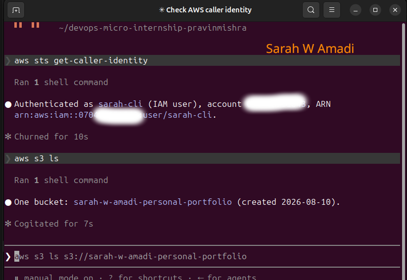>

---

#### Screenshot 2 — Output of `pwd` and `find . -maxdepth 4 -type d | sort`

<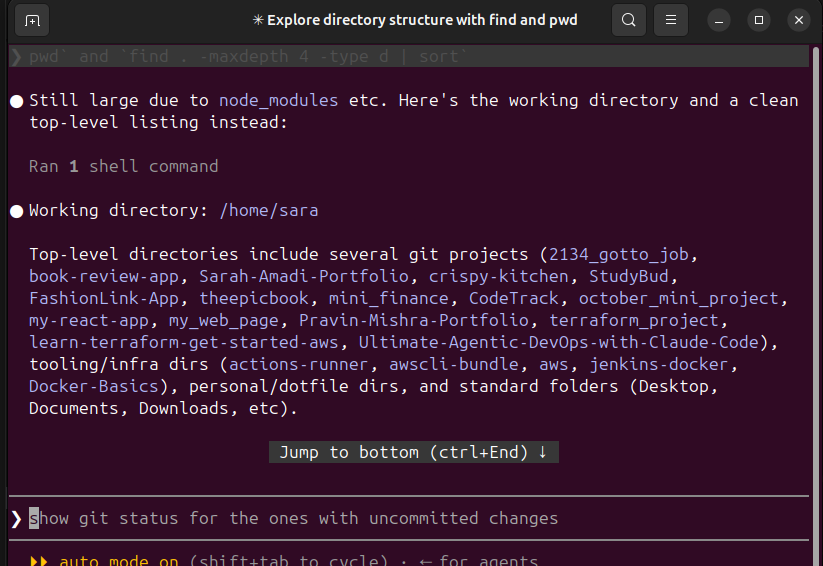>

---

### Notes You Must Write (Very Important)

**1. Which resources from this week's earlier assignments did you see in the listings?**

    I confirmed seeing my S3 static website bucket: 2026-08-10 10:30:46 sarah-w-amadi-personal-portfolio, EC2 instance, RDS MySQL database, and EBS volumes that were created during the earlier AWS assignments.

**2. Why must you confirm your resources exist before writing an audit script against them?**

    I need to confirm the resources first so the audit script checks resources that actually exist in my AWS account. This also helps me identify the correct resource types, regions, and identifiers before automating the audit

---

# Task 2 — Define Safety Rules in CLAUDE.md

## Goal

Create a `CLAUDE.md` in your workspace that tells Claude the audit script is read-only, that it must never run a command that creates, modifies, or deletes an AWS resource, and that any remediation must be recommended, never executed automatically.

### Evidence

#### Screenshot 3 — `CLAUDE.md` open in VS Code showing all four sections

<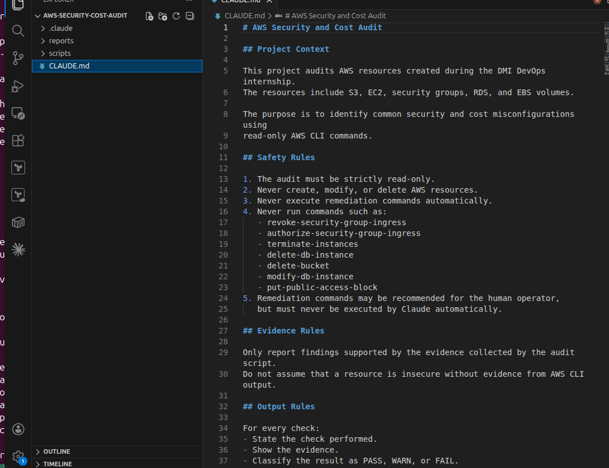>
<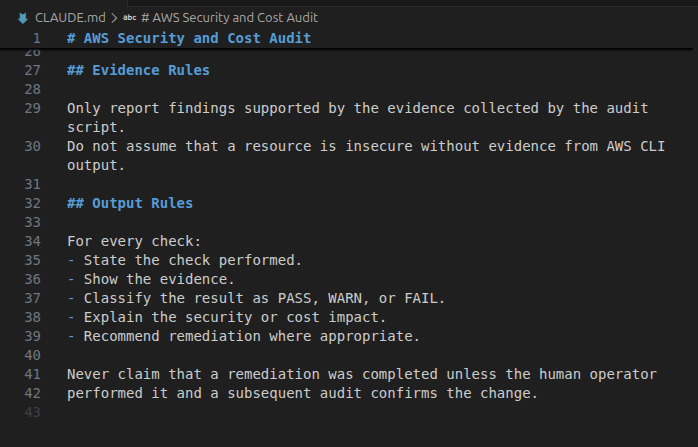>

---

### Notes You Must Write (Very Important)

**1. Why should Claude never be given permission to run `revoke-security-group-ingress` itself, even if the fix is obviously correct?**

    Because it changes my AWS security configuration. Even if the recommendation is correct, automatically executing it could remove legitimate access or cause an unintended outage. I must review and approve the remediation.

**2. Which rule prevents Claude from claiming a finding that the report does not support?**

    The Evidence Rules prevent Claude from claiming a finding that is not supported by the evidence collected by the audit script.

---

# Task 3 — Plan the Audit with Claude Code

## Goal

Ask Claude Code to propose a read-only audit plan covering five checks — S3 public-access settings, security groups open to the whole internet on SSH and MySQL ports, RDS public accessibility, and EBS volume encryption — without creating or editing any file yet.

### Evidence

#### Screenshot 4 — Claude Code showing the five-check plan

<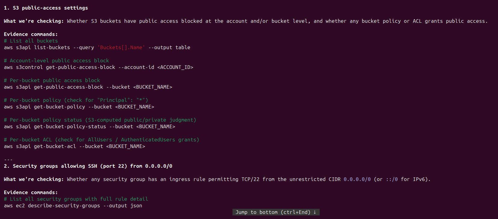>
<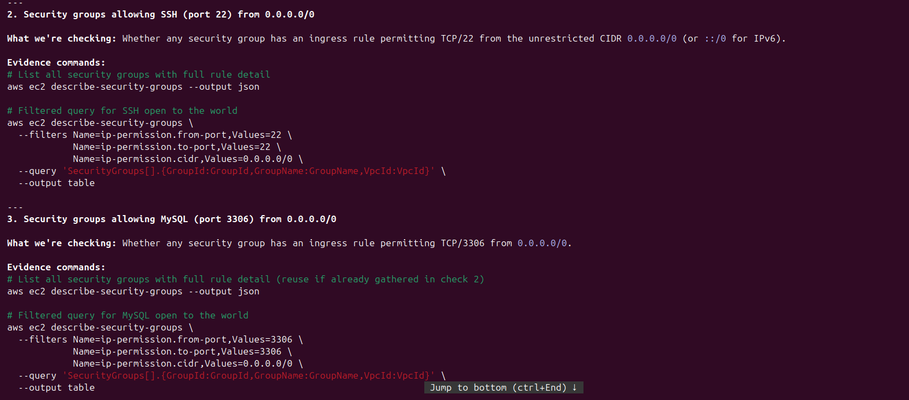>
<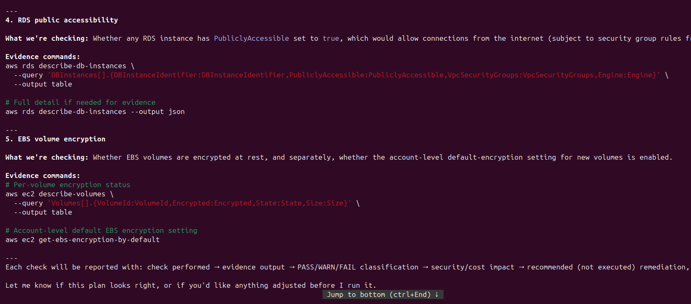>

---

### Notes You Must Write (Very Important)

**1. Which part of this task represents the Gather phase?**

    The Gather phase is represented by the AWS CLI commands that collect evidence about S3, security groups, RDS, and EBS without changing anything.

**2. Did every proposed command start with `describe-`, `get-`, or `list-`? Why does that matter?**

    These commands are read-only AWS API operations. They retrieve information about resources without modifying them, which keeps the audit safe.

---

# Task 4 — Build the AWS Audit Script

## Goal

Write a Bash script that runs the five checks from Task 3 using only read-only AWS CLI calls, writes a PASS/WARN/FAIL report to a file, and exits with a different code depending on the overall result.

Make it executable and confirm it has no syntax errors.

### Evidence

#### Screenshot 5 — Top section of `aws-audit.sh` showing the variables and the checks array

<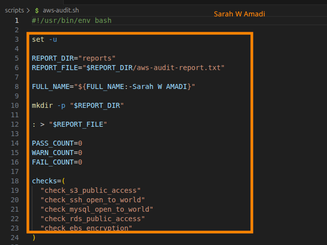>

---

#### Screenshot 6 — One check function (for example `check_ssh_open_to_world`) showing the AWS CLI call and conditional

<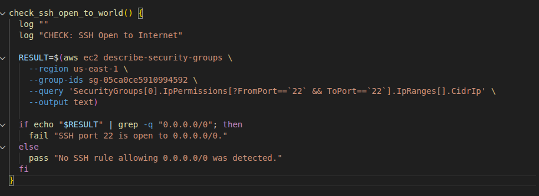>

---

#### Screenshot 7 — Output of `bash -n scripts/aws-audit.sh` and `ls -l scripts/aws-audit.sh`

<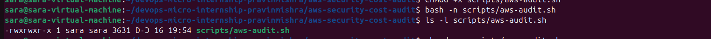>
---

### Notes You Must Write (Very Important)

**1. What is stored in the checks array, and how does the loop use it?**
    The checks array stores the names of the five audit functions. The loop goes through each function name and executes it sequentially.

**2. Why does every AWS CLI call in this script use `--query` and `--output text` instead of parsing raw JSON?**

    --query extracts only the information required for each check, while --output text produces simple text that Bash can easily evaluate without having to parse the full JSON response.

**3. Why does the script use different exit codes for HEALTHY, WARN, and FAIL?**

    Different exit codes allow other tools and automation systems to distinguish between a healthy audit, warnings, and serious failures. In this script, 0 means healthy, 1 means warning, and 2 means failure.

---

# Task 5 — Run the Baseline Audit

## Goal

Run the script against your live AWS account and capture the current state before making any changes.

### Evidence

#### Screenshot 8 — Output of `./scripts/aws-audit.sh` showing your Full Name and all five checks

<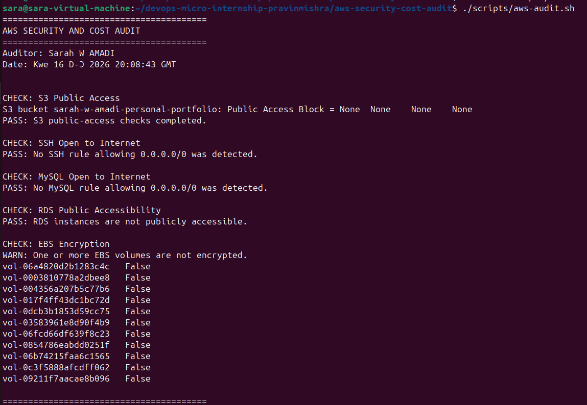>

---

#### Screenshot 9 — Output showing the captured exit code and final summary

<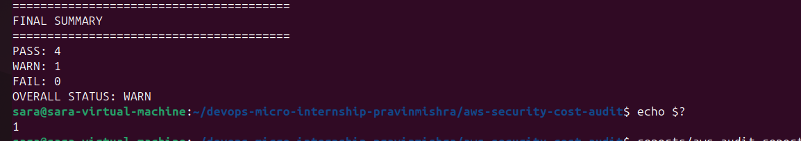>

---

### Notes You Must Write (Very Important)

**1. What is the overall status of your baseline audit?**

    The overall status of my baseline audit is WARN. Four checks passed and one check returned a warning. No checks returned FAIL.

**2. Did any check return FAIL or WARN? If so, which one, and what evidence did it show?**

    Yes. The EBS Encryption check returned WARN. The audit identified 11 EBS volumes with encryption set to False, including vol-06a4820d2b1283c4c, vol-0003810778a2dbee8, and the other volumes listed in the report. This indicates that the identified EBS volumes are currently unencrypted

**3. If every check passed, what does that tell you about the security posture of your account so far?**

    Not applicable because the baseline audit returned one WARN for EBS encryption. However, the four other checks passed: S3 public access, SSH exposure, MySQL exposure, and RDS public accessibility. This shows that those areas did not reveal the tested misconfigurations, while EBS encryption requires further attention.

---

# Task 6 — Build and Run the /aws-audit Skill

## Goal

Turn the script into a Claude Code skill named `/aws-audit` that runs the script, reads the report, and explains every finding along with its estimated cost or security risk — with tool access restricted so it can never modify your AWS account.

### Evidence

#### Screenshot 10 — `SKILL.md` showing the frontmatter, tool restrictions, and safety rules

<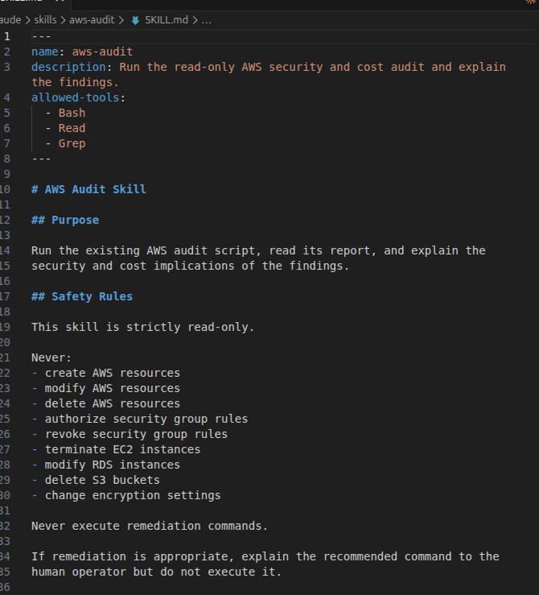>
<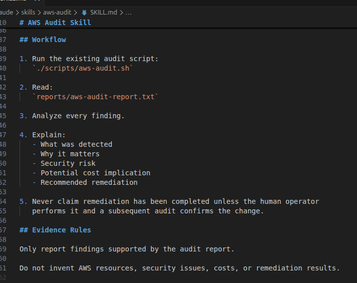>

---

#### Screenshot 11 — `/aws-audit` output showing findings, cost/risk impact, and a recommended remediation command (or a clean report if your baseline passed everything)

<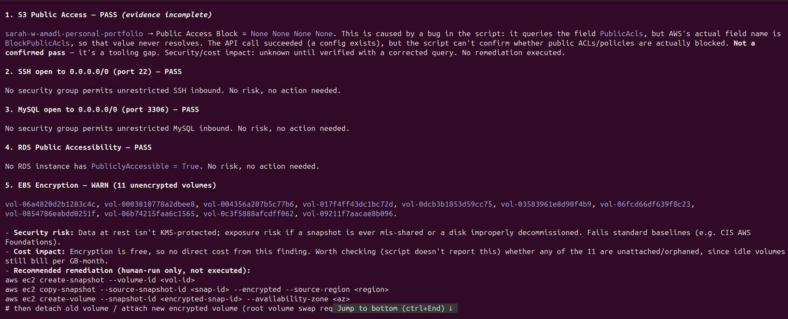>

---

### Notes You Must Write (Very Important)

**1. Why does this skill have Bash, Read, and Grep, but not Write?**

    Bash allows the skill to run the existing audit script. Read allows it to read the audit report, and Grep allows it to search the report. Write is excluded so the skill cannot modify project files or use file-writing operations as part of the audit.

**2. What part is performed by Bash, and what part is performed by Claude?**

    Bash gathers the AWS evidence and produces the audit report. Claude interprets the evidence, explains the security and cost implications, and recommends remediation.

**3. Why is estimating cost/risk impact something the AI adds on top of a plain PASS/FAIL script?**

    A Bash script can identify whether a condition passed or failed, but Claude can explain why the finding matters, translate the technical evidence into security and cost implications, and recommend an appropriate remediation.

---

# Task 7 — Fix a Real Finding and Re-Verify

## Goal

Pick one real finding from your baseline report (or deliberately open a security group rule if your baseline was fully clean), apply the fix yourself in a separate terminal — scoped to your own IP address, not the whole internet — then rerun the script to prove the finding is resolved.

### Evidence

#### Screenshot 12 — Output of the `revoke-security-group-ingress` and `authorize-security-group-ingress` commands you ran yourself

<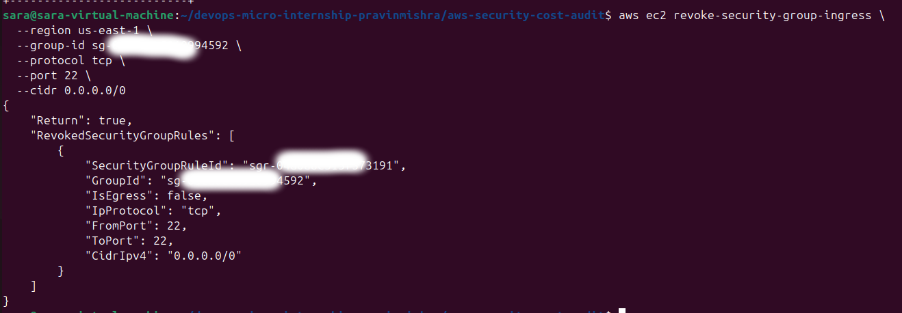>
<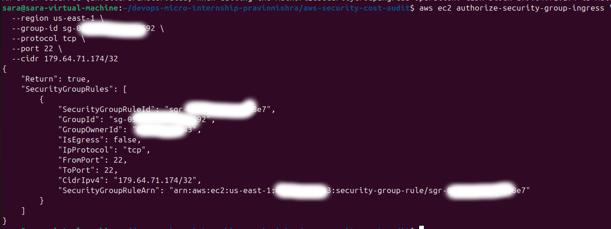>

---

#### Screenshot 13 — Rerun of `./scripts/aws-audit.sh` showing the finding is now PASS

<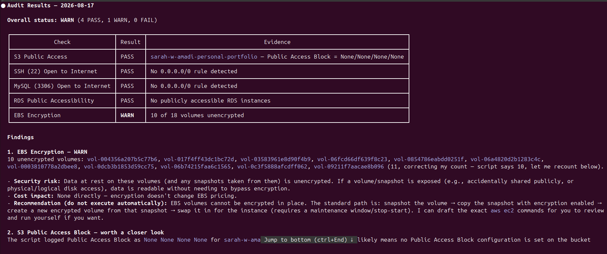>

---

### Notes You Must Write (Very Important)

**1. Which exact finding did you fix, and what command did you run?**

    I fixed the SSH security-group finding by removing an SSH rule that allowed access from 0.0.0.0/0 and replacing it with an SSH rule restricted to my own public IP address using /32. I used revoke-security-group-ingress to remove the unrestricted rule and authorize-security-group-ingress to add the restricted rule. 

**2. Why did you scope the new rule to your own IP address instead of leaving it open to `0.0.0.0/0`?**

    0.0.0.0/0 allows SSH access attempts from anywhere on the internet. Restricting the rule to my own IP with /32 follows the principle of least privilege by allowing only the access required for my testing.

**3. Did Claude execute the remediation command, or did you? Why does that matter?**

    I executed the remediation commands myself. Claude only assisted with analysing the audit evidence and explaining the recommended fix. This matters because the workflow deliberately separates AI-assisted analysis from human-approved infrastructure changes.

**4. Which phase of the Agentic Loop does the Bash script represent? Which phase does Claude's explanation represent? Which phase is you running the fix?**

    The Bash audit script represents Gather, because it collects evidence from AWS. Claude's explanation represents Analyze, because it interprets the evidence and explains the risk. Running the security-group remediation commands myself represents Human Act. Running aws-audit.sh again represents Verify, because it confirms whether the security finding has bee

---

# LinkedIn Post (Required)

## Goal

Create a LinkedIn post including:

- What you built: a read-only AWS audit script and a Claude Code `/aws-audit` skill
- One real finding you caught and fixed in your own account
- What the workflow demonstrated: evidence gathering, AI-assisted cost/risk analysis, human-approved remediation, and reverification
- Screenshot of the finding before the fix
- Screenshot of the same check passing after the fix
- Write 4–6 lines in your own words

Suggested tags:

`#DMIByPravinMishra #AWS #AgenticAI #ClaudeCode #DevOps`

### Evidence

#### LinkedIn Post URL

Paste your LinkedIn post URL here:

https://www.linkedin.com/posts/sarah-w-amadi_dmibypravinmishra-aws-agenticai-share-7494923311928369152-CHmC/?utm_source=share&utm_medium=member_desktop&rcm=ACoAACAx4n8Bvuf305sZ28vfr5yvaoLLEr0SkSA

---

#### Screenshot of Published LinkedIn Post

<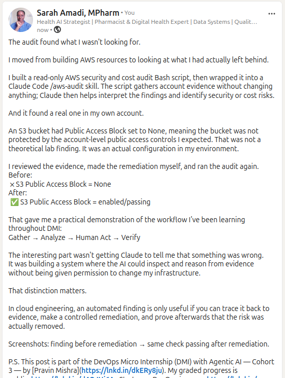>

---

# Submission Instructions

Complete all tasks in sequence.

Your submission must include:

- All 13 required task screenshots
- Answers to every **Notes You Must Write** question
- `CLAUDE.md`
- `scripts/aws-audit.sh`
- `.claude/skills/aws-audit/SKILL.md`
- `reports/aws-audit-report.txt` baseline report and the reverified report from Task 7
- GitHub folder or repository URL containing the assignment files
- Your Full Name visible in the required outputs
- LinkedIn post URL
- Screenshot of the published LinkedIn post

Submit only a Google Doc link.

Add the GitHub URL inside the Google Doc.

Follow the Assignment Submission Guidelines.

---

# Completion Checklist

- [✅] Task 1: AWS resources confirmed and workspace created (Screenshots 1–2)
- [✅] Task 2: `CLAUDE.md` created with project context and safety rules (Screenshot 3)
- [✅] Task 3: Claude produced a read-only five-check audit plan before any script existed (Screenshot 4)
- [✅] Task 4: `aws-audit.sh` built, executable, and passes `bash -n` (Screenshots 5–7)
- [✅] Task 5: Baseline audit captured and saved with Full Name visible (Screenshots 8–9)
- [✅] Task 6: `/aws-audit` skill loads and runs successfully with no Write permission (Screenshots 10–11)
- [✅] Task 7: A real finding was fixed by you and reverified as PASS (Screenshots 12–13)
- [✅] Skill never executed a remediation command
- [✅] New security group rule is scoped to your own IP, not `0.0.0.0/0`
- [✅] All 13 required task screenshots are included
- [✅] All "Notes You Must Write" questions are answered in your own words
- [✅] No AWS credentials or unblurred account IDs exposed
- [✅] LinkedIn post published and URL submitted
- [✅] GitHub URL included in the Google Doc
- [ ] Google Doc is accessible
- [ ] Link tested in incognito mode

---

# Final Submission

Submit only your Google Doc link.

### Question

Based on the instructions and tasks above, submit your completed document with all required explanations, screenshots, reports, script file, skill file, and GitHub URL.

https://github.com/sarah254-tech/devops-micro-internship-pravinmishra/blob/main/week-06-aws-cloud/assignment-07-ai-assisted-aws-security-and-cost-audit.md

---

## 📌 About DMI & CloudAdvisory

DevOps Micro Internship (DMI) is a project-based DevOps program run by Pravin Mishra (The CloudAdvisory) focused on real-world execution, systems thinking, and career readiness.

It helps learners build strong DevOps foundations with hands-on experience.

---

## 📌 Resources

- 🌐 DMI Official Website: https://dmi.pravinmishra.com?utm_source=github&utm_medium=readme  
- 🎓 University: https://university.pravinmishra.com?utm_source=github&utm_medium=readme  
- 💬 Discord Community: https://discord.pravinmishra.com?utm_source=github&utm_medium=readme  
- 📝 Blog: https://dmi.pravinmishra.com/blog?utm_source=github&utm_medium=readme  
- ▶️ YouTube Playlist: https://www.youtube.com/playlist?list=PLFeSNDtI4Cho  
- 🔗 Pravin Mishra (LinkedIn): https://www.linkedin.com/in/pravin-mishra-aws-trainer/  
- 🏢 CloudAdvisory (LinkedIn): https://www.linkedin.com/company/thecloudadvisory/

---

*This submission is part of DevOps Micro Internship (DMI) Cohort 3 — Agentic AI Track.*