# Assignment 6 — Capstone: Deploy Book Review App (Three-Tier Architecture) on Azure

Part of the DevOps Micro Internship (DMI) Cohort 3 with Agentic AI

---

## Purpose

This is the most important assignment of the course. I deployed the Book Review App in a production-ready, best-practice-compliant three-tier architecture on Azure: separated presentation, application, and database tiers, least-privilege network access, a controlled public entry point, protected secrets, and availability/monitoring evidence.

---

# Task 1 — Design the Azure Three-Tier Architecture

## Goal

Create an architecture diagram and implementation plan identifying the presentation, application, and database components, the chosen Azure services, the public entry point, and the internal traffic paths.

### Evidence

#### Screenshot 1 — Architecture diagram showing the public entry point, three tiers, network boundaries, and traffic flow

<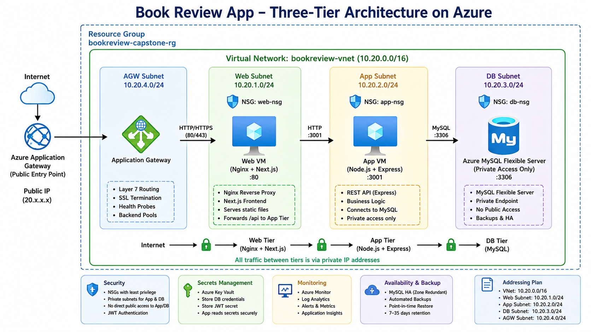>

---

#### Screenshot 2 — Written architecture assumptions and selected Azure services

<>

---

# Task 2 — Create the Azure Network Foundation

## Goal

Create a dedicated Resource Group and VNet with separate subnets for the web, application, and database tiers, keeping the application and database tiers without direct public access.

### Evidence

#### Screenshot 3 — Resource Group overview showing the assignment resources

<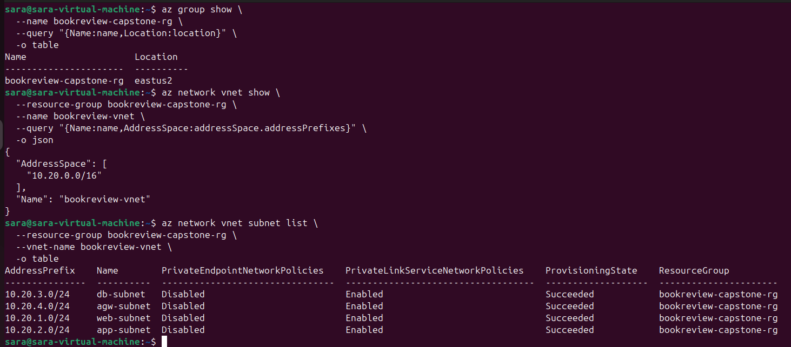>

---

#### Screenshot 4 — VNet overview showing the address space and all required subnets

<>

---

#### Screenshot 5 — Route-table or Private DNS evidence where applicable

<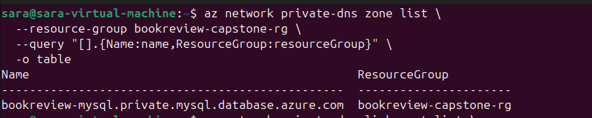>

---

# Task 3 — Configure Security and Secret Management

## Goal

Apply least-privilege NSG rules so traffic flows Internet → public entry point → web tier → application tier → database tier, and store credentials in Azure Key Vault or another approved secure mechanism.

### Evidence

#### Screenshot 6 — NSG rules proving least-privilege access between the tiers

<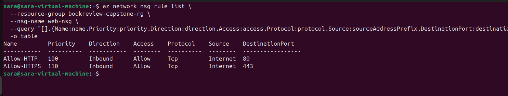>
<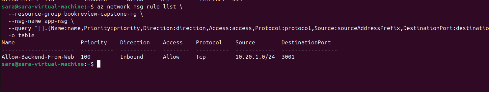>

---

#### Screenshot 7 — Key Vault or approved secret-management configuration (without displaying secret values)

<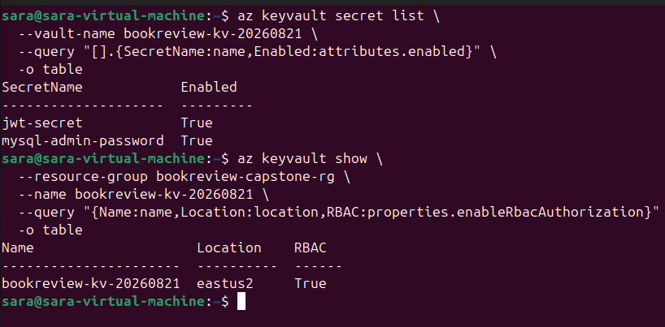>

---

# Task 4 — Deploy the Presentation (Web) Tier

## Goal

Deploy the Book Review App presentation layer on the approved web-tier compute service, configured to route requests to the internal application-tier endpoint, and not directly exposed except through the public entry service.

### Evidence

#### Screenshot 8 — Web-tier compute overview showing subnet and availability configuration

<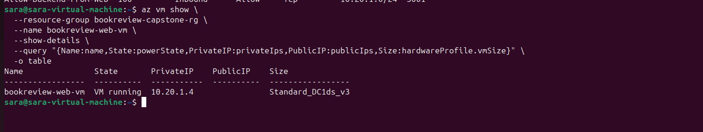>
<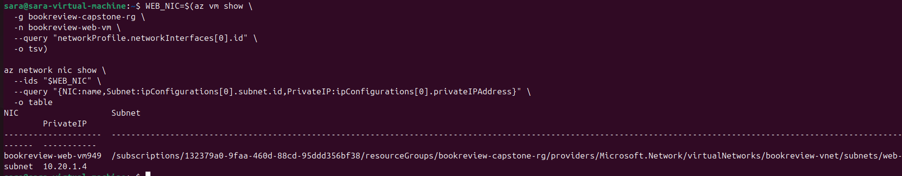>

---

#### Screenshot 9 — Terminal or service output proving the presentation layer is running

<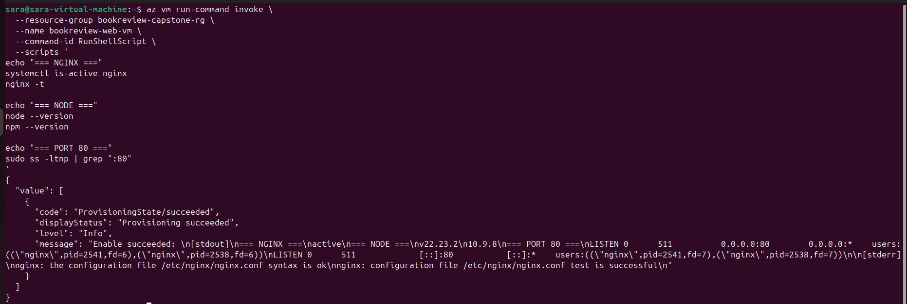>

---

# Task 5 — Deploy the Business (Application) Tier

## Goal

Deploy the Book Review App backend privately in the application subnet, configured to use the private database endpoint and secured environment values, reachable only through its internal endpoint.

### Evidence

#### Screenshot 10 — Application-tier compute overview showing private subnet placement

<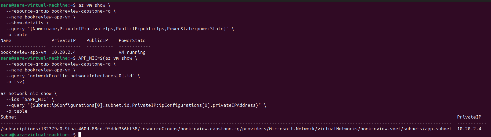>

---

#### Screenshot 11 — Backend process, service, or listening-port evidence

<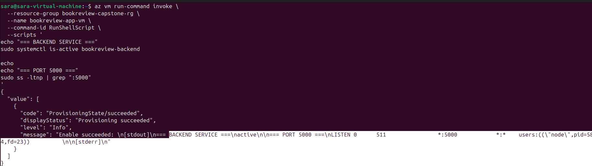>

---

#### Screenshot 12 — Internal health-check or API response (without exposing secrets)

<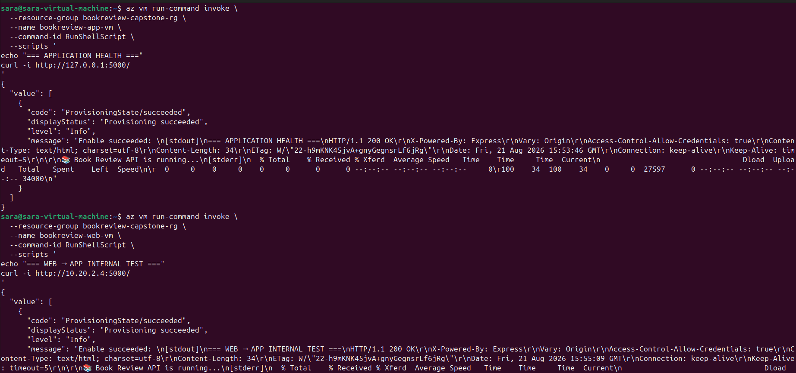>

---

# Task 6 — Deploy the Managed Database Tier

## Goal

Create a private Azure managed database (public access disabled), with availability/backup/retention settings, the Book Review App schema imported, and access restricted to the application tier only.

### Evidence

#### Screenshot 13 — Database overview showing private connectivity and public access disabled

<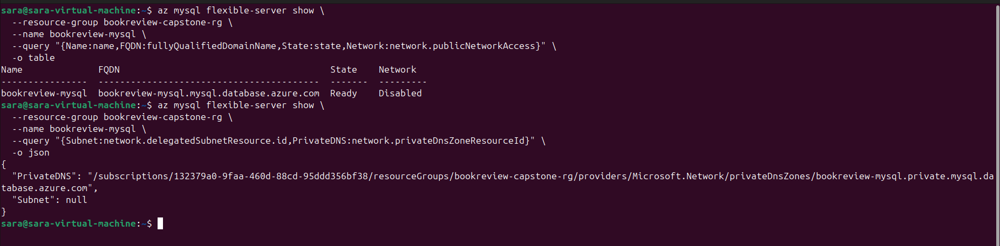>

---

#### Screenshot 14 — Availability, backup, and retention configuration

<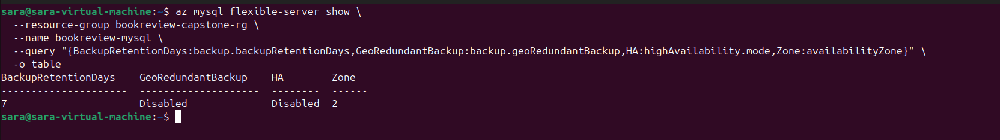>

---

#### Screenshot 15 — Successful schema or connectivity verification (without exposing credentials)

<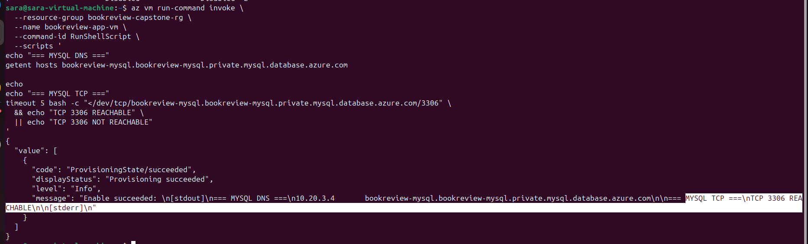>

---

# Task 7 — Configure Traffic Management, Availability, and Monitoring

## Goal

Configure the approved public entry service with health probes and backend pools, internal routing for the application tier where required, and enable Azure Monitor/diagnostics/logs/alerts for the key resources.

### Evidence

#### Screenshot 16 — Public entry service showing listener, frontend endpoint, and healthy web targets

<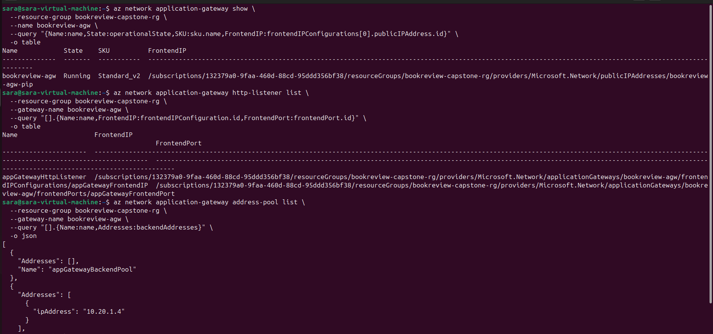>

---

#### Screenshot 17 — Internal application-tier load-balancing or routing configuration where applicable

<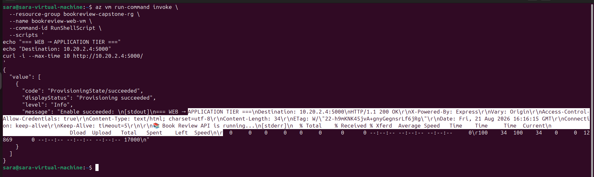>

---

#### Screenshot 18 — Azure Monitor, diagnostic settings, logs, metrics, or alert evidence

<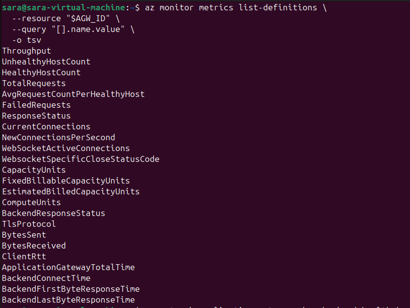>
<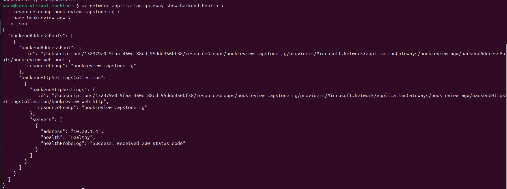>

---

# Task 8 — Validate the Production-Style Deployment

## Goal

Confirm the Book Review App works end to end through the public endpoint, with at least one database read and one write, confirm private tiers are not internet-reachable, and complete a safe availability test.

### Evidence

#### Screenshot 19 — Browser showing the Book Review App through the public endpoint

<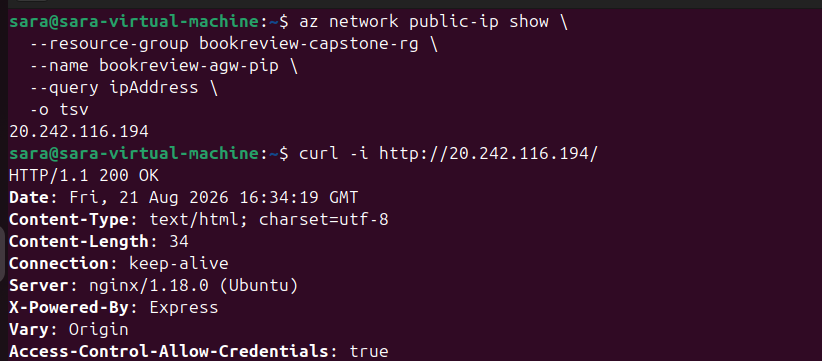>
<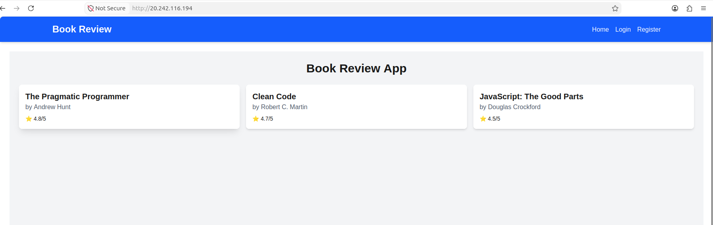>

---

#### Screenshot 20 — Proof of successful database-backed read and write operations

<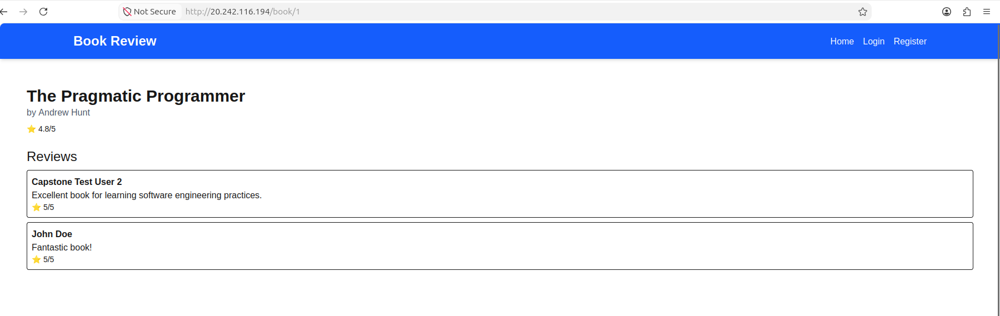>

---

#### Screenshot 21 — Evidence that private tiers are not publicly accessible

<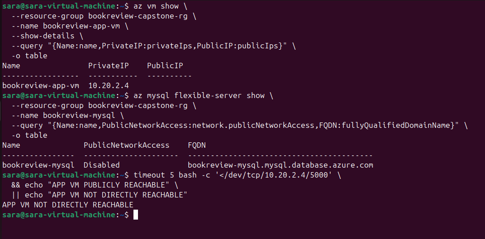>

---

#### Screenshot 22 — Availability-test and healthy-target evidence

<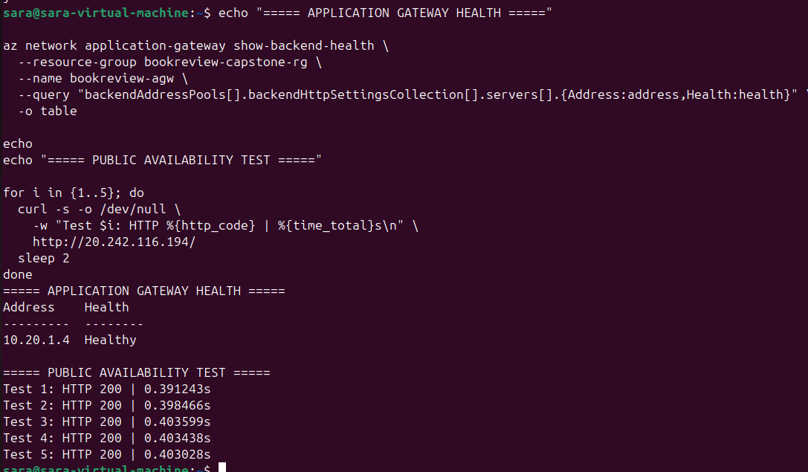>

---

#### Public Endpoint

Paste your public endpoint URL here:

http://20.242.116.194/

---

### Notes

Summarize what worked, issues encountered and how they were fixed, and the availability/security/secrets/monitoring/backup choices made.

## Notes: What Worked, Issues Encountered, and Key Design Choices

### ✅ What Worked

* Built and deployed the Book Review application using a **three-tier Azure architecture**:

  * **Presentation tier:** Next.js frontend on the Web VM.
  * **Application tier:** Node.js/Express backend on the private App VM.
  * **Database tier:** Azure Database for MySQL Flexible Server on a private subnet.
* Configured **Application Gateway** as the public entry point with a healthy backend target.
* Configured **Nginx** on the Web VM to:

  * Serve the Next.js frontend.
  * Forward `/api` requests to the private application VM.
* Verified communication between:

  * Web VM → App VM.
  * App VM → MySQL.
* Successfully connected the backend to MySQL using **SSL**.
* Confirmed database-backed operations including book retrieval and review retrieval.
* Configured the frontend as a production Next.js application running on port **3000** using `systemd`.
* Successfully exposed the application through the Application Gateway public endpoint.

### ⚠️ Issues Encountered and How They Were Fixed

* **MySQL VNet/subnet creation conflict:** The existing web subnet was already being used by a VM, so Azure initially attempted to recreate the VNet. We stopped this and used the existing VNet/subnet structure.
* **Azure CLI MySQL extension issue:** The expected `rdbms` CLI extension was unavailable. We worked around this using the available Azure MySQL Flexible Server commands and direct resource/network verification.
* **Private MySQL connectivity:** DNS and TCP connectivity were tested from the App VM. The database resolved to its private IP and port `3306` was reachable.
* **Backend initially connected to `127.0.0.1:3306`:** The systemd service did not inherit the correct database environment variables. The backend environment was corrected to use the private Azure MySQL hostname.
* **Backend systemd failure:** After correcting the database configuration and adding the required `JWT_SECRET`, the backend became active and remained running.
* **Incorrect API endpoint testing:** `/books` returned `Cannot GET /books` because the actual route was `/api/books`. This was corrected during testing.
* **Login returned HTTP 500:** Investigation showed `JWT_SECRET` was missing from the backend environment. It was added and the backend restarted successfully.
* **Application Gateway listener configuration:** An existing listener and frontend port were already present, so creating duplicate listener resources caused conflicts. Existing resources were reused.
* **Frontend initially missing from the Web VM:** The backend had been deployed to the App VM, but the Next.js frontend had not been deployed to the Web VM. This was identified and corrected by cloning the existing application repository onto the Web VM.
* **Next.js API path:** The frontend initially used a localhost API fallback. A production `.env.production` configuration was added with `/api`, and the homepage API reference was corrected to prevent `/api/api/...` requests.
* **Monitoring CLI limitation:** The expected `az monitor metric-alert` command was unavailable. Azure resource-level monitoring was instead configured using supported Azure Monitor resources, including an Action Group.

### 🔐 Security and Secrets

* Application and database tiers were kept on **private network addresses** rather than directly exposing them to the Internet.
* Application Gateway was used as the controlled public entry point.
* Database connectivity was restricted to the application tier through the private network.
* Azure Key Vault was created for secure secret management.
* Database credentials were moved toward Key Vault-based management rather than exposing passwords in application configuration.
* JWT authentication was enabled for protected application operations.
* Database connections use **SSL encryption**.
* No passwords, secret values, private keys, or subscription IDs were included in the submission evidence.

### 🛡️ Availability and Traffic Management

* Application Gateway was configured with:

  * Public frontend endpoint.
  * HTTP listener.
  * Backend pool.
  * Health probe.
* The Web VM was registered as a backend target and verified as **Healthy**.
* Repeated HTTP requests were used as a safe availability test.
* The application and API were tested through the public Application Gateway endpoint.
* The Web VM itself remained private, preventing direct Internet access.

### 📊 Monitoring

* Azure Monitor resources were enabled for the deployment.
* An Azure Monitor **Action Group** named `bookreview-alerts` was created for future alert notifications.
* Application Gateway health was used as an important availability indicator.
* Service status, listening ports, API responses, and Application Gateway backend health were checked during validation.

### 💾 Backup and Database Reliability

* Azure Database for MySQL Flexible Server was used instead of running MySQL directly on a VM.
* The database was deployed privately and accessed through its private DNS endpoint.
* Azure-managed database capabilities were selected to provide managed availability, backup, and retention rather than relying on manual VM-level database backups.
* Database schema and sample data were successfully initialized and verified through the application.

### 🎯 Final Outcome

* The deployment ultimately achieved the intended flow:

```text
Internet
   ↓
Azure Application Gateway
   ↓
Private Web VM
   ↓
Nginx
   ├── Next.js Frontend
   └── /api → Private App VM
                    ↓
              Private MySQL
```

* The main lesson from the troubleshooting was that **having each Azure resource healthy individually does not guarantee the application is complete**. The frontend, backend, routing, environment variables, secrets, health probes, and database connectivity all had to be validated together as one end-to-end system.


---

# Submission Instructions

- Add all required screenshots and links in your submission
- Do not expose passwords, keys, connection strings, or subscription IDs

---

# Completion Checklist

- [✅] Task 1: Architecture diagram and assumptions documented (Screenshots 1–2)
- [✅] Task 2: Network foundation created with isolated tiers (Screenshots 3–5)
- [✅] Task 3: Least-privilege security and secret management configured (Screenshots 6–7)
- [✅] Task 4: Presentation tier deployed (Screenshots 8–9)
- [✅] Task 5: Application tier deployed privately (Screenshots 10–12)
- [✅] Task 6: Managed database tier deployed privately (Screenshots 13–15)
- [✅] Task 7: Public entry, internal routing, and monitoring configured (Screenshots 16–18)
- [✅] Task 8: End-to-end validation and availability test completed (Screenshots 19–22, Public Endpoint, Notes)
- [✅] No sensitive data exposed

---

## 📌 About DMI & CloudAdvisory

DevOps Micro Internship (DMI) is a project-based DevOps program run by Pravin Mishra (The CloudAdvisory) focused on real-world execution, systems thinking, and career readiness.

It helps learners build strong DevOps foundations with hands-on experience.

---

## 📌 Resources

- 🌐 DMI Official Website: https://dmi.pravinmishra.com?utm_source=github&utm_medium=readme  
- 🎓 University: https://university.pravinmishra.com?utm_source=github&utm_medium=readme  
- 💬 Discord Community: https://discord.pravinmishra.com?utm_source=github&utm_medium=readme  
- 📝 Blog: https://dmi.pravinmishra.com/blog?utm_source=github&utm_medium=readme  
- ▶️ YouTube Playlist: https://www.youtube.com/playlist?list=PLFeSNDtI4Cho  
- 🔗 Pravin Mishra (LinkedIn): https://www.linkedin.com/in/pravin-mishra-aws-trainer/  
- 🏢 CloudAdvisory (LinkedIn): https://www.linkedin.com/company/thecloudadvisory/

---

*This submission is part of DevOps Micro Internship (DMI) Cohort 3 — Agentic AI Track.*
