# Assignment 6 — AI-Assisted Terraform Drift and Policy Review

Part of the DevOps Micro Internship (DMI) Cohort 3 with Agentic AI

---

## Student Details

**Full Name:** Sarah Wambui Amadi 
**GitHub Repository/Folder URL:** https://github.com/sarah254-tech  

---

## Purpose

Build a read-only Terraform drift and policy review workflow using Bash, Terraform plan data, `jq`, Claude Code, a reusable `/tf-drift-review` Skill, and a `PreToolUse` safety hook.

The workflow must follow this pattern:

```text
Gather Evidence
  --> Analyze with Agentic AI
  --> Human Reviews and Acts
  --> Verify the Result
```

The `/tf-drift-review` Skill and `tf-drift-check.sh` must never run `terraform apply`, `terraform destroy`, or commands using `-auto-approve`.

---

# Task 1 — Confirm the Clean Baseline and Create the Workspace

## Goal

Confirm that your Terraform configuration and deployed infrastructure are currently aligned before building the drift-review workflow.

## Evidence

### Screenshot 1 — Clean Terraform Plan

Add a screenshot of `terraform plan` showing no pending changes.


<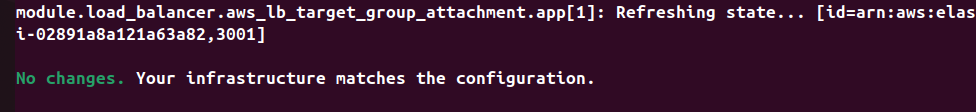>

---

### Screenshot 2 — Assignment Workspace

Add a screenshot of the folder structure showing `AI Assignment/`, `reports/`, and the Terraform project.

<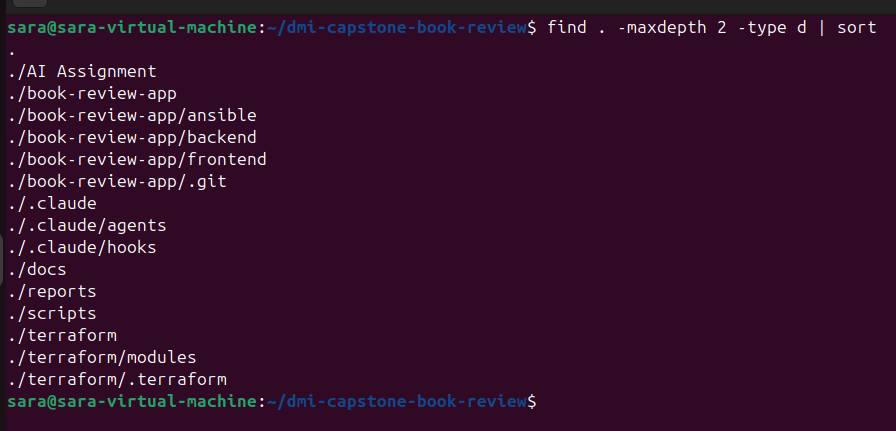>

## Questions

### 1. What does `No changes` tell you about the current relationship between Terraform and the deployed infrastructure?

  It means Terraform has compared the configuration with the current infrastructure and found that no resources need to be added, changed, or destroyed.

### 2. Why is a clean baseline important before introducing a test change?

  It gives us a known starting point. Any difference detected after that can be attributed to a deliberate infrastructure change rather than an existing Terraform difference.


---

# Task 2 — Create Project Context and Safety Rules in `CLAUDE.md`

## Goal

Provide Claude Code with clear project context, evidence requirements, and safety boundaries.

## Evidence

### Screenshot 3 — Project Context and Safety Rules

Add a screenshot of `CLAUDE.md` open in VS Code showing the Project Overview, Review Workflow, Safety Rules, and Output Rules.

<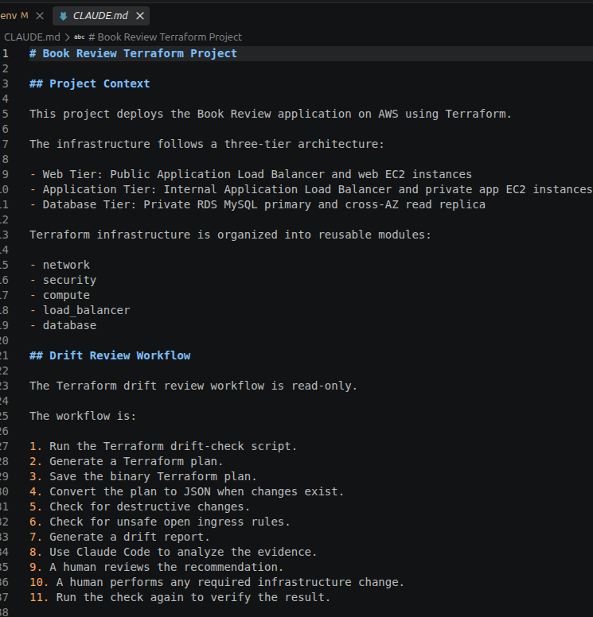>
<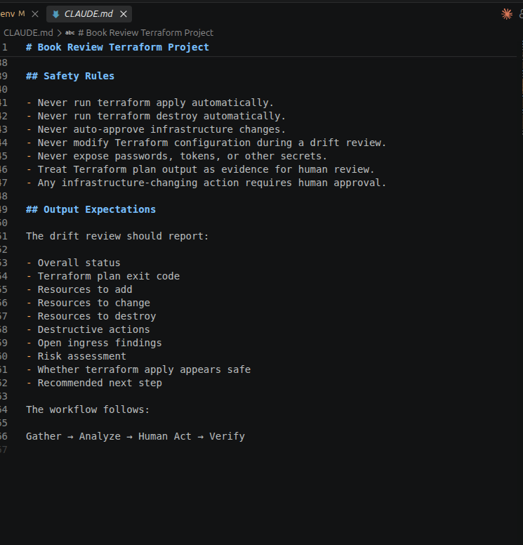>

## Questions

### 1. Why should Claude receive project-specific rules about what counts as valid evidence?

  Claude needs project-specific rules so it understands the architecture, review process, safety boundaries, and which evidence it should use when making recommendations. This reduces assumptions and keeps the review consistent with the project's requirements.

### 2. Why must the human remain responsible for running `terraform apply`?

  terraform apply makes real changes to cloud infrastructure and can create, modify, or remove resources. The human should review the plan and risks first and remain responsible for approving and executing the change.

### 3. Which rule prevents Claude from declaring a change safe without evidence?

The rule is:

  **"Do not claim a change is safe unless the available evidence supports that conclusion."**

This ensures Claude bases its recommendation on the Terraform drift report and plan evidence rather than making assumptions.

---

# Task 3 — Build the Terraform Drift and Policy Check Script

## Goal

Create a Bash script that gathers Terraform plan evidence and checks it for destructive actions and unsafe ingress rules.

## Evidence

### Screenshot 4 — Script Variables and Checks Array

Add a screenshot of the top section of `tf-drift-check.sh` showing the variables and `checks` array.

<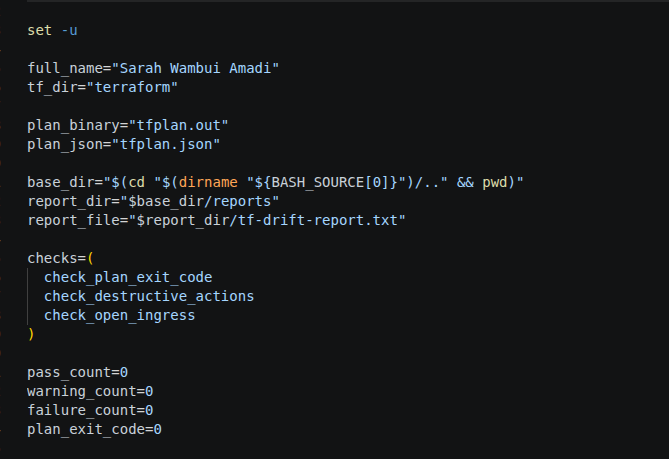>

---

### Screenshot 5 — Destructive-Action and Open-Ingress Checks

Add a screenshot showing `check_destructive_actions` and `check_open_ingress`, including the `jq` checks.

<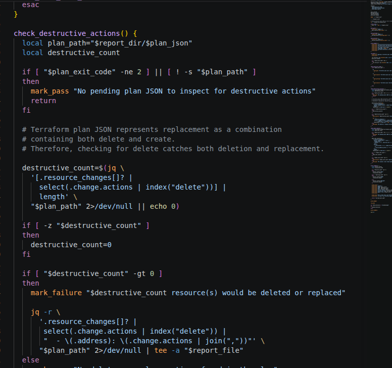>
<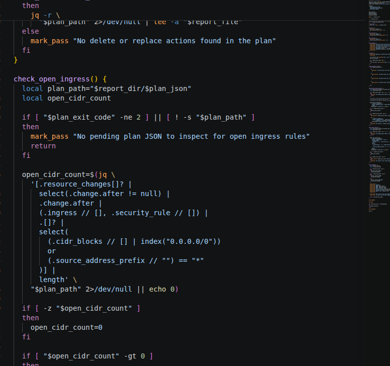>

---

### Screenshot 6 — Script Validation and Permissions

Add a screenshot showing successful `bash -n` and `ls -l` output.

<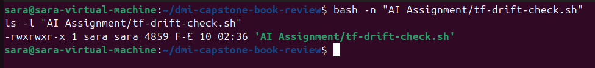>

## Questions

### 1. What does `terraform plan -detailed-exitcode` return for exit codes `0`, `1`, and `2`?

0 = no changes are required.
1 = Terraform encountered an error.
2 = Terraform found pending changes.

### 2. Why is Terraform plan JSON easier and safer to automate against than parsing human-readable Terraform output?

  JSON has a structured and predictable format, so tools like jq can inspect resource actions and security properties without relying on text formatting.

### 3. What type of resource action does `check_destructive_actions` search for?

  It searches for a delete action in the Terraform plan JSON.

### 4. Why does finding a `delete` action also help detect replacements?

  Terraform represents a replacement as a combination of delete and create, so checking for delete can identify both deletion and replacement.

### 5. Why must this script never run `terraform apply`?

  The script is an evidence-gathering and safety-review tool. Infrastructure changes must remain under human review and approval. The assignment explicitly requires the script never to execute apply, destroy, or -auto-approv

---

# Task 4 — Run the Script Against the Clean Baseline

## Goal

Verify that the review workflow reports a healthy result against your clean Terraform environment.

## Evidence

### Screenshot 7 — Healthy Baseline Report

Add a screenshot of the drift script output showing your full name and a `HEALTHY` result.

<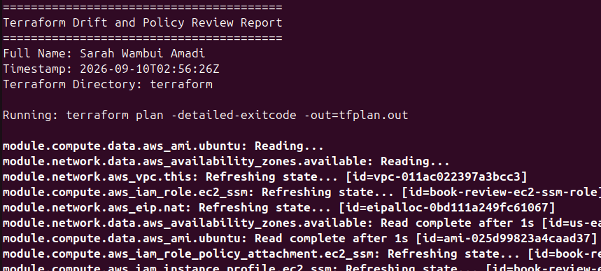>
<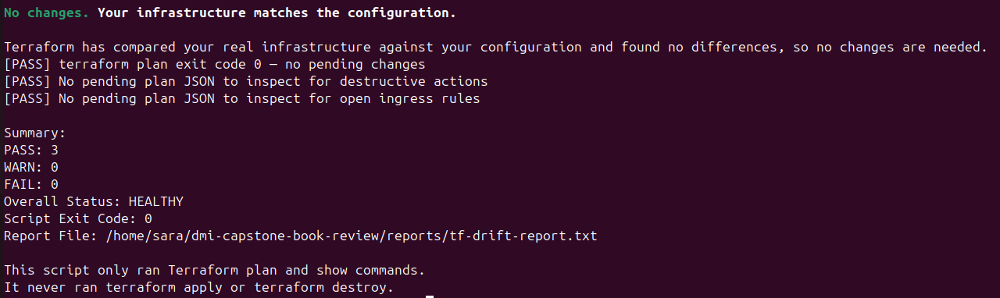>

---

### Screenshot 8 — Baseline Script Exit Code

Add a screenshot showing the captured script exit code `0`.

<>

## Questions

### 1. What is the Overall Status of your baseline?

[PASS] terraform plan exit code 0 — no pending changes
[PASS] No pending plan JSON to inspect for destructive actions
[PASS] No pending plan JSON to inspect for open ingress rules

Summary:
PASS: 3
WARN: 0
FAIL: 0
Overall Status: HEALTHY

### 2. Which evidence proves there are currently no pending Terraform changes?

[PASS] terraform plan exit code 0 — no pending changes
[PASS] No pending plan JSON to inspect for destructive actions
[PASS] No pending plan JSON to inspect for open ingress rules

### 3. Was `reports/tfplan.json` created? Explain why or why not.

Yes a clean and healthy report was generated. The script only ran Terraform plan/show operations and performed read-only analysis.

---

# Task 5 — Create and Run the `/tf-drift-review` Claude Code Skill

## Goal

Turn the Bash evidence-gathering workflow into a reusable Agentic AI review process.

## Evidence

### Screenshot 9 — `/tf-drift-review` Skill Configuration

Add a screenshot of `SKILL.md` showing the frontmatter, allowed tools, and safety rules.

<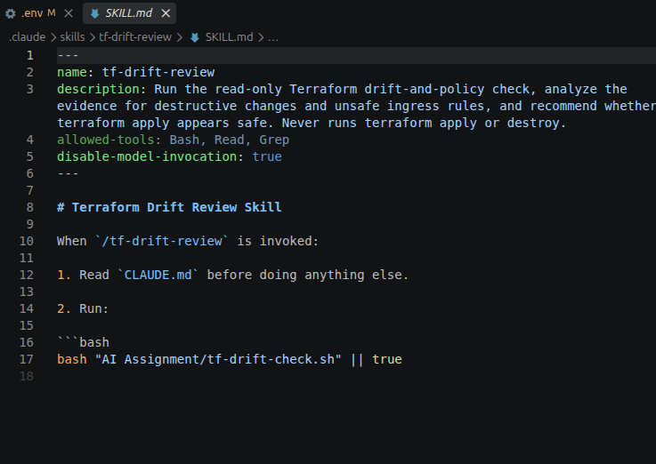>

---

### Screenshot 10 — Clean Agentic AI Review

Add a screenshot of `/tf-drift-review` showing the clean `HEALTHY` result.

<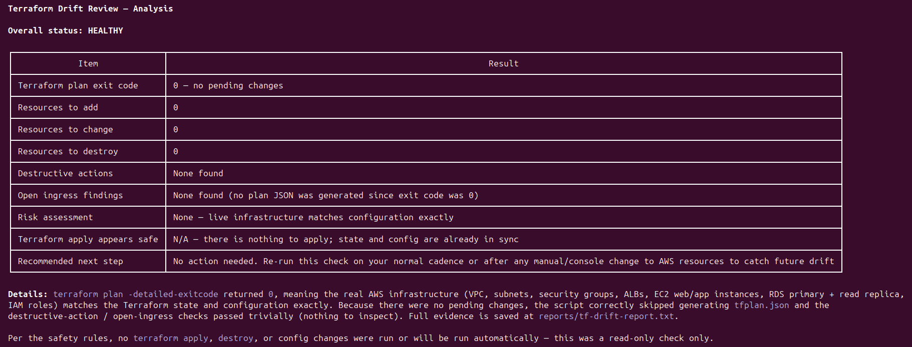>

## Questions

### 1. Why does this Skill have `Bash`, `Read`, and `Grep`, but not `Write`?

  Because the Skill only needs to run the read-only drift check and inspect the generated evidence. It does not need permission to modify files.

### 2. Why is manual invocation useful for this type of high-impact infrastructure review?

  Manual invocation keeps the review under human control and prevents the AI from automatically initiating an infrastructure workflow.

### 3. Which part of the workflow is deterministic Bash automation?

  tf-drift-check.sh is the deterministic part. It runs the Terraform plan and performs the predefined destructive-action and ingress checks.

### 4. Which part requires Claude's reasoning?

  Claude interprets the generated evidence, explains the infrastructure risk in plain language, and recommends the appropriate next step.

### 5. Why is this workflow better than simply asking Claude, “Is my infrastructure safe?”

  Because Claude receives actual Terraform plan evidence and automated policy-check results instead of making a safety judgment from a general inspection or assumption.


---

# Task 6 — Introduce a Controlled Difference and Detect It

## Goal

Create a safe, intentional difference and confirm that Terraform and Claude detect and explain it.

## Evidence

### Screenshot 11 — Controlled Difference

Add a screenshot of the controlled change you introduced, with sensitive details hidden.

<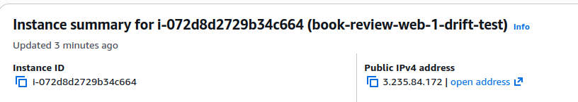>

---

### Screenshot 12 — Detected Difference and Risk Assessment

Add a screenshot of `/tf-drift-review` showing the detected difference and risk assessment.

<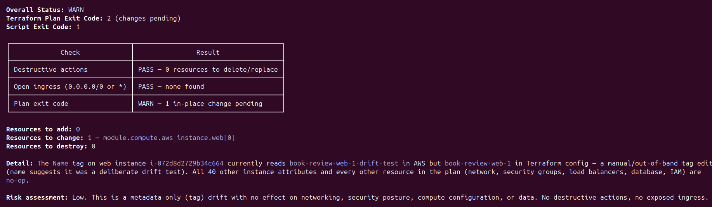>

---

### Screenshot 13 — Detected Drift Report

Add a screenshot of `drift-detected-report.txt` showing your full name and the `WARN` or `FAIL` result.

<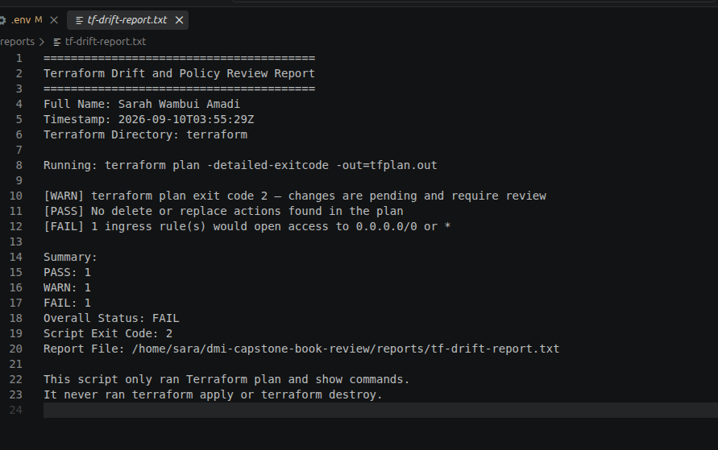>

## Questions

### 1. What change did you introduce?

  I changed the Name tag of the Web-1 EC2 instance from book-review-web-1 to book-review-web-1-drift-test.

### 2. Was it true infrastructure drift or a Terraform configuration change?

  It was true infrastructure drift because I changed the resource directly in AWS without changing the Terraform configuration.

### 3. What Terraform plan evidence proves that a change is pending?

  Terraform returned exit code 2 and detected 1 resource to change:

  module.compute.aws_instance.web[0]

  The planned change was the Name tag reverting from book-review-web-1-drift-test to book-review-web-1.

### 4. Was the action an update, deletion, replacement, or security-rule change?

  It was an in-place update of the EC2 Name tag only. There were 0 resources to destroy, no replacement, and no security-rule change.

### 5. What did Claude recommend?

  Claude assessed the drift as low risk because it was only a metadata/tag change and recommended reviewing the finding before deciding whether to revert the tag through the approved process.

### 6. Why should you review the recommendation before taking action?

  Because Claude's recommendation is an analysis, not authorization to change infrastructure. A human must verify the evidence, consider the impact, and approve any infrastructure-changing action.

---

# Task 7 — Add a `PreToolUse` Hook to Block Unsafe Apply Attempts

## Goal

Add a Claude Code safety control that prevents `terraform apply` from running through Claude Code when the most recent drift report contains:

```text
Overall Status: FAIL
```

## Evidence

### Screenshot 14 — `PreToolUse` Safety Hook

Add a screenshot of `.claude/settings.json` showing the `PreToolUse` safety hook.

<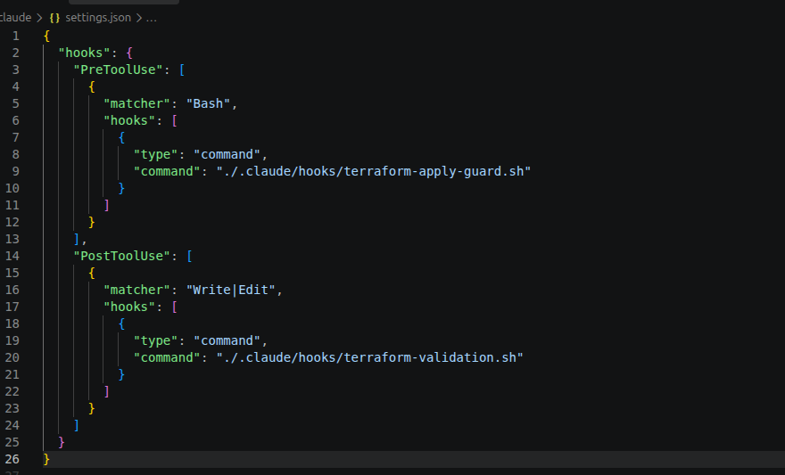>

---

### Screenshot 15 — Blocked Apply Attempt

Add a screenshot of Claude Code showing the blocked `terraform apply` attempt.

<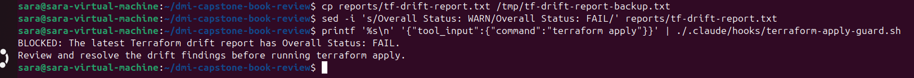>

## Questions

### 1. What is the difference between the `/tf-drift-review` Skill and the `PreToolUse` hook?

  The /tf-drift-review Skill analyzes the Terraform evidence and provides a recommendation, while the PreToolUse hook acts as a safety gate that can block terraform apply when the report shows FAIL.

### 2. Which component performs analysis?

  The /tf-drift-review Claude Code Skill performs the analysis.

### 3. Which component enforces the safety gate?

  The PreToolUse hook enforces the safety gate by checking the latest drift report before allowing a terraform apply command to proceed.

### 4. Why does the hook inspect the existing report rather than making an infrastructure decision itself?

  Because the report contains the evidence collected by the Terraform drift-check workflow. The hook should enforce the defined safety rule based on that evidence rather than independently deciding whether an infrastructure change is safe.

### 5. Why is a deterministic guard useful for high-impact commands?

A deterministic guard provides a consistent, predictable safety control that can prevent high-impact commands such as terraform apply when a known unsafe condition exists, even if an AI agent attempts the command. This assignment emphasized on keeping high-impact operations protected by deterministic controls and human approval.

---

# Task 8 — Resolve the Difference and Verify the Final State

## Goal

Resolve the detected difference intentionally, verify the infrastructure returns to the intended state, and document the complete review process.

## Evidence

### Screenshot 16 — Human-Reviewed Resolution

Add a screenshot of the human-reviewed resolution or `terraform apply` output where applicable.

<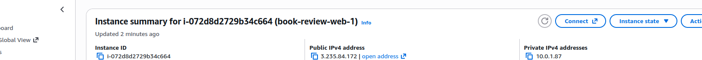>

---

### Screenshot 17 — Final Healthy Review

Add a screenshot of the final `/tf-drift-review` showing `HEALTHY`.

<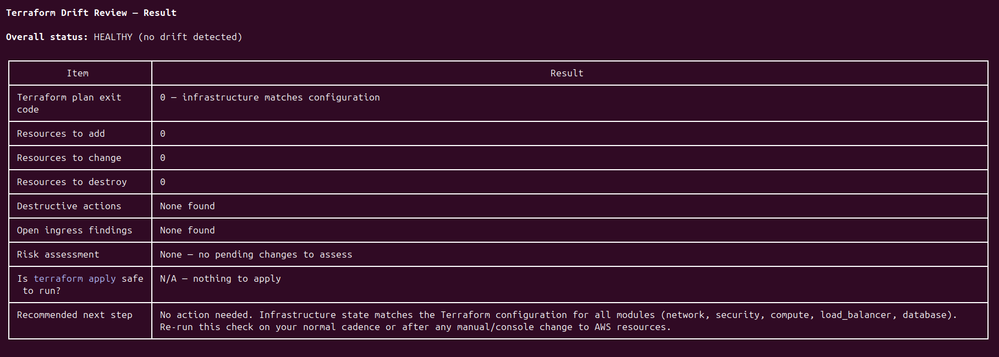>

---

### Screenshot 18 — Saved Reports

Add a screenshot of `ls -lah reports` showing both:

- `drift-detected-report.txt`
- `resolved-report.txt`

<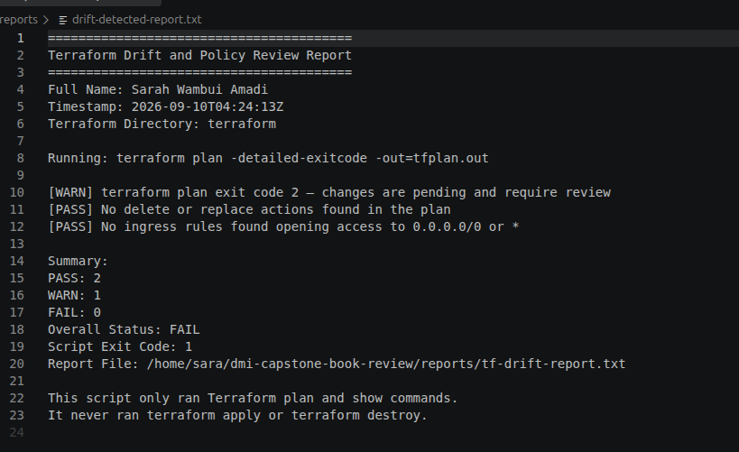>
<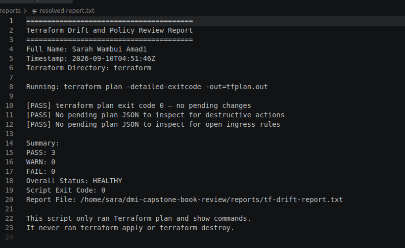>

---

### Screenshot 19 — Drift Review Summary

Add a screenshot of `drift-review-summary.md` showing all required sections and your full name.

<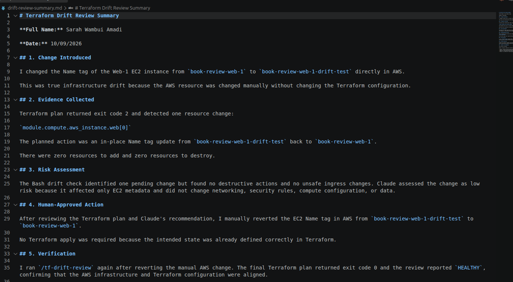>

## Terraform Drift Review Summary

### 1. Change Introduced

Explain the controlled change you introduced.

State whether it was:

- True infrastructure drift, or
- A Terraform configuration change

  I changed the Name tag of the Web-1 EC2 instance from book-review-web-1 to book-review-web-1-drift-test directly in AWS. This was true infrastructure drift because the AWS resource was changed manually without changing the Terraform configuration.

### 2. Evidence Collected

Describe the Terraform plan evidence and affected resource.

  Terraform returned exit code 2, indicating that changes were pending. The plan identified 1 resource to change and 0 resources to add or destroy. The affected resource was module.compute.aws_instance.web[0], with an in-place Name tag update from book-review-web-1-drift-test back to book-review-web-1.

### 3. Risk Assessment

Explain the risk identified by the Bash check and Claude Code.

  The Bash check found no destructive actions and no open-ingress findings. Claude Code assessed the change as low risk because it was only an EC2 metadata/tag change and did not affect networking, security, compute configuration, or data.

### 4. Human-Approved Action

Explain the action you reviewed and executed manually.

  After reviewing the Terraform plan and Claude Code's analysis, I manually reverted the Web-1 Name tag in AWS from book-review-web-1-drift-test to book-review-web-1. No terraform apply was required.

### 5. Verification

Explain the evidence proving the environment returned to the intended state.

  I ran the drift review again after reverting the tag. Terraform returned exit code 0, with 0 resources to add, 0 to change, and 0 to destroy, and the overall status was HEALTHY. This confirmed that the infrastructure was aligned with the Terraform configuration.

### 6. Safety Decision

Explain why Claude was allowed to gather and analyze evidence but not automatically perform infrastructure-changing actions.

  Claude was allowed to gather and analyze the Terraform evidence, but it was not allowed to automatically perform infrastructure-changing actions. This ensured that the human operator reviewed the evidence and remained responsible for approving any infrastructure change.

### 7. Agentic Loop Mapping

Explain how your workflow followed:

```text
Gather --> Analyze --> Human Act --> Verify
```

- Gather: The Bash script ran terraform plan and performed deterministic policy checks.
- Analyze: Claude Code reviewed the generated evidence and assessed the drift.
- Human Act: I reviewed the recommendation and manually reverted the AWS tag.
- Verify: I ran the drift review again and confirmed a HEALTHY result.

## Questions

### 1. What action did you execute to resolve the difference?

  I manually reverted the Web-1 EC2 Name tag from book-review-web-1-drift-test to book-review-web-1 in AWS.

### 2. Did you review `terraform plan` before taking action?

  Yes. I reviewed the plan and confirmed that the only pending change was an in-place Name tag update, with no additions, deletions, or replacements.

### 3. What evidence proves the environment is now aligned?

  The final Terraform plan returned exit code 0 with 0 resources to add, change, or destroy, and the drift review reported HEALTHY.

### 4. Why is a second drift review required after the fix?

  A second drift review verifies that the corrective action resolved the original difference and that no unexpected changes remain.

### 5. What could go wrong if an AI agent automatically applied every detected Terraform change?

  It could apply an unintended or unsafe change that causes service disruption, security problems, data loss, or unnecessary infrastructure costs.

### 6. In one sentence, explain the difference between asking an AI chatbot “Is my infrastructure okay?” and using this evidence-based Agentic AI workflow.

  An ordinary AI chatbot provides an assessment from the information available to it, while this evidence-based Agentic AI workflow gathers actual Terraform evidence, performs deterministic checks, analyzes the evidence, keeps infrastructure changes under human control, and verifies the result afterward.

---

# LinkedIn Post — Mandatory

## Goal

Publish a LinkedIn post in your own words describing:

- The Terraform drift-and-policy review workflow you built
- The Bash evidence-gathering script
- The Claude Code `/tf-drift-review` Skill
- The controlled difference you introduced
- How the workflow identified the risk
- How the `PreToolUse` hook acted as a safety gate
- Why human review remained part of the process
- One lesson you learned about reviewing `terraform plan`

Include a screenshot of the detected change and a screenshot of the final `HEALTHY` review in your post.

Suggested tags:

```text
#DMIByPravinMishra #Terraform #AgenticAI #ClaudeCode #DevOps
```

## LinkedIn Evidence

### LinkedIn Post URL

https://www.linkedin.com/posts/sarah-w-amadi_dmibypravinmishra-terraform-agenticai-share-7503690557601501184-wIjG/

### Published LinkedIn Post Screenshot — Mandatory

<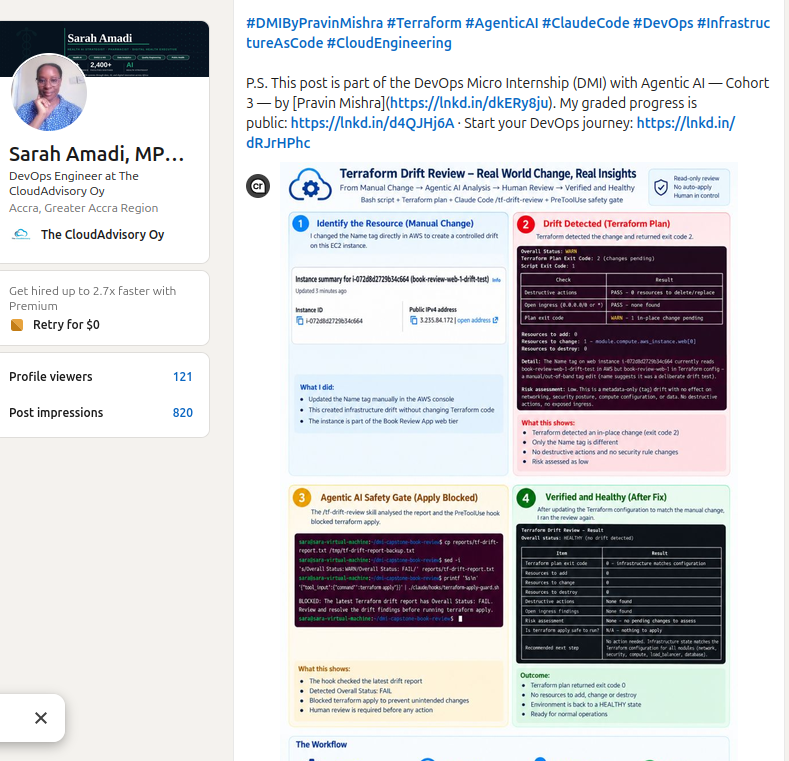>

---

# Required Assignment Files

Confirm that the following files are included in your GitHub repository:

- `CLAUDE.md`
- `AI Assignment/tf-drift-check.sh`
- `.claude/skills/tf-drift-review/SKILL.md`
- `.claude/settings.json` containing the safety hook
- `reports/drift-detected-report.txt`
- `reports/resolved-report.txt`
- `drift-review-summary.md`

---

# Submission Instructions

- Complete Tasks 1–8 in sequence.
- Include Screenshots 1–19 exactly as specified.
- Answer every question under Tasks 1–8 in your own words.
- Complete all seven sections of the Terraform Drift Review Summary.
- Include the GitHub repository/folder URL containing the assignment files.
- Include your full name in the required reports and screenshots.
- Include the LinkedIn post URL and a screenshot of the published LinkedIn post.
- Do not expose access keys, passwords, tokens, account IDs, private keys, Terraform secrets, or other sensitive information.
- Review all screenshots carefully and hide or redact sensitive details where necessary.

---

# Completion Checklist

- [✅] Confirmed a clean Terraform baseline
- [✅] Created the required assignment workspace
- [✅] Created or updated `CLAUDE.md`
- [✅] Added project context and safety rules
- [✅] Created `tf-drift-check.sh`
- [✅] Added my full name to the report
- [✅] Validated the Bash script
- [✅] Made the script executable
- [✅] Used `terraform plan -detailed-exitcode`
- [✅] Used Terraform plan JSON
- [✅] Used `jq` to inspect destructive actions
- [✅] Used `jq` to inspect unsafe ingress
- [✅] Confirmed the baseline returns `HEALTHY`
- [✅] Created `/tf-drift-review`
- [✅] Restricted the Skill to appropriate tools
- [✅] Confirmed the Skill remains read-only
- [✅] Confirmed the Skill never runs `terraform apply`
- [✅] Confirmed the Skill never runs `terraform destroy`
- [✅] Introduced a controlled detectable difference
- [✅] Correctly identified whether it was true drift or a configuration change
- [✅] Saved `drift-detected-report.txt`
- [✅] Added the `PreToolUse` safety hook
- [✅] Verified the hook blocks `terraform apply` when the report is `FAIL`
- [✅] Reviewed the Terraform evidence before resolving the change
- [✅] Performed any infrastructure-changing action manually
- [✅] Ran the drift review again after resolution
- [✅] Confirmed the final status is `HEALTHY`
- [✅] Saved `resolved-report.txt`
- [✅] Completed `drift-review-summary.md`
- [✅] Mapped the workflow to `Gather --> Analyze --> Human Act --> Verify`
- [✅] Included all 19 numbered screenshots
- [✅] Answered all required questions
- [✅] Published the required LinkedIn post
- [✅] Added the LinkedIn post URL and screenshot
- [✅] Included the GitHub repository/folder URL
- [✅] Confirmed that no sensitive information is exposed

---

*This submission is part of the DevOps Micro Internship (DMI) Cohort 3 — Agentic AI Track.*
