# Assignment 02 — Provision Linux VMs with Terraform and Run Ansible Ad-Hoc Commands

Part of the DevOps Micro Internship (DMI) Cohort 3 with Agentic AI

---

## Purpose

In this assignment, I used Terraform to provision three or four Ubuntu Linux Virtual Machines on either Microsoft Azure or Amazon Web Services.

I  configured SSH key-based authentication, organized the servers using a custom Ansible inventory, and run Ansible ad-hoc commands across individual hosts and inventory groups.

---

# Task 1 — Create the Multi-Host Lab Structure

## Goal

Create a separate project directory for the multi-host lab and prepare the Terraform, Ansible, and documentation files.

This project will use the Git repository and Ansible controller prepared in Assignment 01.

### Evidence

#### Screenshot 1 — Terminal showing the complete `ansible-adhoc-lab` project structure

<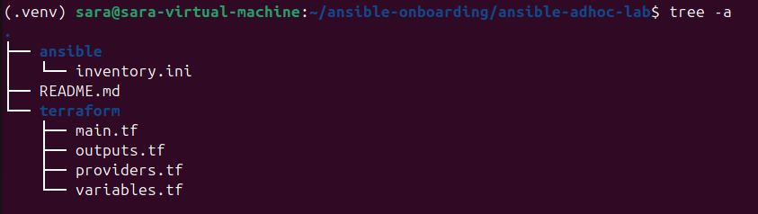>

---

#### Screenshot 2 — Terminal showing `git status --short` with the new project files and updated `.gitignore`

<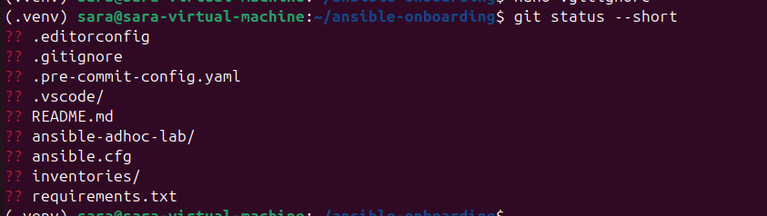>

---

### Notes

For this lab, I will be configuring:

☁️ AWS
🖥️ 3 Ubuntu VMs
web-01
app-01
db-01
🔑 Separate ED25519 Ansible key
🏗️ Terraform provisions the infrastructure
⚙️ Ansible controls the VMs
🔐 SSH restricted to your controller's public IP
🌐 HTTP/80 exposed only on the web server

The Assignment architecture:

                    INTERNET
                       │
                       │ HTTP :80
                       ▼
                ┌──────────────┐
                │    web-01    │
                │    Nginx     │
                └──────────────┘
                       │
                       │
                ┌──────────────┐
                │    app-01    │
                │ Application  │
                └──────────────┘
                       │
                       │
                ┌──────────────┐
                │    db-01     │
                │   Database   │
                └──────────────┘

       YOUR UBUNTU VM
       Ansible Controller
              │
              │ SSH :22
              │ ED25519 key
              ▼
       ┌──────┴───────┐
       │              │
    web-01         app-01         db-01

Terraform will create the infrastructure.

Ansible will then manage the infrastructure.

---

# Task 2 — Create the Terraform Configuration

## Goal

Create the Terraform configuration required to provision three or four Ubuntu Linux VMs on your selected cloud platform.

Complete only one option:

- Option A — Microsoft Azure
- Option B — Amazon Web Services

Do not configure both providers for this assignment.

### Evidence

#### Screenshot 3 — Terraform configuration showing the three or four server roles and the `for_each` or `count` implementation

<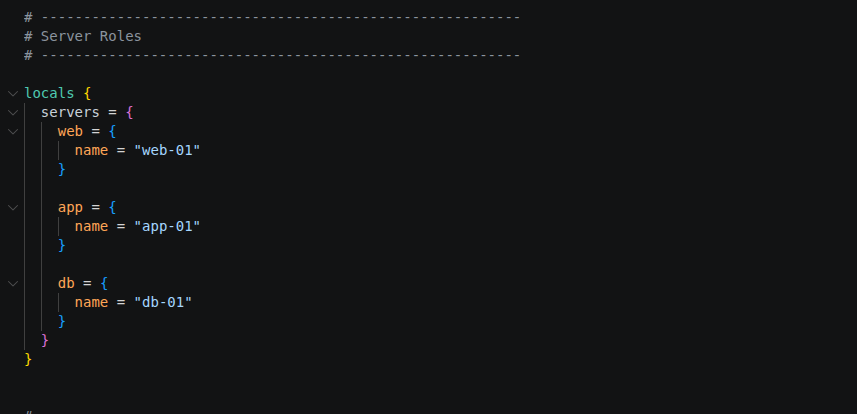>
<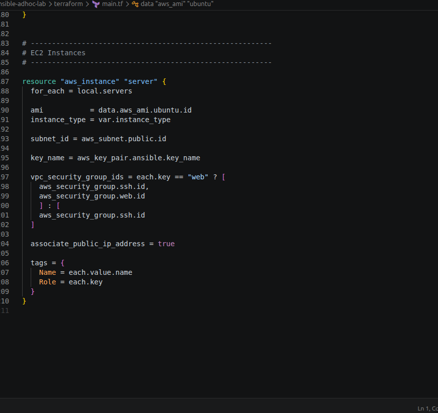>

---

#### Screenshot 4 — Terraform configuration showing SSH restricted to the controller IP and HTTP allowed only for web hosts

<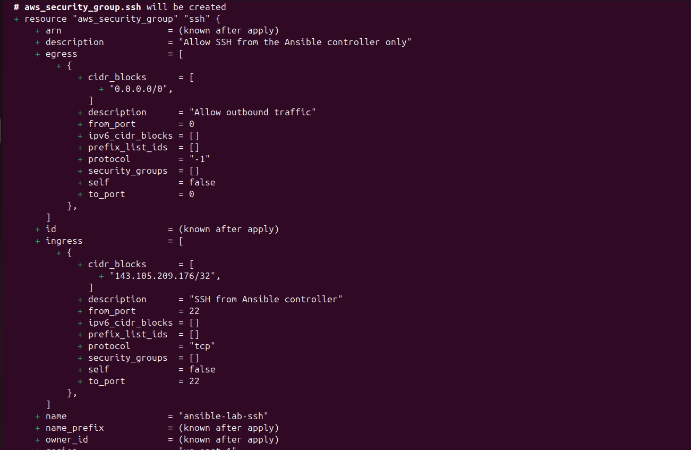>
<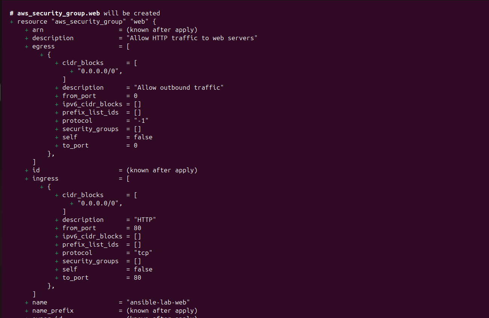>

---

#### Screenshot 5 — Terraform output configuration showing how public IP addresses are associated with the server roles

<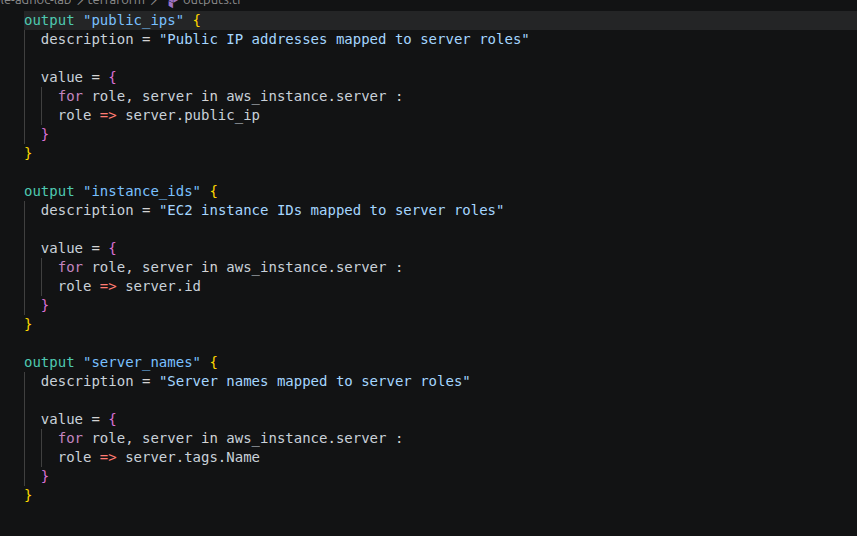>

---

### Notes

---

# Task 3 — Provision the Infrastructure with Terraform

## Goal

Initialize and validate the Terraform configuration, review the execution plan, provision the selected three or four VMs, and retrieve their public IP addresses.

### Evidence

#### Screenshot 6 — Final `terraform apply` output showing `Apply complete`

<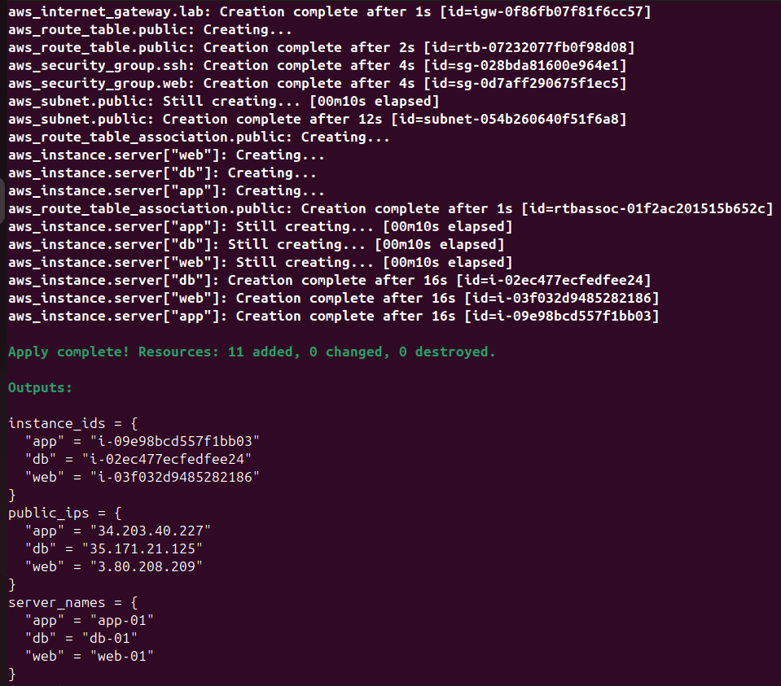>

---

#### Screenshot 7 — `terraform output public_ips` showing the role-to-IP mapping for all three or four VMs

<>

---

#### Screenshot 8 — Azure Portal or AWS Management Console showing all three or four VMs in the `Running` state, with their role-based names visible

<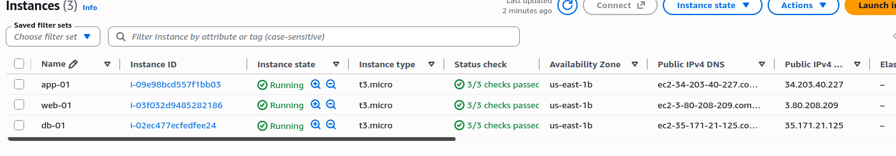>

---

### Notes

---

# Task 4 — Verify SSH Key-Based Access

## Goal

Verify that each managed VM can be accessed from the Ansible controller using SSH key-based authentication.

### Evidence

#### Screenshot 9 — Terminal showing successful SSH hostname output from all VMs

<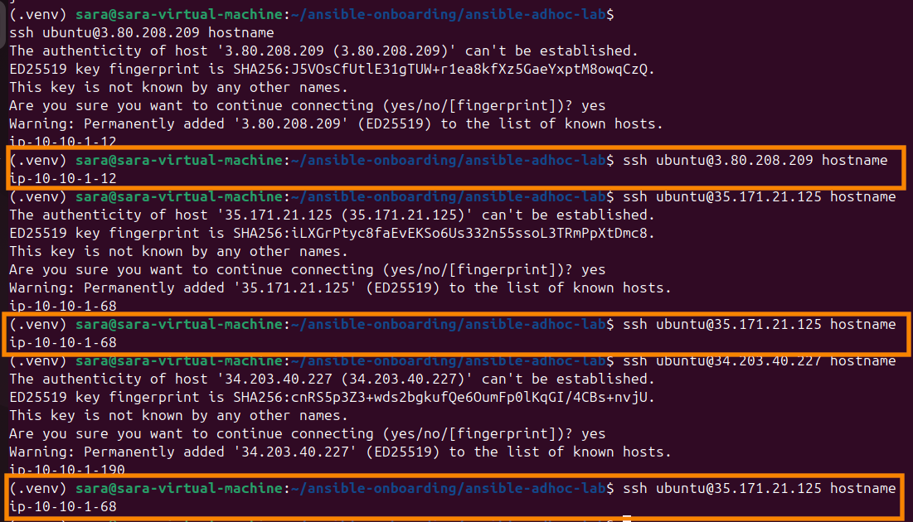>

---

### Notes

I verified SSH key-based access from the Ansible controller to all managed VMs. Each VM returned its hostname successfully, confirming that the controller could establish an SSH connection and execute a remote command.

The SSH private key was kept on the controller and was not exposed or committed to the Git repository. This confirms that the managed VMs are ready to be controlled remotely by Ansible.

---

# Task 5 — Create the Custom Ansible Inventory

## Goal

Create an Ansible inventory file that groups the managed VMs by role.

The inventory allows Ansible to run commands against all servers, or only specific groups such as `web`, `app`, or `db`.

### Evidence

#### Screenshot 10 — `inventory.ini` showing the `web`, `app`, and `db` groups

<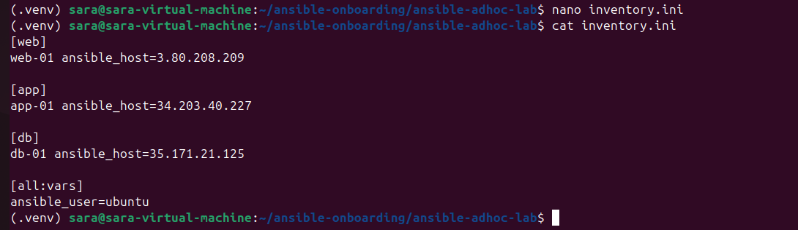>

---

#### Screenshot 11 — Output of `ansible-inventory -i inventory.ini --graph`

<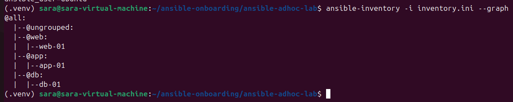>

---

### Notes

I created a custom Ansible inventory that groups the three managed VMs according to their roles: web, app, and db. Each host was assigned its corresponding public IP address and the ubuntu SSH user.

I used ansible-inventory --graph to verify that Ansible correctly recognized the inventory structure and the three server groups. I then tested Ansible connectivity using the ping module to confirm that the controller could communicate with the managed VMs.

---

# Task 6 — Run Ansible Ad-Hoc Commands

## Goal

Run Ansible ad-hoc commands from the controller to verify connectivity, check server information, and manage packages and services across inventory groups.

This task proves that the inventory is working and that Ansible can control multiple managed VMs without writing a playbook.

### Evidence

#### Screenshot 12 — Output of `ansible all -i inventory.ini -m ping`

<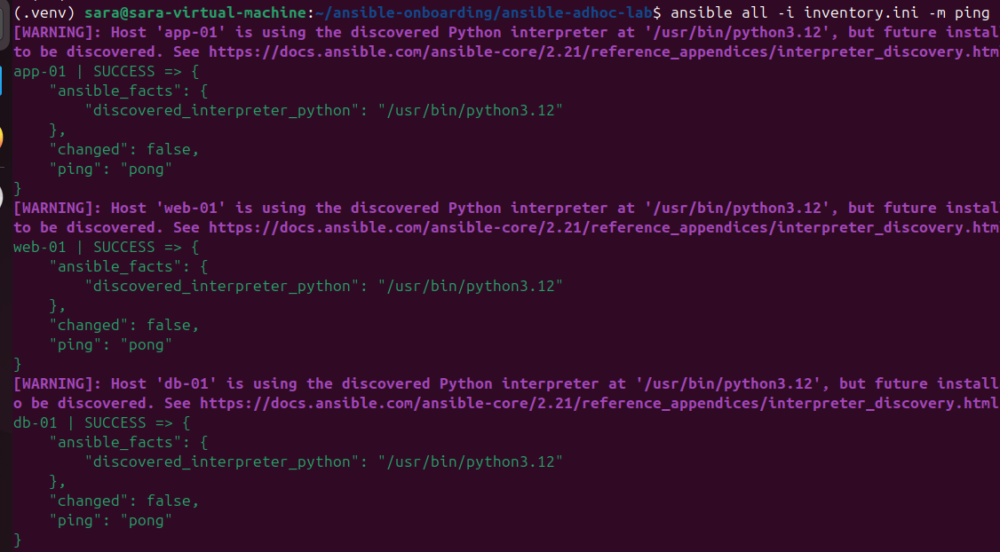>

---

#### Screenshot 13 — Output of `ansible all -i inventory.ini -m command -a "uptime"`

<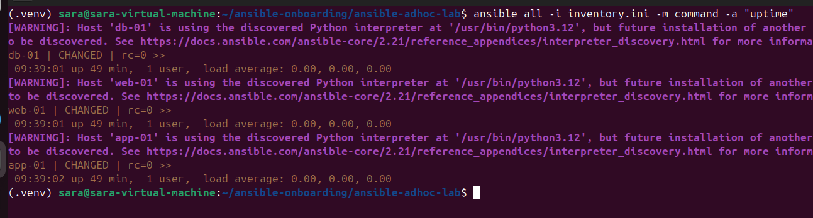>

---

#### Screenshot 14 — Output of `ansible web -i inventory.ini -m apt -a "name=nginx state=present update_cache=yes" --become`

<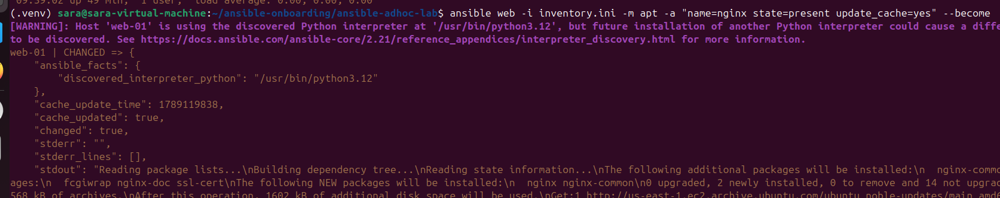>

---

#### Screenshot 15 — Output of `ansible web -i inventory.ini -m service -a "name=nginx state=started enabled=yes" --become`

<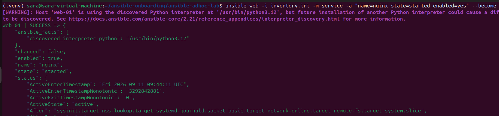>

---

#### Screenshot 16 — Output of `ansible all -i inventory.ini -m apt -a "name=htop state=present update_cache=yes" --become`

<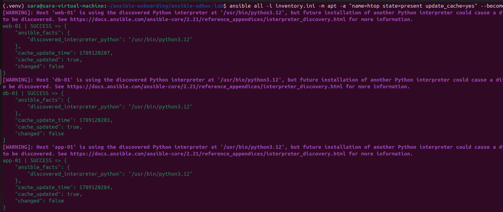>

---

#### Screenshot 17 — Output of `ansible web -i inventory.ini -m command -a "systemctl is-active nginx"`

<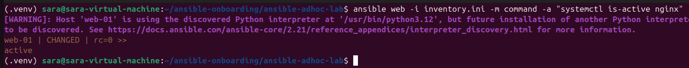>

---

### Notes

I used Ansible ad-hoc commands to manage the three VMs from the controller without creating a playbook. I first used the ping module to verify connectivity to all managed hosts and then used the command module to check their uptime.

I targeted the web group to install and start Nginx, ensuring that the service was also enabled to start automatically after a reboot. I then targeted the all group to install htop across the web, app, and database servers.

Finally, I verified that Nginx was running on the web server using systemctl is-active nginx, which returned active. This confirmed that the inventory, SSH authentication, Ansible modules, privilege escalation, package management, and service management were working correctly.

---

# LinkedIn Post Required

## Evidence

#### LinkedIn Post URL

Paste your LinkedIn post URL here:

https://www.linkedin.com/posts/sarah-w-amadi_dmibypravinmishra-devops-ansible-share-7504128770702790656-SPtY/

---

#### Screenshot — Published LinkedIn post

<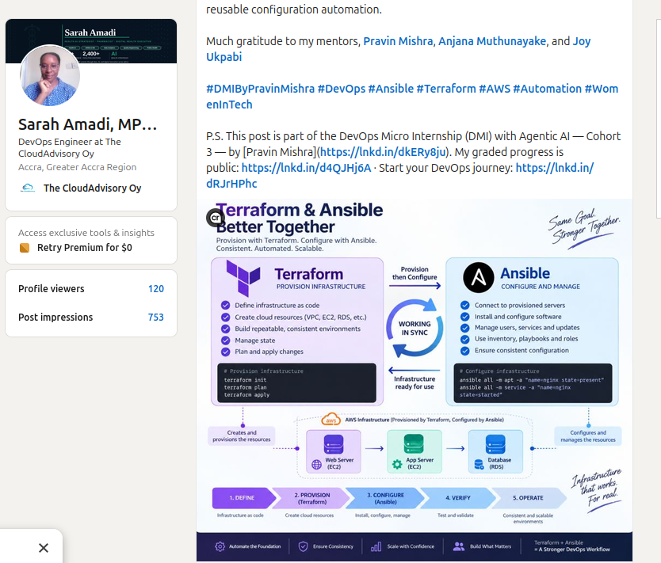>

---

# Assignment Questions

Answer the following in your own words:

**1. What is the purpose of an Ansible inventory file?**

       An Ansible inventory file tells Ansible which servers it needs to manage and how they are organized. In my setup, I grouped the servers into web, app, and db, making it easy to target either all servers or a specific group.

---

**2. What is the difference between the `web`, `app`, and `db` groups in your inventory?**

       The groups represent the different roles of my servers. The web group contains the web server running Nginx, the app group contains the application server, and the db group contains the database server. Grouping them by role allows me to apply tasks only where they are needed.

---

**3. What does the Ansible `ping` module verify?**

       The Ansible ping module verifies that Ansible can connect to the managed server and successfully execute a module. A pong response confirms that the connection and remote Python environment are working.

---

**4. Why do package installation commands require `--become`?**

       Package installation normally requires administrator privileges. --become allows Ansible to temporarily use elevated privileges, similar to using sudo, so it can install or modify system packages.

---

**5. When would you use an ad-hoc command instead of a playbook?**

       I would use an ad-hoc command for a quick, one-time task such as checking uptime, testing connectivity, installing a package, or checking a service. For repeatable tasks involving multiple steps, I would use a playbook because it is easier to maintain and reuse.

---

**6. What is one challenge you faced while setting up SSH or inventory, and how did you fix it?**

       One challenge I faced was initially connecting to the VMs because their SSH host fingerprints were not yet stored on the controller. I verified the servers and accepted their trusted ED25519 host fingerprints. After that, SSH connections worked successfully and I was able to use the same access through Ansible.

---

# Required Files

Confirm that the following files are included in your assignment workspace:

- [✅] `ansible-adhoc-lab/README.md`
- [✅] `ansible-adhoc-lab/terraform/providers.tf`
- [✅] `ansible-adhoc-lab/terraform/main.tf`
- [✅] `ansible-adhoc-lab/terraform/variables.tf`
- [✅] `ansible-adhoc-lab/terraform/outputs.tf`
- [✅] `ansible-adhoc-lab/ansible/inventory.ini`
- [✅] Updated `.gitignore`

---

# Submission Instructions

- Add all required screenshots from the tasks.
- Full Name must be visible in required screenshots.
- Mention whether you used Azure or AWS.
- Mention whether you used the three-VM option or four-VM option.
- Add the public IP addresses of the VMs, redacted if preferred.
- Add your `inventory.ini` proof.
- Add a short explanation of what you learned.
- Answer all assignment questions clearly in your own words.
- Add your LinkedIn post URL.
- Do not expose SSH private keys, Terraform state files, cloud credentials, passwords, access keys, secret keys, account IDs, or subscription IDs.
- Submit only one Google Doc link.

---

# Completion Checklist

- [✅] Task 1: `ansible-adhoc-lab` project structure created
- [✅] Task 1: `.gitignore` updated for Terraform files
- [✅] Task 2: Terraform configuration created
- [✅] Task 2: Server roles defined for either three or four VMs
- [✅] Task 2: `count` or `for_each` used
- [✅] Task 2: SSH restricted to the controller public IP
- [✅] Task 2: HTTP allowed only for web hosts
- [✅] Task 2: Terraform output maps roles to public IPs
- [✅] Task 3: Terraform initialized successfully
- [✅] Task 3: Terraform configuration validated
- [✅] Task 3: Terraform apply completed successfully
- [✅] Task 3: All selected VMs are running
- [✅] Task 4: SSH key-based access works for every VM
- [✅] Task 5: `inventory.ini` contains `web`, `app`, and `db` groups
- [✅] Task 5: `ansible-inventory -i inventory.ini --graph` shows the correct groups
- [✅] Task 6: `ansible all -i inventory.ini -m ping` returns `SUCCESS`
- [✅] Task 6: Ad-hoc commands run successfully
- [✅] Task 6: `--become` was used for package and service tasks
- [✅] Task 6: Nginx is active on the `web` group
- [✅] Screenshots 1–17 are included
- [✅] Assignment questions are answered
- [✅] LinkedIn post published
- [✅] LinkedIn post URL added
- [✅] No sensitive information is exposed
- [ ] Google Doc is accessible

---

## About DMI & CloudAdvisory

DevOps Micro Internship (DMI) is a project-based DevOps program run by Pravin Mishra and The CloudAdvisory, focused on real-world execution, systems thinking, and career readiness.

It helps learners build strong DevOps foundations with hands-on experience.

---

## Resources

- DMI Official Website: [https://dmi.pravinmishra.com?utm_source=github&utm_medium=readme](https://dmi.pravinmishra.com?utm_source=github&utm_medium=readme)
- University: [https://university.pravinmishra.com?utm_source=github&utm_medium=readme](https://university.pravinmishra.com?utm_source=github&utm_medium=readme)
- Discord Community: [https://discord.pravinmishra.com?utm_source=github&utm_medium=readme](https://discord.pravinmishra.com?utm_source=github&utm_medium=readme)
- Blog: [https://dmi.pravinmishra.com/blog?utm_source=github&utm_medium=readme](https://dmi.pravinmishra.com/blog?utm_source=github&utm_medium=readme)
- YouTube Playlist: [https://www.youtube.com/playlist?list=PLFeSNDtI4Cho](https://www.youtube.com/playlist?list=PLFeSNDtI4Cho)
- Pravin Mishra LinkedIn: [https://www.linkedin.com/in/pravin-mishra-aws-trainer/](https://www.linkedin.com/in/pravin-mishra-aws-trainer/)
- CloudAdvisory LinkedIn: [https://www.linkedin.com/company/thecloudadvisory/](https://www.linkedin.com/company/thecloudadvisory/)

---

*This submission is part of DevOps Micro Internship (DMI) Cohort 3 — Agentic AI Track.*