# Assignment 03 — Deploy a Static Website to Multiple Servers Using a Multi-Play Ansible Playbook

Part of the DevOps Micro Internship (DMI) Cohort 3 with Agentic AI

---

## Student Details

**Full Name:** Sarah Wambui Amadi 
**Cloud Platform Used:** AWS 
**Server 1 URL:**  http://3.80.208.209/
**Server 2 URL:** http://34.203.40.227/

---

## Purpose

In this assignment, I created a multi-play Ansible playbook to install Nginx, deploy a static website to two Ubuntu servers, and verified that the website is accessible from both servers.

I used  AWS EC2 instances Virtual Machines as my managed servers.

---

# Task 1 — Create the Project Structure

## Goal

Create the required folders and files for the Ansible project.

## Evidence

### Screenshot 1 — Terminal or VS Code showing the complete `static-web` project structure

<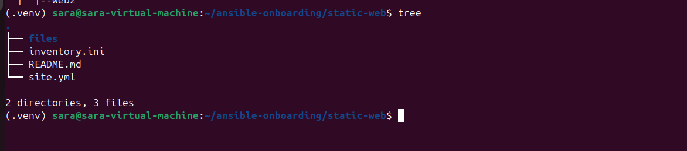>

---

# Task 2 — Configure the Ansible Inventory

## Goal

Add both Ubuntu servers to the Ansible inventory.

## Evidence

### Screenshot 2 — Output of `ansible-inventory -i inventory.ini --graph` showing `web1` and `web2`

<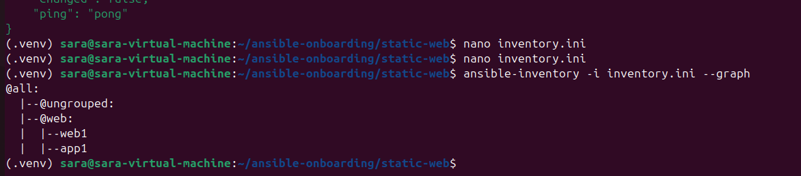>

---

## Configuration File

Copy and paste the complete contents of your `inventory.ini` file below:

```ini
[web]
web1 ansible_host=3.80.208.209
app1 ansible_host=34.203.40.227

[web:vars]
ansible_user=ubuntu

```

---

# Task 3 — Verify Ansible Connectivity

## Goal

Confirm that the Ansible controller can connect to both servers.

## Evidence

### Screenshot 3 — Ansible ping output showing `SUCCESS` and `pong` for both servers

<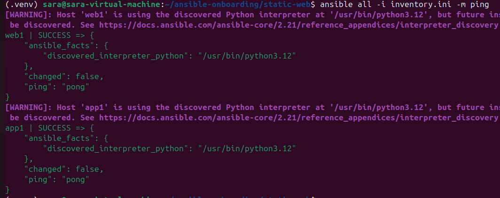>

---

# Task 4 — Download and Personalize the Static Website

## Goal

Download `index.html` to the Ansible controller and personalize the website with your full name.

## Evidence

### Screenshot 4 — Edited `files/index.html` showing the footer line with your full name

<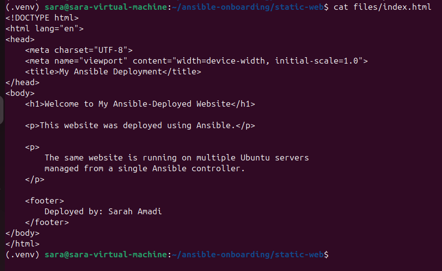>

---

# Task 5 — Create the Multi-Play Ansible Playbook

## Goal

Create a single Ansible playbook containing separate plays for installation, deployment, and verification.

## Configuration File

Copy and paste the complete contents of your `site.yml` file below:

```yaml
- name: Play 1 - Install and configure Nginx
  hosts: web
  become: true

  tasks:
    - name: Update apt cache and install Nginx
      ansible.builtin.apt:
        name: nginx
        state: present
        update_cache: true

    - name: Ensure Nginx is running and enabled
      ansible.builtin.service:
        name: nginx
        state: started
        enabled: true


- name: Play 2 - Deploy static website
  hosts: web
  become: true

  tasks:
    - name: Copy website to Nginx web root
      ansible.builtin.copy:
        src: files/index.html
        dest: /var/www/html/index.html
        owner: root
        group: root
        mode: '0644'


- name: Play 3 - Verify website
  hosts: localhost
  connection: local
  gather_facts: false

  vars:
    servers:
      - name: web1
        url: "http://3.80.208.209"
      - name: app1
        url: "http://34.203.40.227"

  tasks:
    - name: Check website HTTP status
      ansible.builtin.uri:
        url: "{{ item.url }}"
        method: GET
        status_code: 200
        return_content: false
      loop: "{{ servers }}"
      register: website_check

    - name: Display website verification results
      ansible.builtin.debug:
        msg: "{{ item.item.name }} returned HTTP {{ item.status }}"
      loop: "{{ website_check.results }}"

```

---

# Task 6 — Validate the Playbook Syntax

## Goal

Check the playbook for YAML or Ansible syntax errors before running it.

## Evidence

### Screenshot 5 — Successful syntax-check output showing `playbook: site.yml`

<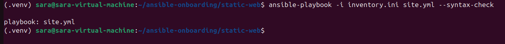>

---

# Task 7 — Run the Multi-Play Playbook

## Goal

Install Nginx, deploy the website, and verify both servers in one playbook run.

## Evidence

### Screenshot 6 — Play 3 verification showing HTTP `200` for both servers

<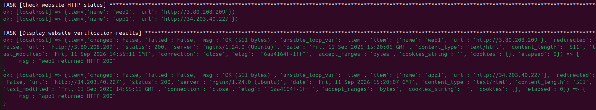>

---

### Screenshot 7 — Final play recap showing `unreachable=0` and `failed=0` for `web1`, `web2`, and `localhost`

<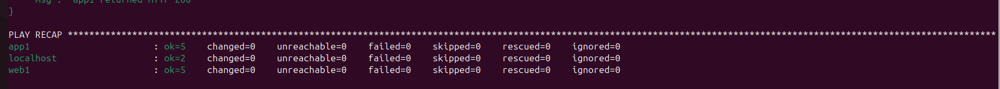>

---

# Task 8 — Verify Idempotency

## Goal

Run the playbook again and confirm that it does not make unnecessary changes.

## Evidence

### Screenshot 8 — Second playbook run showing the play recap with `changed=0`, `unreachable=0`, and `failed=0` for both web servers

<>

---

# Task 9 — Test Both Websites Manually

## Goal

Confirm that the static website is accessible from both public IP addresses.

## Evidence

### Screenshot 9 — `curl -I` output showing HTTP `200 OK` from both servers

<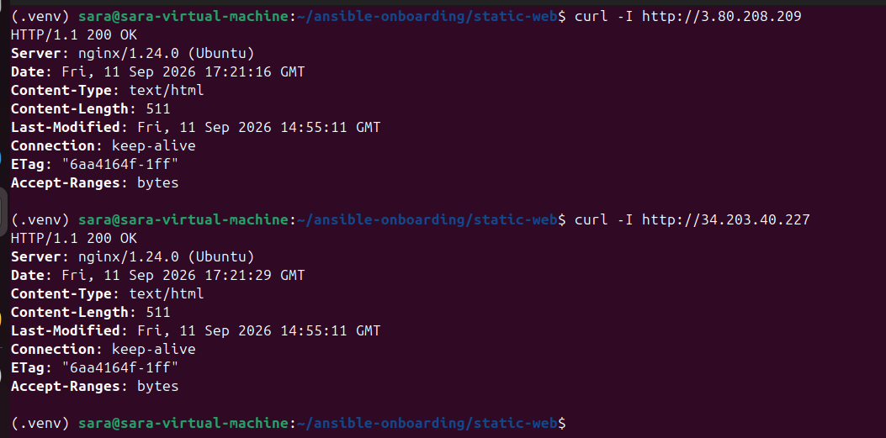>

---

### Screenshot 10 — Browser showing the website from Server 1 with the public IP and your full name visible

<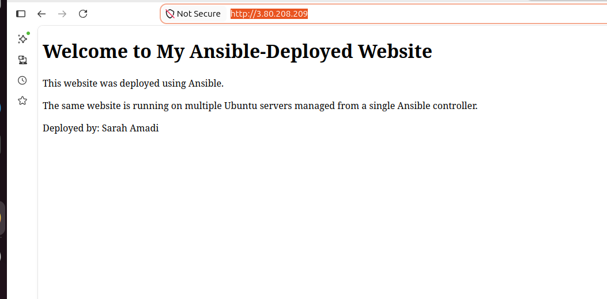>

---

### Screenshot 11 — Browser showing the website from Server 2 with the public IP and your full name visible

<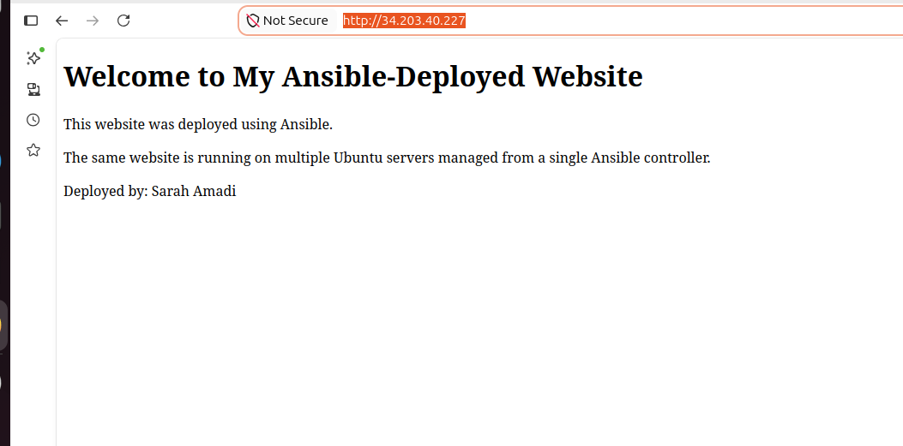>

---

## Website URLs

Add both deployed website URLs below:

```text
Server 1: http://3.80.208.209/
Server 2: http://34.203.40.227/
```

---

# Task 10 — Complete the Project README

## Goal

Document how the project works and record what you learned.

## README Content

Copy and paste the complete contents of your `README.md` file below:

```markdown
# Ansible Static Website Deployment

## Student Details

**Full Name:** Sarah Amadi

**Cloud Platform:** AWS

## Project Summary

This project demonstrates the deployment of a static website to multiple
Ubuntu servers using a multi-play Ansible playbook.

The playbook installs and configures Nginx, deploys a customized
index.html file, and verifies that both websites return HTTP 200.

## Architecture

Ansible Controller
        |
        | SSH
        |
   +----+----+
   |         |
 web1       web2
   |         |
 Nginx     Nginx
   |         |
index.html index.html

## Servers

| Server | Public IP | Role |
|--------|-----------|------|
| web1 | 3.80.208.209 | Web Server |
| app1 | 34.203.40.227 | Web Server |

## Project Structure

static-web/
├── files/
│   └── index.html
├── inventory.ini
├── site.yml
└── README.md

## How to Run

Activate the Ansible virtual environment:

    source ../.venv/bin/activate

Verify connectivity:

    ansible all -i inventory.ini -m ping

Validate the playbook:

    ansible-playbook -i inventory.ini site.yml --syntax-check

Run the playbook:

    ansible-playbook -i inventory.ini site.yml

## Verification

The playbook verifies both websites using the Ansible uri module.

Expected result:

    web1 returned HTTP 200
    app1 returned HTTP 200

## Idempotency

The playbook is designed to be idempotent. Running it again should not
make unnecessary changes when the desired state has already been achieved.

## What I Learned

This assignment helped me understand how Ansible can automate the
installation, configuration, deployment, and verification of services
across multiple servers from a single controller.

```

---

# LinkedIn Post Required

## Evidence

### LinkedIn Post URL

Paste your LinkedIn post URL here:

https://www.linkedin.com/posts/sarah-w-amadi_dmibypravinmishra-ansible-automation-share-7504248401031725056-Gn8Z/

---

### Screenshot — Published LinkedIn post

<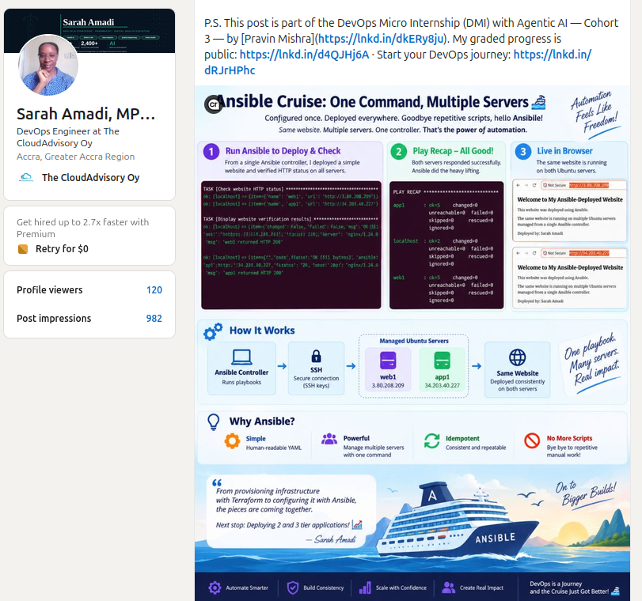>

---

# Assignment Questions

Answer the following in your own words:

**1. What issue did you face while completing this assignment, and how did you fix it?**

    One issue I encountered was ensuring that the Ansible controller could connect to both managed servers using SSH key authentication. I verified the server IP addresses, confirmed that the SSH key was loaded into the SSH agent, and tested direct SSH connectivity before running the Ansible commands.

---

**2. What did you learn from this assignment?**

    I learned how to use a multi-play Ansible playbook to manage multiple servers from a single controller. I also learned how to separate installation, deployment, and verification tasks and how Ansible can use modules such as apt, service, copy, and uri to automate different parts of the deployment process.

---

**3. Why is it useful to split installation, deployment, and verification into separate plays?**

    Separating the tasks makes the playbook easier to understand, troubleshoot, and maintain. Each play has a clear responsibility, so if something fails, I can quickly identify whether the problem is with the server setup, website deployment, or verification.

---

**4. What is one benefit of using the Ansible `copy` module instead of cloning the website directly from Git on every managed server?**

    The copy module allows the controller to distribute a known version of the website directly to the managed servers. This reduces the need to configure Git access on every server and keeps the deployment source under the control of the Ansible controller.

---

**5. What does idempotency mean in this assignment?**

    Idempotency means that I can run the same playbook multiple times and Ansible will only make changes when the actual server state does not match the desired state. When everything is already configured correctly, a second run should show changed=0 for the web servers.

---

**6. What does the Ansible `uri` module verify in Play 3?**

    The uri module sends an HTTP request to each deployed website and checks the response. In this assignment, it verifies that both servers are accessible over HTTP and return the expected 200 status code.

---

# Required Files

Confirm that the following files are included in your assignment folder:

- [✅] `inventory.ini`
- [✅] `site.yml`
- [✅] `files/index.html`
- [✅] `README.md`

---

# Submission Instructions

- Add all required screenshots in the correct order.
- Full Name must be visible in required screenshots.
- Include both deployed website URLs.
- Paste `inventory.ini`, `site.yml`, and `README.md` as editable text.
- Answer all assignment questions clearly in your own words.
- Add your LinkedIn post URL.
- Do not expose SSH private keys, passwords, cloud account IDs, or other sensitive information.

---

# Completion Checklist

- [✅] Task 1: `static-web` folder structure is complete
- [✅] Task 2: Both servers are listed under the `[web]` group in `inventory.ini`
- [✅] Task 2: Inventory graph shows `web1` and `web2`
- [✅] Task 3: Ansible ping returns `SUCCESS` and `pong` for both servers
- [✅] Task 4: `files/index.html` contains your full name
- [✅] Task 5: `site.yml` contains three separate plays
- [✅] Task 5: Play 1 installs, starts, and enables Nginx
- [✅] Task 5: Play 2 deploys `index.html` using the `copy` module
- [✅] Task 5: Nginx reload handler is included
- [✅] Task 5: Play 3 verifies both web servers from the controller
- [✅] Task 6: Playbook syntax check passes
- [✅] Task 7: First playbook run completes with `unreachable=0` and `failed=0`
- [✅] Task 7: URI verification returns HTTP `200` for both servers
- [✅] Task 8: Second playbook run demonstrates idempotency
- [✅] Task 8: Second run shows `changed=0` for both web servers
- [✅] Task 9: Both `curl -I` commands return HTTP `200 OK`
- [✅] Task 9: Website loads from Server 1
- [✅] Task 9: Website loads from Server 2
- [✅] Task 9: Full name is visible on both deployed websites
- [✅] Task 10: `README.md` contains all required explanations
- [✅] Screenshots 1–11 are included
- [✅] `inventory.ini`, `site.yml`, and `README.md` are pasted as editable text
- [✅] Both website URLs are included
- [✅] Assignment questions are answered
- [✅] LinkedIn post published
- [✅] LinkedIn post URL added
- [✅] No sensitive information is exposed

---

## About DMI & CloudAdvisory

DevOps Micro Internship (DMI) is a project-based DevOps program run by Pravin Mishra and The CloudAdvisory, focused on real-world execution, systems thinking, and career readiness.

It helps learners build strong DevOps foundations with hands-on experience.

---

## Resources

- DMI Official Website: [https://dmi.pravinmishra.com?utm_source=github&utm_medium=readme](https://dmi.pravinmishra.com?utm_source=github&utm_medium=readme)
- University: [https://university.pravinmishra.com?utm_source=github&utm_medium=readme](https://university.pravinmishra.com?utm_source=github&utm_medium=readme)
- Discord Community: [https://discord.pravinmishra.com?utm_source=github&utm_medium=readme](https://discord.pravinmishra.com?utm_source=github&utm_medium=readme)
- Blog: [https://dmi.pravinmishra.com/blog?utm_source=github&utm_medium=readme](https://dmi.pravinmishra.com/blog?utm_source=github&utm_medium=readme)
- YouTube Playlist: [https://www.youtube.com/playlist?list=PLFeSNDtI4Cho](https://www.youtube.com/playlist?list=PLFeSNDtI4Cho)
- Pravin Mishra LinkedIn: [https://www.linkedin.com/in/pravin-mishra-aws-trainer/](https://www.linkedin.com/in/pravin-mishra-aws-trainer/)
- CloudAdvisory LinkedIn: [https://www.linkedin.com/company/thecloudadvisory/](https://www.linkedin.com/company/thecloudadvisory/)

---

*This submission is part of DevOps Micro Internship (DMI) Cohort 3 — Agentic AI Track.*