# Assignment 04 — Deploy Mini Finance on Azure Using Terraform and Ansible

Part of the DevOps Micro Internship (DMI) Cohort 3 with Agentic AI

---

## Purpose

In this assignment, I provisioned Azure infrastructure using Terraform and deploy the Mini Finance website using an Ansible multi-play playbook.

Terraform will created the Azure Virtual Machine and networking resources. Ansible  installed Nginx, cloned the Mini Finance repository, deployed the website, and verified the deployment.

---

# Task 1 — Create the Project Structure

## Goal

Create separate directories and files for the Terraform infrastructure and Ansible configuration.

### Evidence

#### Screenshot 1 — Terminal or VS Code showing the complete `mini-finance` project structure

<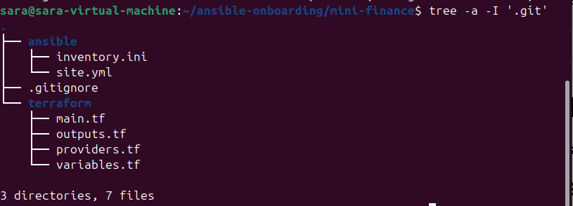>

---

### Notes

    I created the mini-finance project structure with separate directories for Terraform and Ansible configuration. I also created the required Terraform files, Ansible inventory and playbook files, and a .gitignore file to prevent sensitive and unnecessary files from being committed to version control
```
.gitignore/
# Terraform
.terraform/
*.tfstate
*.tfstate.*
crash.log
crash.*.log
*.tfvars
*.tfvars.json

# Terraform variable override files
override.tf
override.tf.json
*_override.tf
*_override.tf.json

# Sensitive credentials
*.pem
*.key
*.pfx
*.p12

# SSH
.ssh/
id_rsa
id_ed25519
id_rsa.pub
id_ed25519.pub

# Python
.venv/
venv/
__pycache__/
*.pyc

# Ansible
*.retry

# VS Code
.vscode/

# OS files
.DS_Store
Thumbs.db

```
---

# Task 2 — Create the Azure Infrastructure Using Terraform

## Goal

Use Terraform to provision an Ubuntu Virtual Machine with the required Azure networking and security resources.

### Evidence

#### Screenshot 2 — Terraform code showing the `Allow-SSH` rule for port `22` and the `Allow-HTTP` rule for port `80`

<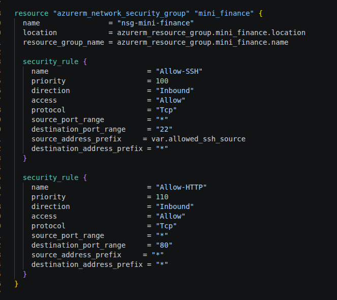>

---

#### Screenshot 3 — Terraform code showing the association between `nsg-mini-finance` and `nic-mini-finance`

<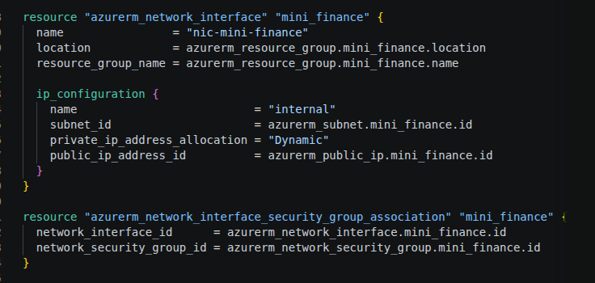>

---

### Notes

    I created the Terraform configuration required to provision the Mini Finance Azure infrastructure. The configuration defines the resource group, virtual network, subnet, public IP, network security group, network interface, and Ubuntu virtual machine. I configured separate inbound security rules for SSH on port 22 and HTTP on port 80. SSH access is restricted to my public IP address, while HTTP is open for public website access. I also associated the nsg-mini-finance network security group with the nic-mini-finance network interface.

---

# Task 3 — Initialize and Apply the Terraform Configuration

## Goal

Format and validate the Terraform configuration, review the execution plan, and provision the Azure infrastructure.

### Evidence

#### Screenshot 4 — End of the `terraform apply` output showing `Apply complete!` with no errors

<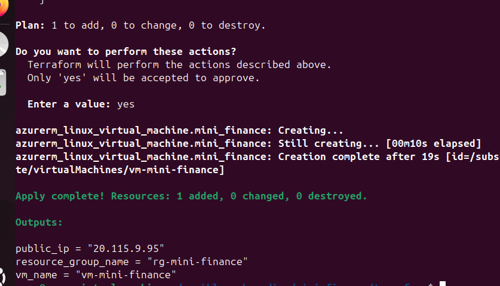>

---

#### Screenshot 5 — Output of `terraform output public_ip` showing the VM’s public IP address

<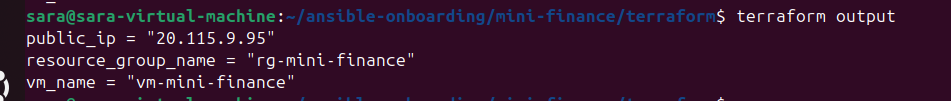>

---

### Notes

    Terraform successfully provisioned the Azure infrastructure and created the Mini Finance VM. The VM public IP was retrieved using terraform output public_ip.

---

# Task 4 — Verify Passwordless SSH Access

## Goal

Confirm that the Ansible controller can connect to the Terraform-provisioned Azure VM using SSH key authentication.

### Evidence

#### Screenshot 6 — Passwordless SSH command and the returned `mini-finance` hostname

<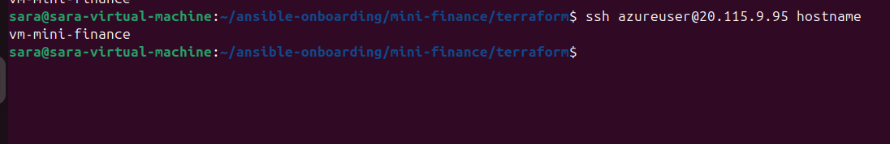>

---

### Notes

    Ansible controller can connect to the Azure VM using passwordless SSH key authentication. and the hostname minifinance was returned.

---

# Task 5 — Create the Ansible Inventory and Verify Connectivity

## Goal

Add the Terraform-provisioned Azure VM to the Ansible inventory and confirm that Ansible can connect to it.

### Evidence

#### Screenshot 7 — Ansible ping output showing `SUCCESS` and `pong` from the Azure VM

<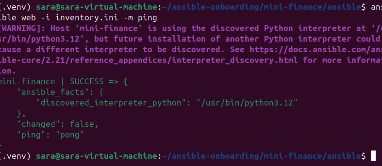>

---

### Configuration File

Copy and paste the complete contents of your `ansible/inventory.ini` file below:

```ini
inventory.ini 
[web]
mini-finance ansible_host=20.115.9.95

[web:vars]
ansible_user=azureuser
ansible_ssh_private_key_file=/home/sara/.ssh/id_ed25519

```

---

# Task 6 — Create the Multi-Play Ansible Playbook

## Goal

Create one Ansible playbook containing separate plays to install Nginx, deploy the Mini Finance website, and verify the deployment.

### Evidence

#### Screenshot 8 — `site.yml` showing Play 1 and the beginning of Play 2

Screenshot must show:

- Play 1 targeting the `web` group
- Installation of `nginx`, `git`, and `rsync`
- Nginx service configured as started and enabled
- Beginning of Play 2 with the Git repository URL and synchronization task

<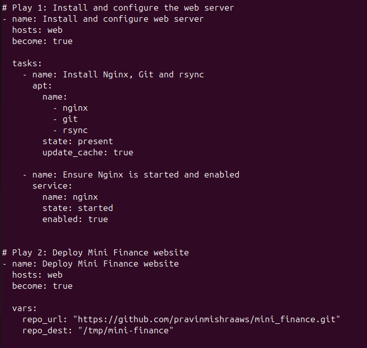>
<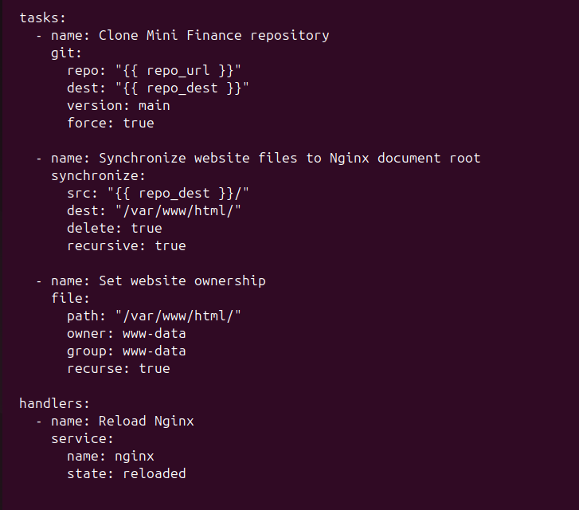>

---

#### Screenshot 9 — `site.yml` showing the deployment destination, handler, and Play 3 verification

Screenshot must show:

- Website destination `/var/www/html/`
- Ownership set to `www-data:www-data`
- Nginx reload handler
- Play 3 targeting `localhost`
- The `uri` verification and `assert` condition

<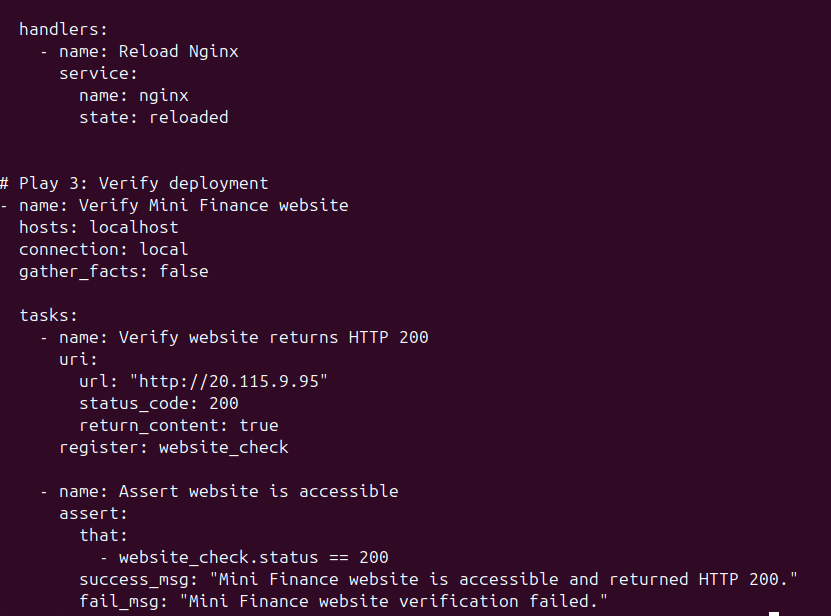>

---

### Configuration File

Copy and paste the complete contents of your `ansible/site.yml` file below:

```yaml
# Play 1: Install and configure the web server
- name: Install and configure web server
  hosts: web
  become: true

  tasks:
    - name: Install Nginx, Git and rsync
      apt:
        name:
          - nginx
          - git
          - rsync
        state: present
        update_cache: true

    - name: Ensure Nginx is started and enabled
      service:
        name: nginx
        state: started
        enabled: true


# Play 2: Deploy Mini Finance website
- name: Deploy Mini Finance website
  hosts: web
  become: true

  vars:
    repo_url: "https://github.com/pravinmishraaws/mini_finance.git"
    repo_dest: "{{ playbook_dir }}/mini-finance-repo"

  tasks:
    - name: Clone Mini Finance repository
      git:
        repo: "{{ repo_url }}"
        dest: "{{ repo_dest }}"
        version: main
        force: true

    - name: Synchronize website files to Nginx document root
      synchronize:
        src: "{{ repo_dest }}/"
        dest: "/var/www/html/"
        delete: true
        recursive: true

    - name: Set website ownership
      file:
        path: "/var/www/html/"
        owner: www-data
        group: www-data
        recurse: true

  handlers:
    - name: Reload Nginx
      service:
        name: nginx
        state: reloaded


# Play 3: Verify deployment
- name: Verify Mini Finance website
  hosts: localhost
  connection: local
  gather_facts: false

  tasks:
    - name: Verify website returns HTTP 200
      uri:
        url: "http://20.115.9.95"
        status_code: 200
        return_content: true
      register: website_check

    - name: Assert website is accessible
      assert:
        that:
          - website_check.status == 200
        success_msg: "Mini Finance website is accessible and returned HTTP 200."
        fail_msg: "Mini Finance website verification failed."

```

---

# Task 7 — Validate and Run the Ansible Playbook

## Goal

Validate the syntax of the multi-play Ansible playbook and run it to install Nginx, deploy the Mini Finance website, and verify the deployment.

### Evidence

#### Screenshot 10 — Successful playbook syntax check showing `playbook: site.yml`

<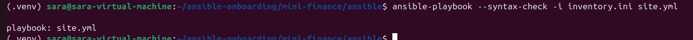>

---

#### Screenshot 11 — Play 3 output showing the successful HTTP verification and assertion

<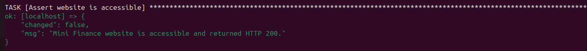>

---

#### Screenshot 12 — Final `PLAY RECAP` showing `failed=0` and `unreachable=0`

<>

---

### Notes

    The Ansible playbook was validated successfully using the syntax check. The playbook was then executed against the Azure VM to install Nginx, Git and rsync, deploy the Mini Finance website, and verify that the website was accessible. The final verification confirmed an HTTP 200 response, and the Ansible play recap showed no unreachable hosts and no failed tasks.

---

# Task 8 — Test the Mini Finance Website in a Browser

## Goal

Confirm that the Mini Finance website is publicly accessible through the Azure VM’s public IP address.

### Evidence

#### Screenshot 13 — Mini Finance website successfully loading in the browser, with the Azure VM’s public IP address visible in the address bar

<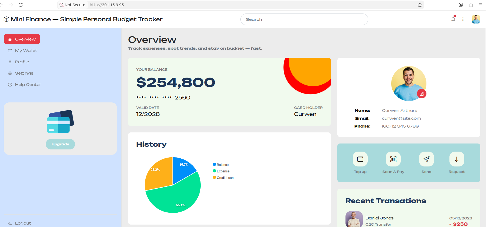>

---

### Website URL

Add your deployed website URL below:

```text
http://20.115.9.95/
```

---

# Task 9 — Create the Project README

## Goal

Create a `README.md` file to document the Mini Finance infrastructure and deployment project.

### Evidence

#### Screenshot 14 — Completed `README.md` displayed in the VS Code Markdown preview or terminal

<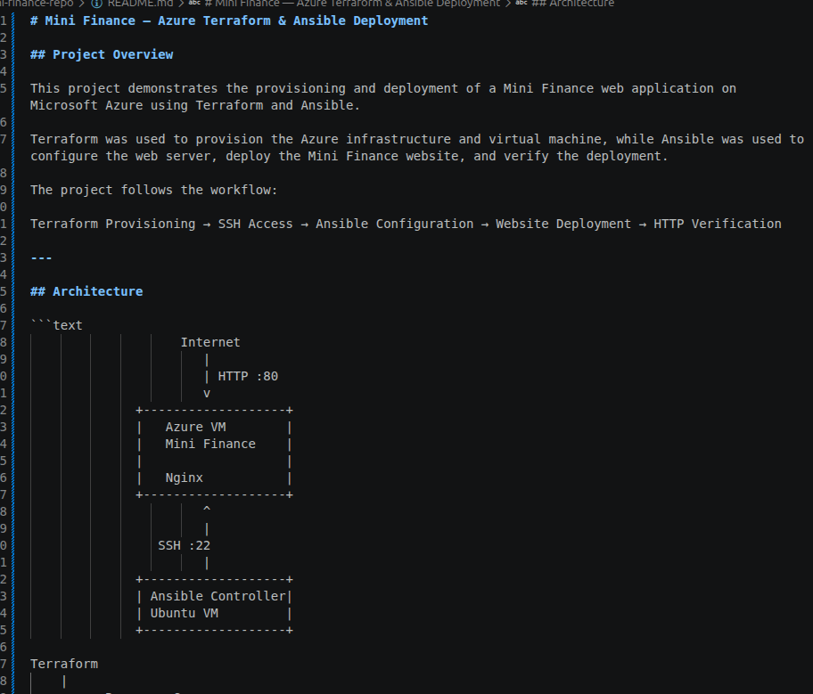>

---

### README Content

Copy and paste the complete contents of your `README.md` file below:

```markdown
# Mini Finance — Azure Terraform & Ansible Deployment

## Project Overview

This project demonstrates the provisioning and deployment of a Mini Finance web application on Microsoft Azure using Terraform and Ansible.

Terraform was used to provision the Azure infrastructure and virtual machine, while Ansible was used to configure the web server, deploy the Mini Finance website, and verify the deployment.

The project follows the workflow:

Terraform Provisioning → SSH Access → Ansible Configuration → Website Deployment → HTTP Verification

---

## Architecture

```text
                    Internet
                       |
                       | HTTP :80
                       v
              +-------------------+
              |   Azure VM        |
              |   Mini Finance    |
              |                   |
              |   Nginx           |
              +-------------------+
                       ^
                       |
                 SSH :22
                       |
              +-------------------+
              | Ansible Controller|
              | Ubuntu VM         |
              +-------------------+

Terraform
    |
    +---- Resource Group
    +---- Virtual Network
    +---- Subnet
    +---- Public IP
    +---- Network Security Group
    +---- Network Interface
    +---- Linux Virtual Machine
```

---

# LinkedIn Post Required

## Evidence

#### Screenshot 15 — Published LinkedIn post showing the text and at least one deployment screenshot

<>

---

#### LinkedIn Post URL

Paste your LinkedIn post URL here:

https://www.linkedin.com/posts/sarah-w-amadi_dmibypravinmishra-ansible-automation-share-7504248401031725056-Gn8Z/

---

### LinkedIn Submission Notes

**One challenge you faced and how you fixed it:**

    Several Azure VM deployment issues were encountered during the project.

    The initial VM size was unavailable in the selected Azure region because of capacity restrictions.

    Another VM size could not boot the selected Ubuntu image because of Hypervisor Generation compatibility.

    A further VM size was rejected because the subscription had zero quota for that VM family in East US.

    The final working configuration used:

    Standard_D2als_v7

    The Ansible deployment also encountered an rsync source-directory issue. The deployment was corrected so that the repository is available on the Ansible controller before the website files are synchronized to the Azure VM.

    These issues demonstrated the importance of checking Azure VM availability, quota, image compatibility and deployment paths instead of assuming that every documented VM size is available for every subscription and region.

---

**One real-world example where you can use this learning:**

    This learning can be applied to deploying web applications in real-world environments where infrastructure and application configuration need to be automated separately. Terraform can provision the cloud infrastructure, while Ansible can consistently configure servers and deploy applications across development, testing and production environments.

---

# Assignment Questions

Answer the following in your own words:

**1. What did you provision using Terraform in this assignment?**

    I used Terraform to provision the Azure infrastructure for the Mini Finance application. This included the resource group, virtual network, subnet, public IP, network security group, network interface, NSG association, and Linux virtual machine.

---

**2. What did Ansible configure and deploy in this assignment?**

    Ansible configured the Azure VM by installing Nginx, Git and rsync. It then deployed the Mini Finance website files to /var/www/html/, configured the website ownership and reloaded Nginx.

---

**3. Why is SSH access on port `22` restricted to your public IP address?**

    SSH provides administrative access to the server, so leaving port 22 open to everyone would unnecessarily expose the VM. Restricting it to my public IP reduces the number of sources that can attempt to connect to the server.

---

**4. Why is HTTP port `80` open to the internet?**

    Port 80 is open because the Mini Finance website needs to be accessible through a web browser. Users connecting to the application's public IP need HTTP access to reach the Nginx web server.

---

**5. What is the purpose of the Ansible inventory file?**

    The Ansible inventory tells Ansible which servers it needs to manage and provides connection information such as the server IP address, SSH username and SSH key. In this project, it identifies the Azure VM as part of the web group.

---

**6. Why does the playbook use separate plays for install, deploy, and verify?**

    Separating the tasks makes the automation easier to understand and manage. The first play prepares the server, the second deploys the application, and the third verifies that the deployment is working. It also makes it easier to identify where a problem occurs.

---

**7. Why is `rsync` useful when deploying website files?**

    rsync efficiently transfers files between systems by synchronizing the source and destination. Instead of unnecessarily transferring every file each time, it can transfer only files that have changed, making repeated deployments faster.

---

**8. What does the Ansible `uri` module verify in this assignment?**

    The uri module sends an HTTP request to the deployed website and checks the response. In this assignment, it verifies that the Mini Finance website returns HTTP status code 200, confirming that the application is accessible.

---

**9. What issue did you face during this assignment, and how did you fix it?**

    I encountered several Azure VM deployment issues involving VM capacity, VM generation compatibility and quota restrictions. I also encountered an Ansible rsync source-directory problem. I resolved the Azure issues by selecting a compatible VM size with available quota, and corrected the Ansible deployment path so that the repository files could be synchronized correctly to the Nginx document root.

---

**10. What did you learn from using Terraform and Ansible together?**

    I learned that Terraform and Ansible solve different parts of the deployment process. Terraform is useful for creating and managing the infrastructure, while Ansible configures the server and deploys the application. Using them together creates a more repeatable workflow from infrastructure provisioning to application deployment and verification.

---

# Required Files

Confirm that the following files are included in your assignment folder:

- [✅] `.gitignore`
- [✅] `README.md`
- [✅] `terraform/providers.tf`
- [✅] `terraform/main.tf`
- [✅] `terraform/variables.tf`
- [✅] `terraform/outputs.tf`
- [✅] `ansible/inventory.ini`
- [✅] `ansible/site.yml`

---

# Submission Instructions

- Add all required screenshots in the correct order.
- Full Name must be visible in required screenshots.
- Add the Azure VM public IP address.
- Add the final Mini Finance website URL.
- Paste `inventory.ini`, `site.yml`, and `README.md` as editable text.
- Answer all assignment questions clearly in your own words.
- Add your LinkedIn post URL.
- Do not expose SSH private keys, passwords, Azure credentials, subscription IDs, Terraform state contents, or other sensitive information.
- Submit only one Google Doc link.
- Ensure that anyone with the link can view the document.
- Test the Google Doc link in an incognito or private browser window before submitting.

---

# Completion Checklist

- [✅] Task 1: `mini-finance` project structure created
- [✅] Task 1: `.gitignore` created
- [✅] Task 2: Terraform Azure infrastructure code created
- [✅] Task 2: `Allow-SSH` rule configured for port `22`
- [✅] Task 2: `Allow-HTTP` rule configured for port `80`
- [✅] Task 2: NSG associated with the Network Interface
- [✅] Task 3: `terraform fmt` completed
- [✅] Task 3: `terraform init` completed
- [✅] Task 3: `terraform validate` completed successfully
- [✅] Task 3: `terraform apply` completed successfully
- [✅] Task 3: `terraform output public_ip` displayed the VM public IP
- [✅] Task 4: Passwordless SSH works from the Ansible controller
- [✅] Task 5: `inventory.ini` created
- [✅] Task 5: Ansible ping returns `SUCCESS` and `pong`
- [✅] Task 6: `site.yml` contains three separate plays
- [✅] Task 6: Play 1 installs Nginx, Git, and rsync
- [✅] Task 6: Play 2 clones and deploys the Mini Finance website
- [✅] Task 6: Play 3 verifies HTTP status code `200`
- [✅] Task 7: Playbook syntax check passes
- [✅] Task 7: Ansible playbook completes successfully
- [✅] Task 7: Final recap shows `failed=0` and `unreachable=0`
- [✅] Task 8: Mini Finance website loads in the browser
- [✅] Task 8: Azure VM public IP is visible in the browser screenshot
- [✅] Task 9: `README.md` completed
- [✅] Screenshots 1–15 are included
- [✅] `inventory.ini`, `site.yml`, and `README.md` are pasted as editable text
- [✅] Assignment questions are answered
- [✅] LinkedIn post published with Anyone visibility
- [✅] LinkedIn post URL added
- [✅] No sensitive information is exposed
- [ ] Google Doc is accessible

---

## About DMI & CloudAdvisory

DevOps Micro Internship (DMI) is a project-based DevOps program run by Pravin Mishra and The CloudAdvisory, focused on real-world execution, systems thinking, and career readiness.

It helps learners build strong DevOps foundations with hands-on experience.

---

## Resources

- DMI Official Website: [https://dmi.pravinmishra.com?utm_source=github&utm_medium=readme](https://dmi.pravinmishra.com?utm_source=github&utm_medium=readme)
- University: [https://university.pravinmishra.com?utm_source=github&utm_medium=readme](https://university.pravinmishra.com?utm_source=github&utm_medium=readme)
- Discord Community: [https://discord.pravinmishra.com?utm_source=github&utm_medium=readme](https://discord.pravinmishra.com?utm_source=github&utm_medium=readme)
- Blog: [https://dmi.pravinmishra.com/blog?utm_source=github&utm_medium=readme](https://dmi.pravinmishra.com/blog?utm_source=github&utm_medium=readme)
- YouTube Playlist: [https://www.youtube.com/playlist?list=PLFeSNDtI4Cho](https://www.youtube.com/playlist?list=PLFeSNDtI4Cho)
- Pravin Mishra LinkedIn: [https://www.linkedin.com/in/pravin-mishra-aws-trainer/](https://www.linkedin.com/in/pravin-mishra-aws-trainer/)
- CloudAdvisory LinkedIn: [https://www.linkedin.com/company/thecloudadvisory/](https://www.linkedin.com/company/thecloudadvisory/)

---

*This submission is part of DevOps Micro Internship (DMI) Cohort 3 — Agentic AI Track.*