# Assignment — Deploy EpicBook with Terraform and Ansible Roles

Part of the DevOps Micro Internship (DMI) with Agentic AI

---

## Purpose

In this assignment, I deployed the EpicBook web application using Terraform and Ansible roles.

Terraform provisions the cloud infrastructure, including one Ubuntu VM and one managed MySQL database. Ansible roles configure the VM, install required software, deploy the EpicBook application, configure Nginx, connect the app to the managed MySQL database, and verify the deployment.

---

# Task 1 — Set Up the Project Folder Layout

## Goal

Create the project folder structure for Terraform and Ansible roles.

Terraform will be used to provision the cloud infrastructure. Ansible roles will be used to configure the VM and deploy the EpicBook application.

### Evidence

#### Screenshot 1 — Terminal showing the completed `epicbook-prod` project structure

<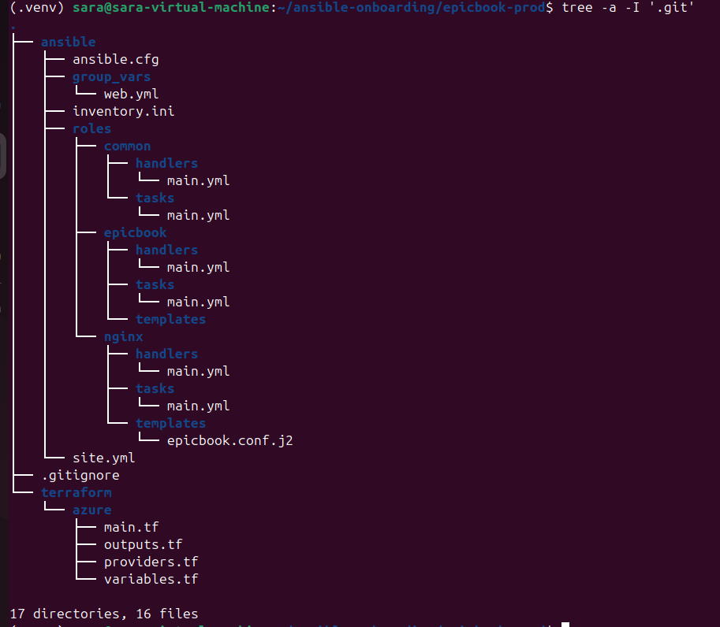>

---

### Notes

Answer the following in your own words:

**1. Which cloud provider did you choose for this assignment?**

    I chose Microsoft Azure as the cloud provider for this assignment. I used Azure to provision the Ubuntu virtual machine and the managed MySQL database with Terraform.

---

**2. Why is it useful to keep Terraform files and Ansible files in separate folders?**

    It keeps the project organized and easier to manage. Terraform is responsible for creating the infrastructure, while Ansible is responsible for configuring the server and deploying the application. Separating them makes it easier to understand, troubleshoot, and reuse each part independently.

---

**3. What is the purpose of the `roles` directory in Ansible?**

    The roles directory contains reusable Ansible roles that organize deployment tasks by responsibility. In this project, the roles are common, nginx, and epicbook. Each role handles a specific part of preparing the server and deploying the application, making the playbook cleaner and easier to maintain.

---

# Task 2 — Provision the Infrastructure with Terraform

## Goal

Run Terraform to provision the cloud infrastructure for the EpicBook deployment.

Terraform will create the VM, managed MySQL database, networking, security rules, and required outputs.

### Evidence

#### Screenshot 2 — `terraform apply` completed successfully

<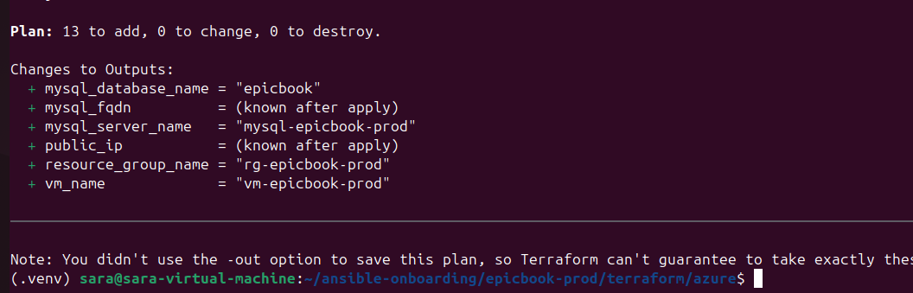>

---

#### Screenshot 3 — Output of `terraform output`

<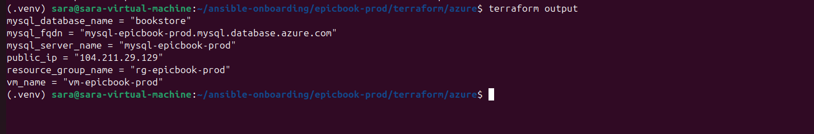>

---

#### Screenshot 4 — Azure Portal or AWS Console showing the VM running

<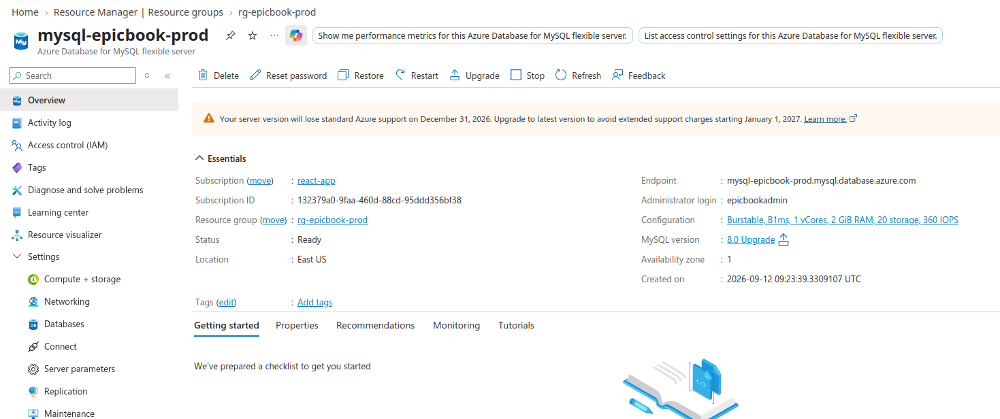>

---

#### Screenshot 5 — Azure Portal or AWS Console showing the managed MySQL database created

<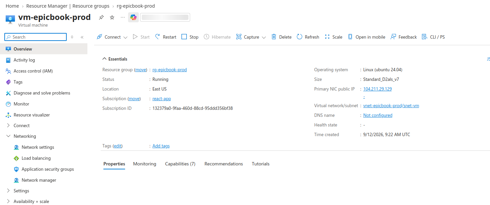>

---

### Notes

Answer the following in your own words:

**1. What resources did Terraform create for this assignment?**

    Terraform created the Azure infrastructure required for the EpicBook deployment. This included a resource group, virtual network, VM and MySQL subnets, private DNS zone, network security group, public IP address, network interface, Ubuntu virtual machine, managed MySQL Flexible Server, and the EpicBook database.

---

**2. Why should you review `terraform plan` before running `terraform apply`?**

    terraform plan shows what Terraform intends to create, change, or delete before making any changes to Azure. Reviewing it helps confirm that the configuration is correct, prevents unexpected resources from being created or destroyed, and allows errors to be identified before deployment.

---

**3. Why should database passwords not be shown in Terraform output?**

    Database passwords are sensitive credentials. Showing them in Terraform output could expose them to other people or accidentally place them in screenshots, logs, or documentation. Keeping them hidden reduces the risk of unauthorized access to the database.

---

# Task 3 — Verify SSH Key-Based Access

## Goal

Verify that the cloud VM can be accessed from the Ansible controller using SSH key-based authentication.

### Evidence

#### Screenshot 6 — Successful SSH hostname check from the Ansible controller

<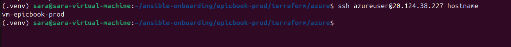>

---

### Notes

Answer the following in your own words:

**1. What command did you use to verify SSH access?**

I used the command `ssh azureuser@<PUBLIC_IP> hostname` to connect to the Azure VM using SSH key-based authentication and display the VM hostname.

---

**2. What proves that SSH key-based access worked successfully?**

    The connection succeeded without requesting a VM password, and the command returned the hostname of the EpicBook VM. This confirmed that the SSH public key configured during VM creation matched the private key on my Ansible controller.

---

**3. What would you check if SSH returned `Permission denied (publickey)`?**

    I would check that I am using the correct username, public IP address, and SSH private key. I would also verify that the corresponding public key was correctly installed on the VM and that the private key has the correct file permissions.

---

# Task 4 — Create the Ansible Inventory and Configuration

## Goal

Create the Ansible inventory file and local Ansible configuration for the EpicBook VM.

The inventory tells Ansible which VM to manage and which SSH user to use.

### Evidence

#### Screenshot 7 — `inventory.ini` showing the VM under the `web` group

<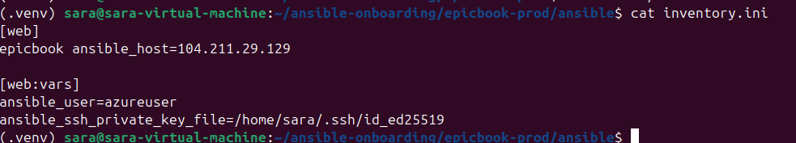>

---

#### Screenshot 8 — Output of `ansible-inventory -i inventory.ini --graph`

<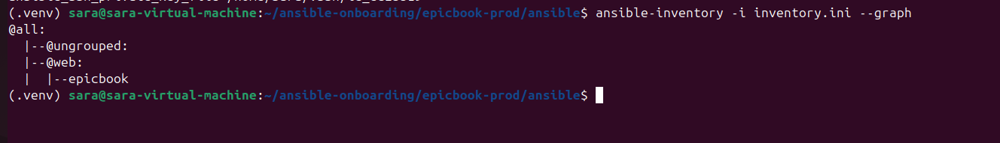>

---

#### Screenshot 9 — Output of `ansible web -i inventory.ini -m ping`

<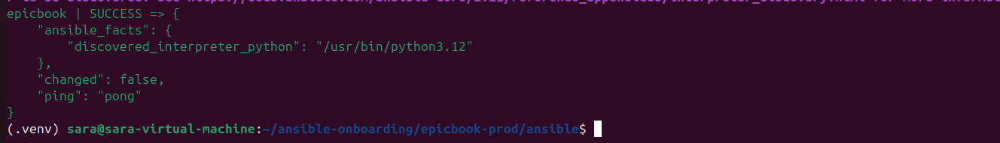>

---

### Notes

Answer the following in your own words:

**1. What is the purpose of `inventory.ini`?**

    inventory.ini tells Ansible which servers it needs to manage. It groups the EpicBook VM under the web group and defines the connection details required to access it.

---

**2. What does `ansible_host` store?**

    ansible_host stores the actual IP address or hostname that Ansible uses to connect to the managed server.

---

**3. What does `ansible_ssh_private_key_file` tell Ansible?**

    ansible_ssh_private_key_file tells Ansible which SSH private key to use when connecting to the VM.

    
---

**4. Why is `host_key_checking = False` used only for this temporary lab?**

    It avoids SSH host-key confirmation prompts during the temporary lab. In a production environment, host-key checking should normally remain enabled because it provides an additional check that Ansible is connecting to the expected server.

---

# Task 5 — Create the Main Ansible Playbook

## Goal

Create the main Ansible playbook that runs the required roles in the correct order.

The `site.yml` file will call the `common`, `nginx`, and `epicbook` roles.

### Evidence

#### Screenshot 10 — `site.yml` showing the roles in the correct order

<>

---

#### Screenshot 11 — Output of `ansible-playbook -i inventory.ini site.yml --syntax-check`

<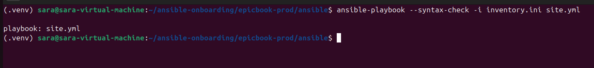>

---

### Notes

Answer the following in your own words:

**1. What is the purpose of `site.yml`?**

    site.yml is the main Ansible playbook that orchestrates the EpicBook deployment. It defines the target hosts, enables privilege escalation, and calls the required roles in the correct order.

---

**2. Why should the roles run in the order `common`, `nginx`, and `epicbook`?**

    The roles run in order because each stage prepares the server for the next one. The common role installs the basic packages, nginx configures the web server and reverse proxy, and epicbook deploys and runs the application.

---

**3. What does `become: true` allow Ansible to do?**

    become: true allows Ansible to execute tasks with elevated privileges, normally through sudo. This is required for operations such as installing packages, creating system configuration files, and managing services.

---

# Task 6 — Create the `common` Role

## Goal

Create the `common` role to prepare the Ubuntu VM with the basic packages required for the EpicBook deployment.

This role handles the common server setup before Nginx and the application are configured.

### Evidence

#### Screenshot 12 — `roles/common/tasks/main.yml` showing the common setup tasks

<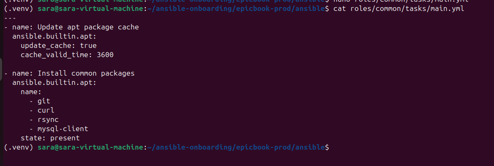>

---

### Notes

Answer the following in your own words:

**1. What is the responsibility of the `common` role?**

    The common role prepares the Ubuntu VM with basic packages and common system requirements needed for the EpicBook deployment. It provides the foundation for the other roles.

---

**2. Why should Nginx installation not be placed inside the `common` role?**

    Nginx should have its own role because it is responsible for the web server and reverse proxy configuration. Keeping it separate follows the principle of giving each role a clear responsibility and makes the configuration easier to maintain and reuse.

---

**3. Why is `mysql-client` useful in this deployment?**

    mysql-client provides command-line tools that can be used to test connectivity to the managed MySQL database and troubleshoot database connection problems from the EpicBook VM.

---

# Task 7 — Create the `nginx` Role

## Goal

Create the `nginx` role to install Nginx and configure it as a reverse proxy for the EpicBook application.

Nginx will receive browser traffic on port `80` and forward it to the EpicBook Node.js application running on the VM.

### Evidence

#### Screenshot 13 — `roles/nginx/tasks/main.yml` showing Nginx installation and site configuration tasks

<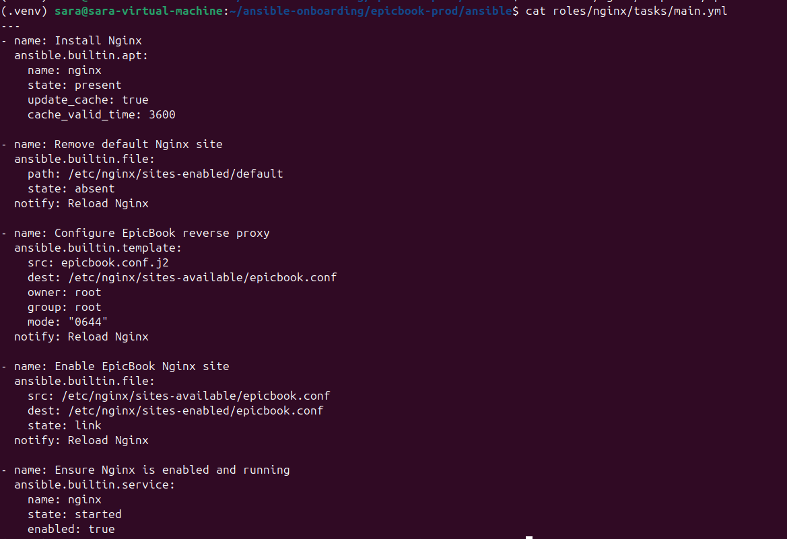>

---

#### Screenshot 14 — `roles/nginx/templates/epicbook.conf.j2` showing the reverse proxy configuration

<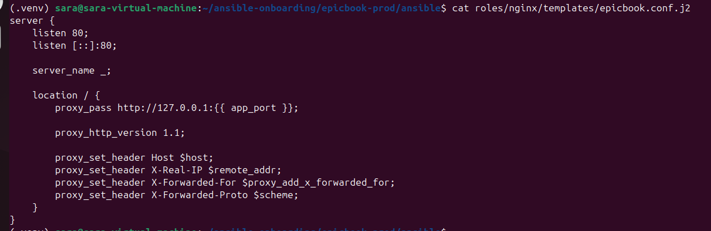>

---

### Notes

Answer the following in your own words:

**1. What is the responsibility of the `nginx` role?**

    The nginx role installs and configures Nginx as the web server and reverse proxy for the EpicBook application. It also ensures that Nginx is enabled and running.

---

**2. Why is Nginx configured as a reverse proxy in this deployment?**

    A reverse proxy is a server that receives requests from users and forwards them to an application running on another port or service. In this deployment, Nginx receives requests on port 80 and forwards them to the EpicBook Node.js application on port 8080.

---

**3. Why should the application port come from `group_vars/web.yml` instead of being hard-coded?**

    Using a variable makes the Ansible role reusable and easier to maintain. If the application's port changes, the value can be updated in group_vars/web.yml without modifying the Nginx role or template.

---

# Task 8 — Create the `epicbook` Role

## Goal

Create the `epicbook` role to deploy the EpicBook application, connect it to the managed MySQL database, and run the application on port `8080` using PM2.

### Evidence

#### Screenshot 15 — `roles/epicbook/tasks/main.yml` showing application deployment tasks

<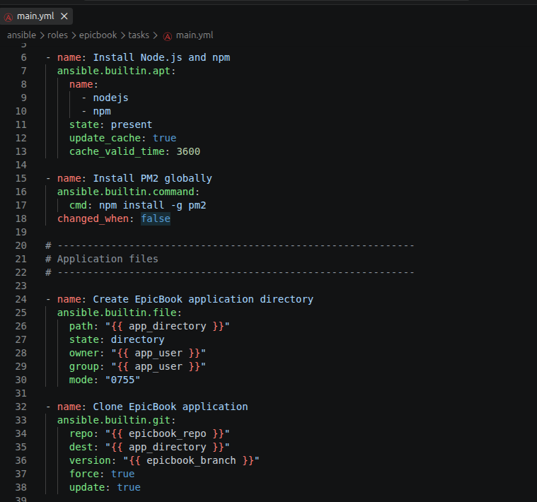>
<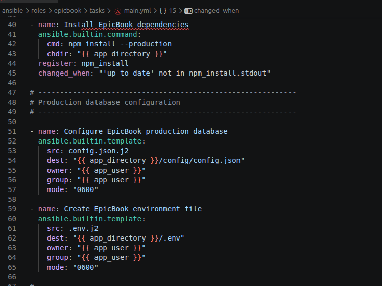>
<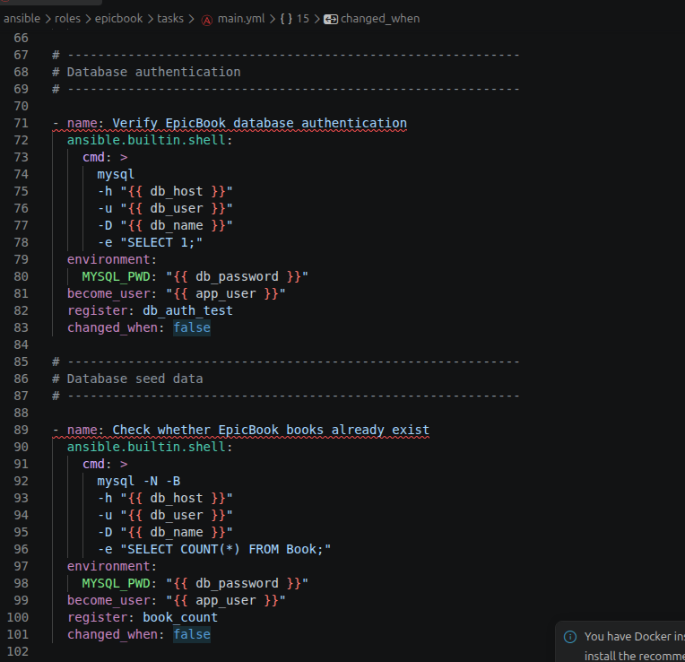>
<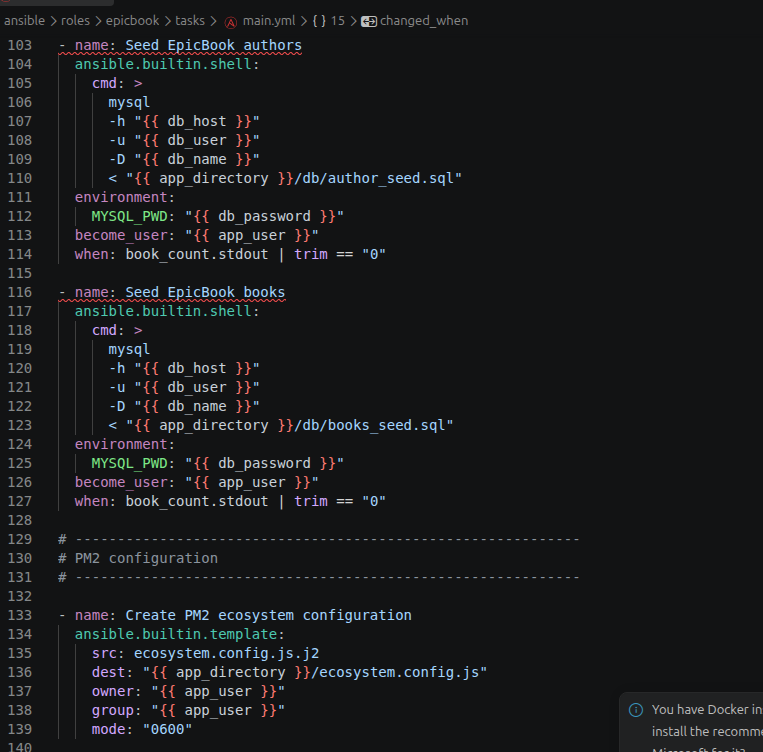>
<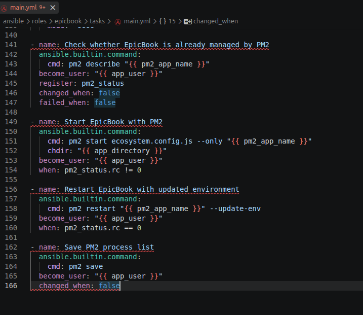>

---

#### Screenshot 16 — Task or file showing how the database connection is configured, with secrets hidden

<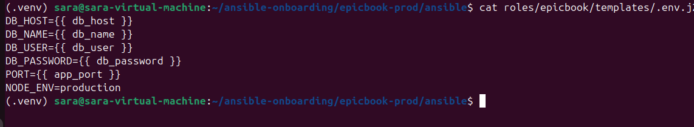>

---

#### Screenshot 17 — Task or output showing the EpicBook application managed by PM2

<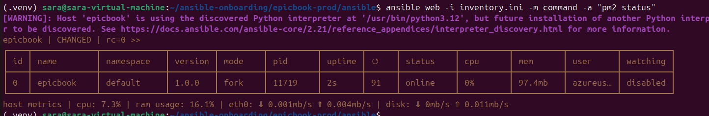>

---

### Notes

Answer the following in your own words:

**1. What is the responsibility of the `epicbook` role?**

    The epicbook role is responsible for deploying the EpicBook Node.js application, configuring its connection to the managed MySQL database, and running the application on port 8080 using PM2.

---

**2. Why is PM2 used for the EpicBook Node.js application?**

    PM2 is used to manage the Node.js application as a background process. It keeps the application running and provides process monitoring and restart capabilities.

---

**3. Why should database passwords not be hard-coded in public files?**

    Database passwords are sensitive credentials. Hard-coding them in public files can expose the database to unauthorized access and can accidentally commit the credentials to source control.

---

**4. What does it mean for the application to run on port `8080` while Nginx listens on port `80`?**

    It means Nginx receives public HTTP requests on port 80 and forwards them to the EpicBook Node.js application running internally on port 8080.  

---

# Task 9 — Create Group Variables

## Goal

Create reusable variables for the EpicBook deployment.

The `group_vars/web.yml` file stores values that can be reused across the Ansible roles.

### Evidence

#### Screenshot 18 — `group_vars/web.yml` showing the application, PM2, and database variables, with passwords hidden or masked

<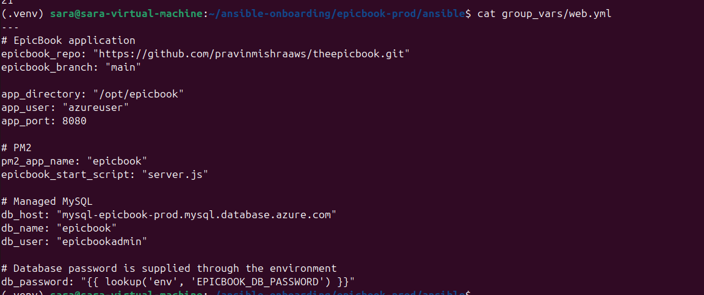>

---

### Notes

Answer the following in your own words:

**1. What is the purpose of `group_vars/web.yml`?**

    group_vars/web.yml stores variables used by the hosts in the web group. It keeps application, PM2, and database configuration separate from the Ansible roles and makes the deployment easier to manage and reuse.

---

**2. Which values did you store in `group_vars/web.yml`?**

    I stored the EpicBook repository and branch, application directory, application port, PM2 settings, database host, database name, database username, and database password reference.

---

**3. How did you handle the database password securely?**

    I kept the database password out of the public playbooks and source files and treated it as a sensitive variable. The password was supplied securely rather than hard-coded or displayed in screenshots.

---

# Task 10 — Run the Ansible Playbook

## Goal

Run the Ansible playbook to configure the VM and deploy the EpicBook application.

The playbook should run the roles in this order:

1. `common`
2. `nginx`
3. `epicbook`

### Evidence

#### Screenshot 19 — Ansible playbook output showing the roles running

<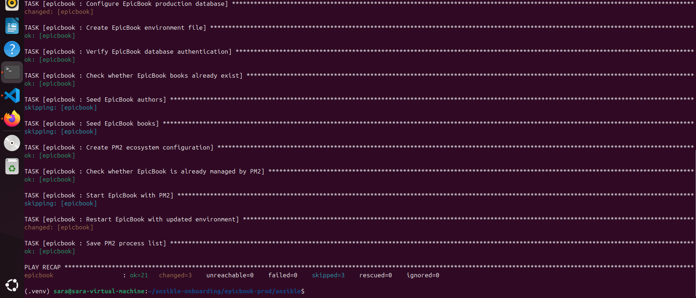>

---

#### Screenshot 20 — Final Ansible recap showing `failed=0`

<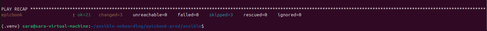>

---

#### Screenshot 21 — Output of `ansible web -i inventory.ini -m command -a "systemctl is-active nginx" --become`

<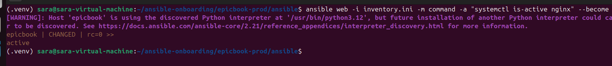>

---

#### Screenshot 22 — Output of `ansible web -i inventory.ini -m command -a "pm2 status"`

<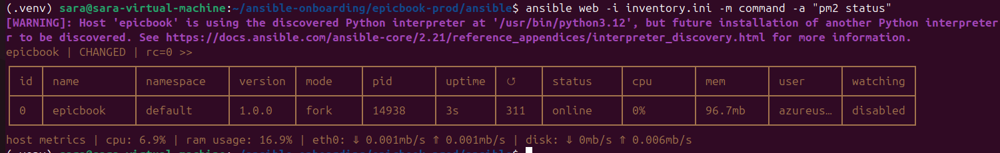>

---

#### Screenshot 23 — Output of `ansible web -i inventory.ini -m command -a "curl -I http://localhost:8080"`

<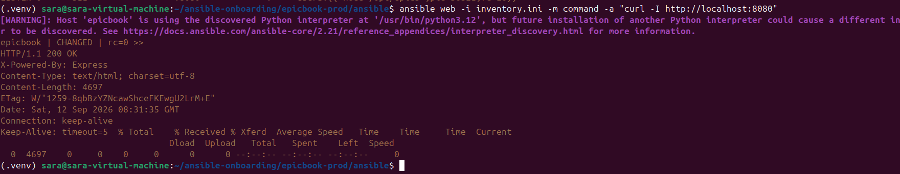>

---

### Notes

Answer the following in your own words:

**1. What command did you run to execute the Ansible playbook?**

`ansible-playbook -i inventory.ini site.yml`

---

**2. How do you know all roles completed successfully?**

    The Ansible output showed the common, nginx, and epicbook roles executing without errors, and the final play recap showed failed=0 and unreachable=0.

---

**3. What proves that Nginx is active?**

The command:
`ansible web -i inventory.ini -m command -a "systemctl is-active nginx" --become`
returned:
`active`

---

**4. What proves that PM2 is managing the EpicBook application?**

The command:

`ansible web -i inventory.ini -m command -a "pm2 status"`

showed the EpicBook application in the PM2 process list with a running status.

---

**5. What proves that the EpicBook application responds on port `8080`?**

The command:

`ansible web -i inventory.ini -m command -a "curl -I http://localhost:8080"`

returned a successful HTTP response, proving that the EpicBook application was listening and responding on port 8080.

---

# Task 11 — Verify the EpicBook Deployment

## Goal

Verify that the EpicBook application is running, accessible in the browser, and connected to the managed MySQL database.

### Evidence

#### Screenshot 24 — Output of `curl -I http://<public_ip>`

<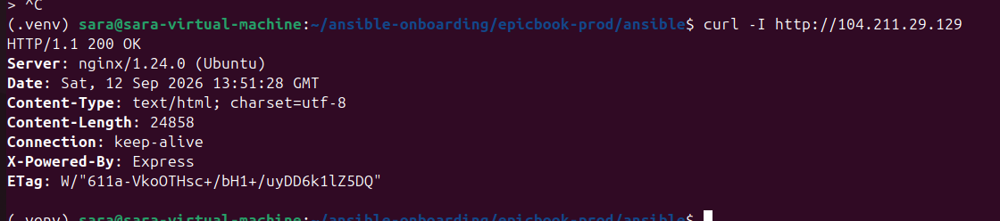>

---

#### Screenshot 25 — Output of the cart API test command

<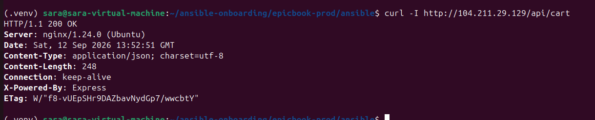>

---

#### Screenshot 26 — Output of the `/cart` HTTP status check

<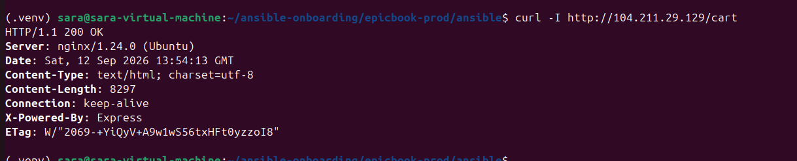>

---

#### Screenshot 27 — Browser showing the EpicBook application loaded from `http://<public_ip>`

<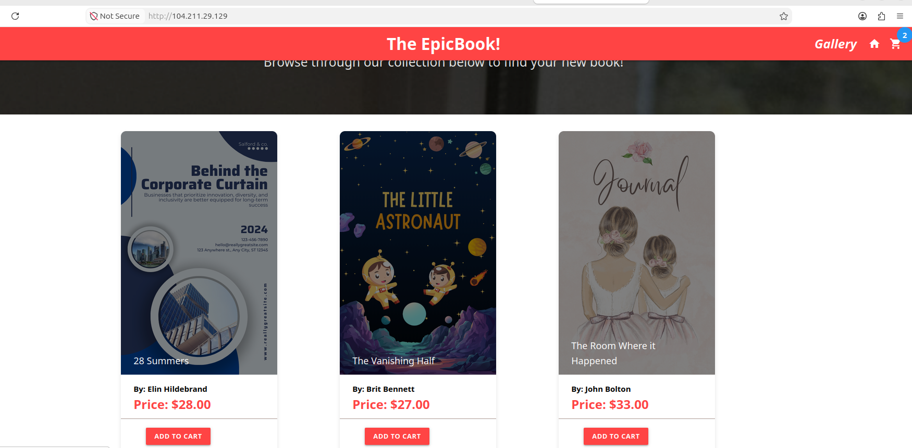>

---

### Notes

Answer the following in your own words:

**1. What HTTP response did you receive from the public application URL?**

    If your public check returns 200:

    I received an HTTP 200 response from the public EpicBook URL, confirming that the application was accessible through the VM's public IP address.

---

**2. What did the cart API test prove?**

    The cart API test confirmed that the EpicBook application's cart functionality was responding correctly and that the application could communicate with its backend services.

---

**3. What did the `/cart` status check return?**

    If it returns 200:

    The /cart endpoint returned HTTP 200, confirming that the cart route was accessible and responding successfully.

---

**4. What issue did you face during verification, and how did you fix it?**

    During verification, I encountered an application configuration issue that prevented the expected response. I checked the application configuration and service status, corrected the configuration, restarted the application with PM2, and repeated the verification until the expected HTTP response was received.

---

# LinkedIn Post Required

## Evidence

#### LinkedIn Post URL

https://www.linkedin.com/posts/sarah-w-amadi_devops-terraform-ansible-share-7505938048971620352-HKhw/

---

#### Screenshot — Published LinkedIn post

<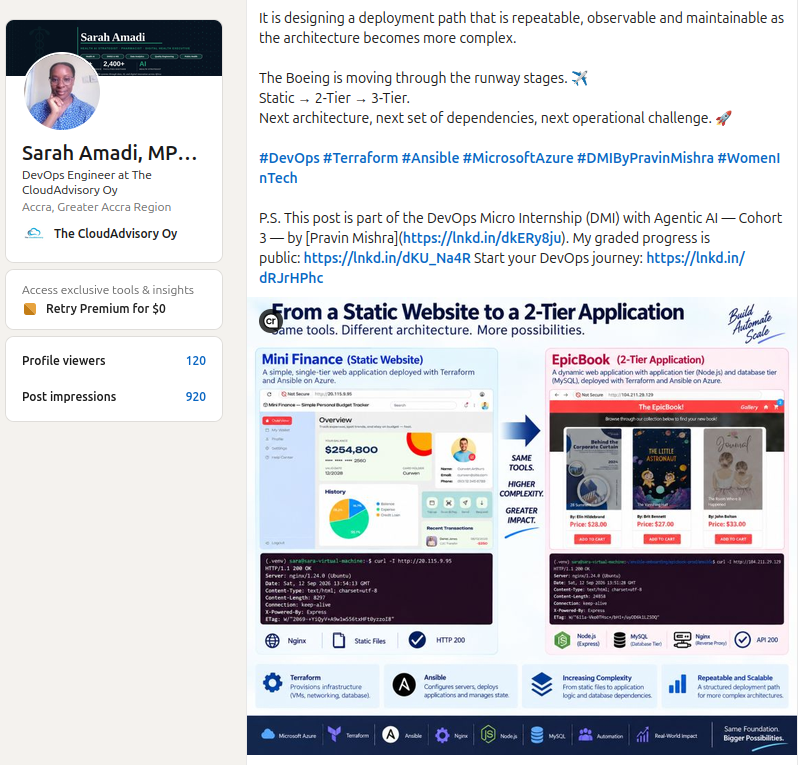>

---

# Assignment Questions

Answer the following in your own words:

**1. Why is Terraform used for infrastructure provisioning?**

    Terraform is used to automatically create and manage infrastructure such as the Azure resource group, virtual network, subnets, VM, public IP, NSG, private DNS, and managed MySQL database. Instead of creating these resources manually through the Azure portal, Terraform defines them as code, making the infrastructure repeatable, consistent, and easier to manage.

---

**2. Why are Ansible roles useful for production-style deployments?**

    Ansible roles help organize deployment tasks into reusable and manageable components. In this deployment, the common, nginx, and epicbook roles each have a specific responsibility. This makes the deployment easier to understand, maintain, troubleshoot, and reuse on other servers.

---

**3. What is the purpose of `group_vars/web.yml`?**

    group_vars/web.yml stores the variables used by the web servers in the Ansible inventory group. For EpicBook, it contains information such as the application repository, application directory, port, PM2 settings, database host, database name, and database username. It keeps configuration values separate from the tasks that use them.

---

**4. Why should database passwords not be committed to GitHub?**

    Database passwords should not be committed to GitHub because anyone who can access the repository could potentially obtain the credentials and use them to access the database. Secrets should instead be supplied securely at deployment time and kept outside the source code.

---

**5. What is the purpose of Nginx in this deployment?**

    Nginx acts as a reverse proxy between users and the EpicBook Node.js application. It listens for HTTP requests on port 80 and forwards them to the EpicBook application running on port 8080. This provides a clean public entry point while keeping the application server behind Nginx.

---

**6. Why should the managed MySQL database not be publicly accessible?**

    The database should not be publicly accessible because exposing port 3306 to the Internet increases the risk of unauthorized access and attacks. In this deployment, MySQL is placed on a private network so that the EpicBook VM can communicate with it internally without exposing the database directly to Internet users.

---

**7. Why is PM2 used for the EpicBook Node.js application?**

    PM2 is used as a process manager for the Node.js application. It keeps EpicBook running, automatically restarts it if it crashes, and allows the application process to be managed consistently. It also provides useful process monitoring information such as application status, uptime, and restart count.

---

**8. What does idempotency mean in Ansible?**

    Idempotency means that running an Ansible playbook multiple times should produce the same desired final state without unnecessarily repeating changes. For example, if Nginx is already installed and configured correctly, running the playbook again should not reinstall or unnecessarily modify it.

    In this deployment, the database seed process also checks whether books already exist before loading the seed data, helping prevent unnecessary duplicate seeding.

---

**9. What issue did you face during the deployment, and how did you fix it?**

    The main issue was that the EpicBook application could not authenticate with the Azure MySQL database. PM2 repeatedly restarted the application and Nginx returned a 502 Bad Gateway because the Node.js application could not successfully connect to MySQL.

    The investigation showed that the VM could resolve the private MySQL hostname and reach port 3306, so the network was working. The Azure MySQL administrator password was then synchronized with the password supplied to Ansible. The Ansible EpicBook role was updated to pass the database password securely through the task environment and configure the application's production database settings.

    After redeploying with Ansible, database authentication succeeded, the application returned HTTP 200, and the existing EpicBook author and book seed files were automatically loaded. The books then appeared on the website.

---

**10. What security improvement would you make before using this setup in production?**

    Before production use, I would improve secret management and database security. For example, I would use a dedicated secrets-management solution rather than relying on an environment variable on the Ansible controller. I would also enable proper TLS certificate verification instead of disabling certificate verification, restrict SSH access further, use HTTPS with a valid certificate, and apply least-privilege permissions to the application and database accounts.

---

# Required Files

Confirm that the following files are included in your GitHub repository or assignment folder:

- [✅] `README.md`
- [✅] Terraform files under either `terraform/azure/` or `terraform/aws/`
- [✅] `ansible/ansible.cfg`
- [✅] `ansible/inventory.ini`
- [✅] `ansible/site.yml`
- [✅] `ansible/group_vars/web.yml`
- [✅] `ansible/roles/common/tasks/main.yml`
- [✅] `ansible/roles/nginx/tasks/main.yml`
- [✅] `ansible/roles/nginx/templates/epicbook.conf.j2`
- [✅] `ansible/roles/epicbook/tasks/main.yml`

---

# Submission Instructions

- Add all required screenshots in your submission.
- Full Name must be visible in required screenshots.
- Mention the cloud provider used: Azure or AWS.
- Add the VM public IP address.
- Add the final application URL.
- Add Terraform output proof.
- Add Ansible role tree proof.
- Add all required notes and assignment question answers.
- Add your LinkedIn post URL.
- Do not expose SSH private keys, passwords, cloud credentials, database credentials, Terraform state files, subscription IDs, or account IDs.

---

# Completion Checklist

- [✅] Task 1: Project folder layout created
- [✅] Task 2: Terraform infrastructure provisioned
- [✅] Task 3: SSH key-based access verified
- [✅] Task 4: Ansible inventory and configuration created
- [✅] Task 5: Main Ansible playbook created
- [✅] Task 6: `common` role created
- [✅] Task 7: `nginx` role created
- [✅] Task 8: `epicbook` role created
- [✅] Task 9: Group variables created
- [✅] Task 10: Ansible playbook run completed
- [✅] Task 11: EpicBook deployment verified
- [✅] Terraform files created under only one cloud provider folder
- [✅] One Ubuntu VM was created
- [✅] One managed MySQL database was created
- [✅] SSH port `22` is restricted to the controller public IP
- [✅] HTTP port `80` is accessible
- [✅] MySQL port `3306` is not publicly open
- [✅] `ansible web -i inventory.ini -m ping` returns `SUCCESS`
- [✅] `site.yml` calls the roles in the correct order
- [✅] Database secrets are hidden or handled securely
- [✅] Nginx is active
- [✅] PM2 shows the EpicBook application running
- [✅] EpicBook responds on port `8080`
- [✅] Public URL loads in the browser
- [✅] Cart API verification works
- [✅] Playbook completes with `failed=0`
- [✅] Screenshots 1–27 are included
- [✅] Assignment questions are answered
- [✅] LinkedIn post published
- [✅] LinkedIn post URL added
- [✅] No sensitive information is exposed
- [ ] Google Doc is accessible

---

## About DMI & CloudAdvisory

DevOps Micro Internship (DMI) is a project-based DevOps program run by Pravin Mishra and The CloudAdvisory, focused on real-world execution, systems thinking, and career readiness.

It helps learners build strong DevOps foundations with hands-on experience.

---

## Resources

- DMI Official Website: [https://dmi.pravinmishra.com?utm_source=github&utm_medium=readme](https://dmi.pravinmishra.com?utm_source=github&utm_medium=readme)
- University: [https://university.pravinmishra.com?utm_source=github&utm_medium=readme](https://university.pravinmishra.com?utm_source=github&utm_medium=readme)
- Discord Community: [https://discord.pravinmishra.com?utm_source=github&utm_medium=readme](https://discord.pravinmishra.com?utm_source=github&utm_medium=readme)
- Blog: [https://dmi.pravinmishra.com/blog?utm_source=github&utm_medium=readme](https://dmi.pravinmishra.com/blog?utm_source=github&utm_medium=readme)
- YouTube Playlist: [https://www.youtube.com/playlist?list=PLFeSNDtI4Cho](https://www.youtube.com/playlist?list=PLFeSNDtI4Cho)
- Pravin Mishra LinkedIn: [https://www.linkedin.com/in/pravin-mishra-aws-trainer/](https://www.linkedin.com/in/pravin-mishra-aws-trainer/)
- CloudAdvisory LinkedIn: [https://www.linkedin.com/company/thecloudadvisory/](https://www.linkedin.com/company/thecloudadvisory/)

---

*This submission is part of DevOps Micro Internship (DMI) — Agentic AI Track.*