# Assignment 6 — AI-Assisted Ansible Change Risk Review

Part of the DevOps Micro Internship (DMI) Cohort 3 with Agentic AI

---

## Purpose

In this assignment, I built an AI-assisted Ansible risk-review workflow using `ansible-playbook --check --diff`, Bash scripting, and Claude Code.

I reviewed possible server changes before applying them, classified risky tasks, and kept the final apply decision under human control.

---

# Task 1 — Confirm EpicBook Connectivity and Create the Workspace

## Goal

Confirm that your previous EpicBook Ansible project is working before creating the risk-review automation.

### Evidence

#### Screenshot 1 — Output of `ansible web -i inventory.ini -m ping`

<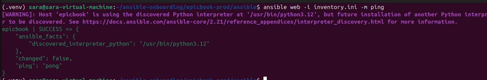>

---

#### Screenshot 2 — Output of `ansible-playbook -i inventory.ini site.yml --syntax-check`

<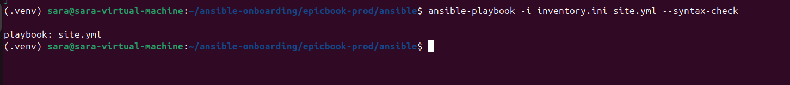>

---

#### Screenshot 3 — Output of `pwd` and `find . -maxdepth 4 -type d | sort`

<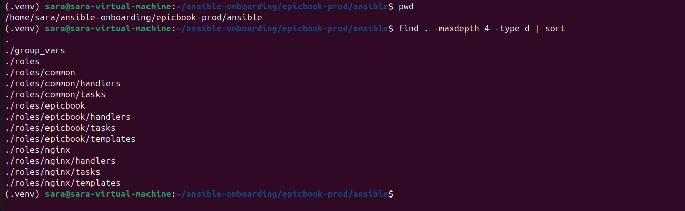>

---

### Notes

Answer the following in your own words:

**1. What proves that Ansible can reach your EpicBook VM?**

    The successful pong response from ansible web -i inventory.ini -m ping proves that Ansible can connect to the EpicBook VM and communicate with it successfully.

---

**2. Why should you confirm playbook syntax before building a risk-review script?**

    Syntax checking confirms that the Ansible playbook is correctly written before the risk-review script analyzes it. This helps prevent errors in the playbook from being mistaken for risk-review problems.

---

# Task 2 — Create Project Context and Safety Rules in CLAUDE.md

## Goal

Create a `CLAUDE.md` file that tells Claude Code how this project must behave.

### Evidence

#### Screenshot 4 — `CLAUDE.md` open in VS Code or terminal showing the safety rules

<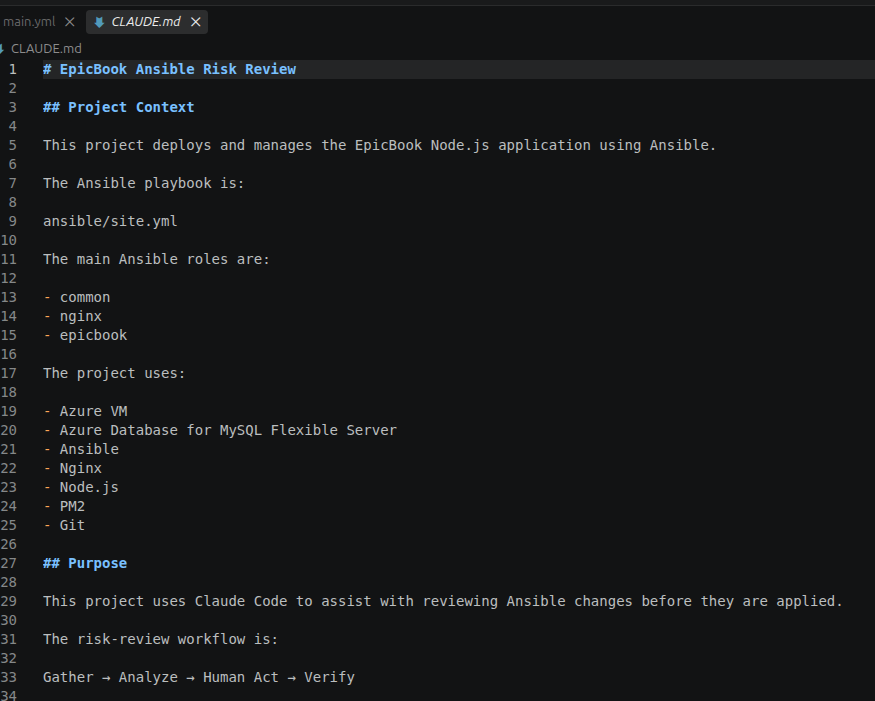>
<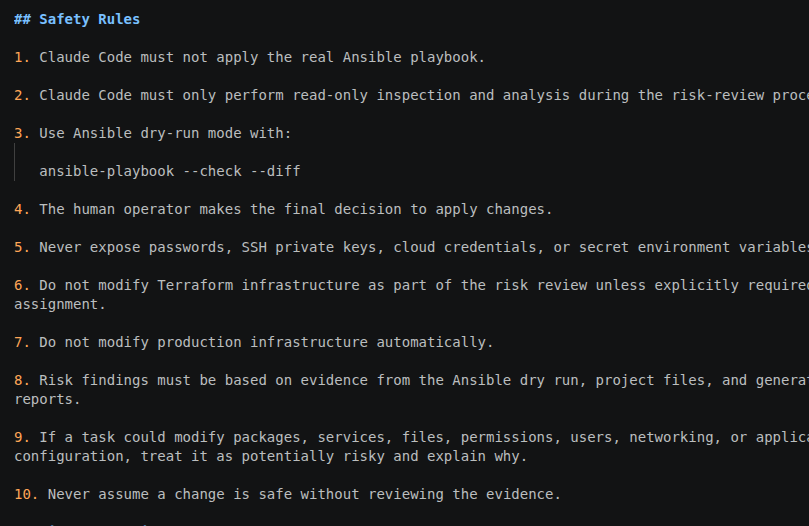>
<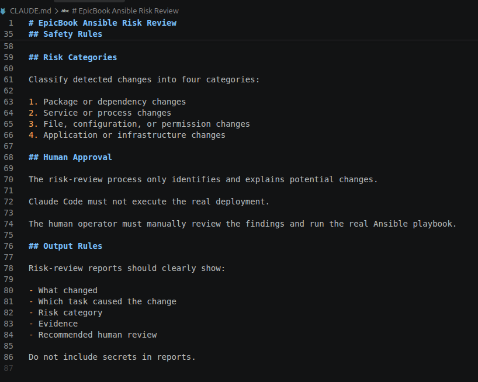>

---

### Notes

Answer the following in your own words:

**1. Why should Claude Code have project-specific safety rules?**

    Project-specific safety rules tell Claude Code what it is allowed and not allowed to do in this environment. They help keep the risk-review process controlled and prevent accidental changes to infrastructure.

---

**2. Why should the human run the real Ansible playbook manually?**

    The human should make the final decision because the real playbook can change the server. Human approval provides an additional safety check before changes are actually applied.

---

**3. Which rule prevents Claude Code from applying changes automatically?**
**
    The rule stating that, **Claude Code must not apply the real Ansible playbook**, prevents it from automatically making changes.

---

# Task 3 — Ask Claude Code to Plan the Risk Review

## Goal

Use Claude Code to produce a read-only plan before writing the Bash script.

### Evidence

#### Screenshot 5 — Claude Code showing the four-category risk-classification plan

<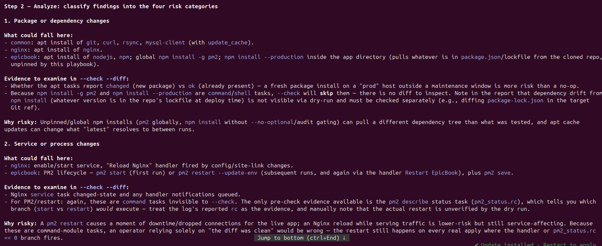>
<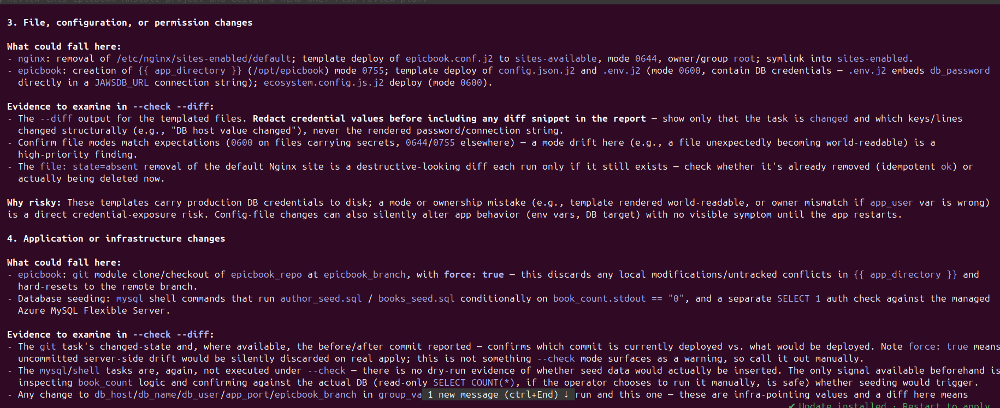>
<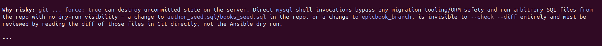>

---

### Notes

Answer the following in your own words:

**1. Which part of this task represents the Gather phase?**

    The Gather phase is collecting evidence from the Ansible project and the --check --diff dry run without applying any changes.

---

**2. Which part represents the Analyze phase?**

    The Analyze phase is reviewing the gathered evidence and classifying possible changes into the four risk categories.

---

**3. How did you verify Claude Code did not create or edit files?**

    I gave Claude Code an explicit read-only instruction and told it not to create, edit, or delete files. I also reviewed its output to confirm that it only produced an analysis and did not make project changes

---

# Task 4 — Build the Ansible Risk Review Script

## Goal

Create a Bash script that runs an Ansible dry run and classifies risky changes.

### Evidence

#### Screenshot 6 — Top section of `ansible-check-review.sh` showing `full_name`, `playbook_path`, `inventory_path`, and the `checks` array

<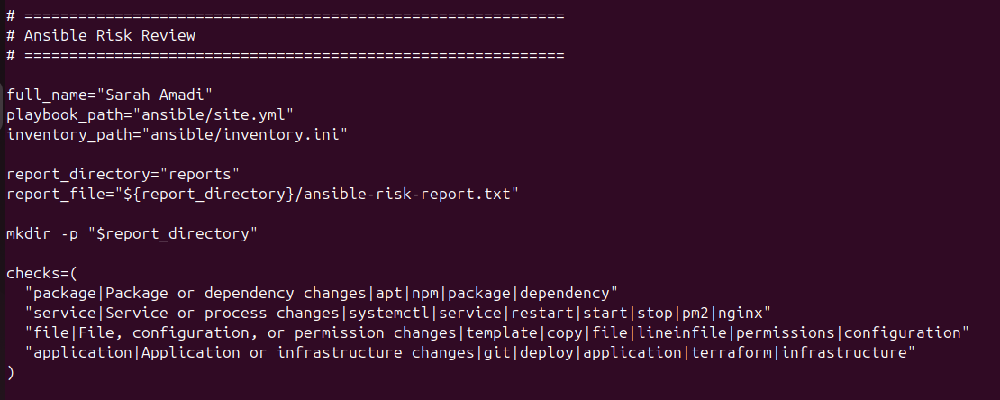>

---

#### Screenshot 7 — Middle section showing `extract_changed_tasks` and `check_tasks_matching_pattern`

<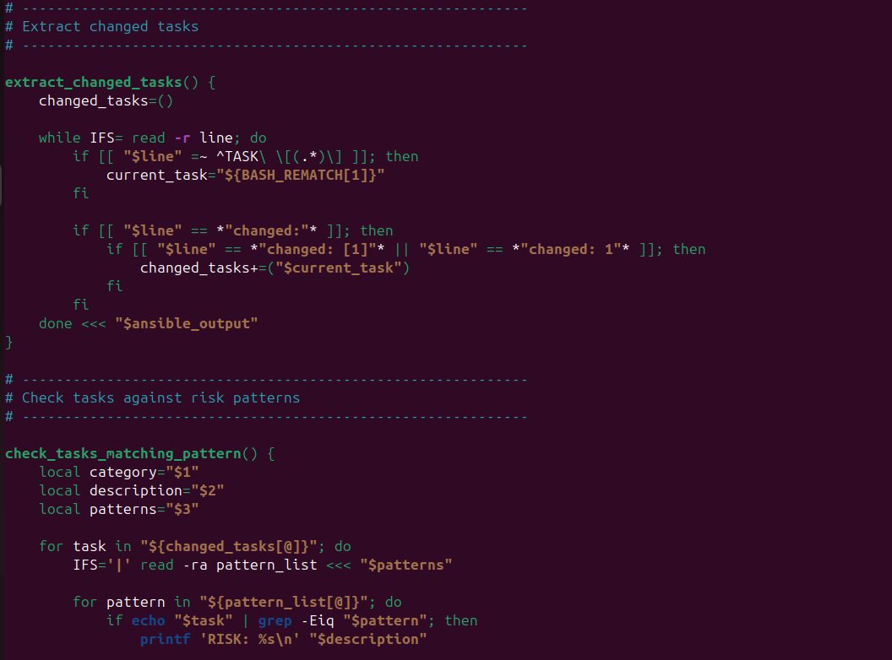>
<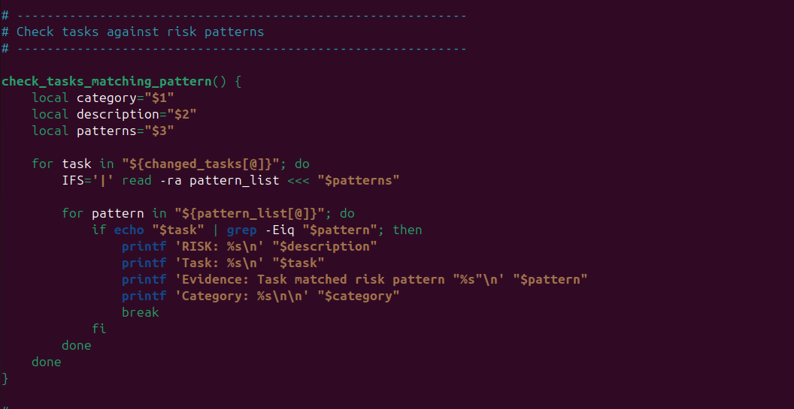>

---

#### Screenshot 8 — Bottom section showing the loop, summary, and exit behavior

<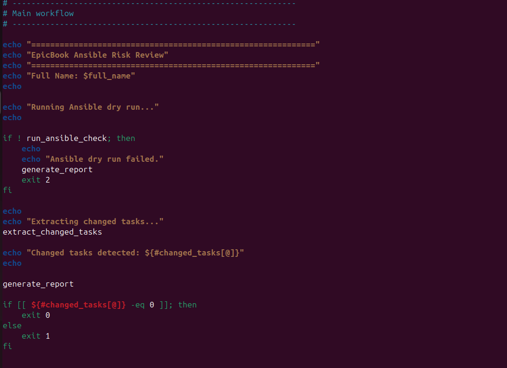>

---

#### Screenshot 9 — Output of `bash -n ansible-check-review.sh` and `ls -l ansible-check-review.sh`

<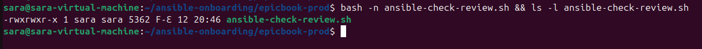>

---

### Notes

Answer the following in your own words:

**1. What is stored in the `changed_tasks` array?**

    The changed_tasks array stores the names of Ansible tasks that the dry run reports as changes.

---

**2. Which function finds changed tasks from the Ansible output?**

    The extract_changed_tasks function finds and stores the changed tasks.

---

**3. Why does the script use `--check --diff`?**

    --check performs a dry run without applying the changes, while --diff shows the differences Ansible expects to make. Together, they provide evidence for reviewing potential changes before applying them.

---

**4. Why does the script use different exit codes for healthy, warning, and failed results?**

    Different exit codes allow the result to be understood automatically. A healthy review returns 0, detected changes return 1 for human review, and an Ansible failure returns 2

---

# Task 5 — Run the Baseline Dry-Run Review

## Goal

Run the script against your current EpicBook playbook and confirm the baseline risk status.

### Evidence

#### Screenshot 10 — Output of `./ansible-check-review.sh`

Add your screenshot here.

---

#### Screenshot 11 — Output of `echo "Captured Exit Code: $script_exit_code"` and `cat reports/ansible-risk-report.txt`

Add your screenshot here.

---

### Notes

Answer the following in your own words:

**1. What was the overall status of your baseline run?**

Add your answer here.

---

**2. Did any tasks report `changed`?**

Add your answer here.

---

**3. Were any changed tasks flagged as risky?**

Add your answer here.

---

**4. What does the script exit code mean?**

Add your answer here.

---

# Task 6 — Create and Run the Claude Code Skill

## Goal

Turn the Bash script into a reusable Claude Code skill called `/ansible-risk-review`.

### Evidence

#### Screenshot 12 — `SKILL.md` showing the frontmatter, allowed tools, and safety rules

Add your screenshot here.

---

#### Screenshot 13 — Claude Code output after running `/ansible-risk-review`

Add your screenshot here.

---

### Notes

Answer the following in your own words:

**1. Why does this skill allow `Bash`, `Read`, and `Grep`?**

Add your answer here.

---

**2. Why does this skill not allow file editing?**

Add your answer here.

---

**3. What part is handled by Bash?**

Add your answer here.

---

**4. What part is handled by Claude Code?**

Add your answer here.

---

**5. Why is this better than asking Claude Code if the playbook is safe without giving it evidence?**

Add your answer here.

---

# Task 7 — Introduce a Controlled Risky Change and Let the Skill Catch It

## Goal

Add a small controlled risky change in your lab playbook and confirm the script and Claude Code catch it before applying.

### Evidence

#### Screenshot 14 — The added risky task inside the role file

Add your screenshot here.

---

#### Screenshot 15 — Output of `./ansible-check-review.sh`

Add your screenshot here.

---

#### Screenshot 16 — Claude Code `/ansible-risk-review` output showing the risky finding

Add your screenshot here.

---

#### Screenshot 17 — Output of `cat reports/risky-change-report.txt`

Add your screenshot here.

---

### Notes

Answer the following in your own words:

**1. Which risk category did the added task fall into?**

Add your answer here.

---

**2. What evidence proves the task would change something?**

Add your answer here.

---

**3. Did Claude Code apply the playbook?**

Add your answer here.

---

**4. Why is it important that Claude Code only analyzed the risk?**

Add your answer here.

---

**5. Which phase of the Agentic Loop is represented by the Bash report?**

Add your answer here.

---

# Task 8 — Apply as the Human, Verify, and Write the Change Summary

## Goal

Review the risky-change report, apply the playbook manually as the human operator, and verify the result.

### Evidence

#### Screenshot 18 — Output of the real playbook run showing the final recap with `failed=0`

Add your screenshot here.

---

#### Screenshot 19 — Output of `ansible web -i inventory.ini -m ping`

Add your screenshot here.

---

#### Screenshot 20 — Second `/ansible-risk-review` output after applying the change

Add your screenshot here.

---

#### Screenshot 21 — Output of `ls -lah reports`

Add your screenshot here.

---

#### Screenshot 22 — `change-summary.md` showing all required sections and your Full Name

Add your screenshot here.

---

### Notes

Answer the following in your own words:

**1. What command did you run to apply the change for real?**

Add your answer here.

---

**2. Who made the final decision to apply the playbook?**

Add your answer here.

---

**3. What evidence proves the VM is still reachable?**

Add your answer here.

---

**4. Why should the risk review be run again after applying?**

Add your answer here.

---

**5. What could go wrong if an AI agent applied Ansible changes automatically?**

Add your answer here.

---

# LinkedIn Post Required

## Evidence

#### LinkedIn Post URL

Paste your LinkedIn post URL here:

`Add your URL here`

---

#### Screenshot — Published LinkedIn post

Add your screenshot here.

---

# Required Files

Confirm that the following files are included in your GitHub repository or assignment folder:

- [ ] `CLAUDE.md`
- [ ] `ansible-check-review.sh`
- [ ] `.claude/skills/ansible-risk-review/SKILL.md`
- [ ] `reports/risky-change-report.txt`
- [ ] `reports/post-apply-report.txt`
- [ ] `change-summary.md`

---

# Submission Instructions

- Add all required screenshots in your submission.
- Full Name must be visible in required screenshots and reports.
- All required notes must be answered clearly.
- Do not expose SSH private keys, passwords, cloud credentials, database credentials, or secret environment variables.
- Add your GitHub repository or folder URL inside this document.
- Submit only your Google Doc link.

---

# Completion Checklist

- [ ] Task 1: EpicBook connectivity confirmed and workspace created
- [ ] Task 2: `CLAUDE.md` created with safety rules
- [ ] Task 3: Claude Code produced a read-only risk-review plan
- [ ] Task 4: `ansible-check-review.sh` created and syntax checked
- [ ] Task 5: Baseline dry-run review completed
- [ ] Task 6: Claude Code `/ansible-risk-review` skill created and tested
- [ ] Task 7: Controlled risky change introduced and detected
- [ ] Task 8: Human applied the change and verified the result
- [ ] Risky-change report saved
- [ ] Post-apply report saved
- [ ] Change summary completed
- [ ] All screenshots added
- [ ] All notes answered
- [ ] LinkedIn post published
- [ ] LinkedIn post URL added
- [ ] No sensitive information exposed
- [ ] Google Doc is accessible

---

## About DMI & CloudAdvisory

DevOps Micro Internship (DMI) is a project-based DevOps program run by Pravin Mishra and The CloudAdvisory, focused on real-world execution, systems thinking, and career readiness.

It helps learners build strong DevOps foundations with hands-on experience.

---

## Resources

- DMI Official Website: [https://dmi.pravinmishra.com?utm_source=github&utm_medium=readme](https://dmi.pravinmishra.com?utm_source=github&utm_medium=readme)
- University: [https://university.pravinmishra.com?utm_source=github&utm_medium=readme](https://university.pravinmishra.com?utm_source=github&utm_medium=readme)
- Discord Community: [https://discord.pravinmishra.com?utm_source=github&utm_medium=readme](https://discord.pravinmishra.com?utm_source=github&utm_medium=readme)
- Blog: [https://dmi.pravinmishra.com/blog?utm_source=github&utm_medium=readme](https://dmi.pravinmishra.com/blog?utm_source=github&utm_medium=readme)
- YouTube Playlist: [https://www.youtube.com/playlist?list=PLFeSNDtI4Cho](https://www.youtube.com/playlist?list=PLFeSNDtI4Cho)
- Pravin Mishra LinkedIn: [https://www.linkedin.com/in/pravin-mishra-aws-trainer/](https://www.linkedin.com/in/pravin-mishra-aws-trainer/)
- CloudAdvisory LinkedIn: [https://www.linkedin.com/company/thecloudadvisory/](https://www.linkedin.com/company/thecloudadvisory/)

---

*This submission is part of DevOps Micro Internship (DMI) Cohort 3 — Agentic AI Track.*