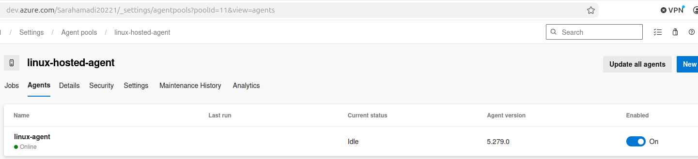
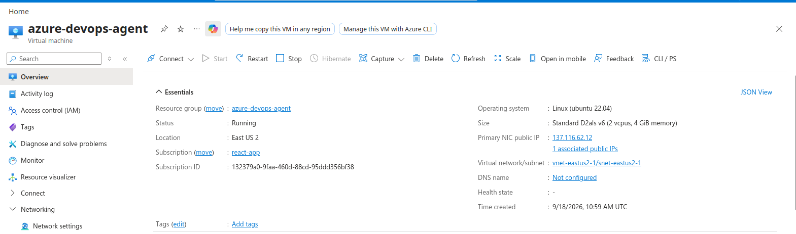
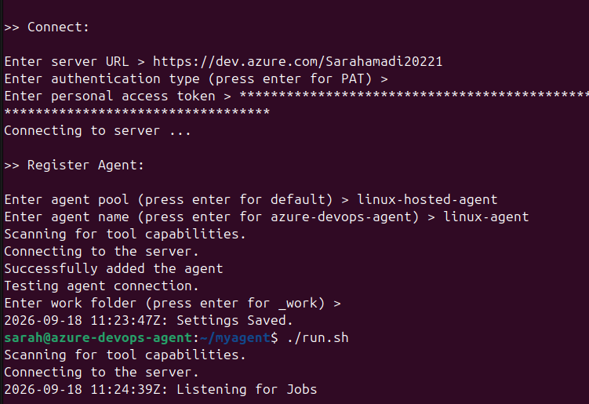
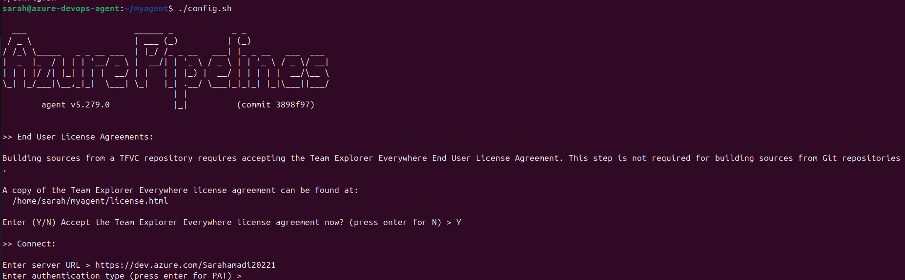
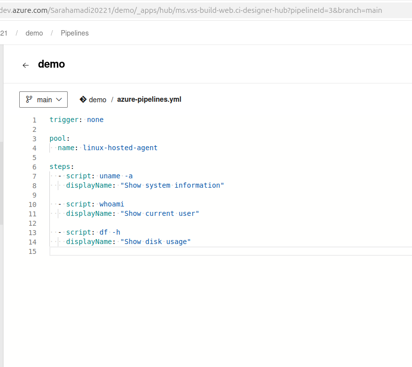
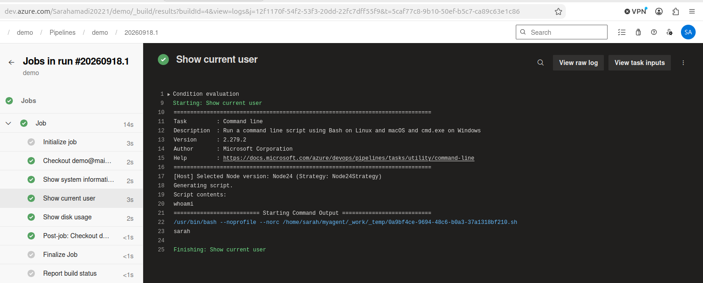
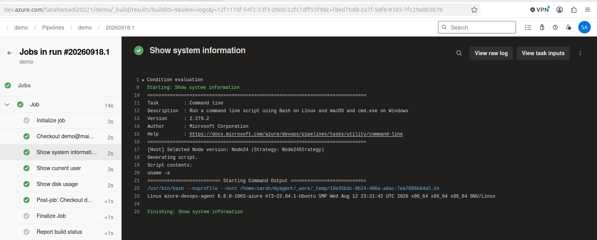
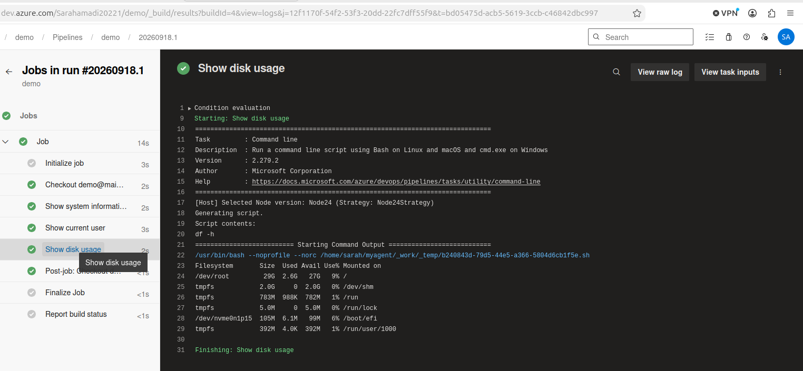

# Assignment 1 — Configure a Self-Hosted Azure DevOps Agent on Ubuntu

Part of the DevOps Micro Internship (DMI) with Agentic AI

---

## Purpose

In this assignment, I provisioned an Ubuntu VM in Azure and configured it as a self-hosted Azure Pipelines agent. I then created an agent pool, registered the agent using a Personal Access Token (PAT), ran it as a Linux system service, and verified it by executing a test pipeline on the VM.

---

# Task 0 — Create or Access Azure DevOps

## Goal

Sign in to Azure DevOps and create or access an organization and project for the assignment.

No submission screenshot is required for this task.

---

# Task 1 — Create a Personal Access Token (PAT)

## Goal

Create and securely store the PAT required to register the self-hosted agent.

No submission screenshot is required for this task.

> Do not include the PAT in this document or in any screenshot.

---

# Task 2 — Create a Self-Hosted Agent Pool

## Goal

Create the Azure DevOps agent pool that will contain the Linux agent.

### Evidence

#### Screenshot 1 — Azure DevOps Agent Pools page showing the newly created pool

<>

---

# Task 3 — Provision and Connect to the Ubuntu VM

## Goal

Provision an Ubuntu VM in AWS or Azure and verify its operating system, architecture, and outbound connection to Azure DevOps.

## Evidence

### Screenshot 1 — Ubuntu VM Running

Add a screenshot from AWS or Azure showing:

* Ubuntu VM name
* VM status as **Running**
* Public IP address

<>

---

### Screenshot 2 — Ubuntu, Architecture, and HTTPS Verification

Add an SSH terminal screenshot showing the output of:

* `cat /etc/os-release`
* `uname -m`
* `curl -I https://dev.azure.com`

The screenshot must confirm a supported Ubuntu version, `x86_64` architecture, and a successful HTTP response from Azure DevOps.

<>

---

# Task 4 — Install and Configure the Azure Pipelines Agent

## Goal

Download, configure, and register the Linux Azure Pipelines agent, and run it as a system service.

## Evidence

### Screenshot 3 — Agent Configuration and Service Status

Add a terminal screenshot showing:

* Successful agent configuration
* Agent service installation
* Agent service start
* `sudo ./svc.sh status` reporting that the service is running

<>

---

#### Screenshot 5 — Terminal showing the agent service running successfully

<>

> Ensure that the PAT is not visible.

---

# Task 5 — Verify That the Agent Is Online

## Goal

Confirm that the agent service is running and the agent appears online in Azure DevOps.

## Evidence

### Screenshot 4 — Agent Online in Azure DevOps

Add a screenshot of the Azure DevOps Agent Pool **Agents** page showing:

* Selected agent pool
* Selected agent name
* Agent status as **Online**
* Agent enabled and available

<>

---

# Task 6 — Create and Run a Test Pipeline

## Goal

Create an Azure DevOps YAML pipeline and verify that its commands execute on the self-hosted Ubuntu VM.

## Evidence

### Screenshot 5 — Azure Pipelines YAML

Add a screenshot of `azure-pipelines.yml` open in the Azure Repos editor showing:

* `trigger: none`
* Selected self-hosted agent pool
* Bash verification step
* Your Full Name
* Linux verification commands

<>


---

### Screenshot 6 — Successful Test Pipeline

Add a screenshot of the successful Azure DevOps pipeline run showing:

containing uname -a, whoami, and df -h.
* Overall status as **Succeeded**
* Expanded **Verify self-hosted Ubuntu agent** step
* `Submitted by: <your-full-name>`
* Agent name
* Machine name
* Output from `uname -a`
* Output from `whoami`
* Output from `df -h`
* Output from `pwd`

<>
<>
<>


---

## Completed azure-pipelines.yml

Paste the contents of your completed `azure-pipelines.yml` file below.

```yaml
trigger: none

pool:
  name: linux-hosted-agent

steps:
  - script: uname -a
    displayName: "Show system information"

  - script: whoami
    displayName: "Show current user"

  - script: df -h
    displayName: "Show disk usage"
```

> Do not include your PAT, SSH private key, password, or cloud credentials in the YAML file.

---

# Assignment Summary

Write a short summary of what you configured.

Cloud Platform: Microsoft Azure
Azure DevOps Organization: Sarahamadi20221
Azure DevOps Project: demo
Agent Pool: linux-hosted-agent

Issues Encountered and Resolutions

During the setup and testing of the self-hosted Azure DevOps Linux agent, I encountered a few issues.

1. Incorrect agent pool name in the YAML pipeline
I initially configured the pipeline with an incorrect agent pool name. As a result, the pipeline could not locate the intended self-hosted agent. I identified the correct pool name, linux-hosted-agent, updated the azure-pipelines.yml file, and committed the correction to the repository.

2. Self-hosted agent connection went offline unexpectedly
During testing, the connection between the Azure DevOps organization and the Ubuntu self-hosted agent went offline without my knowledge. This resulted in a failed pipeline run because Azure DevOps could not find an available agent to execute the job. I checked the agent status, restored the agent connection/service, and verified that the agent was back online in the linux-hosted-agent pool before running the pipeline again.

3. Pipeline queued because the agent was occupied
After correcting the pool configuration and reconnecting the agent, a previous pipeline job was still occupying the self-hosted agent. The new pipeline therefore remained queued with Azure DevOps reporting that all potential agents were running other requests. I identified the previous job in the agent pool, cancelled the unnecessary run, and allowed the corrected pipeline to use the available agent.

After resolving these issues, the self-hosted Ubuntu agent was successfully registered with Azure DevOps and used to execute the test pipeline 

---

# LinkedIn Requirement (If Applicable)

## Screenshot 7 — LinkedIn Post

Add a screenshot of your LinkedIn post showing:

* What you configured
* Why organizations use self-hosted agents
* Three to five lines explaining your experience
* A screenshot of the successful pipeline run with no secrets visible

Add your screenshot here.

<>

**LinkedIn Post URL:** https://www.linkedin.com/posts/sarah-w-amadi_devops-azuredevops-cicd-share-7507656557674033152-05X5/

---

# Submission Instructions

* Include the short assignment summary.
* Include Screenshots 1–6.
* Include the contents of your completed `azure-pipelines.yml` file.
* Include Screenshot 7 and the LinkedIn post URL if the LinkedIn requirement applies.
* Do not expose a PAT, SSH private key, password, account details, or another secret.

---

# Completion Checklist

* Azure DevOps organization and project are ready
* A supported Ubuntu LTS VM is running and accessible through SSH
* SSH access is restricted to your public IP address
* Outbound HTTPS connectivity is working
* PAT was created with the required scopes and stored securely
* A self-hosted agent pool was created
* The same pool name was used during registration and in the pipeline YAML
* The agent service is running
* The agent appears **Online** in Azure DevOps
* The pipeline targets the selected agent pool
* The pipeline run completed with **Succeeded** status
* The pipeline output displays your Full Name
* Screenshots 1–6 are included and readable
* Screenshot 7 and the LinkedIn post URL are included if applicable
* The completed `azure-pipelines.yml` content is included
* No PAT, SSH private key, password, or other secret is visible

---

*This submission is part of the DevOps Micro Internship (DMI) — Agentic AI Track.*
