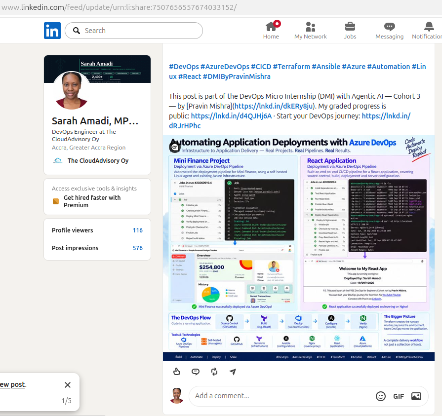

# Assignment 3 — Automate React App Deployment Using Azure DevOps CI/CD

Part of the DevOps Micro Internship (DMI) with Agentic AI

---

## Purpose

In this assignment, I created a multi-stage Azure DevOps pipeline that builds, tests, publishes, and deploys a React application to an Ubuntu VM hosted on AWS or Azure. The pipeline  automatically ran when changes are committed to `main`, transfered the production built as an artifact, and deployed it through Nginx.

---

# Task 0 — Verify the Starting Environment

## Goal

Confirm that Azure DevOps, the pipeline agent, Terraform, Ansible, and the selected cloud environment are ready.

No submission screenshot is required for this task.

---

# Task 1 — Import and Personalize the React Application

## Goal

Import the React application into Azure Repos and add your Full Name and the current date.

## Evidence

### Screenshot 1 — Imported React Project in Azure Repos

Add a screenshot of Azure Repos showing:

* Imported React project
* Repository name
* `main` branch
* Project files

<>

---

# Task 2 — Provision and Configure the Target VM

## Goal

Provision an Ubuntu VM using Terraform and configure Nginx, React SPA routing, SSH access, and deployment permissions using Ansible.

No separate submission screenshot is required for this task.

---

# Task 3 — Create or Update the SSH Service Connection

## Goal

Create or update an Azure DevOps SSH Service Connection that allows the pipeline to connect securely to the target VM.

No separate submission screenshot is required for this task.

> Do not include the VM password, SSH private key, token, or another secret in the submission.

---

# Task 4 — Author the Multi-Stage Azure Pipeline

## Goal

Create an Azure Pipeline containing Build, Test, Publish, and Deploy stages with an automatic trigger for commits to `main`.

## Evidence

### Screenshot 2 — Multi-Stage Pipeline YAML

Add a screenshot of the Azure Pipeline YAML open in the editor showing:

* Trigger
* Build stage
* Test stage
* Publish stage
* Deploy stage

<>
<>
<>
<>
<>

> Do not expose passwords, private keys, tokens, or cloud credentials.

---

# Task 5 — Run the Pipeline and Resolve Configuration Issues

## Goal

Complete a successful end-to-end pipeline run containing all four stages.

## Evidence

### Screenshot 3 — Successful Multi-Stage Pipeline Run

Add a screenshot of one Azure DevOps pipeline run showing all four stages succeeded:

* Build
* Test
* Publish
* Deploy

<>

---

# Task 6 — Verify the Deployment on the VM

## Goal

Confirm that the pipeline deployed the production-ready React files to the correct Nginx web root.

## Evidence

### Screenshot 4 — Post-Deployment Contents of /var/www/html

Add a screenshot of the pipeline SSH verification log or VM terminal showing the post-deployment contents of:

`/var/www/html`

<>

---

# Task 7 — Verify the Website and Automatic Trigger

## Goal

Confirm that the React application is accessible and that a commit to `main` automatically triggers the CI/CD pipeline.

## Evidence

### Screenshot 5 — Deployed React Application

Add a browser screenshot showing:

* Deployed React application
* VM public IP address in the browser address bar
* Your Full Name
* Deployment date

<>

## Final Application URL

`http://<vm-public-ip>`

Replace the placeholder and paste your final application URL below:

http://20.119.44.151

---

# CI/CD Workflow Summary

Write a short explanation of the CI/CD workflow you created.

Built a multi-staged azure devops pipeline and deployed a static website.

---

# LinkedIn Requirement

## Evidence

### Screenshot 6 — LinkedIn Post

Add a screenshot of your LinkedIn post showing:

* Post text
* At least one image or link

<>

## LinkedIn Post URL

https://www.linkedin.com/posts/sarah-w-amadi_devops-azuredevops-cicd-share-7507656557674033152-05X5/

> Do not expose VM passwords, tokens, private keys, cloud credentials, or other sensitive information.

---

# Submission Instructions

* Complete all tasks in sequence.
* Include the short CI/CD workflow summary.
* Include Screenshots 1–6.
* Include the final application URL.
* Include the public LinkedIn post URL.
* Confirm that all screenshots are readable and show the required context.
* Do not expose passwords, PATs, private keys, cloud credentials, subscription IDs, account IDs, or other secrets.
* Follow the Assignment Submission Guidelines.

---

# Completion Checklist

* [ ] All tasks were completed in sequence
* [ ] The correct React repository was imported into Azure Repos
* [ ] Your Full Name and date were added to the application
* [ ] The pipeline YAML was authored and committed to the repository
* [ ] Commits to `main` trigger the pipeline automatically
* [ ] The pipeline contains Build, Test, Publish, and Deploy stages
* [ ] All four stages succeeded in the same pipeline run
* [ ] The production build moved between stages as a pipeline artifact
* [ ] The Deploy stage used the SSH Service Connection
* [ ] No password or secret is stored in the YAML
* [ ] `index.html` is directly inside `/var/www/html`
* [ ] Raw React source code was not deployed to the Nginx web root
* [ ] `node_modules/` was not deployed to the Nginx web root
* [ ] Nginx is active
* [ ] The application opens through the VM public IP address
* [ ] Your Full Name and date are visible in the browser screenshot
* [ ] Screenshots 1–6 are included and readable
* [ ] No password, token, private key, account ID, or other secret is visible
* [ ] The final application URL is included
* [ ] The LinkedIn post is published
* [ ] The LinkedIn post URL is included

---

*This submission is part of the DevOps Micro Internship (DMI) — Agentic AI Track.*
