# Assignment 3 — Deploy React Application with Azure DevOps Pipeline

Part of the DevOps Micro Internship (DMI) Cohort 3 with Agentic AI

---

## Purpose

In this assignment, I builT and deployed the `my-react-app` React application to an Ubuntu VM using a multi-stage Azure Pipeline (Build → Test → Publish → Deploy) over SSH, with automatic triggering on commits to `main`.

---

# Task 1 — Import the React App

## Goal

Import `https://github.com/pravinmishraaws/my-react-app` into Azure Repos and confirm `package.json` and `src/` are visible.

### Evidence

#### Screenshot 1 — Azure Repos showing the imported React project with `package.json` and `src/` visible

<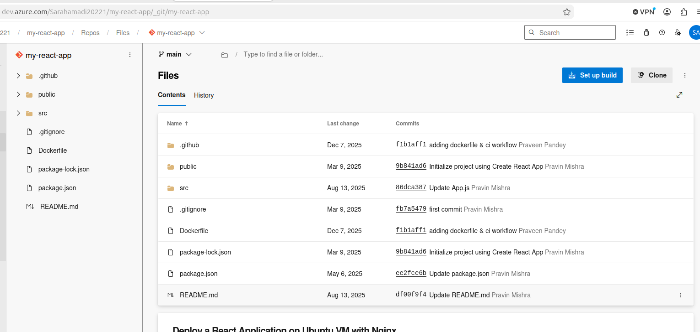>

---

# Task 2 — Prepare the Target VM

## Goal

Provision a new Ubuntu VM with Terraform (ports 22/80 open) and prepare Nginx/`/var/www/html` with Ansible.

### Evidence

#### Screenshot 2 — Terraform output or cloud console showing the new VM and public IP

<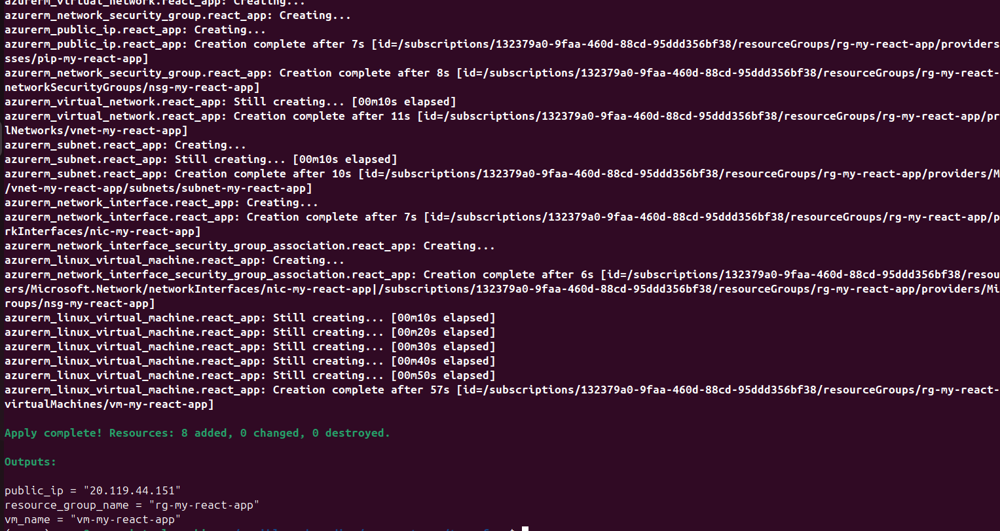>

---

#### Screenshot 3 — Terminal showing Ansible completed successfully and Nginx is active

<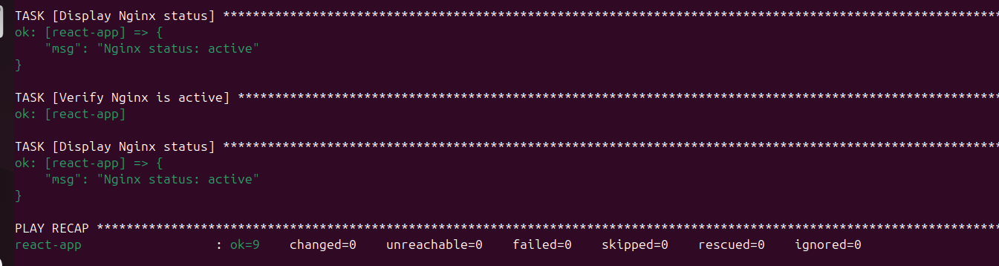>

---

# Task 3 — Create or Update the SSH Service Connection

## Goal

Point the `ubuntu-nginx-ssh` Service Connection to the new VM and validate it.

### Evidence

#### Screenshot 4 — SSH Service Connection page showing the new VM connection and successful validation, with the password hidden

<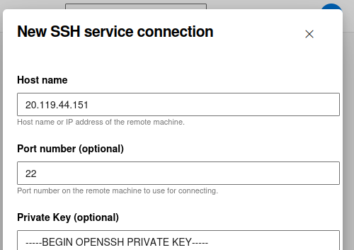>

---

# Task 4 — Author a Multi-Stage Pipeline (YAML)

## Goal

Create the Build (npm install/build), Test (`npm test -- --watchAll=false`, blocking on failure), Publish (publish `build/` as `react_build`), and Deploy (copy artifact to `/var/www/html`, restart Nginx via SSH) stages, triggered on `main`.

### Evidence

#### Screenshot 5 — Azure Pipeline YAML definition with the Build, Test, Publish, and Deploy sections visible

<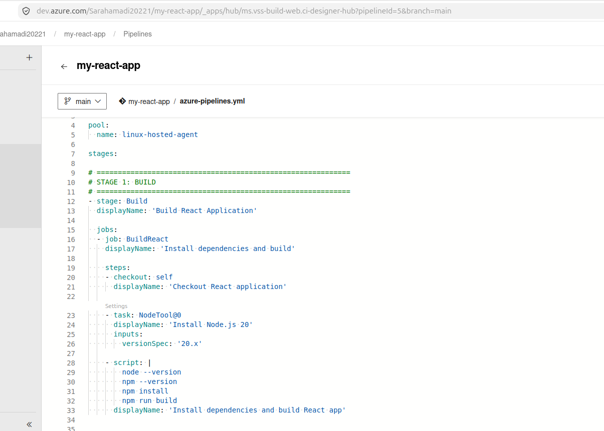>
<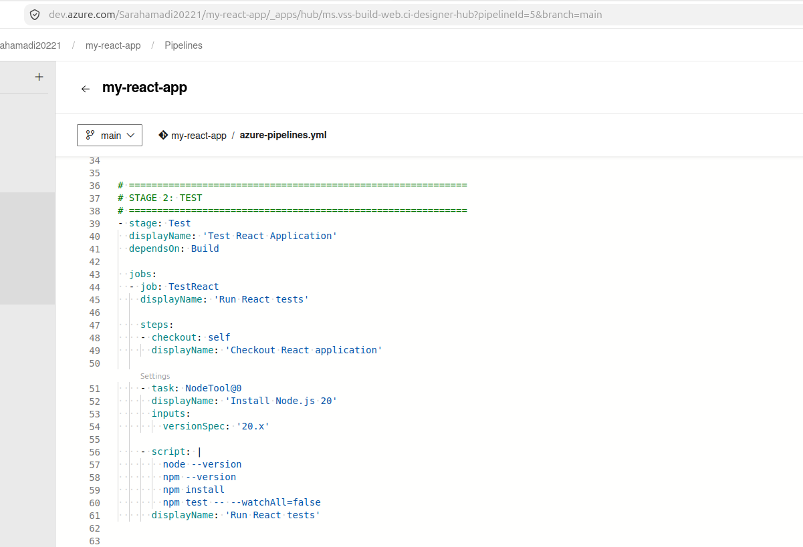>
<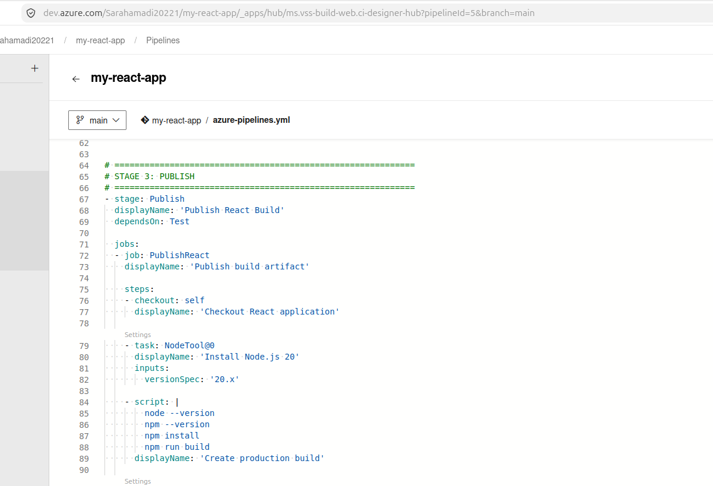>
<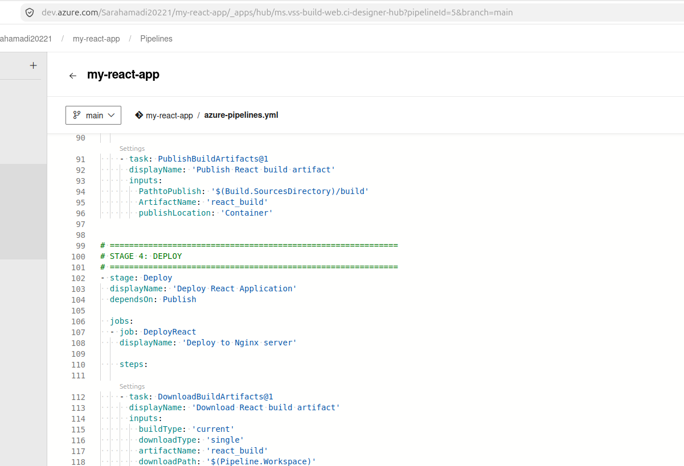>
<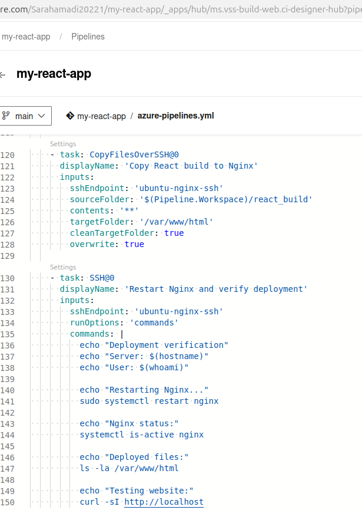>

---

# Task 5 — Run and Verify

## Goal

Confirm a commit to `main` triggers the pipeline, all four stages succeed, the build artifact is on the VM, and the React app is live.

### Evidence

#### Screenshot 6 — Pipeline run summary showing Build, Test, Publish, and Deploy succeeded

<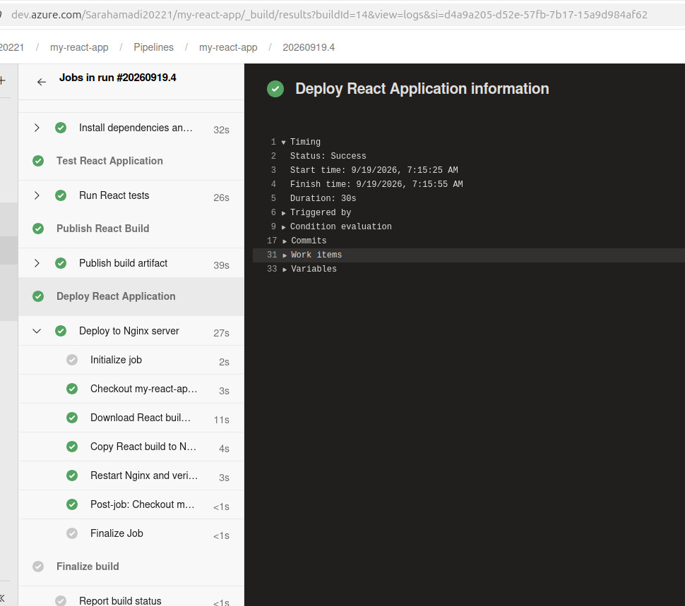>

---

#### Screenshot 7 — Terminal or pipeline output showing `/var/www/html` after deployment

<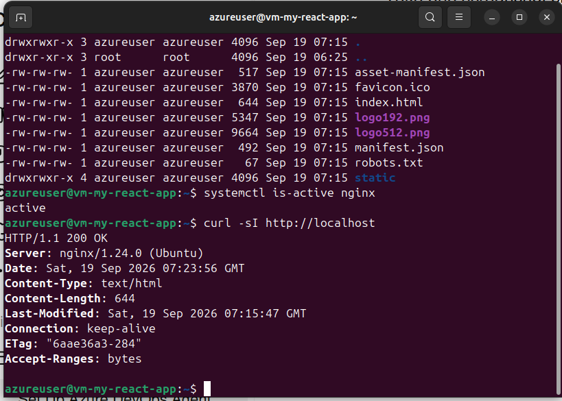>

---

#### Screenshot 8 — Browser showing the running React application with the public IP visible

<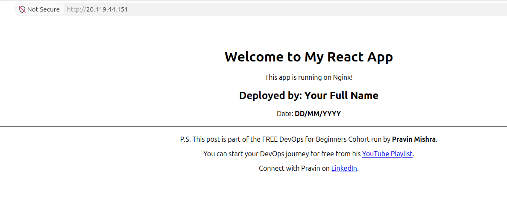>

---

# LinkedIn Post (Required)

## Goal

Publish a LinkedIn post about the completed assignment, mentioning the Build/Test/Publish/Deploy flow and that commits to `main` trigger automatic deployment, with public/"Anyone" visibility and at least one link or image.

## Evidence

#### LinkedIn Post URL

Paste your LinkedIn post URL here:

`Add your URL here`

---

#### Screenshot — Published LinkedIn post showing the text and at least one link or image

Add your screenshot here.

---

# Submission Instructions

- Add all required screenshots in your submission
- Do not reveal VM passwords, tokens, private keys, or service-connection secrets

---

# Completion Checklist

- [✅] Task 1: React app imported into Azure Repos (Screenshot 1)
- [✅] Task 2: New VM provisioned and Nginx configured (Screenshots 2–3)
- [✅] Task 3: SSH Service Connection updated and validated (Screenshot 4)
- [✅] Task 4: Multi-stage YAML pipeline authored (Screenshot 5)
- [✅] Task 5: All four stages succeeded and app verified (Screenshots 6–8)
- [✅] LinkedIn post published and URL submitted
- [✅] No sensitive data exposed

---

## 📌 About DMI & CloudAdvisory

DevOps Micro Internship (DMI) is a project-based DevOps program run by Pravin Mishra (The CloudAdvisory) focused on real-world execution, systems thinking, and career readiness.

It helps learners build strong DevOps foundations with hands-on experience.

---

## 📌 Resources

- 🌐 DMI Official Website: https://dmi.pravinmishra.com?utm_source=github&utm_medium=readme  
- 🎓 University: https://university.pravinmishra.com?utm_source=github&utm_medium=readme  
- 💬 Discord Community: https://discord.pravinmishra.com?utm_source=github&utm_medium=readme  
- 📝 Blog: https://dmi.pravinmishra.com/blog?utm_source=github&utm_medium=readme  
- ▶️ YouTube Playlist: https://www.youtube.com/playlist?list=PLFeSNDtI4Cho  
- 🔗 Pravin Mishra (LinkedIn): https://www.linkedin.com/in/pravin-mishra-aws-trainer/  
- 🏢 CloudAdvisory (LinkedIn): https://www.linkedin.com/company/thecloudadvisory/

---

*This submission is part of DevOps Micro Internship (DMI) Cohort 3 — Agentic AI Track.*
