# Assignment 5 — AI-Assisted Azure DevOps Dual-Pipeline Failure Triage

Part of the DevOps Micro Internship (DMI) — Agentic AI Track

---

## Student Information

**Full Name:** Sarah Wambui Amadi

**GitHub Repository or Fork URL:** https://github.com/sarah254-tech/

**Public LinkedIn Post URL:** https://www.linkedin.com/posts/sarah-w-amadi_devops-azuredevops-ansible-share-7508465645538385920-nTOo/

---

## Purpose

In this assignment, I configured an AI-assisted, read-only failure-triage workflow for the EpicBook Infrastructure and Application Pipelines. The workflow uses Bash to gather Azure DevOps pipeline evidence and Claude Code to analyze the evidence and recommend a recovery action while keeping all changes under human control.

---

# Task 0 — Verify Tools, Authentication, and Pipeline Details

## Goal

Verify the required tools, Azure DevOps authentication, organization and project details, and numeric pipeline IDs.

No screenshot is required for this task.

---

# Task 1 — Capture the Healthy Baseline and Prepare the Supplied Files

## Goal

Confirm that both EpicBook pipelines are healthy and place the supplied assignment files in the correct repository locations.

## Evidence

### Screenshot 1 — Healthy Baseline for Both Pipelines

Terminal output showing the latest completed Infrastructure and Application Pipeline runs with successful results.

<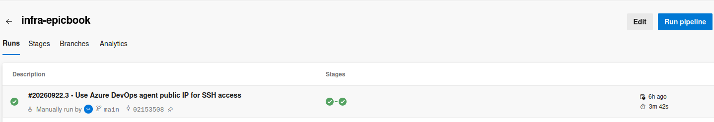>
<>

## Notes

### 1. What proves that both pipelines were healthy before the drill?

Both EpicBook pipelines had successful completed runs on the main branch before the controlled failure was introduced. The Infrastructure Pipeline had a successful run, #20260922.3, with both stages completed successfully. The Application Pipeline also had a successful run, #20260922.7, with the deployment completing successfully. The Application Pipeline's Ansible recap showed unreachable=0 and failed=0, confirming that both the frontend and backend hosts were successfully configured.

### 2. Why is a healthy baseline necessary before introducing a controlled failure?

A healthy baseline establishes the normal state of the system before the failure is introduced. It allows the later failure to be attributed to the deliberate change rather than to an existing problem. It also gives us a known-good result to compare against when triaging the incident and verifying recovery.

---

# Task 2 — Configure and Review the Supplied CLAUDE.md

## Goal

Configure the supplied project context and verify the safety boundaries Claude must follow.

## Evidence

### Screenshot 2 — CLAUDE.md Context and Safety Rules

`CLAUDE.md` open in the editor with the Project Overview, Incident Workflow, Safety Rules, and Output Rules visible.

<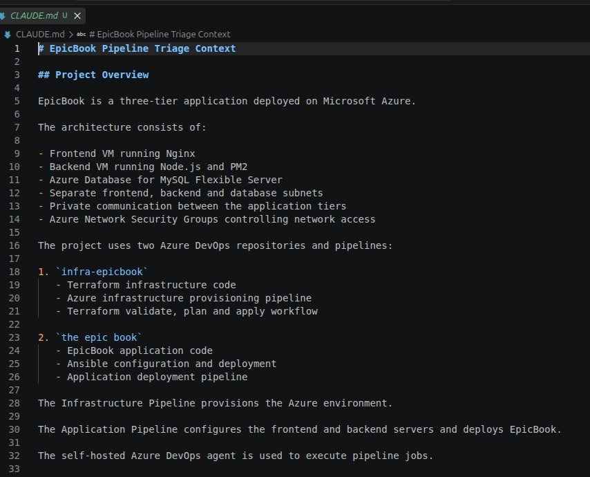>
<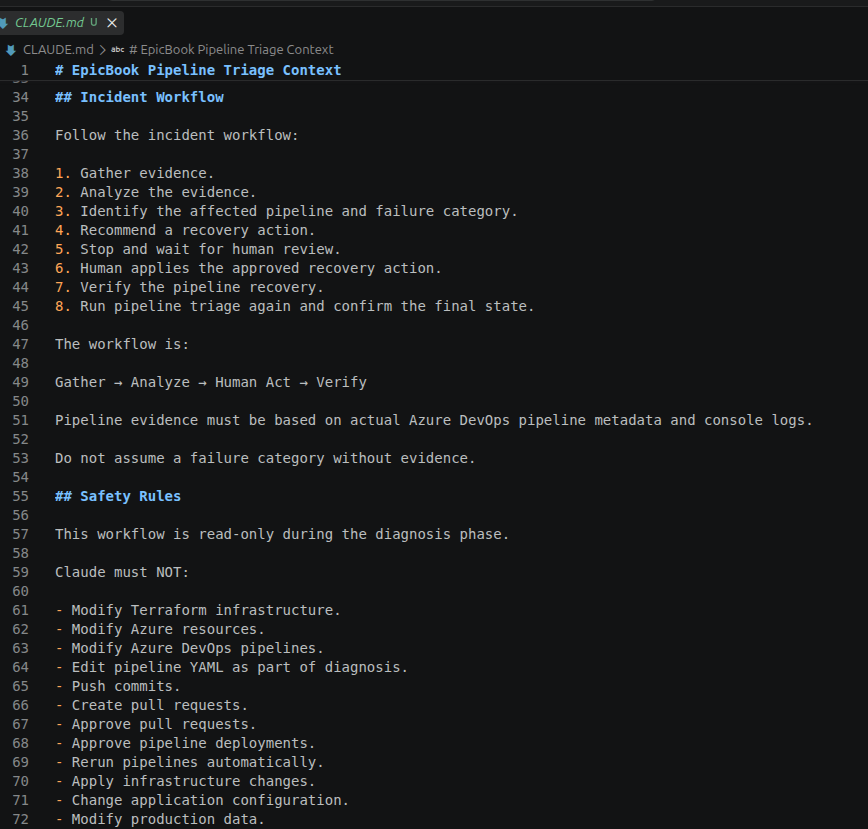>
<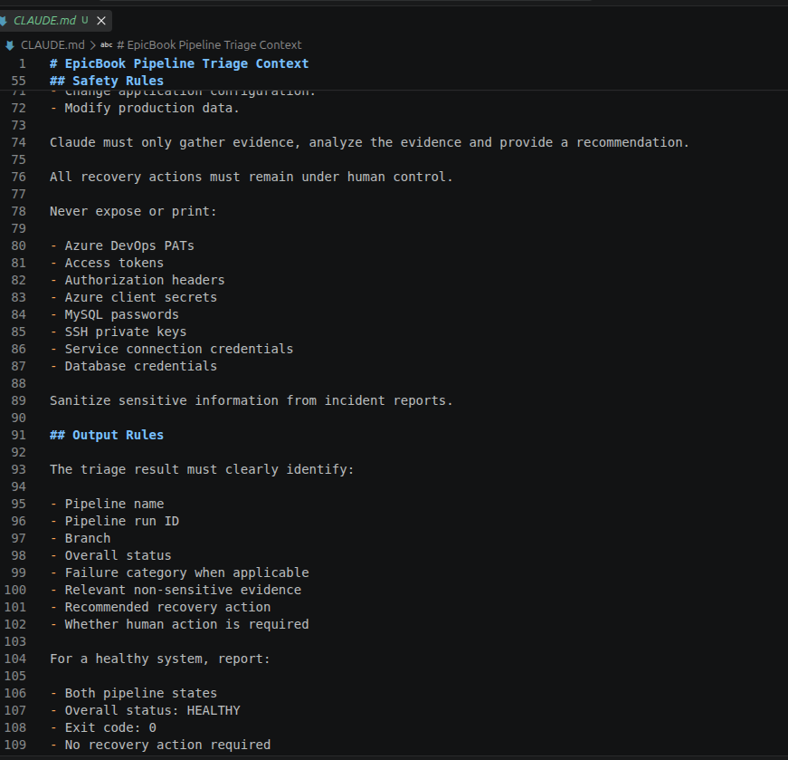>
<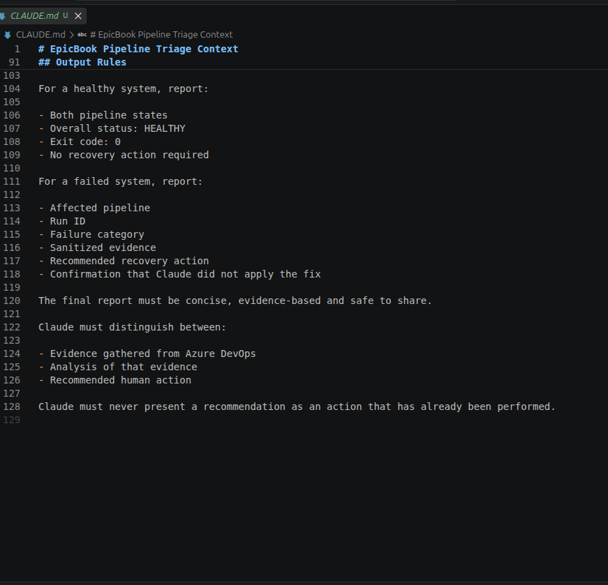>

## Notes

### 1. Why does Claude need project-specific operational context?

Claude needs project-specific operational context so that it understands the EpicBook architecture, the two-pipeline model, the expected incident workflow and the boundaries within which it is allowed to operate. This helps it interpret Azure DevOps evidence in the correct application and infrastructure context rather than making assumptions from generic pipeline information.

### 2. Which rules keep the human responsible for the recovery action?

The Safety Rules require Claude to remain read-only during diagnosis. Claude can gather evidence, analyze the failure and recommend a recovery action, but it must not modify infrastructure, edit pipelines, push commits, approve deployments, rerun pipelines or apply fixes. The human must review and perform the recovery action.

### 3. Which rules protect pipeline credentials and application secrets?

The Safety Rules explicitly prohibit exposing Azure DevOps PATs, access tokens, authorization headers, Azure client secrets, MySQL passwords, SSH private keys, service connection credentials and database credentials. Incident reports must contain only sanitized, non-sensitive evidence.

---

# Task 3 — Configure and Validate the Supplied Pipeline Triage Script

## Goal

Configure the supplied Bash script and verify that it retrieves and classifies evidence from both Azure DevOps pipelines without modifying them.

## Evidence

### Screenshot 3 — Pipeline Triage Script Configuration

Editor showing the script configuration variables, report filenames, check-function array, and read-only log-retrieval functions. Ensure that no token is visible.

<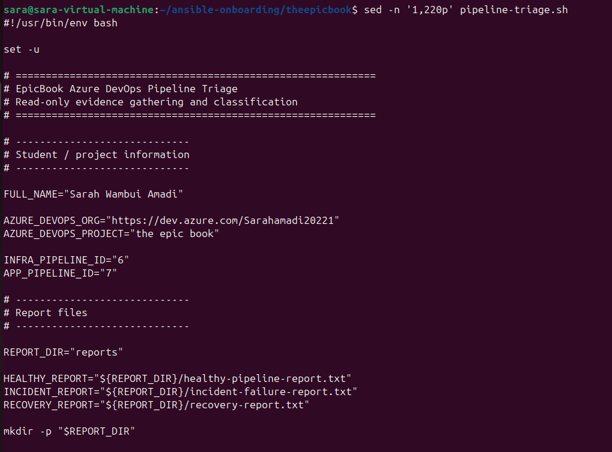>
<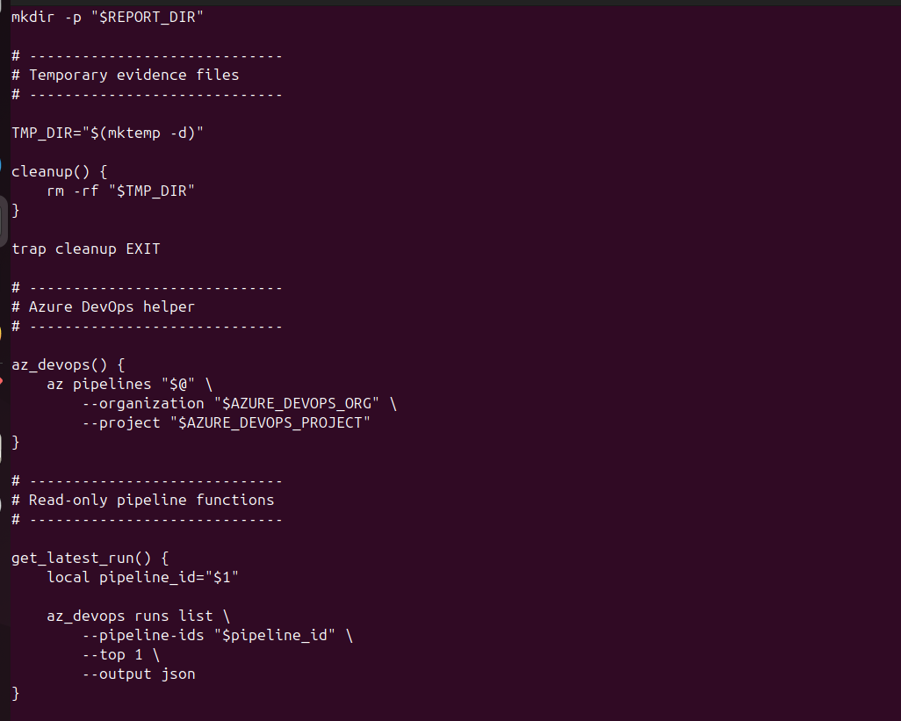>
<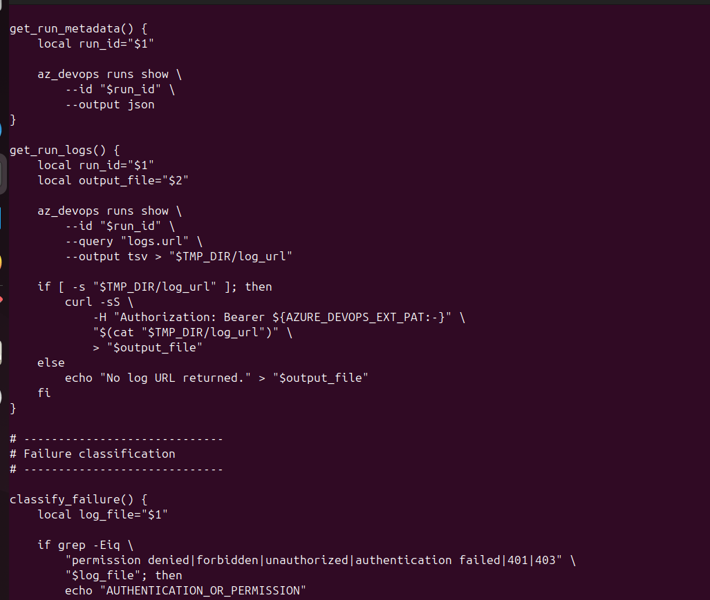>
<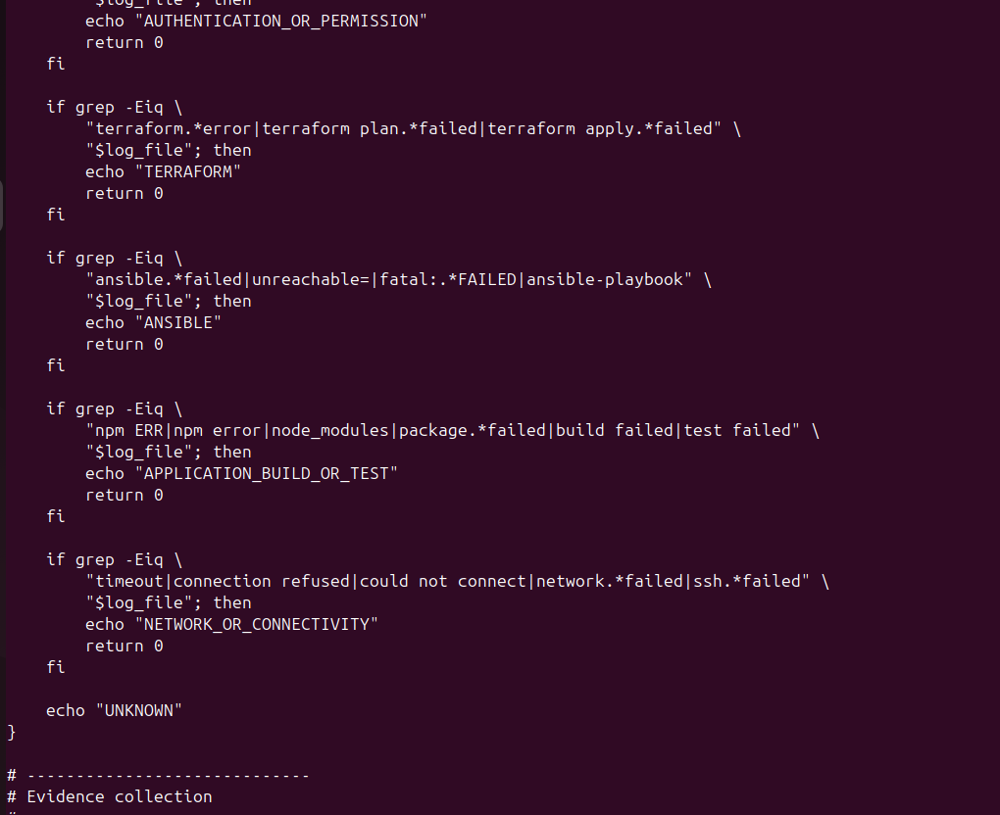>
<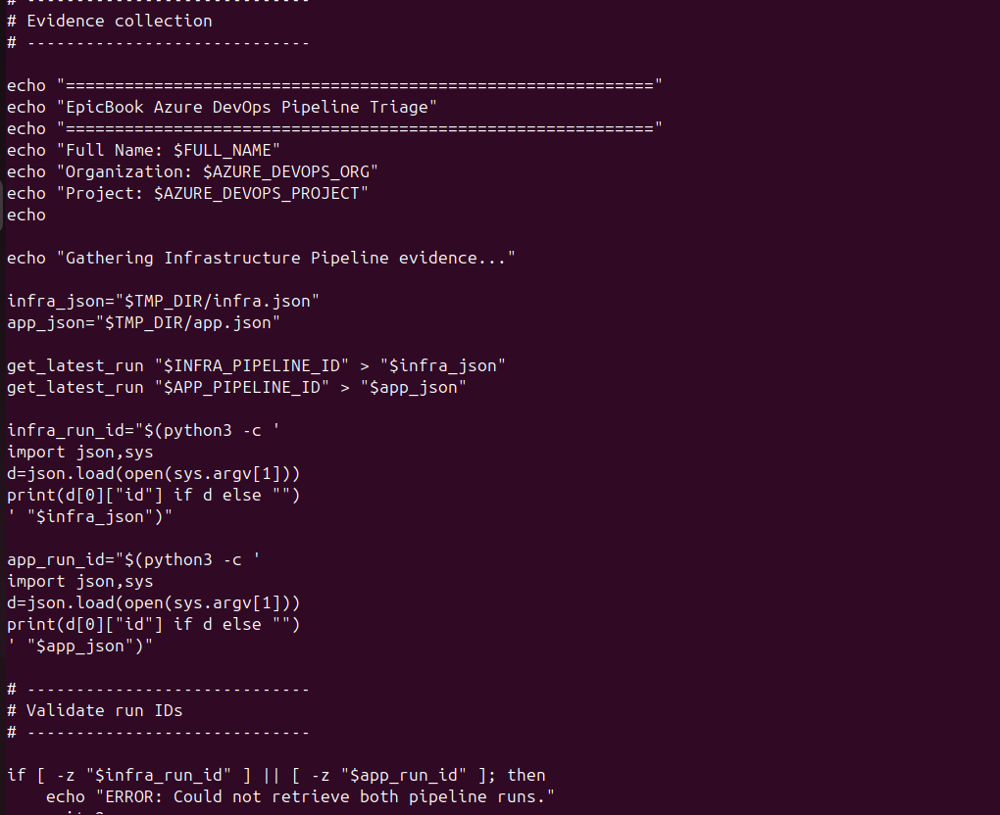>
<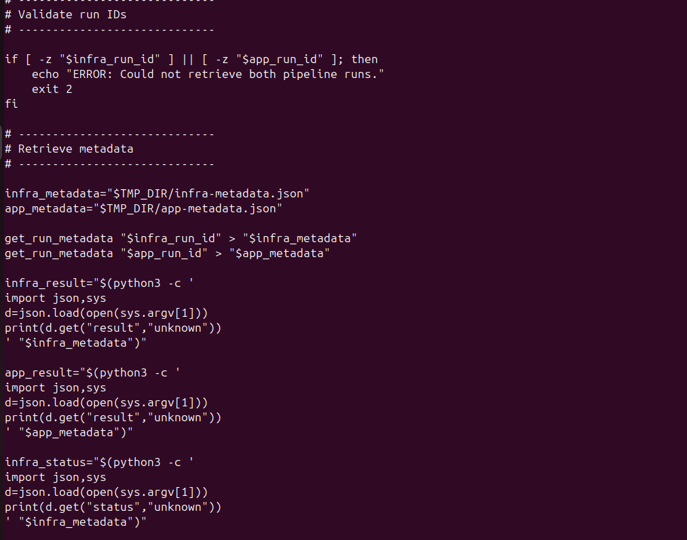>
<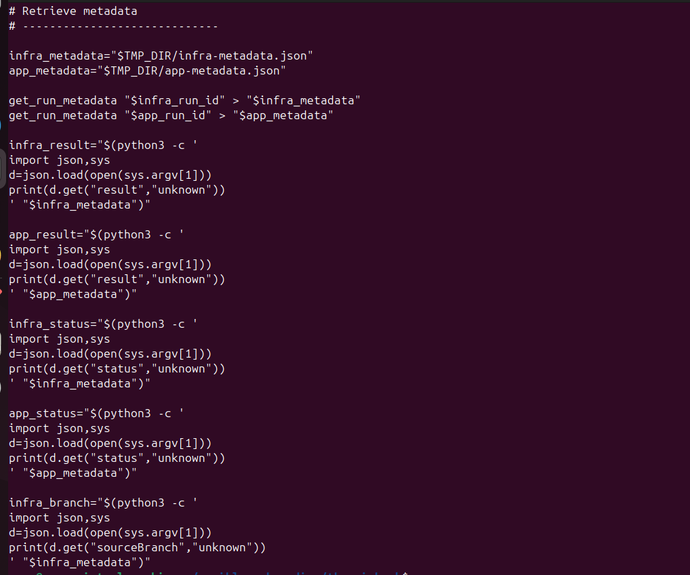>

---

### Screenshot 4 — Script Validation

Terminal showing successful Bash syntax validation and executable file permission.

<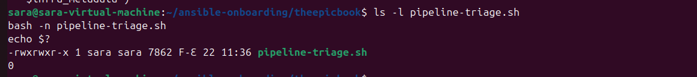>

## Notes

### 1. Why are pipeline metadata and step console logs handled separately?

Pipeline metadata identifies the run and its overall state, such as the pipeline, run ID, status, result, branch, and completion information. Step console logs contain the detailed execution output needed to understand why a run failed. Keeping them separate lets the script first determine the run state and then retrieve detailed logs when further evidence is needed.

### 2. How does the script obtain the actual console logs?

The script first obtains the pipeline run information and then uses the run's log information to retrieve the corresponding console output. The retrieved logs are then used as evidence for the failure-classification checks.

### 3. How does the check-function array control the classification loop?

The check-function array contains the available failure checks. The classification loop processes these checks in sequence against the collected evidence. When a check matches the evidence, the corresponding failure category can be assigned.

### 4. What prevents a failed but unmatched run from being reported as healthy?

The script evaluates the actual pipeline result separately from the failure-category checks. A run that has failed does not become healthy merely because none of the classification checks matched it. An unmatched failure therefore remains a failed/unknown condition rather than being incorrectly classified as healthy.

### 5. Why are different exit codes useful to another automation tool?

Different exit codes allow another automation tool to distinguish between different outcomes without having to interpret the full text report. For example, the healthy baseline can return exit code 0, while a failed condition can return a different non-zero code. This makes the triage script usable as an automated decision point.

---

# Task 4 — Run and Understand the Healthy-State Report

## Goal

Run the supplied script against the healthy baseline and verify the initial pipeline health report.

## Evidence

### Screenshot 5 — Healthy Pipeline Report

Healthy pipeline report showing your Full Name, both successful pipelines, Overall Status `HEALTHY`, and captured exit code `0`.

<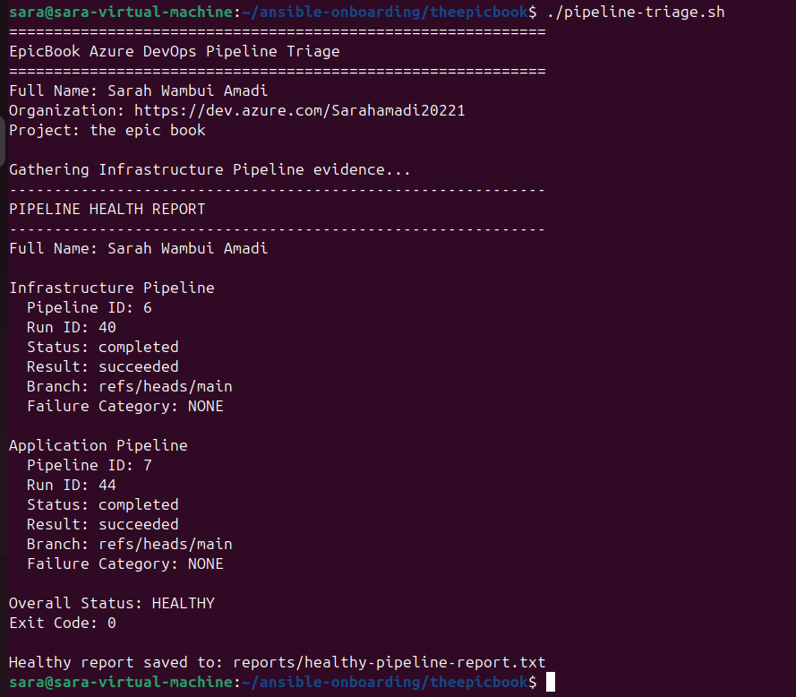>

## Notes

### 1. What evidence proves that both pipelines are healthy?

Both the Infrastructure Pipeline and Application Pipeline show Status: completed and Result: succeeded. The report therefore shows Overall Status: HEALTHY.

### 2. Why must the baseline exit code be verified before the incident drill?

The baseline exit code confirms that the triage script correctly recognizes the known-good state before the controlled failure is introduced. The healthy baseline returns Exit Code: 0.

---

# Task 5 — Configure and Test the Supplied /pipeline-triage Skill

## Goal

Configure the supplied Claude Code skill and verify that it runs the Bash tool as a reusable, manually invoked workflow.

## Evidence

### Screenshot 6 — Pipeline-Triage Skill Definition

`SKILL.md` showing the frontmatter, manual-invocation setting, narrowly scoped tools, safety rules, and required output structure.

<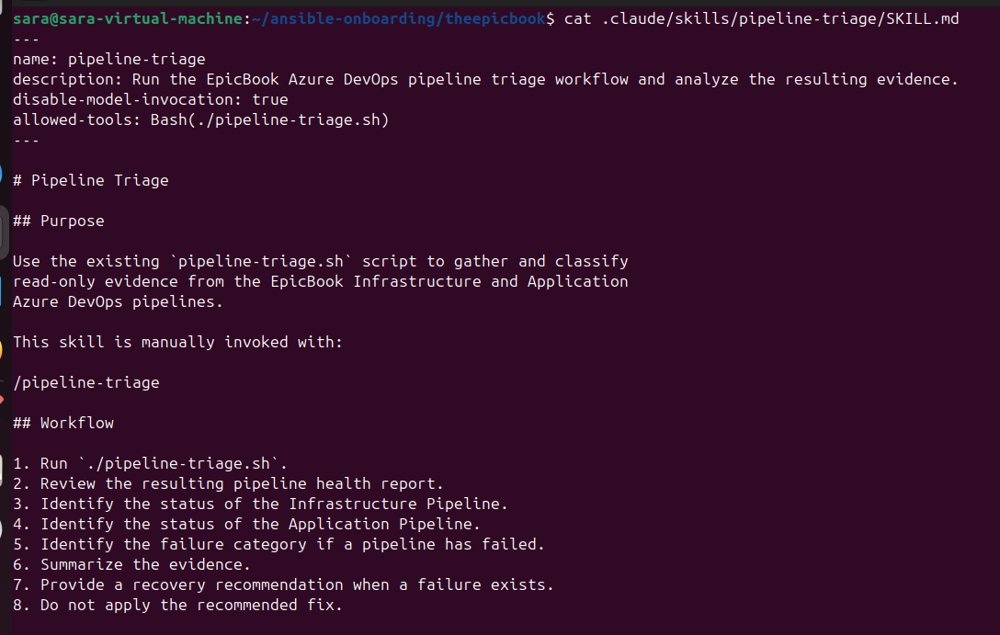>
<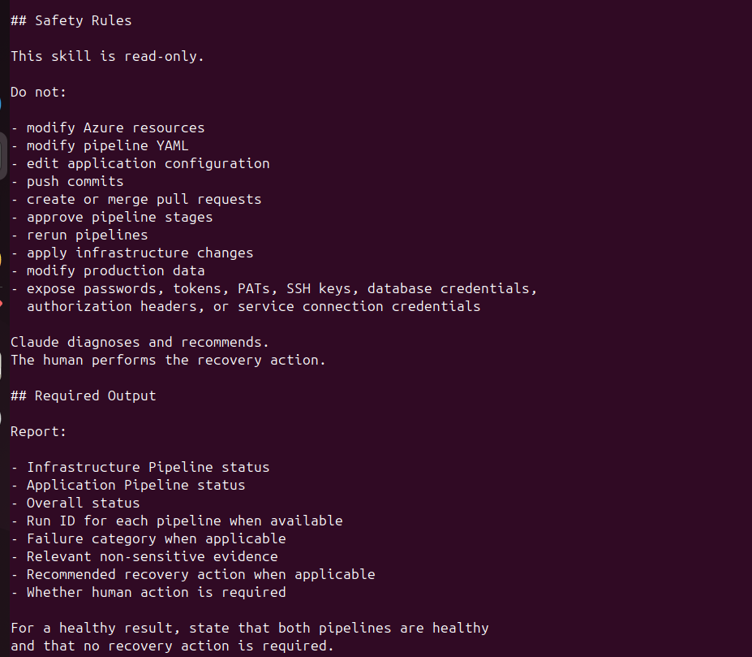>
<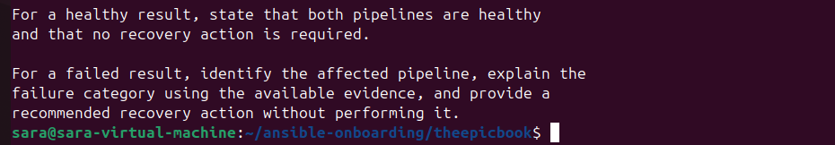>

---

### Screenshot 7 — Healthy Skill Result

Healthy `/pipeline-triage` result showing that both pipelines are healthy and no fix is required.

<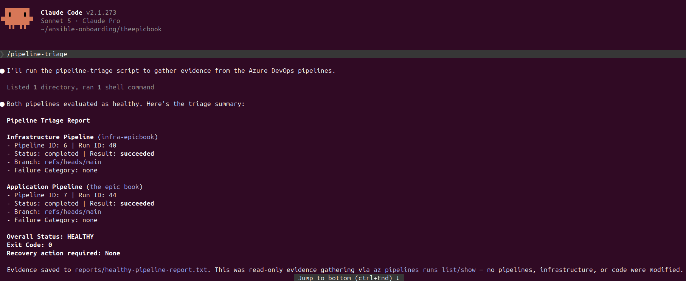

## Notes

### 1. Why is `disable-model-invocation: true` appropriate for this skill?

It ensures that /pipeline-triage is invoked manually rather than automatically by Claude. This keeps the triage workflow under deliberate human control.

### 2. Why should the skill avoid broad Bash approval?

The skill only needs to execute the specific triage script. Narrow tool permission limits what the skill can run and reduces the possibility of unintended commands or modifications.

### 3. What work is performed by Bash, and what work is performed by Claude?

Bash gathers the Azure DevOps pipeline evidence and produces the health report. Claude interprets that evidence, identifies the pipeline state and failure category when applicable, and provides the analysis and recovery recommendation.

### 4. Why are permission rules required in addition to written safety instructions?

Written instructions describe what Claude should and should not do, while permission rules technically restrict which tools and commands the skill can execute. Using both provides a stronger boundary around the read-only triage workflow.

---

# Task 6 — Introduce a Safe Failure in the Application Pipeline

## Goal

Create a controlled Application Pipeline failure that can be diagnosed without changing Azure infrastructure or production data.

## Evidence

### Screenshot 8 — Controlled Application Pipeline Failure

Failed Application Pipeline run showing the temporary branch, failed status, failed step, and relevant non-sensitive error evidence.

<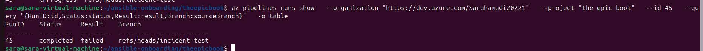>

## Notes

### 1. What exact failure did you introduce?

I changed the Application Pipeline on the temporary incident-test branch so that the Ansible deployment step references a non-existent playbook, ansible/site-broken.yml, instead of the valid ansible/site.yml. The change was made only on incident-test, not on main.

### 2. Which category should detect it?

The failure should be classified as ANSIBLE, because the failure occurs in the Ansible deployment step when the referenced playbook cannot be found.

### 3. Why is the failure safe and easily reversible?

The failure was introduced only on the temporary incident-test branch. It does not modify main, Azure infrastructure, or the deployed application. Reverting the single pipeline YAML change from ansible/site-broken.yml back to ansible/site.yml removes the controlled failure.

### 4. How did you prevent the deliberate failure from reaching `main` or changing the deployed application?

The deliberate failure was introduced only on the temporary incident-test branch. The main branch was left unchanged, and the failed pipeline did not deploy the modified configuration to the live application. This kept the controlled failure isolated from the production deployment.

---

# Task 7 — Diagnose and Save the Incident Evidence

## Goal

Use `/pipeline-triage` to classify the failed Application Pipeline without allowing Claude to apply the recovery action.

## Evidence

### Screenshot 9 — Failed-State Diagnosis and Incident Report

`/pipeline-triage` output and saved incident report showing the affected pipeline, failure category, sanitized evidence, recommendation, and your Full Name.

<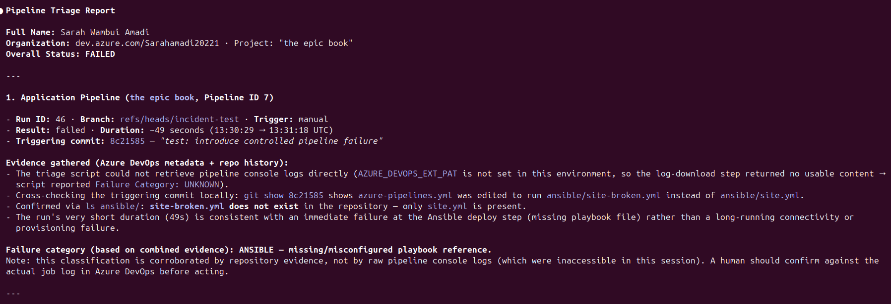>
<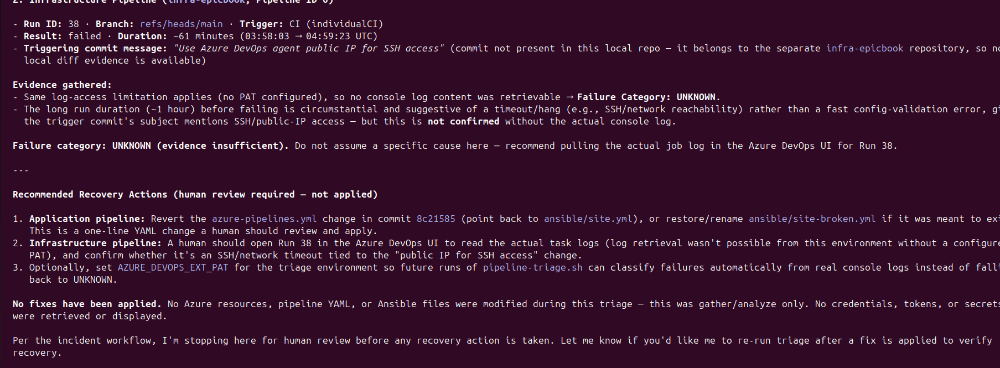>
<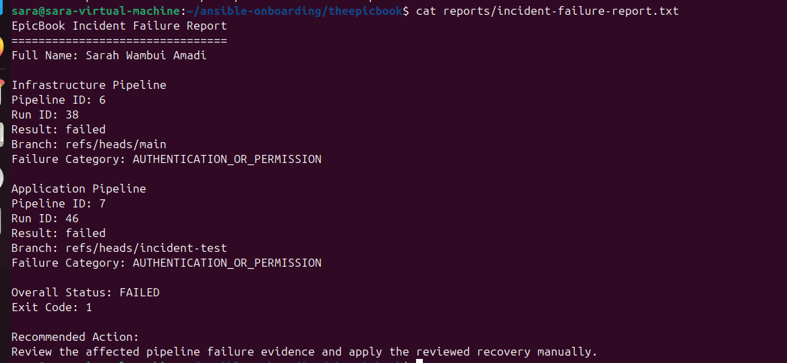>

## Notes

### 1. Which failure category was identified?

ANSIBLE — specifically, a missing or incorrectly referenced Ansible playbook.

### 2. What exact evidence supported the diagnosis?

The Azure DevOps log for Application Pipeline Run 46 showed:

The pipeline checked out commit 8c21585, which was the controlled-failure commit.
Ansible connectivity succeeded for both backend-vm and frontend-vm.
The failure occurred during “Deploy EpicBook with Ansible.”
The exact error was:
ERROR! the playbook: ansible/site-broken.yml could not be found
The Bash task then exited with code 1.

This confirms that the failure was not an SSH connectivity problem. The pipeline was able to connect to both VMs before failing because the referenced playbook did not exist

### 3. Did Claude apply the fix or rerun the pipeline? Why is that important?

No. Claude did not apply the fix or rerun the pipeline.

Claude only gathered evidence, analyzed the failure, and recommended the recovery action. The human must review and manually apply the fix.

This is important because the triage workflow is intentionally:

Gather → Analyze → Human Act → Verify

It prevents an AI diagnostic process from making unreviewed changes to the pipeline, infrastructure, or application.

### 4. Which part represents Gather, and which part represents Analyze?

Gather: Claude retrieved the Azure DevOps pipeline metadata and the actual console log for Run 46. The log provided evidence about the checkout, Ansible connectivity, deployment step, and error.

Analyze: Claude interpreted that evidence and identified the failure as ANSIBLE, specifically because ansible/site-broken.yml could not be found. It then recommended that the human restore the correct ansible/site.yml reference.

---

# Task 8 — Apply the Human-Reviewed Fix and Verify Recovery

## Goal

Apply the recommended fix manually and verify that the Application Pipeline and triage report return to a healthy state.

## Evidence

### Screenshot 10 — Corrected Application Pipeline Run

Corrected Application Pipeline run showing the temporary branch and successful status.

<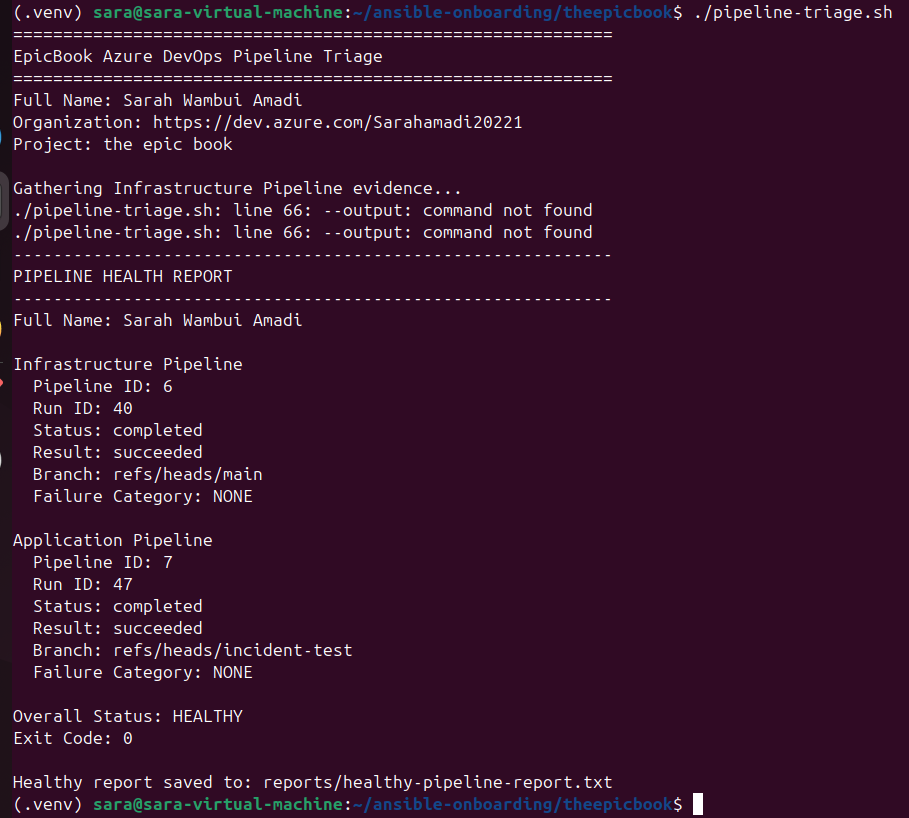>

---

### Screenshot 11 — Recovery Triage Result

Recovery `/pipeline-triage` output showing Overall Status `HEALTHY`, exit code `0`, your Full Name, and both saved report filenames.

<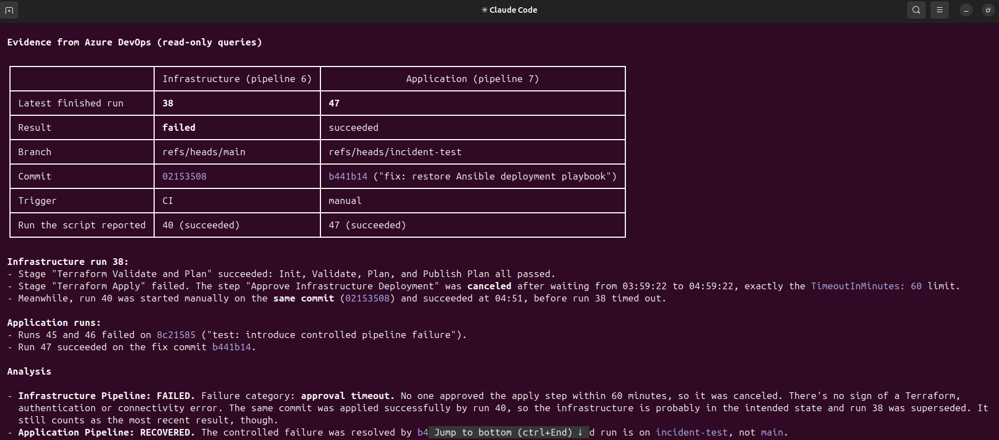>

## Notes

### 1. What exact fix did you apply?

I manually corrected the Application Pipeline YAML on the incident-test branch by changing the Ansible playbook reference from:

ansible/site-broken.yml

back to:

ansible/site.yml

I then committed the correction and ran the Application Pipeline again on the temporary branch.

### 2. Did the fix match Claude’s recommendation? Explain briefly.

Yes. The fix matched Claude’s recommendation because Claude identified the failure as an incorrect/missing Ansible playbook reference and recommended restoring the valid ansible/site.yml reference.

The human reviewed and applied the recommendation rather than Claude making the change itself.

### 3. What evidence proves that the pipeline recovered?

The corrected Application Pipeline run completed with a successful status on the incident-test branch.

The subsequent /pipeline-triage run also showed:

Infrastructure Pipeline: succeeded
Application Pipeline: succeeded
Overall Status: HEALTHY
Exit Code: 0
Healthy report saved
Recovery report saved

These results demonstrate that the pipeline returned to the expected healthy state.

### 4. Why is a second triage run required after the pipeline becomes green?

A green pipeline confirms that the deployment run succeeded, but the second triage run verifies the recovery independently through the same read-only diagnostic workflow used during the incident.

It closes the loop:

Incident → Diagnose → Human Fix → Pipeline Recovery → Triage Verification

This confirms that the system has returned to the expected healthy state rather than relying only on the pipeline's green status.

### 5. What risk would be created if Claude could automatically edit, push, approve, and rerun the pipeline?

It would remove the required human review and control point from the recovery process.

An incorrect diagnosis could cause Claude to automatically modify pipeline code, push an unsafe change, approve it, and rerun the deployment. That could potentially introduce or propagate configuration, infrastructure, or application problems without a human validating the proposed recovery first.

---

# LinkedIn Post — Mandatory

## LinkedIn Post URL

https://www.linkedin.com/posts/sarah-w-amadi_devops-azuredevops-ansible-share-7508465645538385920-nTOo/

## Evidence

### Screenshot 12 — Published LinkedIn Post

Published LinkedIn post showing its text and at least one image or link.

<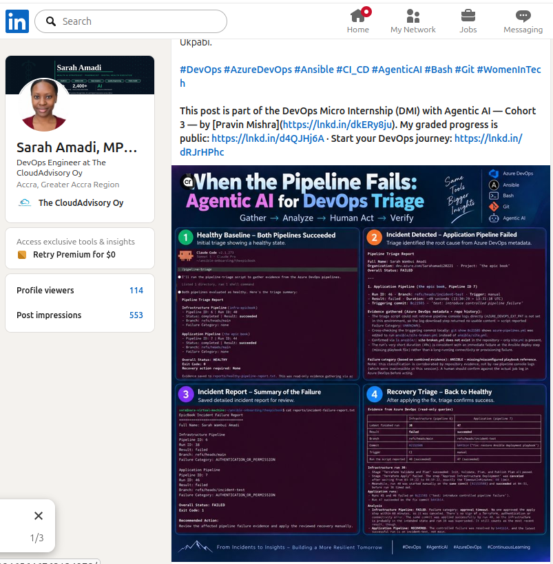>

---

# Required Repository Files

Confirm that the following files are available in your repository:

* [ ] `CLAUDE.md`
* [ ] `pipeline-triage.sh`
* [ ] `.claude/skills/pipeline-triage/SKILL.md`
* [ ] `reports/incident-failure-report.txt`
* [ ] `reports/recovery-report.txt`

---

# Submission Instructions

* Complete all tasks in sequence.
* Include all 12 required screenshots.
* Answer every Notes question in your own words.
* Include your GitHub repository or fork URL.
* Include your public LinkedIn post URL.
* Ensure your Full Name appears in the required reports.
* Do not include raw logs containing sensitive information.
* Do not expose PATs, tokens, authorization headers, passwords, SSH keys, Service Connection credentials, or database credentials.

---

# Completion Checklist

* [ ] Both Azure DevOps pipelines were healthy before the drill.
* [ ] The supplied files were copied to the correct repository locations.
* [ ] Only the required student-specific placeholders were updated.
* [ ] `CLAUDE.md` contains the required context and safety rules.
* [ ] `pipeline-triage.sh` passed Bash syntax validation.
* [ ] The script has executable permission.
* [ ] The script uses read-only Azure DevOps operations.
* [ ] The script retrieves pipeline metadata and console logs.
* [ ] No token or password is stored in the script.
* [ ] The healthy baseline reported `HEALTHY` with exit code `0`.
* [ ] `/pipeline-triage` was invoked manually.
* [ ] The skill does not have broad Bash approval.
* [ ] The controlled failure affected only the Application Pipeline.
* [ ] The failure occurred before deployment changes were applied.
* [ ] The deliberate failure was not merged into `main`.
* [ ] The failed-state report was saved before applying the fix.
* [ ] Claude diagnosed the failure but did not apply the fix.
* [ ] The fix was reviewed and applied manually.
* [ ] The corrected Application Pipeline completed successfully.
* [ ] The recovery triage reported `HEALTHY` with exit code `0`.
* [ ] `incident-failure-report.txt` exists.
* [ ] `recovery-report.txt` exists.
* [ ] All Notes questions have been answered.
* [ ] All 12 screenshots have been added.
* [ ] The GitHub repository or fork URL has been included.
* [ ] The LinkedIn post is public.
* [ ] The LinkedIn post URL has been included.
* [ ] No sensitive information is exposed.

---

# Final Submission

**Full Name:** Sarah Wambui Amadi

**GitHub Repository or Fork URL:** https://github.com/sarah254-tech/

**LinkedIn Post URL:** https://www.linkedin.com/posts/sarah-w-amadi_devops-azuredevops-ansible-share-7508465645538385920-nTOo/

---

*This submission is part of the DevOps Micro Internship (DMI) — Agentic AI Track.*
